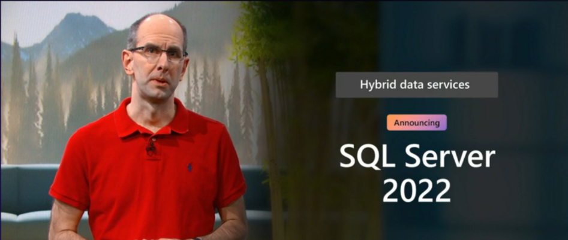
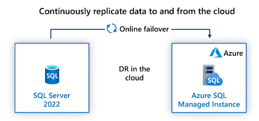
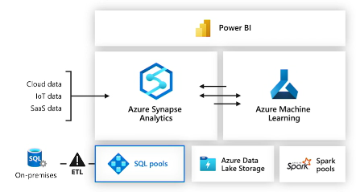
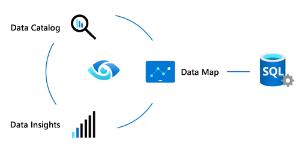
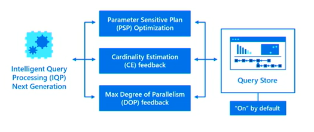
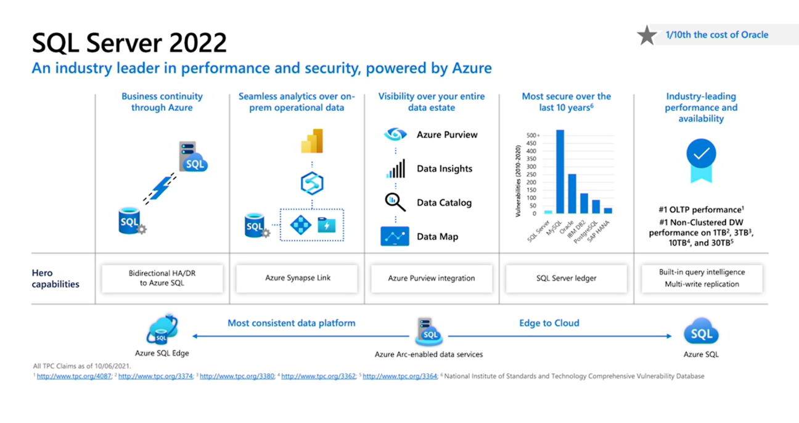

Durante el último evento Microsoft Ignite 2021 realizado a principios
del mes de noviembre, Microsoft ha hecho anuncios importantes sobre la
próxima versión de su motor de bases de datos relacional, SQL Server
2022.

Esta versión estará disponible como Private Preview, por lo que
deberemos completar un formulario indicando todo lo relacionado a los
casos de usos que utilizaremos para testear, así como también que
funcionalidades queremos probar. Seguramente durante principios de 2022
esta versión estará disponible como Community Technical Preview (CTP)
para que todos podamos descargarla, utilizarla, probarla y proveer
feedback, de esta forma todos estaremos colaborando para hacer mejor la
próxima versión de SQL Server

**Alta Disponibilidad y Disaster Recovery (HA/DR) Bi-direccional con Azure SQL Managed Instance (MI)**

Podremos configurar un Distributed Availability Group (DAG) donde una de
las réplicas podría ser una MI. Si fuese necesario podremos hacer
failover desde SQL Server 2022 a MI y viceversa, por lo que cualquiera
de las dos replicas puede ser el primario (la de lectura/escritura).
Otra posibilidad será que podremos hacer Backup de una o varias bases de
datos alojadas en una MI y la podremos restaurar en una SQL Server 2022.
Esto último no estaba soportado hasta ahora.

**Azure Synapse Link**

Como en Azure Cosmos DB o Dataverse , podremos establecer un link entre
SQL Server 2022 y un SQL Pool de Azure Synapse Analytics y de esta forma
podremos tener visibilidad casi en tiempo real de todos los cambios
realizados en nuestro sistema transaccional y de esta forma poder hacer
análisis analítico sobre los datos en vivo. Este nos da la posibilidad
de pensar en reemplazar los procesos de ETL (extracción, Transformación
y Carga) por Azure Synapse Link

**Azure Purview integration**

Azure Purview es la nueva plataforma unificada de gestión y gobierno de
datos. Es importante remarcar que SQL Server esta también integrado con
Azure Purview para poder realizar un proceso de descubrimiento de datos
en forma mejorada, permitiéndonos con esto romper los silos de datos

**Performance**

Lo primero que observamos es que, al igual que en Azure SQL, cuando
creamos nuevas bases de datos en SQL Server 2022, estas tendrán
habilitado "por defecto" "Query Store" y "Automatic Query Tuning".
También el soporte de Query Store en las réplicas de solo lectura,
teniendo así la posibilidad de utilizar "hints", para poder mejorar la
performance y rápidamente mitigar los problemas sin tener que cambiar el
código T-SQL.

Con respecto a "Intelligent Query Procesing" Microsoft está expandiendo
su funcionalidad para cubrir nuevos escenarios basándose en los
problemas más comunes reportados por los clientes. Por ejemplo el
problema denominado "Parameter Sensitive Plan (PSP)" o Planes sensibles
a los parámetros, que básicamente ocurre cuando se genera un único plan
de ejecución basado en el primer parámetro que se utiliza al ejecutar el
SP o query, que a su vez no es óptimo para las subsiguientes ejecuciones
con diferentes parámetros. Ahora con SQL Server 2022 se generarán y
almacenarán múltiples planes de ejecución para una misma query .

**Seguridad**

En los últimos años SQL Server ha reportado la menor cantidad de
vulnerabilidades en comparación con la competencia. Basándonos en esto,
la nueva funcionalidad "ledger" permite crear un registro inmutable de
modificaciones de datos a través del tiempo, protegiéndolos de posibles
actividades maliciosas.

**Disponibilidad**

Debido a la tendencia actual de sistemas distribuidos globalmente,
muchas organizaciones se están moviendo a un entorno de escritura
múltiple el cual permite que se realicen cambios en la base de datos
local y se envíen a otras réplicas en un flujo bidireccional de
actualizaciones. Sin embargo, si varias personas cambian la misma fila
en una misma tabla y las diferentes réplicas de escritura contienen
información diferente, se genera un conflicto de réplicas de
peer-to-peer que paraliza toda la operación hasta que se soluciona el
inconveniente. SQL Server 2022 modifica este comportamiento utilizando
la regla del último que escribe gana, entonces cuando se detecta un
conflicto, se elegirá la hora de modificación (timestamp) más reciente
para que persista en todas las réplicas. Esto ayuda a que los escenarios
de escritura múltiple funcionen en forma transparente

**¡¡Hay más!!**

Microsoft ha informado que también habrá mejoras en áreas como System
Page Concurrency, In-Memory OLTP, Accelerared Database Recovery (ADR) ,
Transact SQL (T-SQL) así como también en el manejo de datos JSON y la
compresión de datos XML, por lo que esperamos poder tener acceso a estas
primeras versiones para poder aprender un poco más acerca de novedades.

**Referencias**

Para aprender más sobre SQL Server 2022 e informarnos acerca de las
novedades

https://aka.ms/SQLServer2022

Para unirse al programa de Private Preview completar el siguiente
formulario

https://aka.ms/EAPSignUp

**Javier Villegas**  
IT Director , DBA & BI Services @ MSC  
Microsoft MVP , Data Platform  
javier.ignacio.villegas@gmail.com  
[@javier_vill](https://twitter.com/javier_vill)  
[javiervillegas](https://www.linkedin.com/in/javiervillegas/)   
 
import LayoutNumber from '../../../components/layout-article'
export default LayoutNumber
