De la misma manera que hicimos en el artículo anterior, una vez en el
portal de Power Automate iremos a la sección de Datos (Data) -> Conectores personalizados (Custom Connectors)

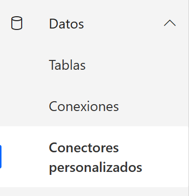

Una vez allí iremos a crear un nuevo conector personalizado y creamos
uno desde cero

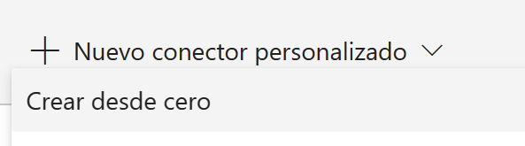

Le ponemos un nombre al conector y le damos continuar

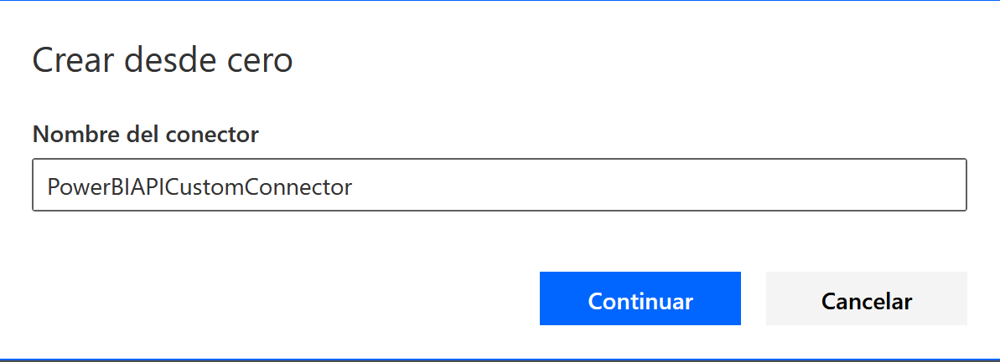

En esta sección de la creación del conector personalizado tendremos
varias secciones a rellenar con los datos la PowerBI Rest API, por lo
que vamos a necesitar registrar nuestra aplicación en Power BI.

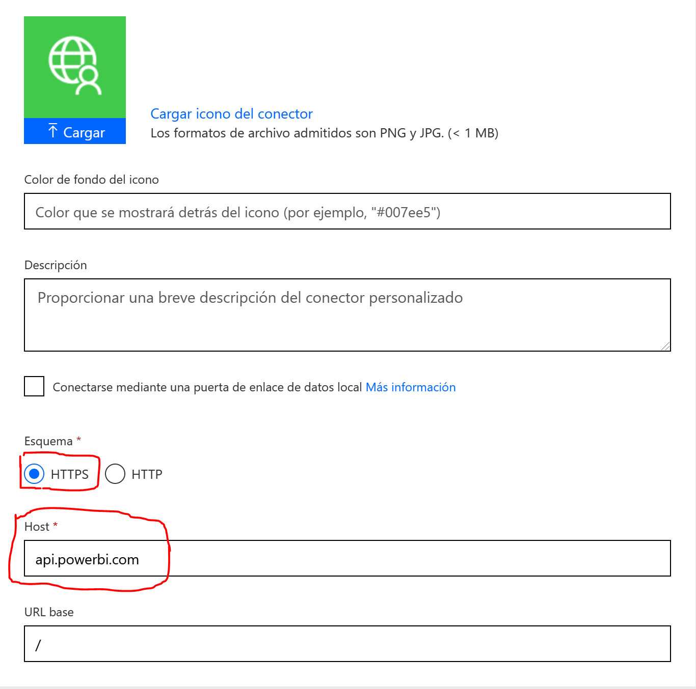

En esta sección los datos importantes son el esquema y el host, el
esquema debe ser HTTPS y el host es la URL a la Power BI Rest API "api.powerbi.com".

Una vez completada esta sección damos en 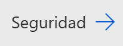 y continuamos con la siguiente sección.

En esta sección lo primero que debemos seleccionar es el tipo de
seguridad:

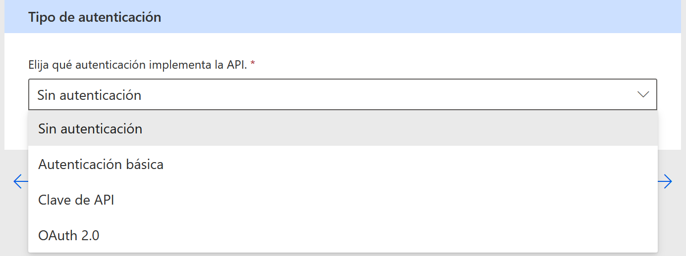

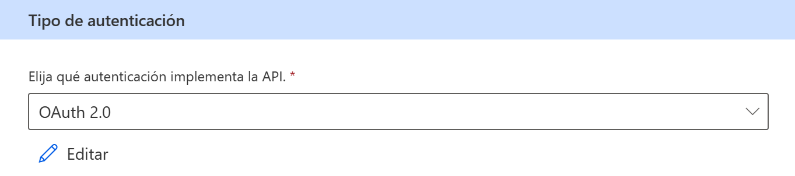

Seleccionamos OAuth 2.0 y nos aparecerá la siguiente pantalla:

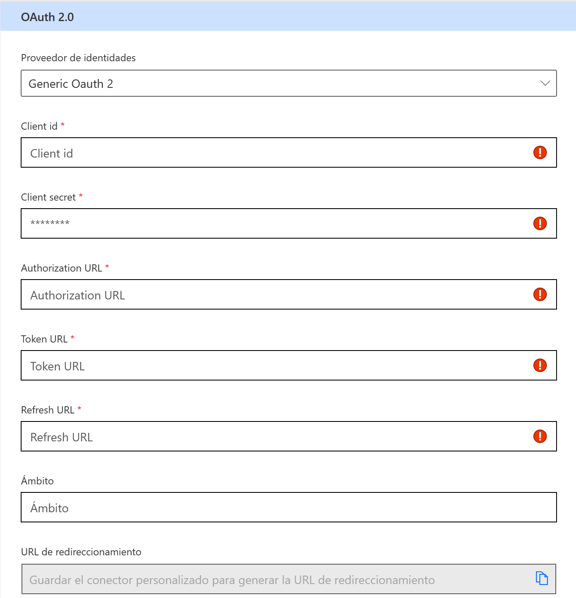

La información del Client id, Client Secret la vamos a obtener del
registro de la aplicación en Power BI, para ello abrimos en el navegador
https://app.powerbi.com/apps.

Una vez allí nos logueamos y comenzamos el registro.

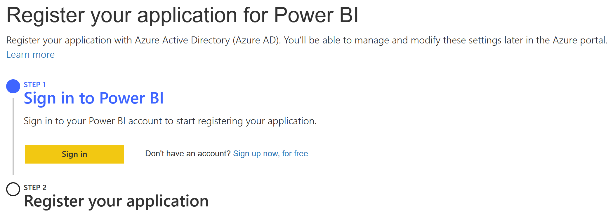

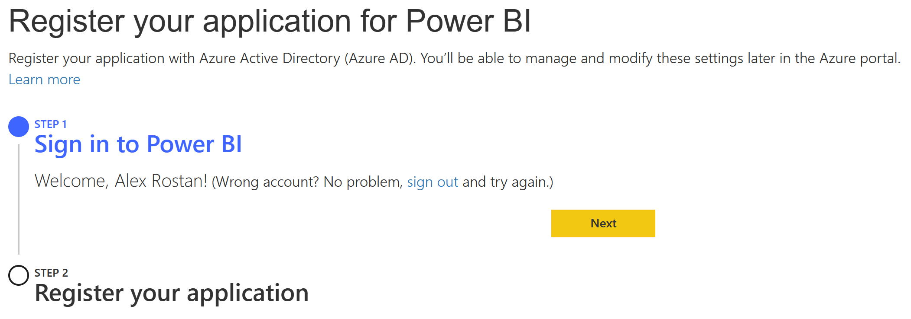

Hacemos clic en el botón Next y comenzaremos el proceso de registro de
nuestra aplicación.

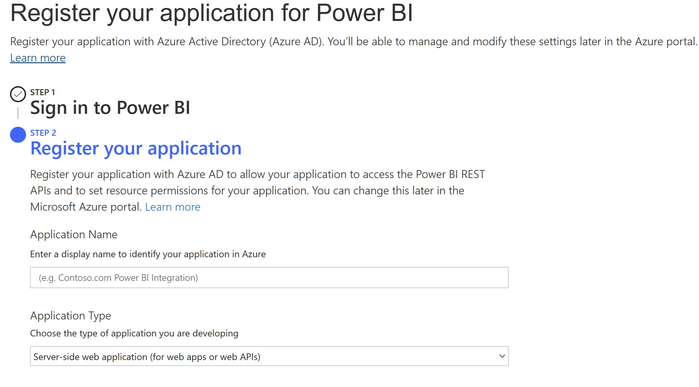

Completamos los datos y luego vamos a la sección de API Permissions.

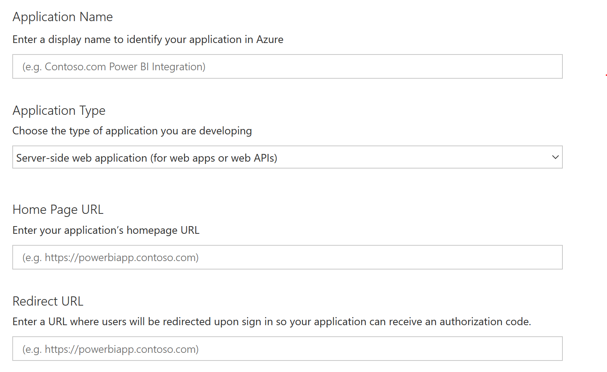

Completamos los datos y luego vamos a la sección de API Access.

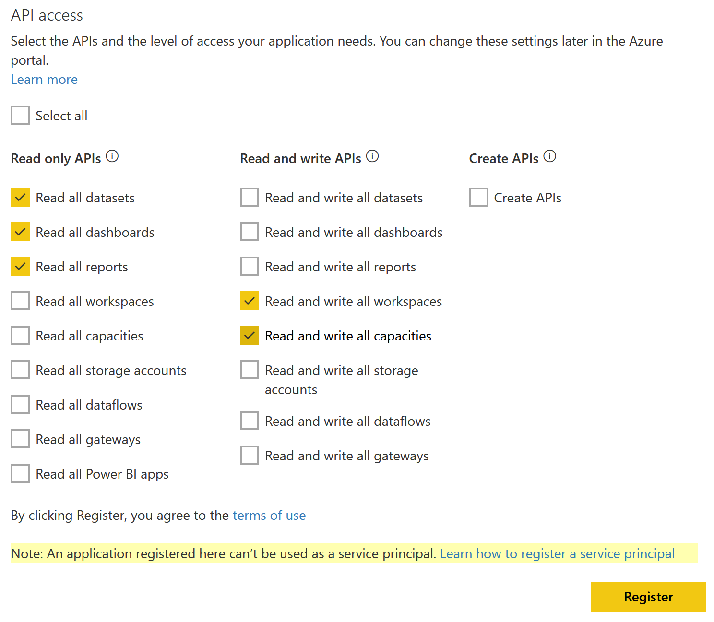

En esta sección lo que estamos realizando es definir que tipos accesos
tendrá el conector y a cuáles elementos.

Ya finalizada la seleccionamos el botón **Register** y nos aparecerá la
siguiente pantalla con el Application ID y Application Secret.

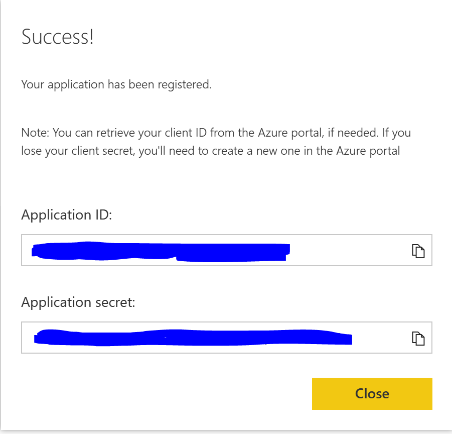

Retornamos a nuestro Custom Connector seleccionamos Azure Active
Directory en Proveedor de Indentidades (Identity Provider), pegamos el
ID y el Secret previamente copiados donde corresponde.

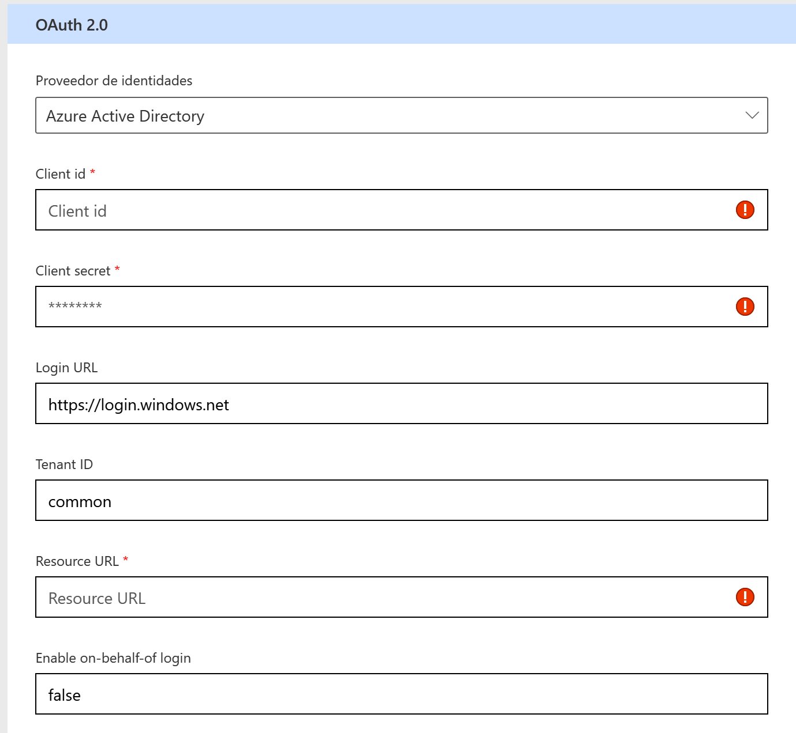

Ya cargados los datos necesarios pasamos a la definición haciendo clic
en 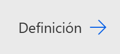

Aquí debemos definir todas las acciones que tendrá nuestro conector,
como ejemplo podría haber una acción por cada método de la Power BI Rest
API. Para agregar una nueva acción vamos a Acciones -> Nueva Acción.

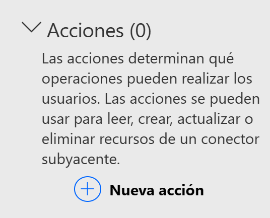

Debemos cargar el resumen, la descripción y el Identificador de nuestra
acción.

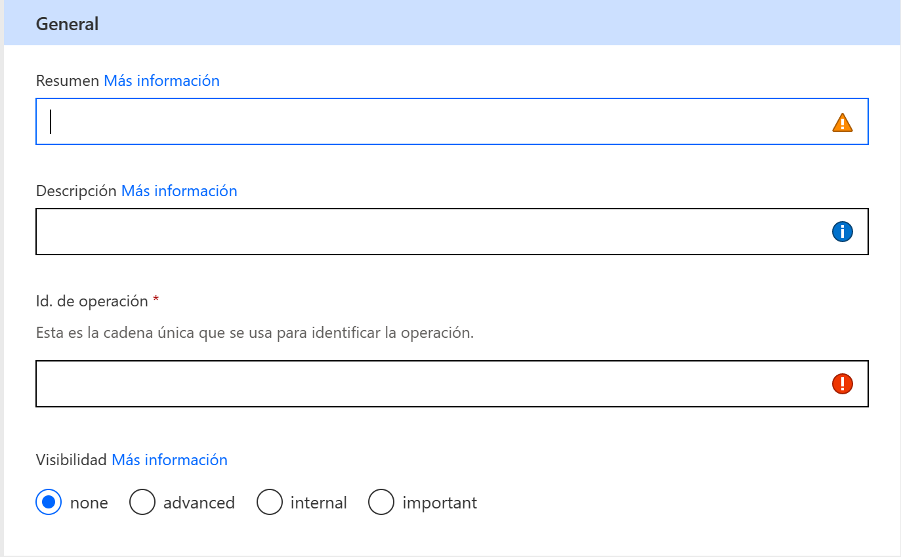

Luego vamos a crear la solicitud para esa operación.

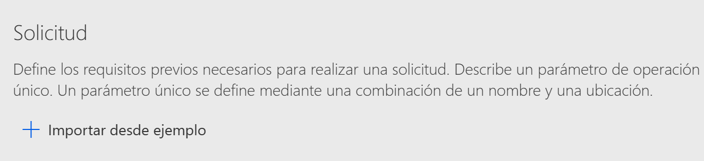

Luego vamos a importar desde ejemplo y le pegamos la llamada a nuestra
API. En este paso debemos seleccionar el verbo de la llamada "get","
post", "put", etc. Si no necesita de un cuerpo particular pegamos la
URL y el propio conector se encargará de crear el request y las
variables si así las identifica, si necesita un cuerpo debemos cargar un
ejemplo del JSON correspondiente.

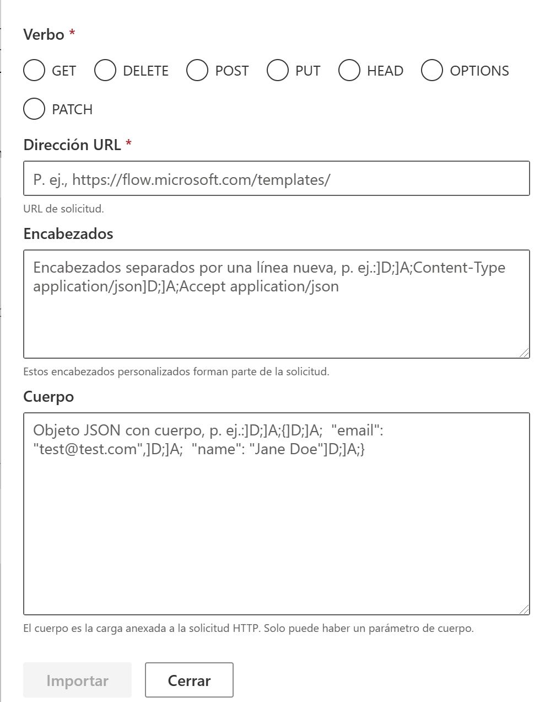

Para conocer las operaciones de la Power BI Rest API solo basta con
ingresar a https:// docs.microsoft.com/en-us/rest/api/power-bi. Luego de
cargar todas las acciones que consideremos necesarias debemos guardar y
actualizar el conector. Podemos ir a la sección de probar nuestro
conector para validar que todo funcione correctamente.

Ya nuestro conector quedo listo, este aparecerá en los conectores
personalizados cuando estemos en el diseñador de flujos de Power
Automate y lo utilizaremos como un conector más dentro de nuestro flujo.

**Conclusión**

Este particular conector personalizado con la Power BI Rest API nos
permite obtener información e interactuar con Power BI desde Power
Automate.

**Alex Rostán**  
Microsoft Business Applications MVP AI & Smarts Applications / Cloud Architect (Azure, O365, Power Platform)  
Mail:rostanker@msn.com  
Twitter: @rostanker  
LinkedIn: https://www.linkedin.com/in/alexrostan/ 
 
import LayoutNumber from '../../../components/layout-article'
export default LayoutNumber
