Con la aparición de la *Power Platform* Microsoft apostó fuerte por los
servicios destinados al *Citizen Developer*, aunque hoy en día ya
podemos decir que también están destinados a los *Pro Developer*. Entre
estos servicios podemos encontrar *Microsoft Power Virtual Agets*, cuyo
objetivo es facilitar a los usuarios finales la creación de chatbots, o
lo que es lo mismo, robots que son capaces de mantener una conversación
con un usuario mediante comandos de texto y/o voz. Entraríamos en un
interesante debate para ver si realmente un usuario con pocos
conocimientos técnicos sería capaz de trabajar con ambas herramientas.

Si a estos servicios le podemos añadir capacidades de Inteligencia
Artificial de una forma relativamente sencilla, entonces podremos
desarrollar herramientas realmente útiles. Es por este motivo que
Microsoft sigue por la IA, añadiendo nuevas funcionalidades y
capacidades, como es el reciente *Custom Question Answering*, un
servicio que nos permite realizar consultas sobre un documento no
estructurado (por ejemplo, un documento PDF), y recibir respuestas de
forma inmediata.

En este artículo se pretende mostrar cómo crear un chatbot con *Power
Virtual Agents*, que va a devolver respuestas en base al contenido de
uno o diversos documentos, sin que el usuario tenga que introducir las
preguntas y respuestas de forma manual.

*Azure Cognitive Service for Language documentation* es un servicio de IA que incorpora las siguientes funcionalidades:

-   *Extraer información:* Mediante el uso de *Natural Language
    > Understanding (NLU)*, podemos analizar un texto cualquiera e
    > identificar frases clave, información personal o encontrar
    > entidades (poblaciones, monedas, tipos de documentos).

-   *Responder preguntas:* Proporcionar respuestas a preguntas basadas
    > en el texto analizado de forma predeterminada, o bien editando los
    > pares pregunta-respuesta.

-   *Clasificación de texto:* Servicio con el que podemos detectar el
    > idioma o detectar el sentimiento de un texto analizado, mediante
    > el uso de *Natural Language Understanding (NLU)*.

-   *Traducir texto:* Servicio con el que podemos traducir cualquier
    > texto de un idioma origen a un idioma destino.

-   *Entender conversaciones:* Con este servicio podemos crear un modelo
    > de *Conversational Language Understanding* y entrenarlo, para
    > posteriormente usarlo en conversaciones con los usuarios (en
    > chatbots, por ejemplo).

Como siempre, el coste de uso de estos servicios vendrá determinado por
las capacidades de procesamiento contratadas.

**Caso práctico: Uso de *Custom Question Answering* en un chatbot de
Power Virtual Agents**

La mejor manera de ver cómo nos pueden ayudar estos tipos de servicios
es el de verlos en acción con un caso práctico. Imaginemos que queremos
crear un chatbot que proporcione respuestas sobre nuestros productos, la
información de los cuales se encuentra en un documento PDF (descripción
del producto, características, precio).

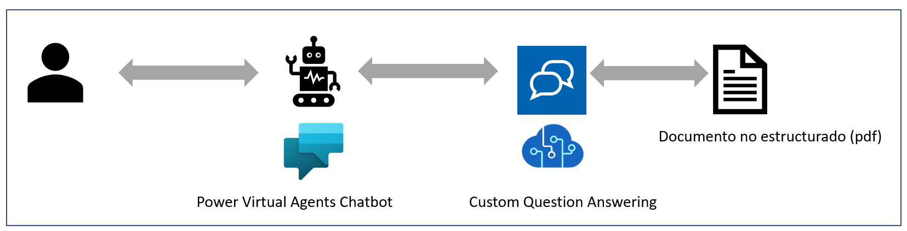

El objetivo es que, a partir del documento PDF con la información del
catálogo, el chatbot de *Power Virtual Agents* sea capaz de responder a
cualquier pregunta sobre nuestros productos.

**Creación de la base de datos de conocimiento**

Antes de crear nuestro chatbot de Power Virtual Agents, deberemos crear
el modelo de *Custom Question Answering*, siguiendo los pasos
siguientes:

1)  **Crear una instancia del servicio de QnA Maker:** Iremos a
    <https://www.qnamaker.ai/Create> e indicaremos que queremos crear
    una nueva base de datos de conocimiento (knowledge base) usando
    *Custom Question Answering*:

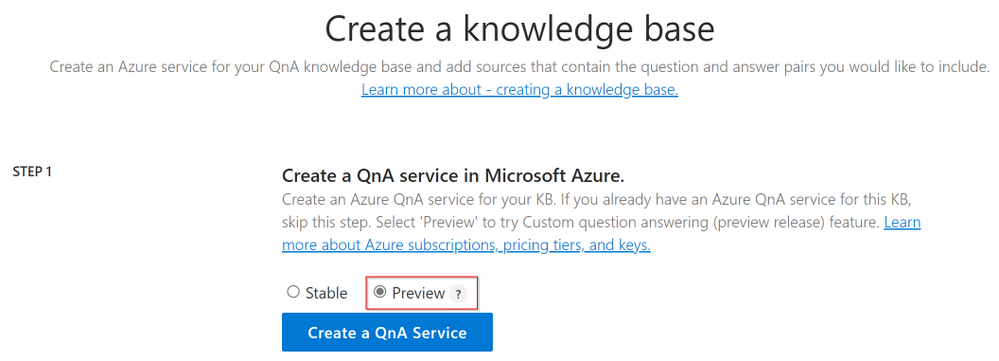

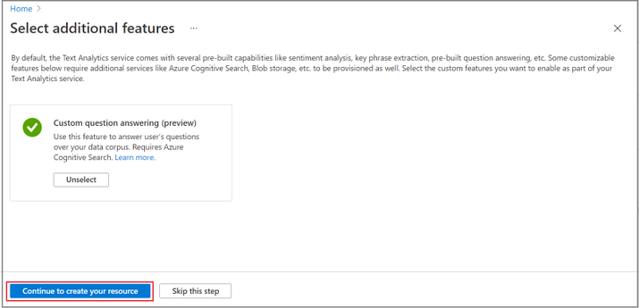

Finalmente, deberemos seleccionar en qué suscripción de Azure queremos
crear el servicio, y la capacidad de proceso que queremos utilizar.

2)  **Crear base de datos de conocimiento:** Deberemos seleccionar la
    instancia creada anteriormente, e indicarle qué contenido queremos
    que forme parte de la base de datos de conocimiento. En este caso,
    crearemos una base de datos de conocimiento llamada *Microsoft
    Devices Information*:

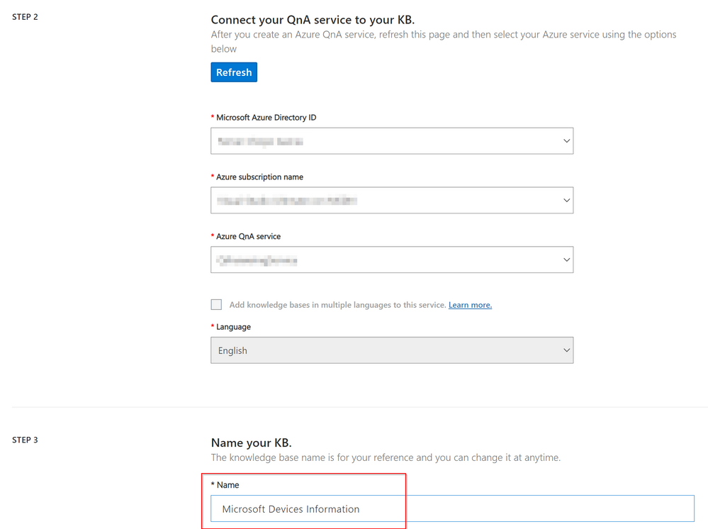

3)  **Añadir contenido a la base de datos de conocimiento:** En el
    siguiente y último paso, indicaremos que el fichero "*Introducing
    Surface laptop.pdf*", formará parte de la base de datos de
    conocimiento.

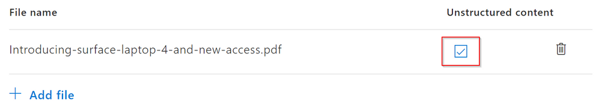

Una vez añadido el fichero ya podemos crear la base de datos de
contenido. A partir de ese momento se iniciará el proceso de análisis
del fichero, con lo que con *Custom Question Answering*, podremos
realizar preguntas que tengan relación con el mismo, y ver si obtenemos
respuestas:

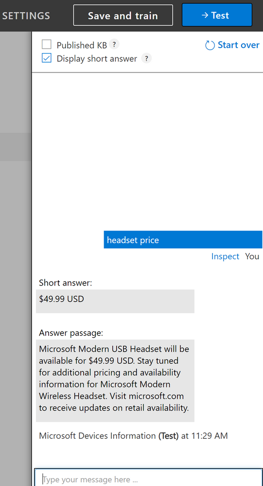

Así, podemos ver como preguntamos los precios de unos auriculares,
obtenemos la respuesta (*short answer*) y en qué párrafo del texto está
basada (*Answer passage*). Si creemos que la base de datos de contenido
es correcta, ya la podríamos publicar para su uso. Si no es así, podemos
modificar el fichero pdf, o crear nuevos ficheros para mejorar o
complementar la información.

**Creación del chatbot con Power Virtual Agents**

No perdamos de vista que el objetivo final es crear un chatbot que
responda a preguntas sobre productos, que sabemos que están basadas en
documentos de texto que hemos añadido a una base de datos de contenidos.
Por lo tanto, y en primer lugar, vamos a crear un nuevo Power Virtual
Agents bot:

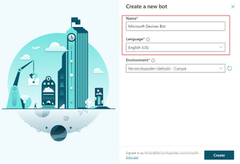

Sea cual sea la pregunta que nos realice el usuario, pediremos al bot
que reenvíe la pregunta al servicio de *QnA Maker* y *Custom Question
Answering*. Para ello, deberemos añadir lo que se llama un *fallback
topic*, o lo que es lo mismo, si el bot no encuentra una respuesta a una
pregunta, le pediremos que lleve a cabo una acción:

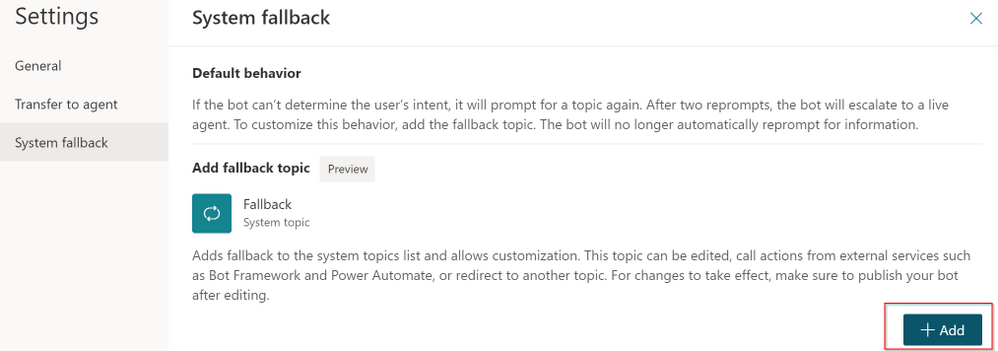

En este caso, la acción a ejecutar será la de llamar a un flujo de
*Power Automate*:

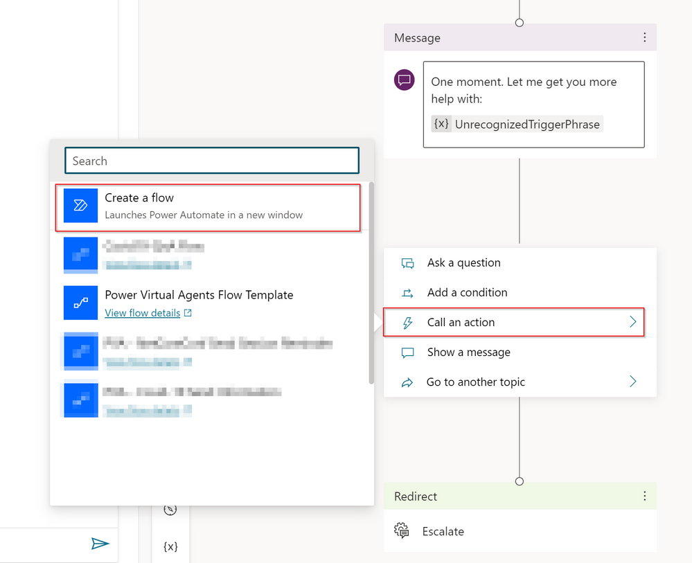

**Creación de un flujo de Power Automate para usar el servicio de
*Custom Question Answering***

El flujo va a constar de los pasos siguientes:

1)  Añadir una entrada en el disparador, que va a ser la pregunta
    introducida por el usuario.

2)  Hacer una llamada HTTP al servicio de QnA para obtener la respuesta
    basada en la pregunta del usuario. Para ello deberemos usar los
    parámetros que obtuvimos al crear la base de datos de contenido (Id
    de la base de datos, URL).

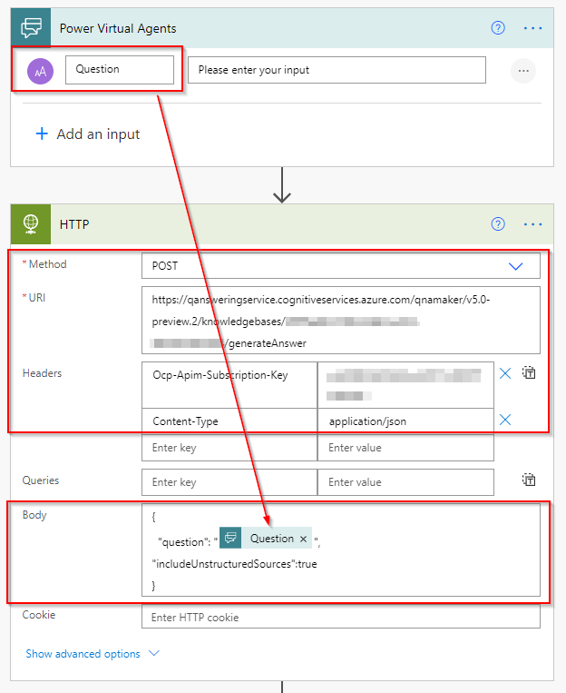

Cabe mencionar como en el cuerpo de la petición HTTP indicamos que
queremos consultar contenido no estructurado, y que debemos informarlo
siempre con el valor *true* si queremos obtener respuestas en base al
contenido de los ficheros.

3)  Comprobar si la llamada se ha ejecutado correctamente (código
    devuelto igual a 200).

4)  Si la llamada ha devuelto unos resultados correctos,

    a.  Interpretar el contenido de la respuesta (en format JSON) y
        capturar el valor de esta.

    b.  Como puede haber múltiples respuestas, en nuestro caso solo
        seleccionaremos la primera.

    c.  Devolver la respuesta al bot de PVA.

5)  Si no obtuvimos resultados correctamente, devolvemos un mensaje de
    error.

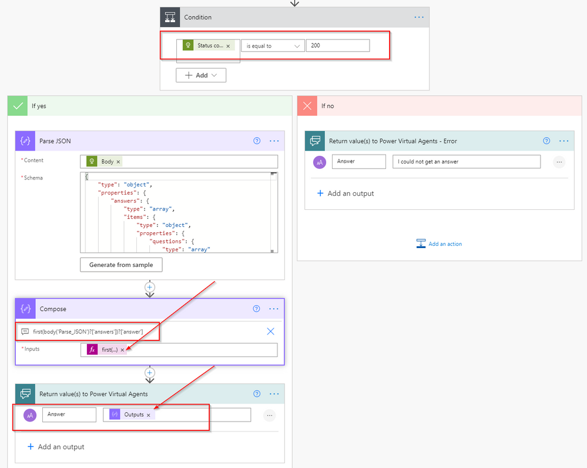

**Llamar al flujo desde el bot de PVA**

En este punto, debemos volver al diseñador de bots de PVA e indicar que
cuando se ejecute el *fallback topic*, se ejecute el flujo que acabamos
de crear.

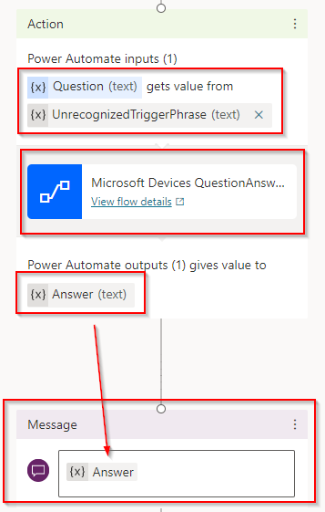

Como podemos comprobar, estamos pasando al flujo la palabra no
reconocida por el bot. Finalmente guardaremos los cambios y ya podremos
probar el bot de PVA.

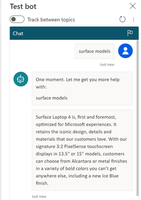

**Conclusión**

Hemos creado un bot de PVA que es capaz de responder a preguntas sobre
un catálogo de productos sin la necesidad de introducir la información
manualmente. En su lugar, hemos creado un servicio de QnA y *Custom
Question Answering* que es capaz de procesar contenido no estructurado y
devolver respuestas en función de las preguntas del usuario. Por lo
tanto, podríamos añadir nuevos documentos a la base de datos de
contenido, y crear potentes chatbots de PVA en cuestión de minutos.

Sin lugar a duda, el servicio de *Custom Question Answering* es una
herramienta muy útil que nos puede servir para reducir la complejidad y
el tiempo de desarrollo de nuestros chatbots de PVA.

**Ferran Chopo Garcia**  
Solution Expert -- PlanB GmbH  
ferran@ferranchopo.com  
@fchopo