**Uniendo tu backend en Azure con tu aplicación en tiempo real**

Vamos a partir de la base de que Power Apps o en concreto Power Platform
se está abriendo paso a Azure a pasos agigantados, y que cada vez será
más frecuente incorporar backends en Azure que den servicios a nuestras
aplicaciones, y crear procesos alrededor de nuestras Apps basados en
servicios de integración como Logic Apps o backend serverless en Azure
Functions.

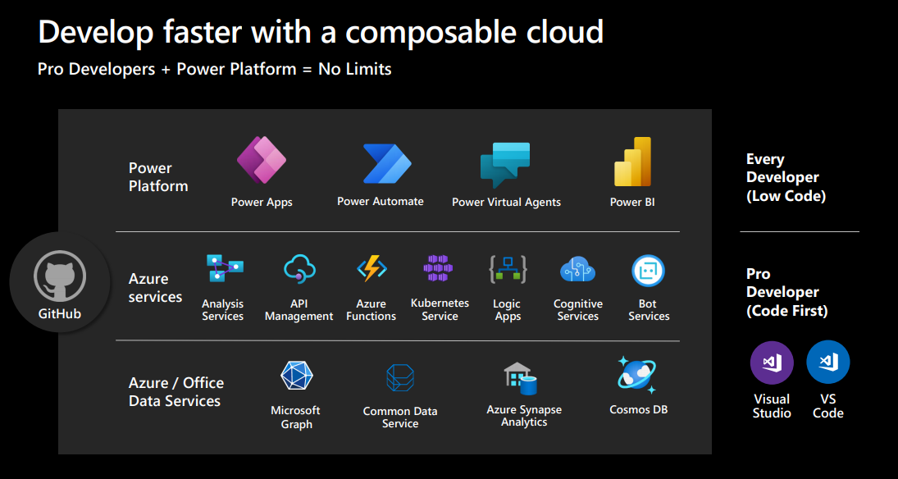


En muchos casos podremos crear conectores personalizados desde Azure y
hacer llamadas asíncronas desde nuestras apps, pero ¿Cómo conectamos
nuestros procesos pesados de backend con nuestras aplicaciones sin
recurrir a los temidos timers?.

**Contruyendo nuestra API Web Socket, un backend con Azure Signal R y Azure Functions**

En artículos anteriores hemos hablado de Azure SignalR , que por
recordarlo es un servicio que proporciona Azure para incorporar
funcionalidades web en tiempo real mediante peticiones Http y haciendo
uso de protocolo Websocket para conectar nuestros clientes con nuestro
servicio de mensajería.

Además, este servicio nos evita tener que montar un backend propio que
haga las conexiones y conecte con nuestros clientes, sino que podemos
tener múltiples clientes escuchando a nuestro servicio de SignalR y es
este el que se encarga de distribuir los mensajes en función de los
clientes conectados a un Hub en concreto.

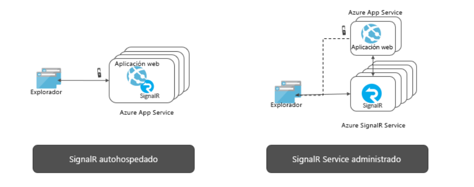


Sabiendo un poco por encima que es Azure SignalR, vamos a empezar a
utilizarlo en nuestra solución Real Time con Power Apps. Lo primero es
crear nuestra API WebSocket sobre Azure functions, que va a encargarse
de generar esa conexión segura con Azure SignalR, y de negociarla por
nosotros.

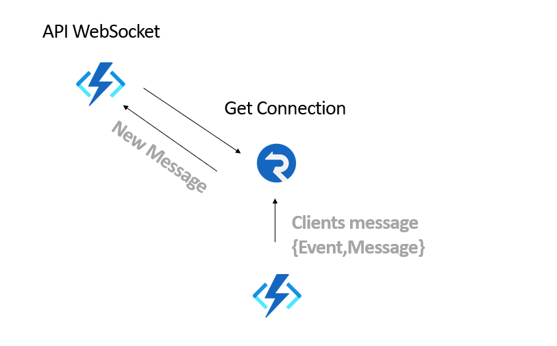


Como vemos nuestra solución es simple, crear una API de entrada sobre
Azure Functions, que negocie las conexiones para nuestra futura
aplicación de Power Apps, para que esta puede recibir todo mensaje que
enviemos a nuestro servicio de mensajería en tiempo real.

Nuestra functions solo necesita un método Negotiate del siguiente tipo:

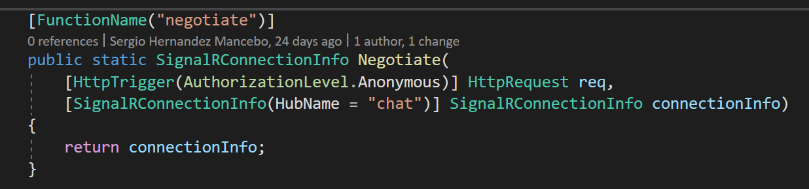

El trigger es del tipo HTTP, y además recibirá una petición de conexión
del tipo SignalR a un Hub concreto que nosotros hemos denominado Chat. 
Si todo va bien, se devuelve al cliente que invoque esta función la
conexión segura al SignalR, y desde la cual empezará a recibir mensajes.

Para que todo esto funcione, necesitamos tener vinculado a nuestro
proyecto de Azure Functions un servicio de SignalR, vía Azure Key Vault,
o en las propias settings del servicio de Functions tenemos que
referenciar la conexión segura a nuestro servicio de SignalR en Azure.

```
 "ConnectionStrings ": {

 "AzureSignalRConnectionString ":
 "Endpoint=https://eventdrivensignalrservice.service.signal ... "

}
```

La cadena de conexión la podemos encontrar en el portal de Azure en las
propiedades del propio servicio de SignalR. Una vez tenemos esta mínima
función programada, podemos desplegarla en Azure para poder hacer el
componente React que va a conectarse con ella desde Power Apps.

**Construir nuestro componente de Notificaciones con PCF y React**

El segundo paso es dar forma a nuestro componente de Power App con
React. 
Para ellos vamos a programar con Power App Component framework, un
pequeño componente que se va a conectar con nuestra API Websocket, y
desde la cual va a recibir mensajes en tiempo real.

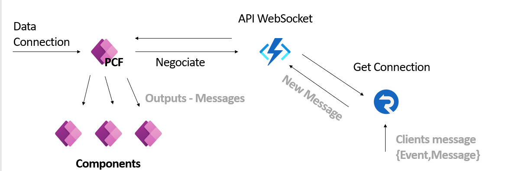


Para empezar, necesitamos tener instalado en nuestra máquina de
desarrollo, Power App CLI y que podéis encontrar en [CLI de Microsoft
Power Platform - Power Apps  | Microsoft
Docs](https://docs.microsoft.com/es-es/powerapps/developer/data-platform/powerapps-cli).

Para comprobar que todo va bien abrir vuestro Visual Studio Code y en el
terminal escribir PAC para ver que tenéis la última versión instalada.

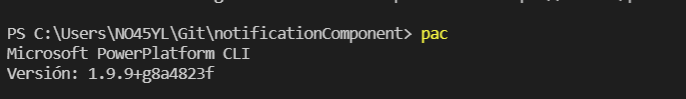

Ahora crearos una carpeta en vuestro entorno de desarrollo, y ejecutar
desde el terminal la instrucción pac pcf init  --namespace
notificationComponent  --name TSNotificationComponent  --template field

Si todo va bien, nos va a crear una estructura de proyecto en React de
Power App Component, que nos va a permitir diseñar nuestro componente de
Power Apps.

El primer paso es instalar el paquete de SignalR en nuestra solución
para poder usarlo, ejecutando en el terminal npm install
 @aspnet/signalR .

Sobre la solución creada nos creamos una carpeta Model y dentro un
fichero Recieved.ts

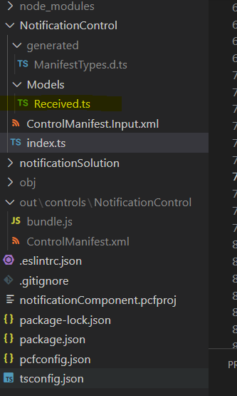


Abrirmos el fichero y definimos la siguiente clase:

```
class ReceivedModel
{
    sender: string;
    text: string;
    type:string;
}
``` 

Ahora vamos a modificar el manifiesto de la aplicación para que podamos
recibir los datos que necesitamos. Para ello, en el fichero
ControlManifest.input.xml añadimos las siguientes líneas:

```
 <property name= "Message " display-name-key= "Property_Display_Key "
description-key= "Property_Desc_Key " of-type= "SingleLine.Text "

usage= "bound " required= "false " />

 <property name= "SignalRUrl " display-name-key= "signalR_Key "
description-key= "signalR_Key " of-type= "SingleLine.Text "
usage= "bound " required= "true " />

 <property name= "hubName " display-name-key= "hub_key "
description-key= "hub_key " of-type= "SingleLine.Text " usage= "bound "
required= "false " />
```

Con esto estamos definiendo las tres propiedades que queremos manejar en
nuestro componente:

-   **SignalRUrl**: Aquí debemos introducir la URL del API Webscoket que
    hemos creado anterior mente en este artículo.

-   **HubName**: Vamos a usar esta propiedad para identificar el
     "nombre del evento ", del que queremos recibir mensajes.

-   **Message**: Que es cada uno de los mensajes que vamos a recibir en
    tiempo real.

Una vez configurado el manifiesto, nos queda configurar el Index.ts que
es la clase que maneja todo el componente. Lo primero es importar la
referencia a SignalR con la siguiente línea:

```
import  * as signalR from  " @aspnet/signalr ";
```

Dentro de la definición del componente  "Notification ", debemos añadir
las siguiente propiedades privadas:

```
private  _receivedMessage: string;

private  _notifyOutputChanged: () => void;

private  _context: ComponentFramework.Context <IInputs>;

private connection: signalR.HubConnection;

private  _signalRApi: string;

private  _hub: string;
```

Dentro del método Init que es el primer método que se ejecuta al cargar
nuestro componente en la APP, debemos añadir el siguiente código:

```
public init(context: ComponentFramework.Context <IInputs>,
    notifyOutputChanged: () => void, state: ComponentFramework.Dictionary,
    container:HTMLDivElement): void
  {
    this. _context = context;
    this. _notifyOutputChanged = notifyOutputChanged;
    this. _signalRApi=context.parameters.SignalRUrl.raw?
    context.parameters.SignalRUrl.raw: " ";
    this. _hub=context.parameters.hubName.raw?
    context.parameters.hubName.raw: " ";
    //Create the connection to SignalR Hub
    this.connection = new signalR.HubConnectionBuilder()
    .withUrl(this. _signalRApi)
    .configureLogging(signalR.LogLevel.Information) // for debug
    .build();
    //configure the event when a new message arrives
    this.connection.on(this. _hub, (message:string) => {
    this. _receivedMessage=message;
    this. _notifyOutputChanged();
    });
    //connect
    this.connection.start()
    .catch(err => console.log(err));
  }
``` 

Si analizamos el código anterior, lo primero que hacemos es mapear a
nuestras propiedades privadas los datos que hemos definido en el
manifiesto (hubName, SignalRUrl), y con estas vamos a crear nuestra
conexión SignalR y a definir nuestro evento para recibir los mensajes:

```
this.connection = new signalR.HubConnectionBuilder()
    .withUrl(this. _signalRApi)
    .configureLogging(signalR.LogLevel.Information) // for debug
    .build();
    //configure the event when a new message arrives
    this.connection.on(this. _hub, (message:string) => {
    this. _receivedMessage=message;
    this. _notifyOutputChanged();
    });
```

Por último, el código inicializa la conexión contra el SignalR y abre la
conexión por WebSockets con el servicio en Azure, recordemos que pasa
por nuestra API WebSocket, y es esta la que establece la conexión de
forma correcta con Azure SignalR.

Por último, tenemos que poder refrescar la propiedad Message cada vez
que se reciba un mensaje, ya que el código de Init solo refresca la
propiedad privada, necesitamos que el componente exponga a nuestra APP
el mensaje recibido.

Para ello sobre el método getOutputs añadimos el siguiente código:

```
public getOutputs(): IOutputs
{
    //This code will run when we call notifyOutputChanged when we receive a new message
    //here is where the message gets exposed to outside
    let result: IOutputs = {
        Message: this. _receivedMessage
    };

    return result;
}
```

Con getOutputs podemos indicar a una propiedad de salida como Message,
que se resetee con la propiedad recievedMessage con cada cambio de valor
de esta.

**Depurando el componente en local con Postman**

Una vez tenemos el componente terminado, podemos probar el componente.
Para ello vamos a añadir un método que reciba mensajes en nuestra API de
Websocket, con el siguiente código, con el objetivo de que el componente
que se conecte al evento puede recibir los mensajes:

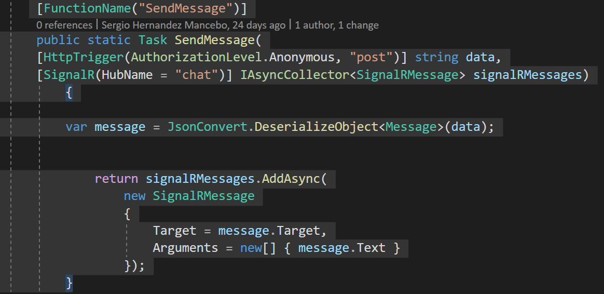

Esta functions recibe mensajes con un modelo tipado, pero que podéis
elegir vosotros como mejor os venga para definir el mensaje. 
Ese mensaje lo enviamos a SignalRMessage, mediante la cadena de conexión
de nuestro API Websocket, y cada cliente que se conecte a esta conexión
irá recibiendo en tiempo real los mensajes.

Una vez terminado de actualizar la functions, para probar el componente
de React, tenemos que ejecutar estos tres comandos en orden:

-   npm install

-   npm run build

-   npm run start

Con estos tres comandos instalamos todos los paquetes necesarios para el
componente de React de Power Apps, lo compilamos y sobre todo nos lo
ejecuta en un navegador local.

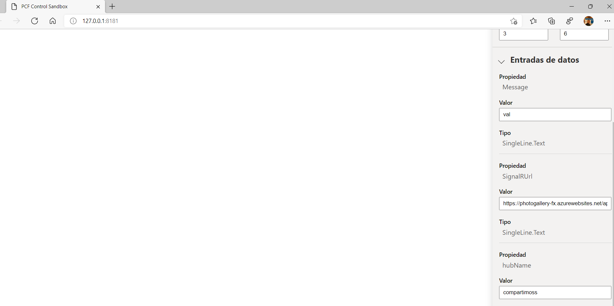


Como vemos en la figura actual se levanta un navegador con el
componente, simulando a **Power Apps Studio**, y podemos configurar
nuestro componente:

-   **HubName**: Compartimoss

-   **SignalRUrl**:  url_websocket_api/api, recordar no poner el método negotiate en la url, lo coge por convenio.

Por otro lado, debemos lanzar desde Postman peticiones al método
**SendMessage** que hemos configurado y desplegado en nuestra Function.

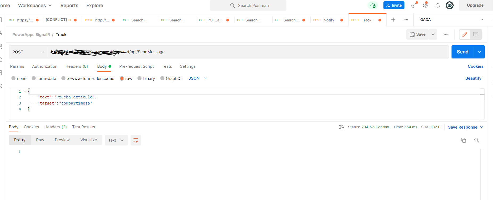


Mandamos un json con los datos del mensaje, recordando que cruzamos el
nombre de la propiedad HubName con el target que enviamos por Postman.
Podríamos cambiar el nombre de hubname por cualquier otro, aunque
recordar que debemos asegurarnos que por código enviemos a SignalR, el
nombre del  "Target " de forma correcta:

```
return signalRMessages.AddAsync(
    new SignalRMessage
    {
        Target = message.Target,
        Arguments = new [ ] { message.Text }
    });
```

Con esto ya tenemos en tiempo real el componente en el simulador, y
podemos ver que gracias al código del getOuputs de mi componente, la
propiedad Message se actualiza en tiempo real

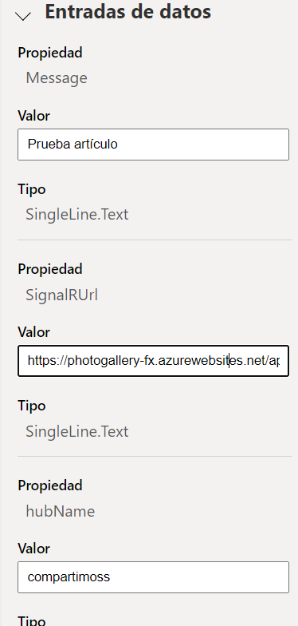


Desde aquí ya tenemos conectado un componente PFC con nuestro backend en
Azure mediante Azure SignalR. Este componente lo podemos empaquetar, y
desplegar en nuestro tenant de Power Apps, pudiendo así usarlo en
nuestras aplicaciones.

**¿Cómo le podemos sacar partido?,** pues fácil si a la propiedad
mensaje le conectamos funcionalidad de Power Apps como un Notify podemos
tener notificaciones en nuestra App en tiempo real.

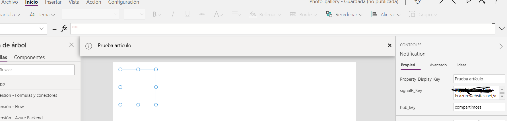


Como vemos en la siguiente imagen, ya tengo una página en blanco con mi
componente Notification agregado, y sobre la propiedad  "On change ",
añado un **Notify(Notification.Message)**.

Notification es el nombre que le he dado a nuestro componente en la
página de Power Apps, y Message es la propiedad que por código me
escribía los mensajes obtenidos desde Azure SignalR.

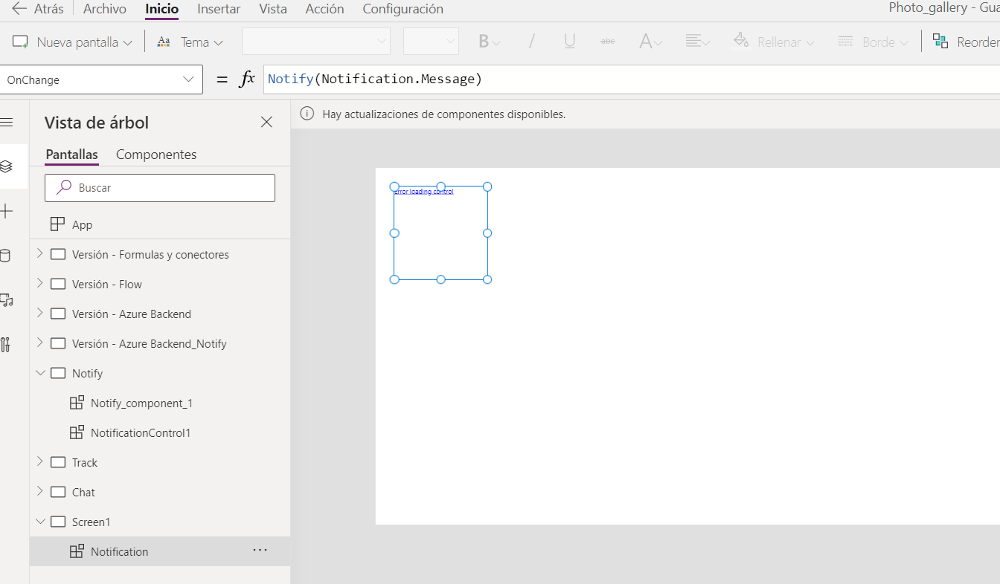

Con esto tenemos una notificación en tiempo real en Power Apps, con solo
añadir el componente y recordando configurar los campos de signalR_key y
hub_key tal cual se ve en la siguiente figura.

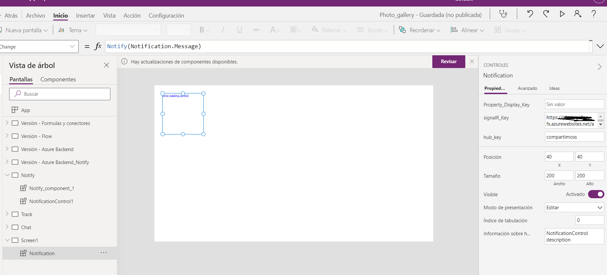


**Conclusiones**

Pues la mejor de las reflexiones, es que en todo el artículo estamos
hablando de Power Apps, y no hemos parado de hablar de Azure y de React,
nada más que añadir.

Bueno sí, ¿Quién decía que Power Platform es solo Low Code?, los tiempos
cambian, y debemos poder sacar el máximo partidos a cada uno de los
servicios que nos proporciona Microsoft, sean de Office 365, de Power
Platform o de Azure. Vivimos la época dorada del desarrollo de
Aplicaciones empresariales, no nos cerremos a una sola tecnología.

¡¡¡¡Feliz navidad a todos!!!!


**Sergio Hernandez Mancebo** <br />
Azure MVP 
 
import LayoutNumber from '../../../components/layout-article'
export default LayoutNumber
