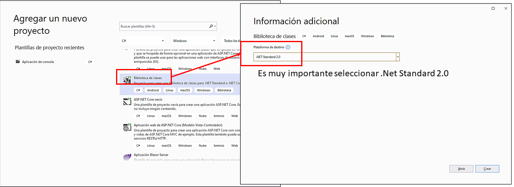

Desde la incorporación de *Roslyn* como *Compiler as a Service* (*CaaS*)
en *.Net*, los programas pueden hacer uso de los servicios típicos de un
compilador para usar la diversa información acerca de la compilación de
código fuente para hacer sus labores. Si bien es una necesidad bastante
específica, que seguramente no tenga aplicación directa o evidente en
bastantes tipos de software, la flexibilidad y control que otorga al
programador hace que merezca la pena conocer su existencia y
aplicaciones. En este artículo vamos a hablar de un elemento nuevo de
.*Net 5*, los *Source Generators* que, apoyándose en los servicios
*CaaS* mencionados, da la capacidad al programador de introducir código
nuevo a voluntad en tiempo de compilación, que puede ser generado a
partir de información disponible durante dicha fase. El artículo muestra
un ejemplo paso a paso de uso, y también establece las bases para crear
programas cuyo código fuente pueda cambiar en función de características
externas al mismo que puedan obtenerse antes de su compilación.

Los *Source Generators* son una nueva característica de *.Net 5*. Una de
sus principales utilidades es que nos permiten generar código que va a
ser añadido al del resto del programa en tiempo de compilación. ¿Qué
significa esto? Pues que, si los usamos, el código del programa que va a
compilarse no va a ser ya solo el que veamos en nuestro IDE, sino que
podemos introducir nuevos ficheros de código justo antes de compilar
nuestra solución. Es importante entender este concepto antes de seguir
desarrollándolo:

-   Cuando compilamos una solución se compilan todos los ficheros de
    código que la componen.

-   Habitualmente los tenemos todos a golpe de vista en nuestro IDE,
    organizados en *Proyectos* de nuestra *Solución*.

-   Ahora, gracias al uso de *Source Generators*, existirá un conjunto
    extra de código que se introducirá en una fase concreta del proceso
    de compilación junto con el resto. Este código lo podemos definir a
    voluntad.

-   A efectos de compilación, todo el código es igual (se compilan de la
    misma forma y, si hay errores de tipo, de sintaxis o cualquier de
    otra clase, se notifican también con los mismos mensajes de error a
    los que estamos acostumbrados). Solo cambia cuando se "mete" ese
    código en el proceso de compilación.

La Imagen 1 representa este proceso. En ella podemos ver cómo hay una
fase de compilación extra donde actúan los *Source Generators*. Si
existe alguno definido, se analiza su código, se genera un nuevo código
fuente si es correcto (y si no, se muestran los errores de tipo,
sintaxis, etc. al usuario), y finalmente se introduce ese nuevo código
fuente en el proceso de compilación:

![Imagen 1.- Incorporación de un *Source Generator* al proceso de compilación** [1]](../../../images/numero50/source_generators/image1.png)

Si bien en este artículo nos vamos a centrar en esta primera
característica, no podemos dejar de mencionar que otra de sus utilidades
es proporcionar **objetos de compilación** (*compilation objects*)
[2]. Estos objetos representan el código que está siendo compilado, y
pueden inspeccionarse para trabajar con los modelos de sintaxis y
semántica del código de la misma forma que los analizadores de código.
En la Figura 5 veremos posteriormente como se usa uno para obtener el
namespace donde se ha definido el método Main.

La combinación de las dos características hace que los *Source
Generators* puedan llegar ser muy útiles en determinados escenarios. Por
ejemplo, podemos usar los metadatos generados por el compilador para
crear el código que se incorporará a la compilación, haciendo que este
cambie en función de lo que hayamos leído. No obstante, los datos que
podemos usar para construir el código que se añadirá a la compilación
pueden ser muchos más: características de la máquina, presencia de
determinados servicios, ficheros, usuarios, etc. En general, todo lo que
creamos que nos puede ser útil para modificar y adaptar el código del
*Source Generator* que se va a acabar compilando y que podamos obtener
vía código. Todo esto es posible gracias a las funcionalidades
proporcionadas por el *Compiler as a Service* *Roslyn* [3].

Antes de continuar, quiero destacar un aspecto que distingue la
aproximación que representa los *Source Generators* respecto a otras
soluciones, técnicas o productos que puedan parecer similares: no son
código añadido en tiempo de ejecución [4]. Esto implica que, una vez
el programa esté en ejecución, no podremos modificar su código mediante
*Source Generators*, y es necesario usar otras técnicas para ello.
Además, gracias a esto nos aseguramos de que los tipos de todo el código
en ejecución ya hayan sido comprobados por el compilador (siempre y
cuando no usemos elementos del lenguaje como dynamic).

**Limitaciones de los *Source Generators***

A pesar de que los *Source Generator* son muy potentes, en su diseño no
se contemplaron determinados casos de uso de forma intencionada, qué
podemos decir que son limitaciones. Como decíamos, un *Source Generator*
está compuesto por cadenas de texto que representan código C# válido que
se añadirá a la compilación. Sin embargo, este código añadido NO puede
modificar código que ya hayamos definido en nuestra solución (el que
vemos en el IDE), es decir, solo se puede añadir código y no modificar
el existente. Esta limitación de acceso a otro código desde un *Source
Generator* también incluye al código generado por otros *Source
Generator* distintos. Tampoco es posible generar nuevas características
del lenguaje con ellos.

A consecuencia de la primera limitación, está claro que no pueden usarse
directamente para la reescritura de código en tiempo de ejecución. Como
decíamos, para este último caso de uso existen otras técnicas y
librerías más adecuadas, como *IL Weaving* [5] o *CallSite Rewriting*
[6]. No obstante, desde un *Source Generator* sí podemos acceder a
otros ficheros que no sean código C#, e incorporar o manipular su
contenido. Además, en el caso de que haya un error generando el código
fuente de uno de ellos, podemos ver la causa de este de la misma forma
que si fuera código que nosotros hemos escrito en el IDE. No tenemos que
olvidar lo que dijimos en la introducción: al final todo se va a
compilar de la misma forma, y cambia CUÁNDO el código se le proporciona
al compilador.

**Aplicaciones de los *Source Generators***

Siendo unos elementos tan avanzados, creados con unos objetivos y
limitaciones bien claros, existen una serie de casos de uso
perfectamente documentados por *Microsoft* [7], donde se muestran
ejemplos en los que los *Source Generators* resultan muy útiles para
distintos escenarios. Algunos de los más interesantes son:

-   **Generar nuevas clases a las que se puede hacer referencia desde el
    código de usuario**. Eso quiere decir que el código que escribimos
    en el IDE puede hacer referencia a un tipo que aún no está definido.
    Ese tipo se generará en tiempo de compilación con la información que
    podamos leer del resto del programa.

-   **Transformar ficheros que no sean código C#**: y de esta forma
    construir una representación en C# de los contenidos de ese fichero
    (listas, árboles, etc.)

-   **Incorporar nuevas funcionalidades al código del usuario**: Podemos
    añadir nuevos elementos a clases que hayamos definido en el IDE como
    parciales (partial).

**Ejemplo sencillo de uso de *Source Generators***

A modo ilustrativo, veamos el siguiente ejemplo de uso. Imaginemos que
tenemos una aplicación que va a desplegarse en dos tipos de redes. En
una de ellas la información que necesita se va a consumir vía servicio
web, mientras que en la otra lo va a hacer desde una base de datos
*MariaDB*. Está claro que podríamos programar la aplicación para que, en
tiempo de ejecución, detecte cada uno de los casos y actúe en
consecuencia, lo cual tiene un coste en ejecución. ¿Qué pasaría si en
una aplicación dada este tipo de decisiones tuviera un coste en
ejecución elevado? ¿No se podrían generar dos versiones de la misma
aplicación "especializadas", adaptadas a cada escenario de uso? Es
decir, tendríamos una misma solución y aplicación, pero el código fuente
a compilar cambiaría en función de información externa a la misma que le
suministremos en la fase de compilación. Veamos cómo.

Lo primero sería definir un pequeño esqueleto que se encargará de "leer"
esos datos en una solución de *Visual Studio* estándar. El código fuente
de la Imagen 2 muestra este esqueleto, así como una explicación de cada
uno de sus elementos:

Hecho esto, vamos a crear un nuevo proyecto en la solución para crear
nuestro *Source Generator*. Este nuevo proyecto va a ser una biblioteca
de clases y, mucho cuidado, debemos especificar que la biblioteca a
crear debe seguir el *.Net Standard 2.0* (ver Imagen 3). Esto es muy
importante porque si especificamos otro *framework* (incluso el *.Net
Standard 2.1*) la creación de los *Source Generator* fallará. Es de
esperar que en el futuro haya un soporte más integrado para la creación
de *Source Generator* en *Visual Studio*, pero por el momento debemos
tener especial cuidado en este paso.

Una vez creada la librería, otra de las cosas que debemos hacer es
añadir una referencia a los paquetes Microsoft.CodeAnalysis.CSharp y
Microsoft.CodeAnalysis.Analyzers en el fichero .csproj que se ha
generado para este nuevo proyecto, de manera que queden de la forma que
se muestra en la Imagen 4:

{width="6.1527209098862645in"
height="1.4111745406824148in"}

Hecho esto, ya podemos definir el código de nuestro *Source Generator*.
Para ello, es necesario crear una clase etiquetada con el atributo
[Generator] y que implemente la interfaz ISourceGenerator. Esto nos
obliga a implementar dos métodos:

-   **Initialize**: Que podemos usar para preparar, calcular u obtener
    cualquier información que sea necesaria para crear el código del
    *Source Generator*. Aquí podríamos consultar ficheros externos,
    recursos accesibles vía código en la máquina o en remoto, o
    cualquier cosa que necesitemos para crear el código como queremos.

-   **Execute**: Donde crearemos el código a añadir en forma de string y
    lo añadiremos al conjunto de ficheros a compilar especificando un
    nombre para el fichero que contendrá dicho código
    (context.AddSource). Nótese que, aunque en este ejemplo usamos un
    solo literal string, nada nos impide componerlo a partir de varios,
    intercalar trozos de código según deseemos, leer código fuente de
    otros ficheros, o cualquier combinación que nos permita construir el
    código final.

Con estas premisas, creamos el *Source Generator* tal y como se ve en la
Imagen 5, donde además se han incluido comentarios para entender bien lo
que se pretende hacer. Es especialmente destacable el comentario donde
se habla de los *compilation objects*, y que muestra cómo se podría
acceder a ellos para obtener más información.

Y ya casi lo tenemos, simplemente quedaría añadir desde el proyecto del
programa principal **una** referencia de proyecto a la biblioteca de
clases con el *Source Generator* que hemos creado. No obstante, no basta
con añadir una referencia como se hace normalmente desde el IDE, sino
que es necesario de nuevo modificar manualmente el fichero .csproj de la
solución para añadir un par de atributos más a la referencia añadida, de
manera que quede como se ve en la Imagen 6:

Y en este momento por fin ya estaría listo. Si ahora recompilamos la
solución, el programa nos dirá que los datos se han leído de un servicio
web. Si modificamos el código del *Source Generator* para que
ReadsDataFromWebService devuelva false y recompilamos, el programa nos
dirá que los datos se leen de una base de datos. Tenemos por tanto un
mismo programa cuyo código fuente cambia en función de aspectos que
podemos determinar justo antes de compilarlos, de forma que el código se
adapte a cualquier escenario que nos planteen cuando lo creemos. Ya no
sería necesario tomar decisiones en tiempo de ejecución, sino que el
código podría salir compilado directamente para cualquier alternativa
que podamos necesitar.

**¿Podemos "jugar" con las limitaciones de los *Source Generators*?
Modificar clases existentes mediante el preproceso**

Esta última funcionalidad creada a base de clases parciales es la que
nos podría permitir de alguna forma "saltarnos" una de las limitaciones
de los *Source Generator* para conseguir efectos interesantes, que nos
podrían resultar útiles en determinados escenarios. Como hemos visto, si
definimos una clase como parcial y con métodos parciales, es posible
añadir o modificar elementos en ella a través de los *Source Generator*,
pero conviene recordar de nuevo que no será posible modificar los que ya
hayamos introducido en el IDE.

No obstante, ¿qué ocurriría si preprocesamos el código fuente de nuestro
proyecto para transformar algunas clases del código que va a compilarse
en algo que sí se pueda modificar con un *Source Generator*? A priori no
debería ser algo imposible de realizar con un programa externo que haga
transformaciones a las clases que queramos para adaptarlas, y establecer
así qué partes de esta puedan definirse como *Source Generators*. El
interfaz público de la clase, usado por el resto de las clases del
programa para comunicarse con la que estamos convirtiendo, se podría
mantener así:

1.  **Redefiniendo la clase como parcial** si no lo es ya, y haciendo
    que todos los métodos susceptibles de ser modificados por un *Source
    Generator* sean parciales también.

2.  En caso de que no pueda convertirse el método a parcial directamente
    (no retorna void), podemos reproducir la misma técnica que el
    ejemplo anterior: un método mantendrá la signatura del original y
    llamará a otro que retorna void que sí podrá ser modificado por un
    Source Generator.

3.  En caso de necesitar hacer el paso anterior, el tipo de retorno del
    método quedará como un atributo privado con un nombre generado
    automáticamente con un patrón conocido (ejemplo: result_<Nombre
    del método>). El *Source Generator* escribiría el resultado de la
    llamara en este atributo en lugar de devolverlo (ya que es void).

4.  Si hacer la clase parcial no es viable por algún motivo, podemos
    crear una interfaz que tenga todos los métodos públicos de la clase
    a transformar, reemplazar cada declaración de un objeto de dicha
    clase por dicha interfaz, y luego transformar la clase a modificar
    para que implemente dicha interfaz, atendiendo a lo dicho en el
    segundo punto.

Por tanto, esta aproximación necesitaría un programa externo con el que
podamos decidir "convertir" cualquier clase del programa que estemos
creando en otra equivalente compatible con un *Source Generator* para
ciertos métodos que queramos. Al hacer eso, tendremos total libertad
para modificar el código de los métodos transformados de dicha clase y
añadir los elementos que nos hagan falta en tiempo de compilación. Esto
realmente no solventa las limitaciones de un *Source Generator*, sino
que se aprovecha de un preproceso para seleccionar determinadas clases e
instrumentarlas de manera que sea posible modificar su código fuente sin
romper dichas limitaciones. De nuevo el objetivo es el mismo que en el
ejemplo anterior: que el código fuente de un programa que va a
compilarse se modifique en función de otras consideraciones externas, de
manera que el programa resultante sea uno u otro adaptado a ellas.

El siguiente ejemplo describe cómo podría hacerse esa transformación con
una clase de ejemplo. Si bien es viable desarrollar un programa capaz de
hacer este proceso automáticamente, en este artículo describiremos el
proceso de forma manual para que se entienda mejor. La principal ventaja
de esta técnica es que en todo momento estamos lidiando con código que
se introduce en tiempo de compilación. En lugar de recurrir a técnicas
que modifiquen el código en tiempo de ejecución, como las que
mencionamos anteriormente, y que pueden tener un coste en ejecución
(tiempo y memoria) elevado, ahora dicho coste se ve reducido al de
ejecución del código introducido. Todo el proceso de añadido,
compilación y comprobación de tipos se seguirá haciendo en la fase de
compilación del programa. La Imagen 7 muestra como la clase HashCompute
se puede transformar para que sus métodos GetHash (privado) y
GetHashString (público) puedan ser modificados vía *Source Generator*.
En el ejemplo cambiamos el algoritmo de generación de *Hash* de SHA-256
a SHA-512, más seguro, para mostrar un cambio de funcionalidad.

La creación del *Source Generator* correspondiente es idéntica a la del
ejemplo anterior y, como vemos el código generado (Imagen 8), ahora da
una nueva implementación a ambos métodos.

En este ejemplo además queda patente que *Visual Studio* necesita aún
una mayor integración con los *Source Generators*, porque en ocasiones
se reporta un error de que hay métodos ya definidos. Sin embargo, este
error es falso, y la ejecución de la clase modificada se puede hacer sin
problemas. Como decíamos anteriormente, es de esperar que estos
problemas sean solventados en el futuro.

Una vez visto cómo podría convertirse una clase en algo manipulable
mediante un *Source Generator*, vamos a ver 3 posibles ejemplos de
utilidad que nos podrían resultar interesantes. Ha de tenerse en cuenta
que ahora parte de las clases se construirán a partir de string de
código, por lo que es totalmente viable inyectar en ellas cualquier
función que queramos. Aunque en el ejemplo anterior el *Source
Generator* cambiaba la funcionalidad de la clase, se puede orientar la
transformación de manera que se añada código al ya existente, por lo que
el código del *Source Generator* podría crearse en gran medida a partir
del fichero fuente de la clase original que estemos compilando en
nuestro IDE. De hecho, si nos fijamos en el ejemplo anterior, el código
del *Source Generator* es casi idéntico al original.

-   **Inyección de log**: Los métodos convertidos de esta forma pueden
    añadir al principio y antes de cada uno de sus return una llamada a
    una clase Logger externa que haga la traza de cada llamada, por
    ejemplo, para hacer depuración. Una vez el log no sea necesario, el
    programa se recompilaría sin dicho código.

-   **Inyección de mediciones de rendimiento**: Una variante del proceso
    anterior se puede dar cuando, en lugar de hacer logs de por dónde ha
    pasado un código, lo que hagamos es introducir llamadas al principio
    y antes de cada return de la función para medir tiempos. De esta
    forma podríamos localizar posibles cuellos de botella y el programa
    podría compilarse sin esta funcionalidad en cuanto ya no fuera
    necesaria la misma.

-   **Creación de *mockups***: Cuando se hacen pruebas de sistema es muy
    típico que parte de un sistema, bien por estar todavía en fase beta
    o bien por no estar todavía disponible, se pruebe creando un
    *mockup*, es decir, haciendo que parte del código devuelva valores
    fijos o aleatorios sin producirse ninguna computación real que forme
    parte del modelo de dominio. Una clase adaptada de esta forma puede
    transformarse fácilmente en una que siga la filosofía de un
    *mockup*. De esa manera, nuestra herramienta de conversión podría
    decidir qué clases van a ser convertidas a *mockup* en cada una de
    las compilaciones.

**Conclusiones**

En este artículo hemos visto de qué manera podemos definir un *Source
Generator*, sus limitaciones, utilidad y cómo podemos aprovecharnos de
su filosofía para transformar clases existentes en otras equivalentes
que permitan usarlos. De esta forma, se abre la posibilidad de poder
modificar en tiempo de compilación ciertas clases de un programa que
hayamos preprocesado previamente para ello, compilándose así distintas
versiones de un mismo programa con cambios a su código fuente que
hayamos decidido introducir en tiempo de compilación. En el futuro
quiero explorar esta línea de trabajo para conseguir distintos efectos
útiles, algunos de ellos relacionados con la seguridad del código de una
aplicación. Esto se añadiría a la nutrida colección de ejemplos de uso
de los *Source Generators* que ya existe por Internet [8].

Los ejemplos mostrados en este artículo están disponibles públicamente
en un repositorio de GitHub [9].

**Jose Manuel Redondo López**  
Profesor Titular Universidad de Oviedo  
**Referencias**  
[1] P. Carter, «Introducing C# Source Generators,» 6 11 2021. [En
línea]. Available:
https://devblogs.microsoft.com/dotnet/introducing-c-source-generators/.
[2] Microsoft, «Microsoft.CodeAnalysis Namespace,» 6 11 2021. [En línea].
Available:
https://docs.microsoft.com/en-us/dotnet/api/microsoft.codeanalysis?view=roslyn-dotnet-3.11.0.
[3] GitHub, «Roslyn: The .Net Compiler Platform,» 6 11 2021. [En línea].
Available: https://github.com/dotnet/roslyn.
[4] J. M. Redondo, «Dynamic Class Creation in C#-Preserving Type Safety in C# with Roslyn,»
*DotNetCurry Magazine,* 2020. 
[5] W. Barbosa, «.NET IL Weaving for
those who know nothing about .NET IL Weaving,» Medium.com, 24 10 2017.
[En línea]. Available:
https://medium.com/@heytherewill/net-il-weaving-for-those-who-know-nothing-about-net-il-weaving-c0f7e461ef47.
[Último acceso: 6 11 2021].
[6] A. Mikunov, «Rewrite MSIL Code on the
Fly with the .NET Framework Profiling API,» Microsoft, 22 10 2019. [En
línea]. Available:
https://docs.microsoft.com/en-us/archive/msdn-magazine/2003/september/write-msil-code-on-the-fly-with-the-net-framework-profiling-api.
[Último acceso: 6 11 2021].
[7] Varios, «Source Generators Cookbook,»
GitHub, 2021. [En línea]. Available:
https://github.com/dotnet/roslyn/blob/main/docs/features/source-generators.cookbook.md.
[Último acceso: 6 11 2021].
[8] Varios, «Source Generators Examples,»
GitHub, 2021. [En línea]. Available:
https://github.com/dotnet/roslyn-sdk/tree/main/samples/CSharp/SourceGenerators.
[Último acceso: 6 11 2021].
[9] J. M. Redondo, «Source Generators
Example,» GitHub, 6 11 2021. [En línea]. Available:
https://github.com/jose-r-lopez/Source_Generators_Example . [Último
acceso: 6 11 2021].