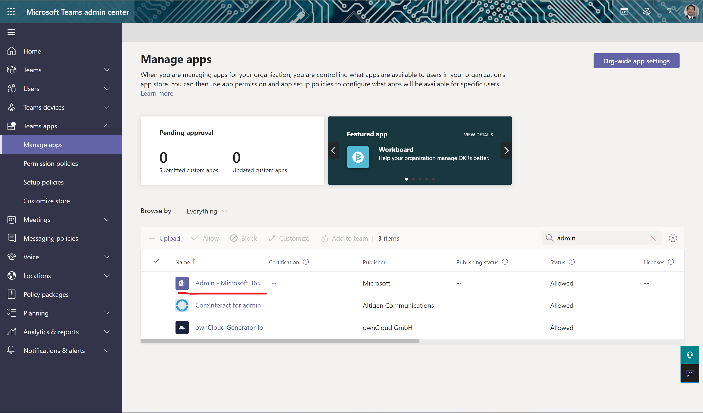
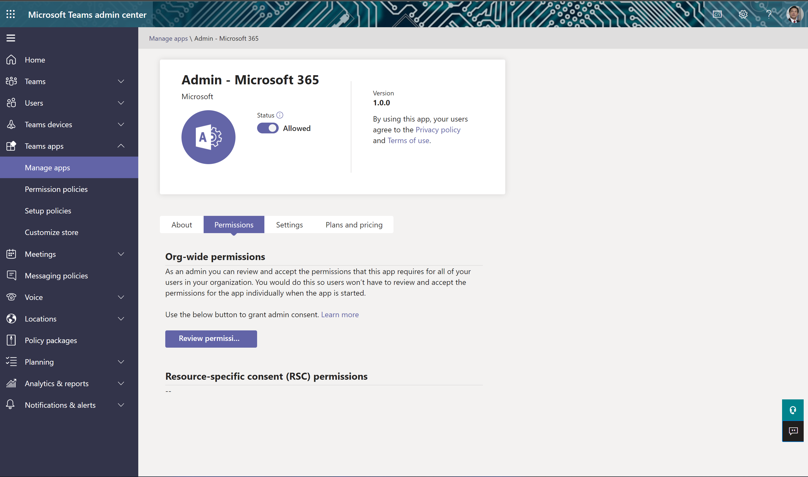
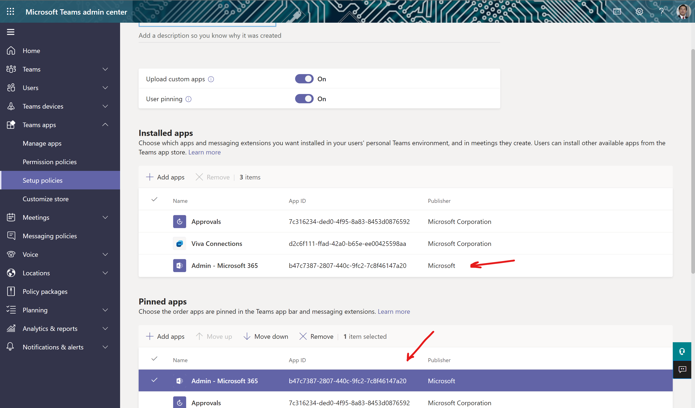
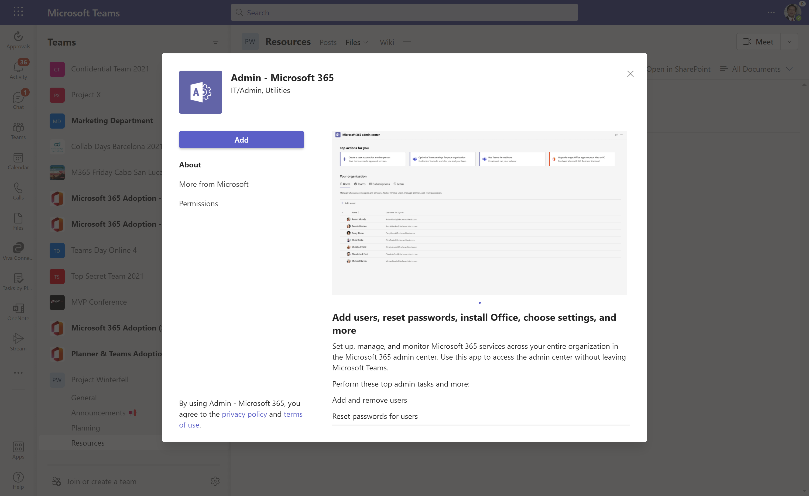
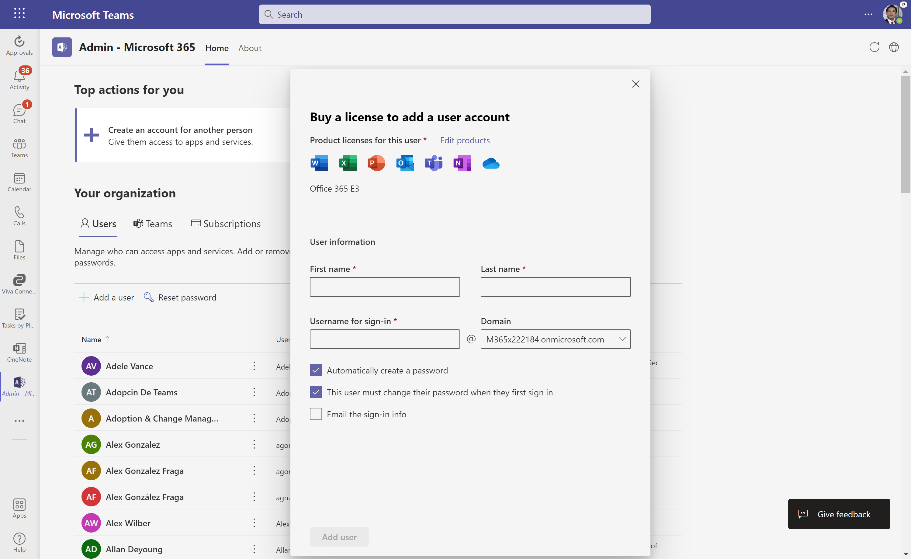
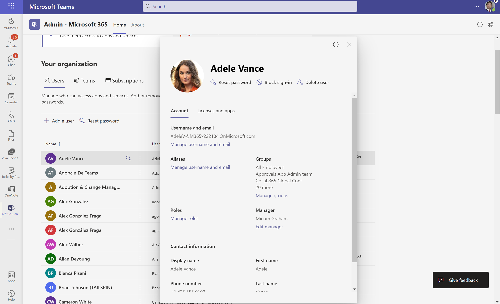
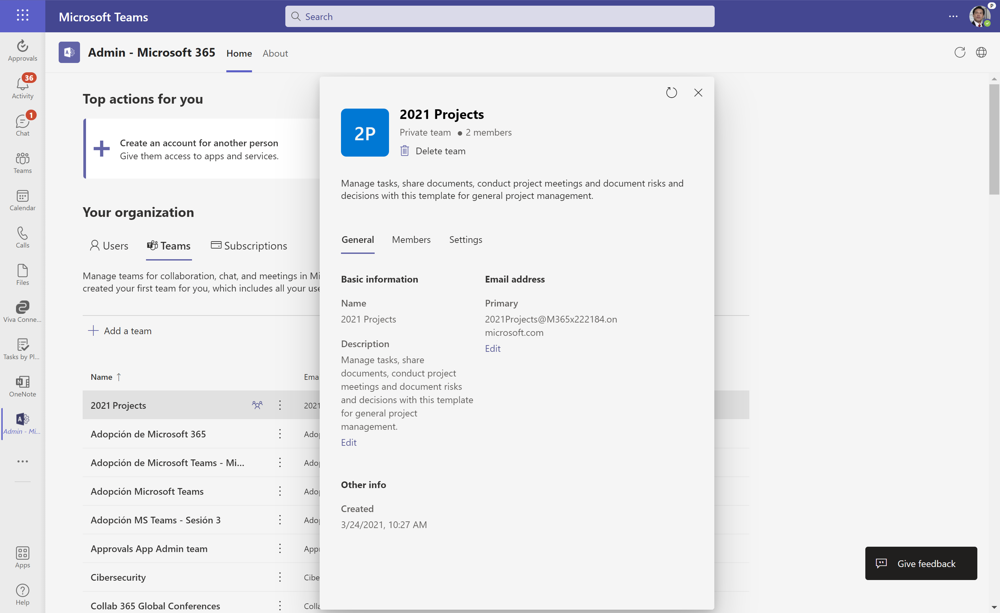
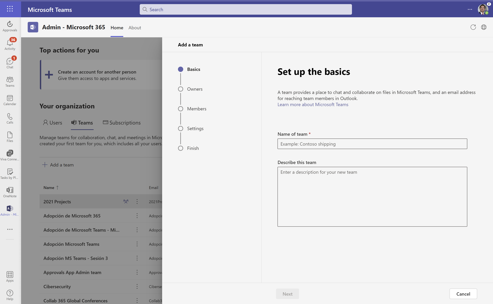
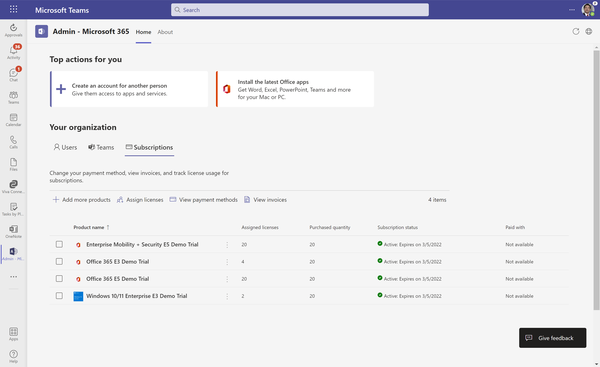

En este artículo os voy a mostrar como podemos realizar ciertas tareas
de administración de Microsoft 365 desde Microsoft Teams a través de la
Admin -- Microsoft 365 App liberada por Microsoft el año pasado (Nota:
Si no recuerdo mal, el anuncio de la App se realizó en la edición de
otoño de Microsoft Ignite 2021) lo que es un ejemplo más de como en
Teams tiene cabida todo tipo de Aplicación que un usuario, dependiendo
de su rol, pueda requerir en su día a día.

**Admin -- Microsoft 365 App en el Teams Admin Center**

Como siempre, lo primero que tenemos que hacer cuando hablamos de
Aplicaciones para Teams ya sean de Microsoft o de terceros es revisar
que están habilitadas para poder ser utilizadas por el usuario, sus
posibilidades de configuración y luego determinar como queremos que se
use la App y quien la usar en nuestra organización a través de las
correspondientes directivas de permisos de aplicaciones y de
configuración.

Como podréis comprobar, esta App tiene de particular que requiere
permisos elevados en el tenant para que los usuarios con el rol
requerido puedan realizar funciones de administración en el tenant. Como
administradores del tenant podremos revisar los permisos de la App y
realizar el consentimiento correspondiente:

**Añadiendo la Admin -- Microsoft 365 App en Microsoft Teams**

Añadir la Admin -- Microsoft 365 App en Microsoft Teams se puede
realizar de acuerdo con dos posibilidades:

-   Opción #1: Mediante una directiva de configuración en la que la App
    directamente esté ya disponible para usar por los usuarios e incluso
    anclada en la barra de aplicaciones de Teams:

-   Opción #2: Que sea el usuario quien localice la App y la añada al
    cliente de Teams:

Cualquiera de las dos opciones tendrá como resultado que el usuario
tendrá disponible la Aplicación para realizar las tareas de
administración que habilita.

**Administrando Microsoft 365 con la Admin -- Microsoft 365 App**

Una vez que tenemos instalada la Aplicación en Teams, ya podemos pasar a
realizar operaciones de administración de Microsoft 365. Como podéis
ver, la pantalla principal se divide en las siguientes secciones:

-   Top actions: Accesos directos a acciones de administración como por
    ejemplo crear una cuenta de usuario y asignar una licencia.

-   Your organization: Sección desde la que podemos administrar
    Usuarios, Teams de Microsoft Teams y subscripciones en el tenant. En
    el caso de Usuarios, podemos añadir nuevos usuarios (Experiencia ya
    explicada) o bien para un Usuario existente ver su ficha de detalle
    y/o realizar acciones rápidas como reinicio de contraseña, bloquear
    el inicio de sesión o eliminarlo.

> De manera similar podremos ver los Teams de Microsoft Teams, editar un
> Team existente y realizar ciertas operaciones en el mismo o bien crear
> un Team nuevo.

> La experiencia de usuario de creación de un Team es similar a la que
> tenemos para crear Grupos en el Microsoft 365 Admin Center:

Finalmente, desde la App podremos administrar de forma similar las
suscripciones disponibles a través de poder asignar licencias a
usuarios, visualizar los métodos de pago habilitados o ver las facturas
disponibles entre otros.

**Conclusiones**

Sin duda, la App de Admin -- Microsoft 365 es un ejemplo claro de como
en Microsoft Teams podemos integrar aplicaciones de todo tipo y que en
este caso está enfocadas a que perfiles con un rol de administrador en
el tenant puedan de forma rápida realizar ciertas acciones de
administrador sin tener que salir del cliente de Microsoft Teams.

**Juan Carlos Gonzalez Martin**  
Offices Apps & Services MVP  
M365 SME & Delivery Manager  
@jcgm1978 | https://www.linkedin.com/in/juagon/