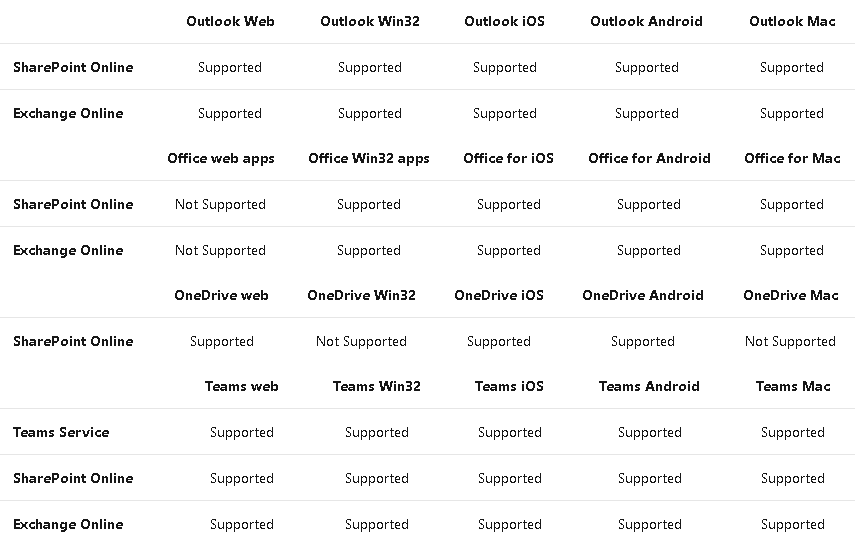
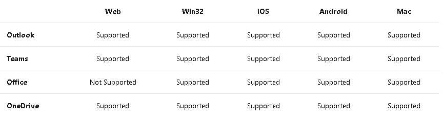
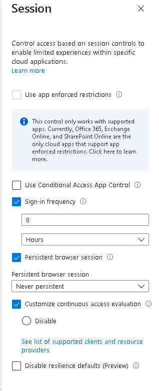
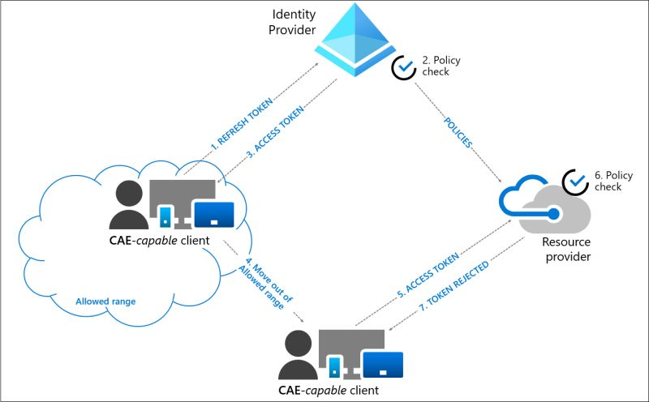

¡Hola de nuevo! Esta vez vamos a hablar de una nueva funcionalidad de
Azure AD que se integra con Acceso Condicional y que proporciona una
experiencia casi en tiempo real para proteger nuestros recursos y
aplicaciones, esta nueva funcionalidad es: Continuous Access Evaluation
(CAE).

Vamos a ver en detalle de qué se trata, pero primero, entendamos que
pasa en las tripas de las autenticaciones mediante tokens, para ello,
nos tenemos que fijar en OpenID Connect para la parte de Autenticación y
OAuth 2.0 para la parte de autorización.

Cuando nos conectamos a un servicio de Microsoft, por ejemplo Teams, las
peticiones a las API son autorizadas mediante un token de acceso OAuth
2.0, por defecto, este token tiene una validez de 1 hora, cuando este
token expira, la sesión se redirige a AzureAD para que este refresque el
token (a este token también lo veréis referenciado como Access Token
Lifetime). En ese momento de refresco, es cuando se reevalúan las
políticas de Acceso Condicional para el acceso de ese usuario, y que,
dependiendo de la casuística, se diera el caso de que no pudiera renovar
el token. Ya nos podemos imaginar que las ventanas aquí pueden ser muy
diversas (dependiendo de la configuración que apliquemos), pero entre
ese primer token que obtenemos y el refresco de este, pueden pasar
muchas cosas.

Básicamente la casuística es la siguiente: como administrador de IT
necesito bloquear a un usuario desde el portal de Azure, debido a una
brecha de seguridad, cada minuto cuenta, y ese token por defecto de 1
hora, es muy largo y puede hacer mucho daño.

Y es aquí, donde CAE entra en acción, ya que habilita a Azure AD (el
emisor de los tokens) y al servicio de Microsoft (que actúa como RPT) a
tener una conversación bidireccional.

**¿Vale, pero esto que significa?**

Pues básicamente, que el tiempo de vida del token deja de ser tan
importante, ya que el servicio de Microsoft (Azure AD en este caso),
puede darse cuenta de cualquier cambio en casi tiempo real. Por lo que
se presentan dos tipos de
[escenarios](https://docs.microsoft.com/en-us/azure/active-directory/conditional-access/concept-continuous-access-evaluation#scenarios)
muy importantes:

-   Critical Event Evaluation: eventos en los que no está basado acceso
    condicional, pero sí que se apoya en otros servicios de Azure AD:

    -   Cuenta de usuario eliminada o deshabilitada.

    -   El usuario ha cambiado el password o ha sido reseteado.

    -   MFA ha sido habilitado para el usuario.

    -   El administrador explícitamente ha revocado los tokens para ese
        usuario.

    -   Se ha detectado un riesgo mediante Azure AD Identity Protection.

-   Conditional Access Evaluation: Servicios como Exchange Online,
    Teams, MS Graph se sincronizan con las políticas de Acceso
    Condicional para que CAE pueda reevaluar y hacer de trigger.

Con lo que, algunos de sus principales beneficios son:

-   Forzamos el cierre de la sesión del usuario o bien la contraseña se
    cambia y/o resetea: la sesión del usuario se revoca en tiempo
    prácticamente real.

-   Cambio de ubicación de red: Las directivas de acceso condicional
    serán lanzadas casi en tiempo real.

-   Una maquina con un token valido sale del perímetro marcado como
    trusted location: las políticas de acceso condicional serán
    reevaluadas y lanzadas si es el caso.

Hay que tener en cuenta que, para los clientes, CAE se comporta de forma
diferente, ya que anteriormente los clientes trabajaban con el token en
caché hasta que este caducaba, ahora con CAE se ha introducido un nuevo
mecanismo para indicar que el token ha sido rechazado y que este debe
renovarse, por lo que el escenario es algo similar al siguiente:

**Me gusta lo que me dices, ¿Pero, como lo configuro?**

Si tenemos un tenant donde en su día activamos CAE en Preview,
simplemente deberemos de acceder al portal de Azure Security Continuous
Access Evaluation y darle a migrar

Es una migración sencilla, así que darle sin miedo

Para los que no estuvisteis en la Preview de CAE, no os preocupéis, no tenéis que hacer nada, CAE estará activo en todas aquellas políticas de Acceso Condicional que tengáis ya implementadas, pero si se da el caso de que queréis desactivarlo de alguna de ellas, el procedimiento es simple.
Accedemos a la politica de AC en cuestión y vamos al apartado de sesión:

**¿Y cómo es el flujo de autenticación? ¿Y la experiencia de usuario?**

En este caso, el flujo de autenticación del usuario es algo como el
siguiente:

1.  Se piden credenciales o refresco de un token a Azure AD para acceder
    a un recurso en concreto.

2.  Azure AD evalúa las políticas de Acceso Condicional para ver si el
    cliente cumple las condiciones.

3.  Se devuelve un Access token con sus propiedades respectivas.

4.  El usuario se mueve fuera del rango de IPs permitido.

5.  El usuario presenta de nuevo el token adquirido anteriormente fuera
    del rango de IP permitido.

6.  Se evalúa la validez del token y se evalúa la ubicación respecto a
    la directiva.

7.  En este caso, se deniega el acceso y se envía un challenge ya que la
    petición proviene de una IP fuera de rango.

8.  Volvemos al paso 1 y volvemos a validarnos desde la nueva ubicación.

En cuanto al usuario final, hay diferentes formas de ver su experiencia,
pongamos como ejemplo lo siguiente:

-   El usuario se conecta desde una red que es considerada como
    **"Trusted Location".**

-   El usuario accede mediante Edge a Outlook en la web.

-   El usuario puede recibir y enviar correos.

> Ahora bien, ¿qué pasa si el usuario cambia de red?

-   El usuario se conecta a un AP que está considerado como **"Untrusted
    Location".**

-   El usuario abre Edge y navega a Outlook en la web.

-   Pero, al intentar refrescar su correo, CAE detecta el cambio de red
    y al usuario le salta un prompt para iniciar sesión mediante MFA.

Podemos ver que CAE actúa prácticamente en tiempo real, con algo tan
simple como cambiar de localización de red y vemos como impacta esto en
el usuario.

**Para cerrar...**

Esto soluciona uno de los problemas de seguridad que han existido con la
distribución de token, su expiración y el periodo de refresco, ya que
había un gap entre los cambios en las condiciones y/o permisos, y cuando
esto se veía reflejado en los ciclos de refresco, Ahora con CAE, esto se
puede solventar sin impactar la experiencia de usuario.

Para mas info: [Continuous access evaluation in Azure AD | Microsoft
Docs](https://docs.microsoft.com/en-us/azure/active-directory/conditional-access/concept-continuous-access-evaluation)

**Alberto Andrés Rodríguez**  
Cloud Solutions Architect @ Seidor   
@albandrod  
https://albandrodsmemory.com/