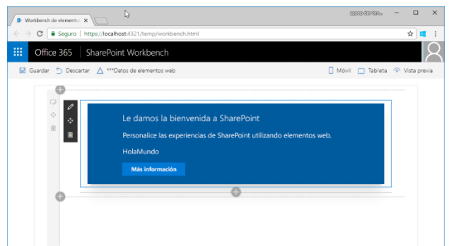
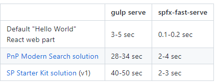
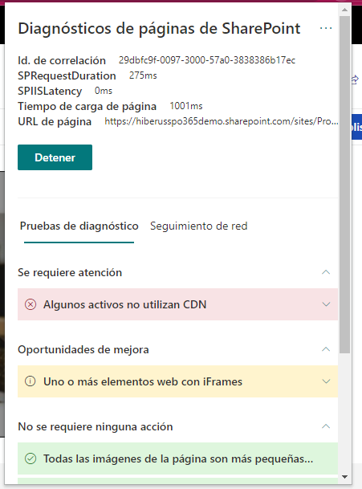
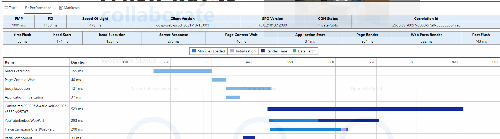
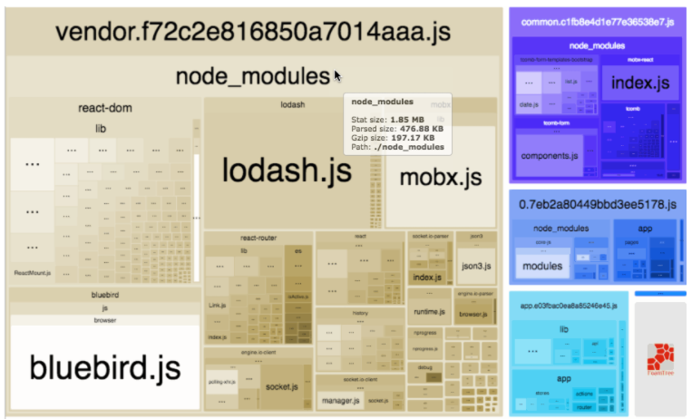
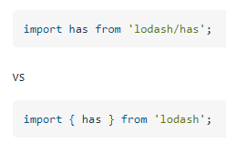
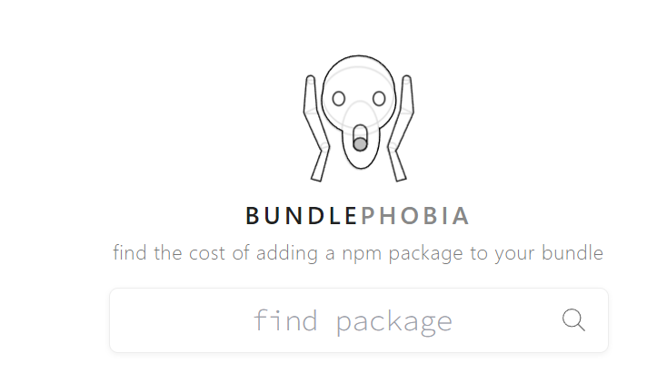
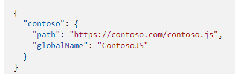

En el siguiente artículo vamos a hablar de consejos para hacer que tus
proyectos de SPFx funcionen mas rapido y diferentes consejos sobre que
pasos deberiamos tener en cuenta antes de desplegar en produccion.

**Qué es SPFX o Sharepoint Framework**

Es un modelo de elementos Web y páginas que proporciona compatibilidad
completa con el desarrollo de SharePoint del lado cliente, integración
fácil con los datos de SharePoint y extensión de Microsoft Teams.

SPFx es el modelo recomendado de extensibilidad y personalización de
SharePoint para desarrolladores.

Una vez hecha la introduccion hablaremos del primer consejo:

**Como reducir los tiempos de compilacion desarrollando**

Para poder desarrollar con SPFx tenemos un serie de comandos gulp donde
compilamos la solucion se levanta un localhost y podemos abrir el
workbench dentro de nuestro Sharepoint Online para testear nuestro
componente.




El problema que han experimentado los desarrolladores comparado con un
desarrollo tipico frontend es que tarda mucho en compilar los cambios,
del orden de 5 a 7 segundos. Esto provoca que el desarrollador este
mucho tiempo inactivo esperando como compila y se visualizan los
cambios. La comunidad vio esta problemática y es por eso que surgio:

**SPFX Fast Serve**

¿Como funciona? Es un paquete npm que instalamos y hace unas
modificaciones en el fichero gulp y webpack de nuestra solucion para que
compile de manera diferente y conseguimos unos resultados sorprendes,
como podemos ver en este cuadro comparativo.




¿Como aplicar los cambios a tu proyeco?

-   Abrir terminal donde esta la solucion alojada.

-   Ejecutar npm install spfx-fast-serve -g.

-   Ejecutar spfx-fast-serve y seguir las instrucciones.

-   Ejecturar npm install.

-   Ejecturar npm run serve.

Mas informacion: <https://github.com/s-KaiNet/spfx-fast-serve>

En el siguiente bloque vamos a comentar diferentes aspectos a tener en
cuenta antes de desplegar nuestra solucion en Produccion. Normalmente en
cualquier proyecto de front end hay diferentes aspectos a tener en
cuenta como :

-   El tamaño de la solucion.

-   Hospedarlo en un cdn.

-   Dependencia entre modulos.

-   Carga de componentes solo cuando se van a usar.

-   Testear la solucion.

En este apartado hablaremos de que herramientas usaremos para conseguir
estos objetivos con SPFx.

**Diagnosticos de Páginas de SharePoint**

Plugin de google chrome desarrollado por Microsoft que permite evaluar
ciertos aspectos claves para garantizar un correcto funcionamiento de
nuestras soluciones. Inicialmente lo empezo a usar el equipo de soporte
de Microsoft para evaluar problemas de rendimiento y finalmente lo
lanzaron publico y lo añadieron dentro de su guia para desplegar en
produccion.




Cuales son los puntos mas importantes a tener en cuenta:

**CDN**

Tener el cdn habilitado va a hacer que la solucion cargue mas rapido,
por lo tanto si no esta habilitado es un punto que va a marcar este
plugin. Si es tambien vuestro caso , en el siguiente articulo explica
como habilitar el CDN en Sharepoint Online:

<https://docs.microsoft.com/es-es/sharepoint/dev/spfx/enable-microsoft-365-content-delivery-network?tabs=msposh>

**IFrames**

El uso de iframes penaliza el tiempo de carga y hace que nuestra pagina
tarde mas en cargar , es por eso que el plugin lo muestra como warning y
un aspecto de mejora.

**Tiempo de carga**

Si las WebParts o extensiones tienen un tiempo de carga muy alto, lo va
a marcar como tiempo de mejora. Podremos ver cuanto tiempo tarda en
cargar. Un aspecto a tener en cuenta es que llegara un momento en el que
no sera posible reducir los tiempos ya que los componentes core de la
webpart tienen unos tiempos de carga que no pueden ser reducidos

**Tamaño de los assets**

Ya sea en la webpart o en la pagina usamos assets como imágenes, CSS,
etc. Si los componentes tienen un tamaño muy grande tambien lo marcara
como aspecto a mejorar

**Dashboard de Desarrollador**

Una manera de poder ver los tiempos de carga de nuestros componentes es
con el siguiente panel. Para habilitarlo ejecutar control + F2 y
aparecera el siguiente panel.




No solo permite ver el rendimiento y tiempos de carga sino que tambien
es posible ver trazas que pongamos en el codigo de nuestra solucion.

**Reducir tamaño de la solucion**

Para poder tomar accion el primer paso es ver los resultados. La mejor
manera de poder ver esa informacion es usando **Webpack Bundle
Analyzer**. Te muestra graficamente el tamaño de la solucion y sus
dependencias.




Como usarlo:

-   Ejecutar npm install \--save-dev webpack-bundle-analyzer

-   Modificar el fichero gulpfile.js y agregar la siguiente linea

```
build.configureWebpack.mergeConfig({
    additionalConfiguration: (generatedConfiguration) => {
        fs.writeFileSync(\"./temp/\_webpack_config.json\", JSON.stringify(generatedConfiguration, null, 2));
        return generatedConfiguration;
    }
});
```

Una vez se han obtenido los datos de cuanto consume cada librería ,
componente etc. Unos trucos para reducir su tamaño.

-   Referencia sólo lo necesitan componentes / funciones:



-   Compruebe si esta habilitado tree shaking:



-   Utilizar referencias internas antes que externas, como lodash,
    moment

-   Externalizar las referencias de 3 partes



**Habilitar Tests en SPFx**

Otro aspecto importante antes de ir a produccion es testear nuestros
compontentes. Como habilitar tests en nuestra solucion:

-   Ejecutar npm i **@voitanos/jest-preset-spfx-react16**

Este paquete habilitara el testing en nuestra solucion.

**Todo en uno**

Por ultimo si estamos buscando una solucion que ya incluya la mayoria de
consejos comentados previamente tenemos esta solucion:

**PnP/generator-SPFx**

-   Multiple libraries like react , vue , angular , jquery

-   Testing

-   Webpack analyser

-   Last spfx version 1.11.0

-   PNPJS

-   PNP Spfx Controls

SPFx fast serve coming soon (not by default)


Mas informacion: <https://pnp.github.io/generator-spfx/>

**Ruben Toribio**