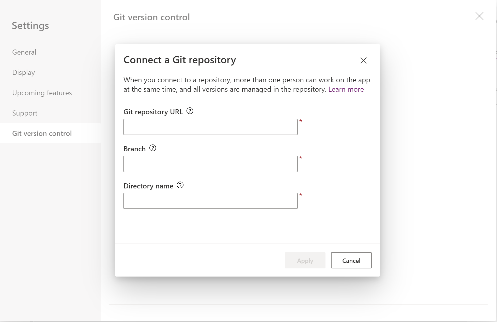

Ahora con Power Apps podemos trabajar de forma colaborativa sin afectar
el trabajo del resto de los colaboradores teniendo en cuenta algunas
premisas y configuraciones que veremos a continuación. Lo primero que
debemos hacer es habilitar el control de código, para ellos tenemos que
ir a configuraciones de la Power Apps o Settings, luego vamos a próximas
características o Upcoming Features en la pestaña Experimental buscamos
"Show the Git Version Control setting" y la activamos.

Ya activada la feature debemos conectar con el repositorio de Git.

En este punto nos pedirá los datos de nuestro repositorio Git, donde
podremos elegir Github or Azure DevOps.

Para este articulo elegí crear un repositorio en GitHub:

Ahora necesitaremos generar un Access Token para utilizar como
contraseña. Para ello vamos a setting en nuestro perfil de github ahí
buscamos las developer settings y allí a personal Access Token y
generamos uno nuevo.

Le damos permiso sobre el repositorio y lo generamos.

Una vez generado nos retornará el token, debemos copiarlo para continuar
la configuración en la Power App.

Nos loguemos con nuestro usuario y Access token allí nos preguntará se
queremos crear un nuevo repositorio le decimos que Si.

En este punto ya tenemos nuestra app conectada y ya nos aparece la
opción de commit and check for update.

Lo último que necesitamos es compartírsela a otro usuario con la opción
Compartir o Share. Al otro usuario se le solicitará que se conecte al
GitHub deberá usar su usuario el Access Token generado previamente.

**Conclusión**

Esta forma de trabajo por un lado nos permitirá acelerar los desarrollos
en Power Apps y por otro lado tener un mayor control en cuanto al
versionado.

**Alex Rostán**  
Microsoft Business Applications MVP AI & Smarts Applications / Cloud Architect (Azure, O365, Power Platform)  
Mail:<rostanker@msn.com>  
Twitter: @rostanker  
LinkedIn: <https://www.linkedin.com/in/alexrostan/>