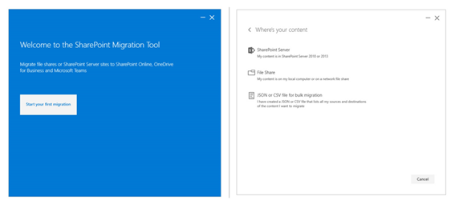
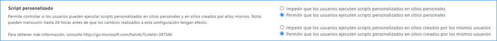
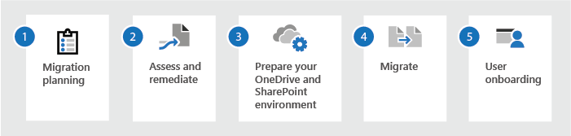
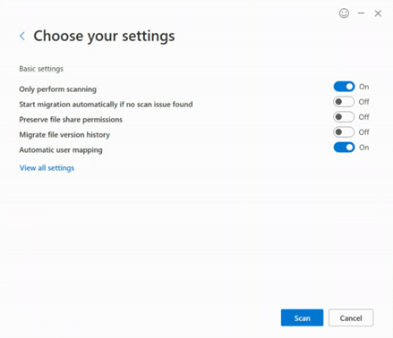
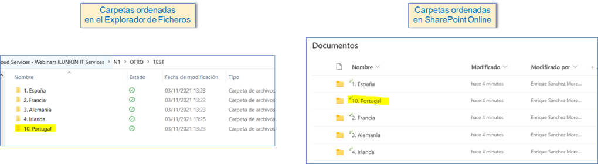
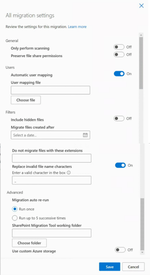
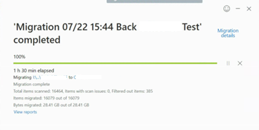
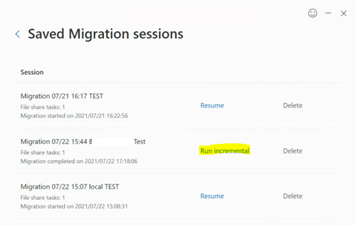
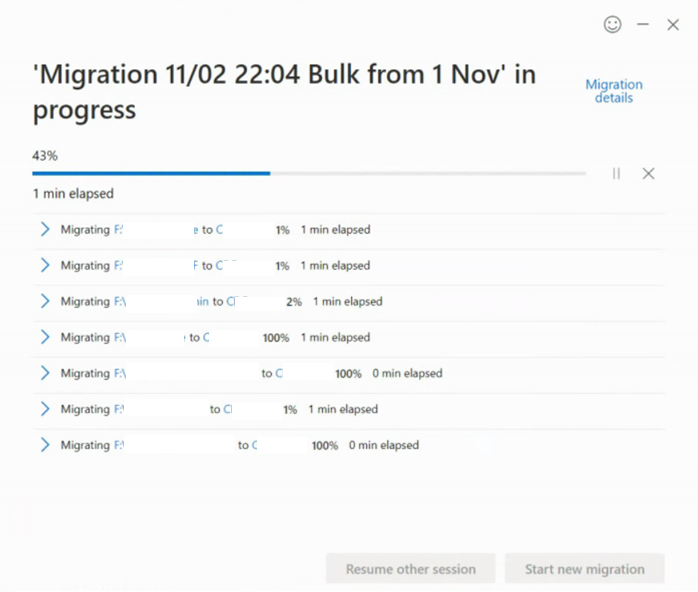

He decidido realizar este artículo después de hacer (y sufrir) una
migración muy grande de ficheros que estaban alojados en un servidor de
ficheros (Network-attached storage -- NAS) a SharePoint Online. La idea
es dejar por escrito los diferentes problemas que nos hemos encontrado
en el proceso, por si os pueden servir de ayuda en futuras migraciones.

**SharePoint Migration Tool**

Esta migración decidimos realizarla utilizando la herramienta gratuita
de Microsoft denominada SharePoint Migration Tool (SPMT).
Podéis ver su documentación y descargarla desde el siguiente enlace:
<https://docs.microsoft.com/es-es/sharepointmigration/introducing-the-sharepoint-migration-tool>

Esta herramienta hay que instalarla en una máquina y con un usuario que
tenga acceso a la unidad de red donde estén los ficheros que queréis
migrar (vuestro File Server). Obviamente, también debe tener acceso a
Internet para poder subirlos a SharePoint Online.

En el siguiente enlace podréis encontrar los requisitos mínimos y los
óptimos que ha de tener la máquina donde instaléis la SPMT.
<https://docs.microsoft.com/es-es/sharepointmigration/spmt-prerequisites>

Una vez instalada la herramienta en la máquina, al ejecutarla
necesitaréis logaros con un usuario que sea administrador de la
colección de sitios de SharePoint donde vais a alojar los documentos. No
vale sólo con ser Owner, requerirá que sea usuario administrador.

También se necesitará que esté habilitada la ejecución de scripts
personalizados en el Centro de Administración de SharePoint. Si no lo
tenéis habilitado, el cambio puede llevaros 24 horas, por lo que
conviene adelantarse.

**Proceso de Migración**

El proceso recomendado para hacer una migración de este tipo es el
siguiente:

**FASE 1: MIGRATION PLANNING**

En la primera fase, deberéis analizar cuál es el volumen de ficheros a
migrar, tanto en número como en tamaño.
Yo os recomiendo, además, hacer un piloto de alguna carpeta a migrar
para poder hacer alguna estimación de tiempos y poder acometer la
planificación de la migración.

También debéis considerar que la velocidad de subida suele verse
afectada por:

-   La velocidad de la red local entre el equipo de migración y el
    servidor de archivos.

-   El rendimiento del servidor de archivos en sí.

-   El ancho de banda del acceso a la red del equipo de migración.

Por estas razones se recomienda que el agente de migración esté
instalado en un disco SSD, que se detengan otras operaciones en la
máquina que está realizando la migración y que el equipo de migración
cuente con un acceso rápido a la red.

Es muy importante que tengáis en cuenta a la hora de planificar la
migración, que la SPMT sólo os permitirá elegir como destino
una **carpeta de primer nivel** en SharePoint. Es decir, podremos elegir
cualquier carpeta de nuestro servidor de ficheros como origen, pero como
destino sólo podremos acceder al primer nivel de SP. Por ejemplo:
podríamos escoger como origen el migrar los ficheros alojados en nuestra
NAS en la ruta **F:NIVEL1NIVEL2NIVEL3** pero como destino sólo
podremos escoger la ruta de SharePoint **DocLibraryNIVEL1** por lo que
los ficheros de NIVEL3, acabarían subiéndose la carpeta NIVEL1.
Esto es muy importante porque os limitará las opciones de hacer
migraciones en fases más pequeñas.

**FASE 2: ASSESS AND REMEDIATE**

Una vez hecha la planificación de la migración, podéis ejecutar la SPMT
para hacer un escaneo previo sin hacer migración. Esto os dará un
informe con los posibles errores que os podéis encontrar en la migración
y que será conveniente resolver antes de pasar a la migración
definitiva.

Por tanto, en esta fase podréis acometer la solución de errores como
rutas excesivamente largas, acceso a carpetas, caracteres no permitidos,
etc.

**FASE 3: PREPARE YOUR ENVIRONMENT**

En esta parte es donde crearemos la colección de sitios y bibliotecas
que fuesen necesarias para la migración.

Aquí es donde os quiero dar el primer consejo. Si vais a hacer una
migración con millones de elementos, debéis tener en cuenta las
limitaciones que tiene SharePoint cuando se supera el umbral de
vista (list view threshold). Por ejemplo, no será posible renombrar las
carpetas que contengan muchos ficheros en su interior. Del mismo modo,
tampoco os dejará moverlas a otra ubicación, ni eliminarlas. Además,
tampoco os permitirá romper la herencia de permisos de estas carpetas.
Por esta razón, es muy importante que hagáis todas estas labores antes
de cargar los ficheros en SharePoint. Si, por ejemplo, las carpetas de
primer nivel van a tener permisos exclusivos, deberéis crearlas antes de
que contengan nada, romperles la herencia y, posteriormente, hacer la
migración.

Además, debéis considerar que SharePoint no utiliza el mismo criterio de
ordenación de los nombres de las carpetas y ficheros que el que se
utiliza en un servidor de ficheros Windows. Os pongo un ejemplo:

Como veis, las carpetas del explorador de ficheros mantienen el orden 1,
2, 3, ..., 10, 11. Sin embargo, en SharePoint, el número 10 está
inmediatamente después del 1. Por supuesto, este cambio es muy
importante a la hora de que vuestros usuarios accedan a la información.
La recomendación aquí es que cambiéis el nombre en el File Server para
agregarle un 0 por delante: 01, 02, 03, ..., 10, 11. Esto hay que
hacerlo en el servidor de ficheros porque, como comentaba anteriormente,
si son carpetas con muchos elementos alojados en su interior, no os
dejará renombrarlas cuando ya estén en SharePoint.

*[NOTA]*: Para evitar estos problemas, Microsoft recomienda que,
aunque las bibliotecas pueden contener millones de documentos, no
alojéis en ellas más de 30.000. Pero, como es difícil que podamos
modificar la manera de trabajar de los usuarios que estaban utilizando
los ficheros del servidor de ficheros para decirles que ahora sus
ficheros están en ubicaciones (bibliotecas) diferentes, es importante
que seáis conscientes de todas las limitaciones que os comentaba
anteriormente.

FASE 4: MIGRACIÓN

Ahora que ya tenemos todo listo, podemos comenzar la faena de Migración.
Debéis tener en cuenta lo que se comentó anteriormente sobre que la
velocidad de la migración depende de múltiples factores: número de
ficheros, tamaño, velocidad de la red, así que, si tenéis que migrar
muchísimos datos, podéis armaros de paciencia. Para haceros una idea, en
mi caso, para migrar 28 GB de información compuesta por 16.000 ficheros
y 1.600 carpetas, el proceso tardó una hora y media. Y para migrar 1 TB
(434.000 ficheros y 113.000 carpetas), tardó 40 horas.

A la hora de lanzar la migración, podemos escoger múltiples parámetros.
Uno de los más útiles es el de filtrar los elementos ocultos ya que son
ficheros que ahora mismo los usuarios seguramente no están visualizando
en el servidor de ficheros y, si se los encuentran ahora en SharePoint,
les resultará muy extraño. Esto tiene el problema de que, si es una
carpeta oculta, puede que el proceso os indique como error los ficheros
alojados dentro de ella.
Otro parámetro muy útil es el de sustituir los caracteres no permitidos
por el carácter que nosotros indiquemos (por defecto viene el guion
bajo) y así evitamos estos errores. Tened en cuenta que esto puede
afectar a los usuarios si tienen ficheros vinculados a éstos que se
cambian de nombre, por lo que es conveniente que en el escaneo de la
Fase 2 no habilitéis esta opción y obtengáis así todos los ficheros que
se van a cambiar de nombre para poder reportárselo a vuestros usuarios
finales.
Estos son todos los parámetros que podéis establecer para configurar
vuestra migración:

Os recomiendo que asociéis un nombre identificativo a la migración para
que la podáis buscar fácilmente cuando hagáis las migraciones
incrementales. Por defecto, la SPMT le indica el texto "*Migration Fecha
Hora*", pero podéis poner el texto que queráis (por ejemplo: *Migration
07/22 15:44 Carpeta X*).

Cuando lancéis la migración, se pondrá en marcha el proceso que
escaneará los ficheros de la ruta que le hayáis indicado en local y los
empezará a subir a SharePoint. Como ocurre en muchos asistentes, NO
hagáis ni caso al porcentaje de avance que muestra el proceso.

Cada vez que acabe un proceso de migración, es muy importante que le
deis a grabar (save) en la ventana que os aparecerá al final del
proceso. De este modo, podréis acceder a posteriori a esa migración y
lanzar una ejecución incremental** **que se encargará de migrar sólo lo
que no se hubiese migrado en el anterior proceso (y lo que haya nuevo).
Si no la grabáis, no podréis disponer de esta opción en el futuro.

Al finalizar cada proceso de migración, vais a poder acceder a una serie
de ficheros CSV de informes (a través del link *Migration Details*)
donde se muestran los errores detectados durante el proceso, así como
otra serie de datos como los elementos escaneados, el resumen de datos
de la migración, etc. La verdad es que la información que proporciona el
sistema es muy completa.

Una funcionalidad muy útil que tiene la SPMT es que se pueden lanzar
migraciones en masa. Para ello tenéis que seleccionar la migración que
aparece con el nombre "*JSON or CSV file for bulk migration*" para
crearos un fichero que permita lanzar de forma simultánea la migración
de ficheros a varias carpetas de primer nivel de SharePoint. Al
lanzarlo, se os mostrará en pantalla cómo va evolucionando cada una de
esas migraciones indicadas en el fichero. Este es un método que os
recomiendo porque, como digo, es muy útil para lanzar varios procesos a
la vez.

*[NOTA]*: La parametrización de este fichero CSV la podéis
encontrar en el siguiente
enlace. <https://docs.microsoft.com/en-us/sharepointmigration/how-to-format-your-csv-file-for-data-content-migration#use-a-csv-file-for-bulk-upload>

En el caso de la migración en masa, volveréis a tener la misma
limitación de que sólo es posible escoger como destino una carpeta de
primer nivel dentro de la biblioteca de SharePoint. Si intentáis elegir
otra ubicación, os avisará con un mensaje de error.

**MIGRACIÓN INCREMENTAL**

Lo normal en las migraciones, sobre todo si son de muchos ficheros, es
que se realice varias ejecuciones de esta. De esta forma, los usuarios
pueden seguir trabajando en su File Server antes de cortarles el acceso
al mismo. Para ello es para lo que se utilizan las migraciones
incrementales de la SPMT que se ejecutan siguiendo los siguientes
criterios:

  -----------------------------------------------------------------------
  **Status**                           **Result**
  ------------------------------------ ----------------------------------
  **Modified time of the source file   File will not be migrated.
  is earlier than the modified time of 
  the target file.**                   

  **Files or lists exist in the        Migration will skip those existing
  SharePoint target location.**        objects during scan.

  **Time stamp on files or object in   The newer files are migrated.
  the source location is newer in the  
  source**                             

  **Source is a file share.**          Validation for migration will be
                                       based on the file/folder path.
  -----------------------------------------------------------------------

> Criterios para la migración incremental

Es importante que tengáis en cuenta que la SPMT **nunca va a eliminar
ficheros** que se hayan subido a SharePoint en una migración anterior.
Es decir, si hacéis el primer ciclo de la migración y, posteriormente,
alguien elimina un fichero del File Server, cuando hagáis la migración
incremental, el fichero seguirá apareciendo en SharePoint. Del mismo
modo, si después del primer ciclo, alguien mueve un fichero de una
carpeta a otra del servidor de ficheros, cuando hagáis el incremental,
el proceso considerará que ese documento que habéis movido es nuevo en
la carpeta destino y lo subirá a SharePoint, pero, como no eliminará el
que estaba en la ubicación anterior, tendréis el fichero dos veces.

Una vez concluida vuestra fase de migración, puede que os surja la
necesidad de comparar que lo que se ha subido a SharePoint coincide con
lo que hay en vuestro Servidor de Ficheros, para verificar que no se ha
quedado nada por el camino. Aquí, podríais pensar que, si lanzásemos un
escaneo como el de la Fase 2, la herramienta nos diría qué ficheros
quedan pendientes. Sin embargo, tengo que daros malas noticias porque,
desgraciadamente, este escaneo de información no valida lo que ya se
hubiese subido en SharePoint.
Aquí la única solución es crear un PowerShell con lo que hay en el File
Server y otro con lo que hay en SharePoint y realizar los cruces
pertinentes (siempre teniendo en cuenta que, si tenéis carpetas con
muchos elementos, el PowerShell también os dará problemas por el umbral
de vista: list view threshold)

**FASE 5: USER ONBOARDING**

Esta fase es la final, pero no es por ello la más sencilla. Se trata de
avisar a los usuarios de que su nuevo repositorio documental es la
biblioteca (o bibliotecas) de SharePoint. Si tenéis usuarios que no
están acostumbrados a utilizar SharePoint, os costará trabajo educarles
en este nuevo entorno.
Además, lo más normal es que quieran utilizar el cliente de
sincronización de OneDrive para acceder a los ficheros de la misma forma
que en su File Server. Es importante que sepan que NO pueden
sincronizarse toda la biblioteca porque esto vuelca una copia al equipo
del usuario. Además, ya sabéis que el cliente de OneDrive da bastantes
problemas de sincronización cuando tiene que hacerlo para mucha cantidad
de información. De hecho, existe la siguiente recomendación de
Microsoft:
"Aunque en SharePoint se pueden almacenar 30 millones de documentos por
biblioteca, se recomienda no almacenar más de 300 000 archivos entre
todas las bibliotecas de documentos para obtener un rendimiento óptimo.
Si tiene 300.000 elementos o más a través de todas las bibliotecas que
se sincroniza, incluso si no está sincronizando todos los elementos
dentro de esas bibliotecas, pueden ocurrir problemas de rendimiento."

Aquí os dejo el enlace a las limitaciones de OneDrive y SharePoint:
<https://support.microsoft.com/en-us/office/restrictions-and-limitations-in-onedrive-and-sharepoint-64883a5d-228e-48f5-b3d2-eb39e07630fa#numberitemscanbesynced>

Bueno, creo que ya he incluido en este post todas las lecciones
aprendidas después de utilizar la SPMT para migrar los ficheros alojados
en una NAS a SharePoint Online.
Espero que os sea útil para que, si tenéis que hacer algún día una
migración de este tipo, podáis evitar los problemas que yo he sufrido en
esta migración.

Muchas gracias por leerme.

**Enrique Sánchez Moreno**  
Cloud Service Manager en ILUNION IT Services  
[www.esanchezm.com](http://www.esanchezm.com)  