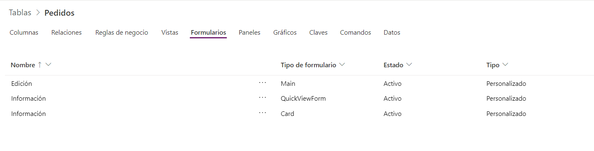

Power Platform y código, dos conceptos difícilmente encajables hace unos
años, pero que hoy en día es mucho más factible, gracias a toda la
integración en la que Microsoft está trabajando, para intentar facilitar
la inclusión de componentes de React y otras librerías cliente en las
soluciones de Power Platform.

**¿Qué es Portals?**

Para el que no lo conozca Portals, es un tipo más dentro de Power Apps.
Al igual que creamos aplicaciones de Lienzo o Basadas en Modelos, en
este caso vamos a crear un Portal de Power Apps.

La diferencia es el "SCOPE", de nuestra solución, ya que en este caso lo
que buscamos es crear una aplicación 100% web, a base de clicks gracias
al Portals Studio, en la mayoría de los casos.


Portals Studio nos permite añadir componentes nativos a la interfaz web,
del tipo Formulario o Lista que están conectados a nuestros de
Dataverse; o por el contrario añadir componentes de visualización como
pueden ser componentes del tipo text, image o Navegation Component. Con
Power Apps studio podemos además extender las plantillas de temas base
para crear un branding 100% a medida, o por el contrario acudir
directamente al CSS de nuestra página y al HTML, para adaptar la web
tanto como necesitemos.


Además, en mi caso destaco las siguientes capacidades de Portals, como
muy aprovechables a la hora de analizar si es nuestra herramienta para
crear portales web:

-   Integración nativa con Directorio Activo, Azure B2C e incluso tiene
    la posibilidad de añadir cuentas externas.

-   Buscador de paginas e indexado de contenido de todo el portal de
    forma nativa.

-   Proceso de On-bording del cliente 100% nativo para controlar cuentas
    y identidades.

-   Integración directa con SharePoint y Dataverse.

-   Integraciones directas con servicios de Azure como Blob Storage para
    almacenar la documentación.

-   Posibilidad de extensión con componentes de React con Power Apps
    Framework.

-   Elección si un portal es público o privado a nivel de sitio o de
    página.

-   Routing y componente de navegación 100% configurable y administrado.

**Como extender con código nuestra solución de Portals**

Hay que pensar que, en el fondo, si obviamos la herramienta de Portals
Studio, y todo lo que te aporta a nivel de Low Code para construir tu
diseño, siempre tenemos la opción de editar el HTM de la página.
Esto quiere decir que podemos insertar el código cliente que nosotros
queramos, otra cosa es buscar la forma más elegante.

**Insertando código desde Portals studio con JavaScript**

Siempre que accedemos a una página desde el Portals Studio, podemos ver
el código HTML y cliente que genera el portal, pinchando sobre el
símbolo "</">, en la parte inferior del editor de página.


Como vemos en la imagen, podemos añadir codigo cliente sin problemas, en
este caso este código muestra los elementos del tipo "buttonLink", que
estaban ocultos con Javascript.

**Liquid-templates**

Si estamos atentos al ejemplo anterior el código era similar a esto:

```


<script>
  $(document).ready(function() {
    console.log("ready!");
    const collection = document.getElementsByClassName("buttonLink");
    for (let i = 0; i < collection.length; i++) {
      collection[i].style.display = 'block';
    }
  });
</script>

{{user}}

```

Obviando la sencillez del código, que nos lleva a tiempos pretéritos
donde tocar el DOM con JavaScript o JQuery era lo más normal (por favor
no lo hagáis); podemos ver que lo realmente interesante es ver las
cláusulas de "Liquid-templates" que hemos añadido.

Este leguaje de plantillas nos permite comunicarnos con el contesto de
nuestra aplicación y manejar entidades como Usuario, Cuenta o Página, y
añadir ciertas lógicas para ejecutar fragmentos de código cliente o
renderizar fragmentos de HTML.

Si repasamos un poco el código vemos que con  le indicamos
a nuestra página que renderize lo siguiente solo si tenemos un usuario
logado, en este caso unos botones de "ver más", que me llevan en mi
prototipo web a paginas privadas.


**Insertar código con un poco más de elegancia: Code Snippets**

Evidentemente tocar a mano las paginas desde el Studio no es lo más
recomendable en mi opinión, y para eso podemos usar uso de los
"Code-Snippets". Para ello, desde el Studio de Portals, debemos navegar
a la configuración de nuestro Portals.


Esto no vas a llevar a la puerta trasera de nuestro portal donde ya
empezamos a intuir fuertemente, el acoplamiento con algunas
funcionalidades de Dynamics 365, o en concreto para ser más correcto
también con Dataverse, como la gestión de entidades, formularios o
vistas. En este caso nos interesa poder añadir un codigo, embebido en
nuestras páginas, y la mejor forma es crear un "fragmento de código".


En el fragmento de código se nos permite meter un código en el campo
Valor y vincularlo a nuestro Portal Web. Si vemos la siguiente imagen,
veremos un ejemplo de código solo con lenguaje de plantillas, y que nos
permite visualizar el nombre del usuario en el título del portal, a modo
de bienvenida solo cuando está logado en el sistema.


Como podemos apreciar el código es similar al ejemplo anterior, mira si
estamos posicionados en la página raíz con **"{% if page.url == '/'
%**}", vuelve a validar si tenemos un usuario logado, y si es así
podemos renderizar un HTML a nuestra elección, y poner un Span con el
texto de bienvenida y el nombre del usuario.

En el ejemplo vemos como instanciar propiedades de una entidad como el
usuario con "user.Fullname", al final es como manejar objetos en
cualquier lenguaje.

Insertando tu código en una plantilla

A mi fragmento de código le he llamado Welcome, y lo podemos usar en un
plantilla de Página**.**

Las plantillas hacen las veces de "layouts", y le podemos indicar a cada
pagina que plantilla vamos a usar, para poder por ejemplo tener
cabeceras o estilos comunes en toda la web.

Para pode añadir el fragmento de código anterior, nos vamos en la
configuración del portal al apartado "Plantillas-web", y añadimos el
siguiente código fuente, para en mi caso añadir el código de Welcome:

```

<div id="mainContent" class="wrapper-body" role="main">

</div>
``` 

La instrucción "Include" nos permite añadir el snipet al inicio de la
página y poder añadir la lógica necesaria para pintar el mensaje de
bienvenida dinámicamente.


**Versión Pro para añadir React o Codigo cliente a tus Portales -- con Power App Component Framework**

Como hemos hablado en otros artículos o eventos de Power Platform, con
Component Framework tu puedes crear tus componentes con JavaScript o
TypeScript y con React, para poder extender nuestra funcionalidad de las
Power Apps. Esto es cada vez más normal en aplicaciones de Lienzo e
incluso basadas en modelos, pero es algo más novedoso, ya que está en
preview, poder usarlo en un Portal de Power Apps.

Para poder añadir un componente a nuestro portal, tenemos que tener
primero desplegado en nuestro tenant de trabajo de Power Apps, una
solución con al menos un componente, que podemos crear siguiendo este
tutorial, [Cree su primer componente usando Power Apps component
framework - Power Apps | Microsoft
Docs](https://docs.microsoft.com/es-es/powerapps/developer/component-framework/implementing-controls-using-typescript).

Una vez creado el componente tenemos dos opciones para añadirlo a
nuestro sitio web y que vamos a ver en los siguientes apartados.

**Añadirlo como columna a un formulario en una aplicación Model Driven
Apps**

Esta primera opción es muy útil si nuestro componente es un efecto
visual dentro de un formulario, y dicho formulario de Lista lo queremos
utilizar en nuestro Portal web.


Para ello debemos tener una aplicación Model Driven Apps y añadir un
formulario a la misma.

A continuación, vamos a la configuración de dicho formulario y lo
editamos.



Como vemos en la imagen, podemos crear una entidad Pedidos, y en el
campo "Coste" añadirle un componente de código del tipo Slider, como en
el tutorial de ejemplo que os he dejado. Editamos el formulario de
edición, y posteriormente vamos a la vista clásica, que es la que nos
permite meter este componente como una columna del formulario.

Una vez en la vista clásica, damos dobles clic sobre la columna para
insertar el componente de código.


Una vez insertado, seleccionamos que salga en todos los dispositivos, y
podemos visualizar en la aplicación de Model Driven Apps el componente,
para comprobar como el campo Coste ya no es un input normal, si no que
tiene un componente gráfico para editar su valor.


**Insertamos el componente en nuestro Portal**

El último paso para poder usar el componente en Portals, es poder
añadirlo a un formulario.
Para ello vamos a los formularios, en la parte de configuración del
sitio, y nos creamos un formulario que sea "Form Component", como en la
siguiente imagen.


Crear un formulario es sencillo, le debemos dar un nombre, y vincularlo
a una entidad de Dataverse, en este caso la de Pedidos, y posteriormente
al formulario que hemos extendido en la Model Driven Apps, en mi caso
"Edición". A continuación, en la pestaña de relacionados, creamos un
nuevo Metadato de formulario básico.


Debemos indicar la columna en la que queremos añadir el componente de
código, y seleccionar el estilo de control a "Componente de código".
Para probar el componente en un formulario, debemos ir a una página de
Portals, añadir un componente de tipo Lista y configurar la vista de
edición con el formulario "Form-Component" que acabamos de crear.


Esta lista debe estar conectada con permisos a la tabla de Pedidos, para
poder añadir o modificar elementos. Si lanzamos el portal en modo
visualización, podemos ver al editar un elemento que el formulario añade
el componente de Slider, tal y como vimos en el Model Driven App.


Añadirlo con Liquid-templates como un fragmento de código

Si tenemos componentes de Component Framework en React por ejemplo, y no
son controles orientados a formulario, podemos no tener que hacer todos
los pasos anteriores. Para añadir un componente a una pagina de Portal,
simplemente tenemos que usar Liquid-templates, y añadir el siguiente
código:

```

```

En este caso, deberéis editar el nombre de vuestro componente, y añadir
tantas variables al componente como tenga de entrada el mismo, en mi
caso al usar el ejemplo del Slider, solo definí en el manifiesto de la
aplicación un valor de entrada controlValue. Por si no tenéis el código
fuente cerca, siempre podemos usar la siguientes URLS para obtener el
manifiesto de un componente, y poder insertar el nombre y las
propiedades de entrada:

-   Listado de componentes:
    > <https://contoso.api.crm10.dynamics.com/api/data/v9.2/customcontrols?$select=ContosoCustomControlName>

-   Manifiesto de un componentes:

> https://contoso.api.crm10.dynamics.com/api/data/v9.2/customcontrols?$filter=name eq 'ContosoCustomControlName' &$select=manifest

Debemos sustituir el tenant Contoso, por la url de vuestro tenant que
podéis sacar en la configuración de vuestro entorno en Power Apps. Para
probar que el "codeComponent", se incorporado a nuestra página podemos
lanzar la pagina en modo visualización, y comprobarlo como en mi
ejemplo:


**Conclusiones**

Me alegra ver que cada vez se fomenta más la figura del "PRO DEVELOPER",
en Power Platform, ya que siendo justos sin atraer a los programadores
es difícil potenciar en ocasiones este tipo de soluciones Low Code. Es
cierto que se busca poder ser flexibles extendiendo la solución de caja
de Power Apps en todas sus versiones, y es de admirar que se están dando
pasos despacio, pero de forma segura para no caer en errores del pasado
como con SharePoint Server, y que el desarrollador vaya muy perdido en
cuanto que se puede o no se puede hacer. A mi todo lo que sea definir
una línea de buenas prácticas me parece correcto.

Y ahora lo malo, y es que si vienes de trabajar con Canvas Apps, y sabes
todo lo que YA se puede hacer con React y Component Framework, ahora te
encuentras que aquí el modelo de despliegue es distinto, que tiene
ciertas limitaciones Component Framework en Portals, que debemos volver
en algunos casos a vistas clásicas de formularios para poder añadir un
componente de columna....; en mi modesta opinión aunque se que está en
Preview, el salto de Canvas a Portals en cuanto a codigo personalizado
aun es grande, y debemos o esperarnos un poco más para usarlo en
producción o armarnos de paciencia ya que el modelo de despliegue y
trabajar con componentes cambia mucho.
No obstante, se agradece la línea tomada tan buena por Microsoft con
Power Platform, y esperemos que pronto todas las versiones de Power Apps
vayan al mismo ritmo cuando trabajemos con componente de código.

**Sergio Hernández Mancebo** <br />
Azure MVP