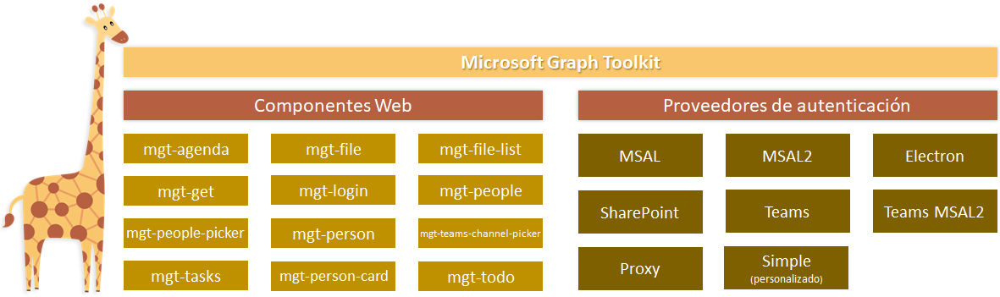
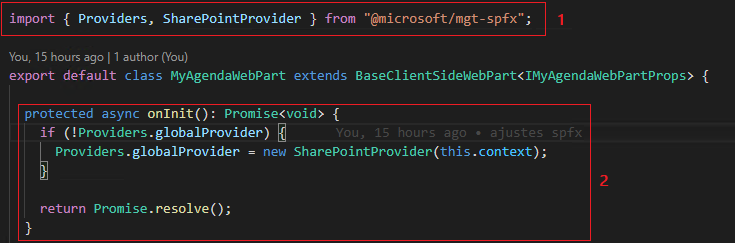
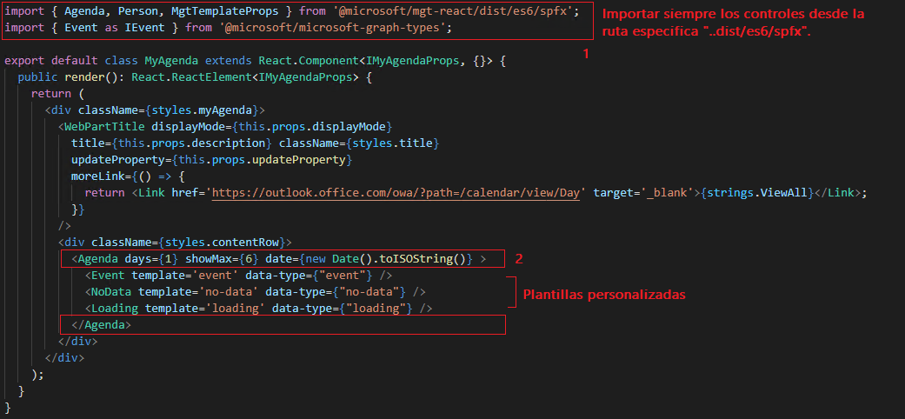
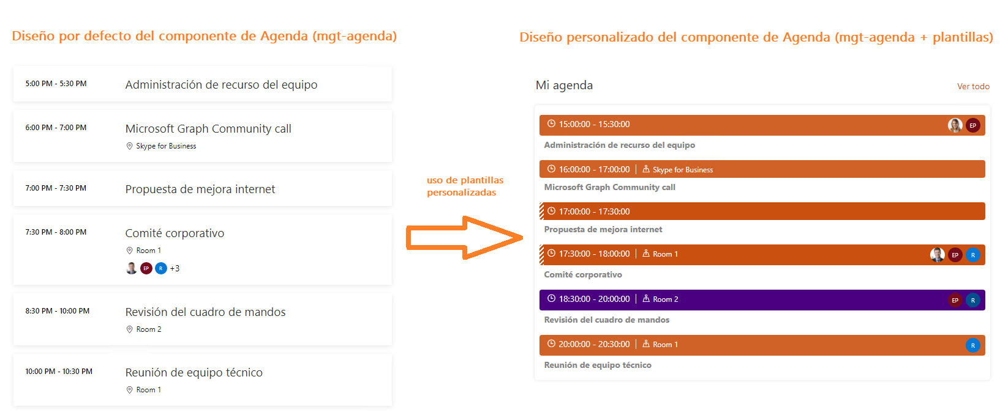
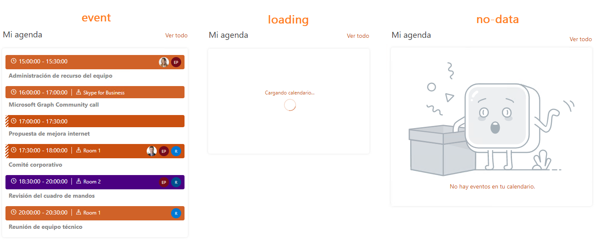
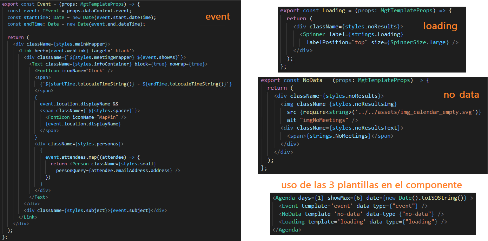

Si quieres una **solución rápida** que te ahorre escribir código, pero
quieres seguir teniendo el control sobre el diseño de tus componentes en
SPFx... estas en el lugar correcto. En este artículo vamos a ver cómo
podemos conseguir todo ello gracias a [Microsoft Graph
Toolkit](https://docs.microsoft.com/es-es/graph/toolkit/overview) y las
plantillas que nos ofrece para sus componentes.

**¿Qué es Microsoft Graph Toolkit?**

Contiene una colección de componentes visuales reutilizables,
"framework-agnostic" y diferentes proveedores de autenticación para
acceder y trabajar con datos de Microsoft Graph. Los componentes nos
ayudan a despreocuparnos de la conexión con el servicio de Microsoft
Graph, a nivel autenticación y petición de datos.

En este ejemplo utilizaré Visual Studio Code, junto con la versión 1.13
de SPFx ( [detalles de cómo preparar un entorno de desarrollo de
SPFx](https://docs.microsoft.com/en-us/sharepoint/dev/spfx/set-up-your-development-environment)
) para crear un WebPart donde mostraré los eventos de mi calendario de
Outlook.

Crearemos un proyecto utilizando el mismo comando que veníamos
utilizando hasta ahora en SPFx: "**yo @microsoft/sharepoint**" y a
continuación tendremos que pasar por el asistente de creación
seleccionando en cada paso las opciones necesarias para crear un WebPart
(en mi caso lo he llamado "MyAgenda").

**¿Qué necesitamos instalar?**

Dentro de la solución ya creada será necesario instalar los siguientes
paquetes:

-   **@microsoft/mgt-spfx**: librería especifica de Graph Toolkit para
    SharePoint, que usaremos para importar los proveedores de
    autenticación.

-   **@microsoft/mgt-react**: nos simplifica el uso de los componentes
    web de Graph Toolkit ya que los exporta como componentes de React.

-   **@microsoft/microsoft-graph-types**: al estar trabajando con el
    lenguaje TypeScript necesitamos instalar como dependencia de
    desarrollo (--save-dev) los types de graph.

Al estar trabajando en una solución para SharePoint Online debemos
utilizar la librería especifica, tanto para el proveedor de
autenticación como para los componentes web en React/SPFx.

**¿Cómo puedo usar los componentes de Graph Toolkit en SPFx?**

Para empezar, necesitamos referenciar en nuestro nuevo WebPart el
proveedor correspondiente para SharePoint Online. Para ello debemos ir
al fichero principal de nuestro WebPart (MyAgendaWebPart.ts) y en la
parte superior importar el proveedor de autenticación (1).

Por otra parte, tenemos que sobrescribir el método OnInit y añadir el
uso global del proveedor de autenticación de SharePoint (2).

Una vez hecho esto, podemos pasar a la parte visual e importar dentro de
nuestro WebPart (MyAgenda.tsx) los controles a utilizar desde la
librería de "mgt-react".

Es muy importante que referenciemos los controles desde
"mgt-react/dist/es6/spfx" para que otros posibles WebPart dentro de la
misma página compartan el mismo registro del control. Es decir, podemos
tener varios WebParts en la misma página que utilicen siempre el mismo
conjunto de componente web de Graph Toolkit (ahorro de tiempo de carga y
mejora de rendimiento).

En mi caso utilizaré el componente de
[Agenda](https://docs.microsoft.com/es-es/graph/toolkit/components/agenda)
(mgt-agenda) para pintar en pantalla un máximo de 6 eventos de
calendario de Outlook (podemos jugar con las propiedades del componente
para hacer diferentes queries o filtros, limitar el número de días a
recuperar de Graph, agrupar los eventos por día, etc).

Por defecto la visualización de estos componentes es muy básica, pero es
allí donde entran en juego las plantillas personalizables que podemos
utilizar para ajustar el diseño a nuestro gusto.

**¿Cómo creamos plantillas personalizadas para los componentes?**

Dependiendo del componente que estemos utilizando nos permitirá
sobrescribir diferentes plantillas que podemos ver en la documentación
oficial. El componente de Agenda (mgt-agenda) que yo estoy utilizando
ofrece varias plantillas:

-   **event**: Plantilla usada para representar cada evento.

-   **event-other**: Plantilla usada para representar contenido
    adicional para cada evento.

-   **header**: Plantilla usada para representar el encabezado de cada
    día.

-   **loading** : Plantilla que se usa cuando se cargan datos.

-   **no-data**: Plantilla que se usa cuando no hay eventos disponibles.

Para mi componente he utilizado la plantilla de event, loading y no-data
para diseñar la visualización de cada elemento de calendario, la
pantalla de "cargando calendario..." y la pantalla sin resultados para
mostrar.

A nivel de código he definido las tres plantillas de manera fácil y
rápida mezclando:

-   html: para definir la estructura de mi WebPart.

-   scss: para asignar las clases y estilos a cada elemento a pintar en
    el WebPart.

-   FluentUI: para incluir iconos y el spinner de carga de datos en el
    diseño.

-   componentes web de Graph Toolkit anidados: para el componente de
    Persona que muestra la imagen de cada asistente a los eventos del
    calendario (plantilla evento).

Además, tenemos diferentes propiedades y eventos que podemos utilizar en
cada componente ([detalles en la
documentación](https://docs.microsoft.com/es-es/graph/toolkit/customize-components/events)
oficial para ver que propiedades y eventos nos ofrece cada componente).

Otra de las funcionalidades que podemos personalizar a nivel visual son
los [temas de
colores](https://docs.microsoft.com/es-es/graph/toolkit/customize-components/style)
y el manejo de estas. Podríamos definir diferentes temas (ej: light,
dark, contrast, teams, etc..) y aplicar cada una de ellas según el
entorno o la configuración que elija el usuario ([ejemplo de WebPart que
utiliza componentes de Graph Toolkit y temas de colores en
GitHub](https://github.com/pnp/sp-dev-fx-webparts/tree/main/samples/react-teams-lead-dashboard)).

**Conclusiones**:

-   Tenemos una manera muy fácil para desarrollar eligiendo los
    componentes predefinidos de Graph Toolkit que más se ajusten a
    nuestras necesidades y personalizarlos usando las plantillas que
    ofrecen.

-   Tenemos varias funcionalidades que nos facilitan aun mas el trabajo:
    propiedades, eventos, temas de colores, posibilidad de incluir
    caché, localización de textos estáticos en diferentes idiomas.

-   Sí ninguno de los componentes predefinidos no nos sirve, podemos
    echar mano del componente "mgt-get" y hacer cualquier petición GET
    hacia MS Graph y personalizar los resultados gracias a las
    plantillas que ofrece.

Links útiles:

-   [**Repositorio GitHub del ejemplo expuesto en el
    artículo**](https://github.com/cdragosf/mgt-templating)

-   [**GitHub oficial del proyecto Graph
    Toolkit**](https://github.com/microsoftgraph/microsoft-graph-toolkit)

-   [**Ejemplos de uso de todos los componentes de Graph
    Toolkit**](https://mgt.dev/?path=/story/overview--page&source=docs)

**Cristian Dragos Fedotov**  
Microsoft 365 Solutions Architect en **NTT DATA**  
cristianfedotov@gmail.com  
https://www.linkedin.com/in/cristianfedotov/   
 
import LayoutNumber from '../../../components/layout-article'
export default LayoutNumber
