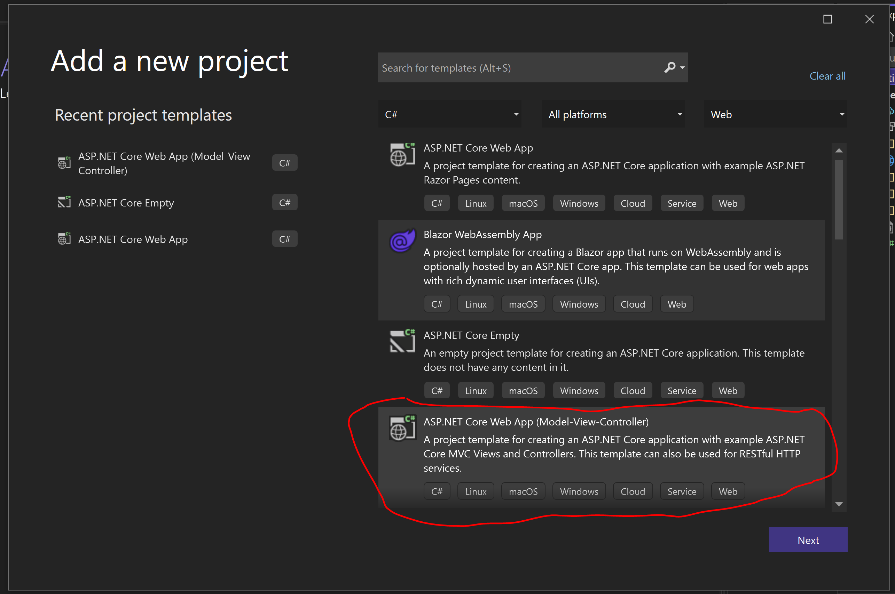

A la hora de realizar un desarrollo usando ReactJS la mayor de las
ocasiones solamente nos planteamos la ubicación donde vamos a alojar
nuestros ficheros Javascript y ya cuando nuestra aplicación los vaya a
obtener empieza la carga de estos ficheros. Sin embargo, nos dejamos en
el tintero dos de los principales problemas que trae este pensamiento:

-   SEO => Que los buscadores encuentren tu página e indexen tu
    contenido.

-   Aumentar la velocidad de carga inicial de tu sitio.

Dentro del ecosistema de .NET, solemos usar ReactJS (o cualquier
framework de frontend que usemos) de una forma totalmente independiente
al desarrollo de la API. Este planteamiento a nivel de equipos puede
proporcionar mejores desarrollos individuales pero bastantes problemas
de integración entre los equipos. En este artículo veremos ReactJS.Net
esta librería que nos puede proporcionar un pegamento para la
integración entre ambos mundos, además de poder subir tus desarrollos en
ReactJS a un nivel superior.

Antes de empezar con el artículo vamos a definir alguno de los conceptos
imprescindibles para poder entender el artículo en profundidad.

**¿Qué es el Server Rendering?**

Dentro de los frameworks Javascript, el server rendering es la
característica que nos devuelve la carga inicial de la página
"compilada" en el servidor y lista para ser renderizada por el
navegador sin necesidad de realizar ninguna llamada extra, ni la
descarga de ningún componente extra.

**¿Qué beneficios nos aporta?**

En primer lugar, aumentamos la velocidad inicial de carga en la primera
llamada. Es muy habitual en cualquier página SPA (Single Page
Applicattion) que la primera llamada se descarga todos los ficheros JS y
posteriormente ya empieza a realizar las llamadas para realizar la carga
de la página (ahora en muchas ocasiones hemos perdido esta buena
práctica, en parte debido a que las conexiones de internet son más
veloces y en parte por los navegadores que se encargan de quitar tiempo
de procesamiento al servidor).

El segundo beneficio dependerá de las necesidades que tenga tu
aplicación. Si tu aplicación necesita estar bien posicionada por los
navegadores, entonces es importante tener el Server Render. Ya que nos
proporciona un punto de entrada a los "crowdlers" que se encargan de
posicionar tu web más arriba. Imaginaros que tenéis una aplicación para
reservar habitaciones de hoteles, es interesante tener una url a la que
se pueda acceder directamente con los distintos tipos de habitaciones
disponibles.

Otro beneficio que nos aporta el Server Rendering es que nos aporta un
marco mucho más seguro que el que realizamos en aplicaciones que se
renderizan solamente en cliente.

**¿Cómo se comporta una aplicación con Server Rendering activado cuando tiene que realizar más acciones?**

Aquí en muchas ocasiones, pensamos que todas las llamadas que realizamos
cuando se tiene esto activado es que pediremos esta información al
servidor y este se encargará de renderizarlo. Si esta afirmación fuera
cierta, al usar esta característica perdemos todos los beneficios que
tiene una SPA que es que una vez tenemos cargadas toda la aplicación, al
no tener que hacer más peticiones "extra" nuestra aplicación podemos
decir que va bastante rápida. Es decir, hemos mejorado el tiempo de
carga de la primera llamada a nuestra aplicación, sin embargo, perdemos
en el resto de las llamadas.

Como habéis podido observar el Server Rendering no funciona de esta
forma, porque sino nadie lo utilizaría. El flujo que tiene una
aplicación con Server Rendering sería el siguiente:

1.  La primera llamada el servidor genera y envía el HTML y el
    JavaScript.

2.  Nunca más se vuelve a generar una pagina en el servidor, se genera
    en cliente y el mismo cliente se encarga de los de datos mediante
    llamadas AJAX.

**¿Qué diferencia tenemos entre Razor y el Server Rendering en ReactJS?**

Razor se encarga siempre de servirnos la página en servidor, y al
cliente siempre le sirve el HTML que va a renderizar, pero el principal
problema que tenemos es cuando pedimos otra página, perdemos todo el
estado que teníamos en cliente y se vuelve a enviar una página nueva
(con el tiempo de carga que ello tiene). En un Server Rendering la carga
inicial es exactamente igual que en Razor, pero con la diferencia es que
nunca mas volvemos a realizar llamadas al servidor, si queremos cargar
otra pagina ya solo cargamos datos (el HTML ya lo teníamos precargado o
lo pedimos como recursos al ser una aplicación SPA).

En esta comparación hemos obviado que en los desarrollos actuales hay
mucha lógica en la parte del cliente y el implementar todo esto dentro
de una página Razor en la gran mayoría de veces montamos un código
ilegible e in mantenible porque no sabemos en que lugar se está
produciendo la interacción. Si nos ponemos a valorar estas alternativas
seguramente encontraremos muchas más desventajas, pero esto ya lo dejo a
consideración del lector.

**Como podemos implementarlo en .NET => ReactJs.NET**

ReactJS.NET es un proyecto OpenSource que lo podemos definir como una
biblioteca que facilita el uso de Babel junto con ReactJS y JSX desde C#

Cuales son sus principales características:

-   Usar al vuelo JSX en la compilación del JS usando Babel y las más
    populares librerías de compilación/minificacion (Cassete, WebPack,
    MSBuild).

-   Server Side Componente para hacer la carga inicial mucho más rápida
    además incluye soporte a bibliotecas como React Router, React
    Helmet.

**Manos a la obra**

Vamos a ver esta librería en acción y así nos podemos ir haciendo una
idea de su potencia. El ejemplo integro lo podéis descargar del
siguiente [Repositorio de
GitHub](https://github.com/AdrianDiaz81/DemosBlog) y así tener todo el
contexto de este.

Por ello en primer lugar nos crearemos un proyecto de ASP.NET Web APP
Model View Controller, utilizaremos la versión del framework NET Core
6.0




Una vez el proyecto creado vamos a añadir una serie de librerías Nugets:

-   React.AspNet
-   React.Router
-   JavaScriptEngineSwitcher.V8
-   JavaScriptEngineSwitcher.ChakraCore
-   JavaScriptEngineSwitcher.V8. Native.win-x86
-   JavaScriptEngineSwitcher.ChakraCore.Native.win-x86
-   JavaScriptEngineSwitcher.ChakraCore.Native.win-x64
-   JavaScriptEngineSwitcher.ChakraCore.Native.win-arm
-   JavaScriptEngineSwitcher.ChakraCore.Native.linux-x64
-   JavaScriptEngineSwitcher.ChakraCore.Native.osx-x64
-   JavaScriptEngineSwitcher.Extensions.MsDependencyInjection

¿Estas librerías que son? Por un lado, tenemos la librería que es la que
se va a encargar de hacer la magia a la hora de servir los datos y por
otro lado tenemos el resto de las librerías que son las que se van a
encargar de ejecutar el JS y enviarlo al cliente. ¿Por qué tenemos
tantas? Es que cada una se utiliza según donde vamos a alojar el
servidor, si tenemos claro donde lo vamos a alojar utilicemos la
librería en particular. Modificamos el fichero Program.cs, como sabéis
con la salida de .NET 6 y en busca de un diseño más minimalista, se ha
obviado los dos métodos unificándolo todo en un único bloque, si queréis
saber más sobre este comportamiento os recomiendo esta
[artículo](https://blog.santiagoporras.com/dot-net-6-add-startup-cs/) de
Santiago Porras. Lo primero se tiene que añadir en los servicios:

```
// Add services to the container.

builder.Services.AddSingleton<IHttpContextAccessor,
HttpContextAccessor>();

builder.Services.AddReact();

// Make sure a JS engine is registered, or you will get an error!
builder.Services.AddJsEngineSwitcher(options =>
options.DefaultEngineName = ChakraCoreJsEngine.EngineName).AddChakraCore();
```

¿Qué es lo que hacen esos servicios? El HttpContextAccesor es la
información donde esta toda la información de las peticiones que llegan
al servidor, algo que necesita la máquina de JS para la comunicación
entre el cliente y el servidor. Seguro que en más de un proyecto os ha
tocado inyectarla. Posteriormente inyectamos el servicio de React y por
último añadimos el tipo de máquina de JS que vamos a utilizar en el
servidor para enviar el HTML al cliente.

Una vez la parte de servicios ya la tenemos lista, el siguiente paso es
realizar la configuración de la WebApplication, para ello tendremos que
añadir las siguientes líneas.

```
app.UseStaticFiles();

app.UseReact(config =>
{
    config
        .SetReuseJavaScriptEngines(true)
        .SetLoadBabel(false)
        .SetLoadReact(false)
        .SetReactAppBuildPath("~/dist");
});
```

¿Qué es lo que hacen estas líneas? La primera línea lo que indicamos es
que nuestro servidor puede servir ficheros estáticos que estén alojados
en el mismo, de esta forma podremos servir los ficheros JS que estemos
alojados. Por otro lado, el UseReact, le inyectaremos la configuración
que vamos a utilizar cuando invoquemos a la librería ReactJSNet. En esta
ocasión indicaremos aspectos de configuración como la Maquina de JS que
vamos a utilizar, el método de compilación y donde vamos a tener
alojados los ficheros JS para establecerlos como Path donde nuestros
desarrollos lo buscarán.

Una vez tenemos listo, la configuración, vamos a realizar los ajustes en
el Front. Partiendo que estamos usando Model View Controller y haremos
uso de la infraestructura que se monta con Razor. En primer lugar, en el
Layout básico que utilizaremos añadiremos la siguiente configuración.
Para quien no este acostumbrado con esto. En la estructura básica que se
crea nos vamos a la ubicación Views/Shared/_Layout.cshtml y editamos el
fichero. Dejándolo con la siguiente estructura:

```
@using React.AspNet
<!DOCTYPE html>
<html>
<head>
    <meta charset="utf-8" />
    <meta name="viewport" content="width=device-width, initial-scale=1.0">
    @Html.ReactGetStylePaths()
</head>
<body>
    @RenderBody()
    @Html.ReactGetScriptPaths()
    @Html.ReactInitJavaScript()
</body>
</html>
```

Una vez tenemos preparado listo y adecuado nuestra parte de Backend,
vamos a ver que ajustes tenemos que hacer en nuestro FrontEnd. ¿Por
dónde empezamos? ¿Tenemos algún proyecto base para poder utilizar dentro
de Visual Studio? ¿Usamos el CreateReact (proyecto para la generación de
las soluciones base de ReactJS proporcionado por Facebook)?

Aquí hay muchas soluciones y todo depende del grado de madurez del
equipo y de como se quiera organizar el mismo. Al final el fichero lo
que estamos buscando con esta solución es arrancar el proyecto y tener
todo junto tanto la parte de APIS como la de FrontEnd y así que ambos
puedan ejecutar lo mismo y de esta forma evitar el conflicto entre
ambos. Aquí voy a plantear una solución que puede servir pero que el
lector tenga claro la idea de que este proceso puede ser tan flexible
como lo necesite.

Creamos un proyecto de librerías vacíos de .NET Core (luego lo
modificaremos para que para compilar ejecute los comandos de Node
necesarios). Sobre este proyecto nos crearemos un fichero package.json
como el siguiente:

```
"name": "avengers",
"version": "1.0.0",
"main": "index.js",
"private": true,
"dependencies": {
"@reduxjs/toolkit": "^1.5.1",
"classnames": "^2.3.1",
"hoist-non-react-statics": "^3.3.2",
"react": "^17.0.2",
"react-device-detect": "^1.17.0",
"react-dom": "^17.0.2",
"react-helmet": "^6.1.0",
"react-number-format": "^4.6.1",
"react-redux": "^7.2.4",
"react-router-dom": "^5.2.0",
"redux": "^4.1.0"
},
"devDependencies": {
"@babel/core": "7.14.0",
"@babel/plugin-proposal-class-properties": "7.13.0",
"@babel/plugin-proposal-object-rest-spread": "7.13.8",
"@babel/plugin-syntax-dynamic-import": "7.8.3",
"@babel/plugin-transform-runtime": "^7.13.15",
"@babel/preset-env": "7.14.0",
"@babel/preset-react": "7.13.13",
"@babel/preset-typescript": "^7.13.0",
"@babel/runtime": "^7.14.0",
"@types/node": "^15.6.1",
"@types/react": "^17.0.4",
"@types/react-dom": "^17.0.3",
"@types/react-router-dom": "^5.1.7",
"@typescript-eslint/eslint-plugin": "^4.22.1",
"@typescript-eslint/parser": "^4.22.1",
"babel-eslint": "^10.0.0",
"babel-loader": "8.2.2",
"cross-env": "^7.0.3",
"css-loader": "^5.2.4",
"eslint": "^7.5.0",
"eslint-config-react-app": "^6.0.0",
"eslint-plugin-flowtype": "^5.7.2",
"eslint-plugin-import": "^2.22.1",
"eslint-plugin-jsx-a11y": "^6.4.1",
"eslint-plugin-react": "^7.23.2",
"eslint-plugin-react-hooks": "^4.2.0",
"eslint-webpack-plugin": "^2.5.4",
"file-loader": "^6.2.0",
"fork-ts-checker-webpack-plugin": "^6.2.6",
"fs-extra": "^10.0.0",
"javascript-obfuscator": "^2.14.0",
"mini-css-extract-plugin": "^1.6.0",
"rimraf": "3.0.2",
"sass": "^1.32.12",
"sass-loader": "^11.0.1",
"ts-loader": "^9.1.1",
"typescript": "^4.2.4",
"webpack": "^5.36.2",
"webpack-cli": "4.6.0",
"webpack-manifest-plugin": "3.1.1",
"webpack-obfuscator": "^3.3.1"
},
"scripts": {
"watch": "rimraf ./ReactDemo/ReactDemo/wwwroot/dist && node
tsconfigGenerator.js && cross-env NODE_ENV=development webpack
--watch",
"build": "rimraf ./../ReactDemo/ReactDemo/wwwroot/dist && node
tsconfigGenerator.js && webpack"
}
}
```

En los ficheros package.json indicaremos las paquetes npm que vamos a
necesitar para que nuestro Front arranque y funcione correctamente. De
todos los paquetes que tiene, para los curiosos podéis observar que
muchos son paquetes para compilar o tienen un proceso bastante
interesante como son file-loader, sass-loader, ts-loader, webpack-cli,
babel loader. Como podéis observar en el mismo este package.json en la
parte de script tiene dos comandos: el build y el watch. El Build es el
que compile y minifique este fichero Javascript y el watch es el que
utilizaremos en tiempo de desarrollo para que veamos todos los cambios
al momento sin tener que volver a compilar ni lanzar otra vez nuestra
aplicación. Este ultimo punto también dependerá de la parte servidora...
pero no adelantemos acontecimientos.

¿Qué aspectos debemos tener más en cuenta? Para compilar el TypeScript
haremos uso de Babel, uno de los transpiladores más usados para generar
un JavaScript interpretados por todos los navegadores en la versión de
EcmaScript que indiquemos. Para ellos nos crearemos un fichero
babel.config.js similar al siguiente:

```
module.exports = {
presets: [
"@babel/preset-react",
"@babel/preset-typescript",
"@babel/preset-env",
],
plugins: [
"@babel/proposal-object-rest-spread",
"@babel/plugin-syntax-dynamic-import",
"@babel/proposal-class-properties",
"@babel/plugin-transform-runtime",
]

};
```

Al usar TypeScript, también es muy adecuado tener un fichero
tsconfig.json en el que establezcamos la configuración del mismo. Un
ejemplo de este fichero de configuración puede ser el siguiente:

```
{
"compilerOptions": {
"target": "es5",
"lib": [
"dom",
"dom.iterable",
"esnext"
],
"allowJs": true,
"skipLibCheck": true,
"esModuleInterop": true,
"allowSyntheticDefaultImports": true,
"strict": true,
"forceConsistentCasingInFileNames": true,
"noFallthroughCasesInSwitch": true,
"module": "esnext",
"moduleResolution": "node",
"resolveJsonModule": true,
"isolatedModules": true,
"noEmit": true,
"noImplicitAny": false,
"jsx": "react-jsx",
"baseUrl": ".",
"paths": {
"src/*": [
"src/*"
]
}
},
"include": [
"./src"
]
}
```

NOTA: Si a la hora de compilar, el proceso tarda más de lo previsto
revisar los parámetros que se le indican porque igual esta compilando
todos los ficheros JS de tu máquina.

El último aspecto que debemos de tener en cuenta es implementarnos el
proceso de compilar para ellos como hemos visto en el fichero
package.json haremos uso de WebPack. En este proceso lo que vamos a
realizar es que nos deje los ficheros generados dentro de la carpeta
wwwroot de nuestro servidor de .NET. Un ejemplo de fichero de
webpack.config.js sería el siguiente:

```
const path = require('path');
const glob = require('glob');
const { WebpackManifestPlugin } = require('webpack-manifest-plugin');
const MiniCssExtractPlugin = require('mini-css-extract-plugin');
const ESLintPlugin = require('eslint-webpack-plugin');
const ForkTsCheckerWebpackPlugin =
require('fork-ts-checker-webpack-plugin');
var WebpackObfuscator = require('webpack-obfuscator');
const babelConfig = require('./.babel.config.js');
const { deployPath, featuresPath } = require('./paths.json');
const isDevelopment = process.env.NODE_ENV === 'development';
const getPath = relativePath => path.resolve(__dirname, relativePath);
const jsFolders = glob.sync(getPath(featuresPath)).reduce(
(acc, path) => {
acc.push(path);
return acc;
},
['./src/index.js'],
);
const folders = jsFolders.map(c => c.replace('/index.js', ''));
module.exports = {
entry: jsFolders,
output: {
filename: '[name].[contenthash:8].js',
globalObject: 'this',
path: getPath(deployPath),
publicPath: '/dist/',
},
mode: isDevelopment ? 'development' : 'production',
optimization: {
runtimeChunk: {
name: 'runtime', // necessary when using multiple entrypoints on the
same page
},
splitChunks: {
cacheGroups: {
commons: {
test: /[/]node_modules[/](react|react-dom)[/]/,
name: 'vendor',
chunks: 'all',
},
},
},
},
module: {
rules: [
{
test: /.tsx?$/i,
loader: 'babel-loader',
options: {
...babelConfig,
sourceMaps: isDevelopment ? 'both' : false,
},
},
{
test: /.s[ac]ss$/i,
use: [
MiniCssExtractPlugin.loader,
'css-loader',
{
loader: 'sass-loader',
options: {
sourceMap: isDevelopment,
},
},
],
},
{
test: /.(png|jpg|gif|svg|ttf|woff2)$/i,
loader: 'file-loader',
},
],
},
plugins: [
new WebpackManifestPlugin({
fileName: 'asset-manifest.json',
generate: (seed, files) => {
const manifestFiles = files.reduce((manifest, file) => {
manifest[file.name] = file.path;
return manifest;
}, seed);
const entrypointFiles = files
.filter(x => x.isInitial && !x.name.endsWith('.map'))
.map(x => x.path);
return {
files: manifestFiles,
entrypoints: entrypointFiles,
};
},
}),
new MiniCssExtractPlugin({
filename: isDevelopment ? '[name].css' :
'[name].[chunkhash].css',
chunkFilename: isDevelopment ? '[id].css' :
'[id].[chunkhash].css',
}),
new ESLintPlugin({
extensions: ['js', 'jsx', 'ts', 'tsx'],
failOnError: !isDevelopment,
overrideConfigFile: getPath('.eslintrc.js'),
files: folders,
}),
new ForkTsCheckerWebpackPlugin({
typescript: {
context: getPath('.'),
configFile: getPath('tsconfig.json'),
mode: 'write-references',
configOverwrite: {
compilerOptions: {
baseUrl: 'node_modules',
paths: { 'src/*': ['../src/*'] },
},
},
},
async: isDevelopment,
}),
!isDevelopment &&
new WebpackObfuscator(
{
rotateStringArray: true,
},
[],
),
].filter(c => c !== false),
resolve: {
alias: {
src: getPath('src'),
},
extensions: ['.tsx', '.ts', '.js', '.scss'],
modules: [getPath('node_modules')],
},
};
```

Vale todo este proceso es algo normal que estamos usando en mucho de
nuestros desarrollos en React. ¿Pero dónde está la parte de Server
Render? Nosotros crearemos nuestro proyecto de React de la misma forma
que lo hacemos en cualquier desarrollo, ahora bien, en algún sitio
tenemos que indicarle cuales son las variables que se deben de usar para
renderizarlo, pues bien. Nos crearemos un fichero index.js en la raíz de
nuestra solución y añadiremos lo siguiente:

```
import React from 'react';
import ReactDOM from 'react-dom';
import ReactDOMServer from 'react-dom/server';
global.React = React;
global.ReactDOM = ReactDOM;
global.ReactDOMServer = ReactDOMServer;
```

Esto lo que hace es que inyectemos en nuestra aplicación que se pueda
usar el Server Rendering (que posteriormente la utilizará la librería
ReactJS.NET para mostrar el contenido de la página. Con todo esto ya
tenemos un proyecto listo para poder empezar a utilizarlo de forma
homogénea. Ahora bien, muchos seguro que os están entrando muchas
dudas/preguntas? Primero porque hemos creado una aplicación de .NET sino
vamos a ejecutar nada. La respuesta es porque ahora este proyecto lo
vamos a modificar y vamos a cambiar su forma de compilar, para ello
abriremos el fichero csproj y cambiaremos su target, quedando de la
siguiente forma:

```
</PropertyGroup>
<Target Name="ReactBuild" BeforeTargets="Build">
<Exec Command="npm i &amp;&amp; npm run build" />
</Target>
```

El principal motivo de tenerlo todo esto junto bajo el paraguas de
DotNet es tener un único pipeline unificado en la que tener todo
incluido. Como he comentado anteriormente esta es una de las opciones y
se puede realizar de muchas de ellas, el de incluso no separar el
fichero JS y tenerlo todo en el mismo sitio, pero esto ya son
circunstancias y comportamientos propios de cada equipo de desarrollo.

**Volvamos a la parte Servidora.**

Ya tenemos nuestro servidor listo para soportar el Server Rendering,
tenemos nuestro FrontEnd tuneado y compilando para que nos lo ubique en
la carpeta wwwroot de nuestro proceso, ¿pero que nos queda para que todo
esto esté funcionando? Naturalmente lo que nos queda es ver en que
página vamos a cargar el FrontEnd. Para ello en la Vista que devuelve
nuestra aplicación tendremos que añadir la siguiente instrucción:

```
@Html.React("Avengers.Home", Model , serverOnly:true)
```

Que significa cada uno de esos parámetros, el primer parámetro es el
nombre de la clase que queremos arrancar en nuestro proyecto, al estar
en el Javascript deberemos tener cuidado con el nombre que le ponemos
porque en el caso de que no coincida se producirá un error.

El segundo parámetro es el modelo de datos que le vamos a pasar, al
estar en datos en servidor es posible que podamos utilizarlo para
pasarle ya datos preestablecidos y no tener que volver a pedirlos una
vez carguemos el JS (este escenario seguro que os será de mucha utilidad
y lo dejamos para futuros artículos).

Y por último el tercer parámetro es para indicar si queremos que lo
devuelva el servidor o no. Seguro que muchos lectores os estáis
preguntando ¿por qué? Si queremos usar Server Rendering en React y con
esto no lo estamos activando. El motivo de porque es un parámetro
opcional es que muchas librerías que se usan no están adaptadas para
Server Rendering por lo que si usamos alguna librería de este tipo e
indicamos este parámetro a true ... nos dará una bonita excepción.

**Conclusión**

En este artículo no solo hemos visto Server Rendering en ReactJS, sino
que hemos visto una librería en .NET que nos puede ayudar a la forma de
organizarnos a los equipos y no tener dos equipos totalmente separados y
que solamente se hablen cuando tienen que integrarse. Ahora mismo los
equipos tienden más a ser multidisciplinares y el tener estas
separaciones solo aporta que los proyectos se alarguen y se pierda
conocimiento entre ambos mundos.

También más allá de la organización, nos hemos adentrado dentro del
mundo del Server Rendering y en que escenarios poder utilizarlos y
sacarles valor.

Happy Coding

**Adrián Diaz Cervera** <br />
Technical Lead at SCRM Lidl Hub International <br />
MVP Office Development <br />
http://theavenger.dev <br />
@AdrianDiaz81 <br />