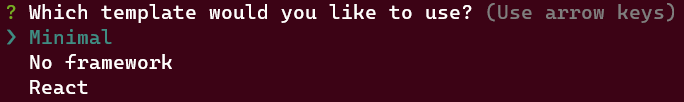
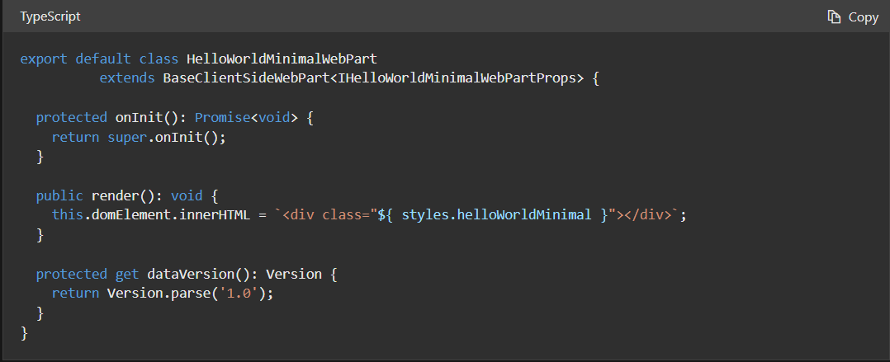
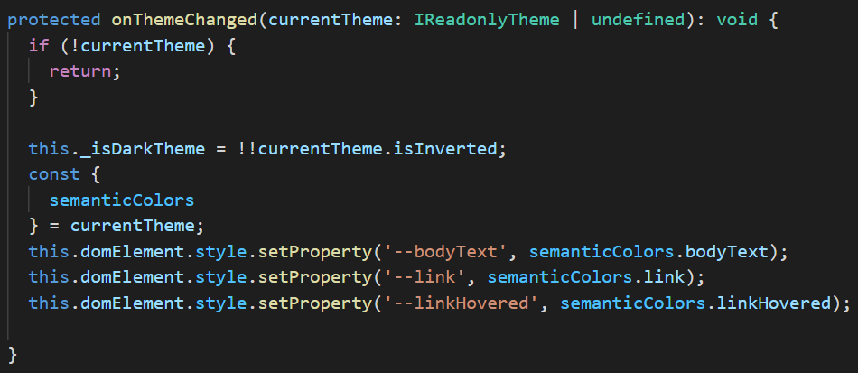
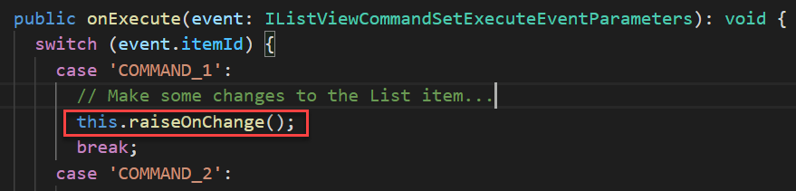
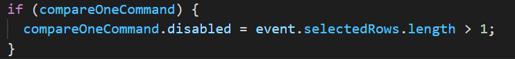
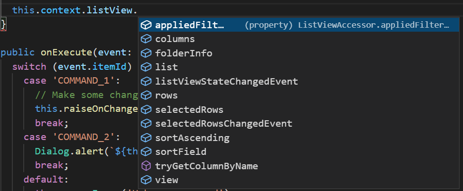
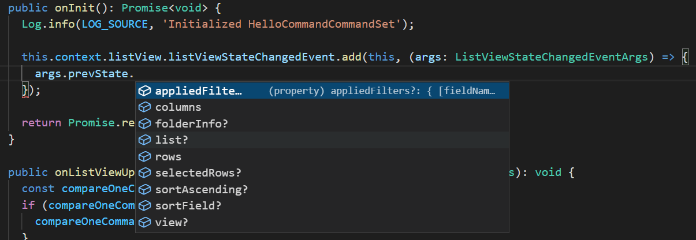
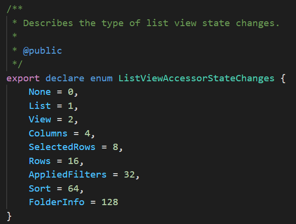
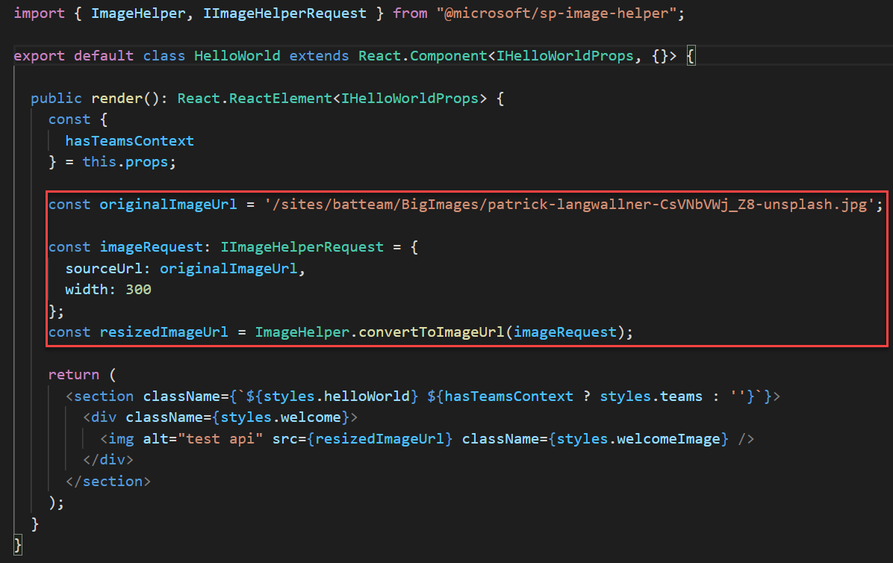

Desde el pasado 17 de febrero, tenemos disponible la nueva release del
SharePoint Framework. En este artículo vamos a ver algunas de las
novedades más destacadas, y entraremos en detalle en la nueva API
llamada **ImageHelper** que nos va a permitir redimensionar imágenes y
mejorar el rendimiento de su carga. Antes de arrancar, recordad que para
actualizar el generador de *Yeoman* y trabajar con la nueva versión del
SPFx, debemos ejecutar el comando:

  -----------------------------------------------------------------------
  npm install @microsoft/generator-sharepoint --global
  -----------------------------------------------------------------------

  -----------------------------------------------------------------------

**Novedades para destacar**

Si queréis un listado exhaustivo de todas las novedades incluidas, así
como aquellas cosas que han desaparecido (que también las hay), o se han
marcado como "*deprecated*" por Microsoft, os recomiendo que veáis las
"*release notes*" del propio Microsoft: [SharePoint Framework v1.14
release notes | Microsoft
Docs](https://docs.microsoft.com/en-gb/sharepoint/dev/spfx/release-1.14).
Y os recomiendo todavía más, que os miréis este artículo de Andrew
Connell, donde destripa cada novedad al detalle, y es mucho más
entendible que las notas de MS (además, está disponible como video de
YouTube, así que es muy fácil seguirlo). Dicho esto, os cuento las que a
mi parecer son las novedades más interesantes:

**Cambios en el "scaffolding" con Yeoman**

Si creamos un nuevo proyecto en la 1.14, el proceso se ha simplificado a
la hora de contestar preguntas. Cosas como:

  -----------------------------------------------------------------------
  Do you want to allow the tenant admin the choice of being able to
  deploy the solution to all sites immediately without running any
  feature deployment or adding apps in sites?
  -----------------------------------------------------------------------

Ya no aparecen como "*prompts*" durante la creación. Esto no quiere
decir que ya no se pueda configurar tu solución con esas opciones,
simplemente ahora el generador le asigna un valor por defecto, que
termina en el "*package-solution.json*", así que si lo necesitas, puedes
configurar el valor adecuado desde allí. Por ejemplo, para la pregunta
anterior, la propiedad a editar en el "*package-solution.json*" sería
"*skipFeatureDeployment*". Además, ahora disponemos de 3 "plantillas"
diferentes a la hora de crear nuestro WebPart:

Las templates de "*No framework*" y "*React*" ya las conocemos, ahora
aparece la nueva "*Minimal*", que creará nuestro WebPart con solo lo
imprescindible. Es realmente "*minimal*" ¡!

Tenéis una lista disponible de todos los cambios a nivel de *Yeoman* en
el siguiente enlace:
<https://docs.microsoft.com/en-us/sharepoint/dev/spfx/yeoman-generator-for-spfx-intro>

**Webpart Context isServedFromLocalhost**

Se ha añadido una nueva propiedad el contexto del WebPart:
"**isServedFromLocalhost**", que como su nombre indica, será verdadero
cuando el WebPart se sirva desde localhost. Este será cuando hagamos un
"*gulp serve*" y carguemos el WebPart en el local workbench de
SharePoint.

**WebPart onThemeChanged method**

Si has trabajado ya con WebParts corriendo tanto en SharePoint como en
MS Teams, seguramente te habrás dado algún cabezazo a la hora del
"*styling*" y los Temas, y habrás tirado de ciertos trucos para
gestionar esto. Pues bien, ahora SPFx nos lo pone mucho más fácil y
tenemos un método del WebPart que se dispara cada vez que se cambia el
Tema, de manera que podemos adaptar los estilos al Tema seleccionado.
Este es el código que viene en la plantilla:

Nuevas APIs para Extensiones del tipo "list view command set"

Ahora disponemos de un nuevo método que va a forzar el evento
"*OnChange*" sobre una vista de lista, de tal manera que SharePoint
refrescará los datos en la vista. De esta forma, si tenemos un Command
que hace algún cambio sobre un item de lista, podemos llamar a este
nuevo método, y así SharePoint refrescará el item en la vista.

También podemos ahora deshabilitar un Comando. Anteriormente, lo que
hacíamos era mostrar u ocultar un comando según condiciones, pero ahora
se puede dejar siempre mostrado el comando (botón en la *ribbon*), y
habilitarlo cuando convenga.

Otra novedad en este apartado es que objeto "*listView*" del contexto,
tiene muchas más propiedades. En la versión anterior, sólo teníamos la
propiedad "*columns*", ahora en cambio:

El último cambio por comentar en este apartado es realmente importante.
Por un lado, queda marcado como "*deprecated*" el método
"***onListViewUpdated***", y queda sustituido por el método que nosotros
queramos registrar, haciendo uso del nuevo método
"***listViewStateChangedEvent.add()***"

Fijaros como tenemos acceso a la propiedad "***prevState***" con
información sobre el estado de la *list view*. Además, tenemos también
disponible la propiedad "**stateChanges**", pero que no te lleve a
engaño. Dicha propiedad es un mero Enumerado que describe el tipo de
cambio que ha sucedido. Estos son los valores posibles:

Recuerda que si quieres conocer el estado actual, puedes hacerlo
directamente desde el contexto (no desde el objeto EventArgs):
*this.context.listView*

**Nota**: como comentamos, el método "*onListViewUpdated*" queda
deprecated, sin embargo, cuando creamos una extensión con el generador
de *Yeoman*, dicho método sigue apareciendo, incluyendo el código que
siempre tuvo. No hay explicación por parte de MS al respecto, y
probablemente sea un error y hayan olvidado actualizar la template...
¡who knows!
Si no terminas de creértelo, justo en este enlace hace la mención MS de
que el método queda *deprecated*:
<https://docs.microsoft.com/en-gb/sharepoint/dev/spfx/release-1.14#deprecations-and-removed-items-in-this-release>

ImageHelper API

**Disclaimer**: Mientras preparaba esta parte del artículo, descubrí
que, finalmente, esta API no ha sido introducida en la versión 1.14.0 GA
(sí, las Release Notes del propio Microsoft están erróneas). Sin
embargo, todavía es posible usar esta API con una versión beta de un
paquete concreto (puedes usar SPFx 1.14.0 con sólo la versión beta de
este paquete. Sigue leyendo para averiguar cómo). Podés ver este issue
que abrí con MS, donde confirman lo que os digo:
<https://github.com/SharePoint/sp-dev-docs/issues/7752>

Veamos ahora como podemos hacer uso de esta nueva API. Como decíamos
anteriormente, la principal ventaja de esta nueva API es que vamos a
poder escalar nuestras imágenes de manera sencilla, mejorando el
performance, y además, esto permitirá que los usuarios no tengan que
andar preocupándose de cuánto de grande es la imagen, etc, ya que
nuestro WebPart la renderizará el tamaño que nos interese, y de la forma
más eficiente posible.

Microsoft ha creado esta página con toda la documentación sobre la API:
[Image Helper API | Microsoft
Docs](https://docs.microsoft.com/en-gb/sharepoint/dev/spfx/image-helper-api)

Sin embargo, como os digo en el disclaimer, la API no viene incluida en
la 1.14, así que hay que instalar una versión beta del paquete de la
API:

  -----------------------------------------------------------------------
  npm install @microsoft/sp-image-helper@1.14.0-beta.5
  -----------------------------------------------------------------------

Una vez instalado el paquete apropiado que sí contiene la nueva API, ya
podemos utilizarlo para obtener una nueva URL con la imagen
redimensionada y optimizada:

En una de mis pruebas, una imagen de 2.15
Mb, redimensionada a 400px de ancho, pasa a pesar tan solo 51Kb.

Básicamente, lo que hace el framework es montar una URL que llama a un
endpoint de la API interna de SharePoint. Es dicho endpoint quién sirve
la imagen optimizada. Una cosa importante a tener en cuenta aquí, es que
dicha nueva URL, puede ser temporal, por lo que no conviene compartirla
o almacenarla. Aquí os dejo un ejemplo de una de esas URLs:

  ------------------------------------------------------------------------------------------------------------------------------------------------------------------------------------------------------------------------------------------------------------------------------------------------------------
  *https://tenant.sharepoint.com/_api/v2.1/shares/u!aHR0cHM6Ly9zYW1ib3JpLnNoYXJlcG9pbnQuY29tL3NpdGVzL2JhdHRlYW0vQmlnSW1hZ2VzL3BhdHJpY2stbGFuZ3dhbGxuZXItQ3NWTmJWV2pfWjgtdW5zcGxhc2guanBn/driveItem/thumbnails/0/c400x99999/content?preferNoRedirect=true&prefer=extendCacheMaxAge&clientType=modernWebPart*
  ------------------------------------------------------------------------------------------------------------------------------------------------------------------------------------------------------------------------------------------------------------------------------------------------------------

Y hasta aquí el repaso a las novedades más destacadas de la nueva
release del SharePoint framework.

¡Hasta el próximo artículo!

**Luis Mañez**   
Cloud Architect en ClearPeople LTD   
@luismanez   
<https://github.com/luismanez>