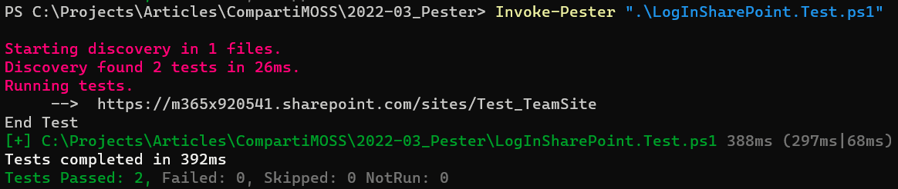
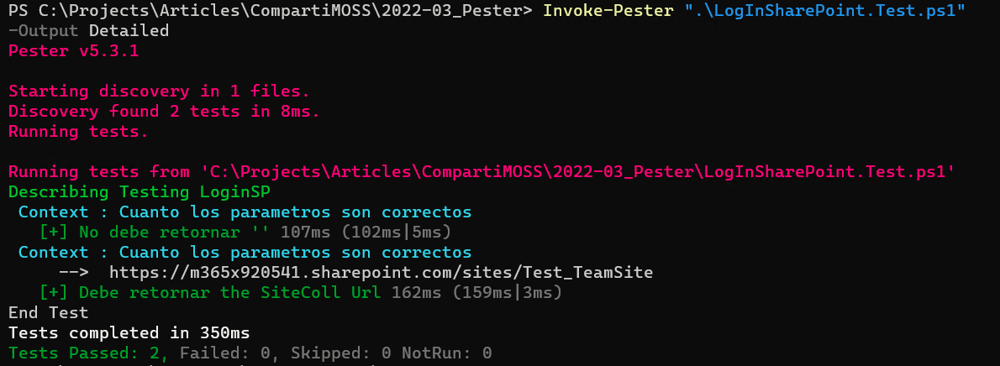
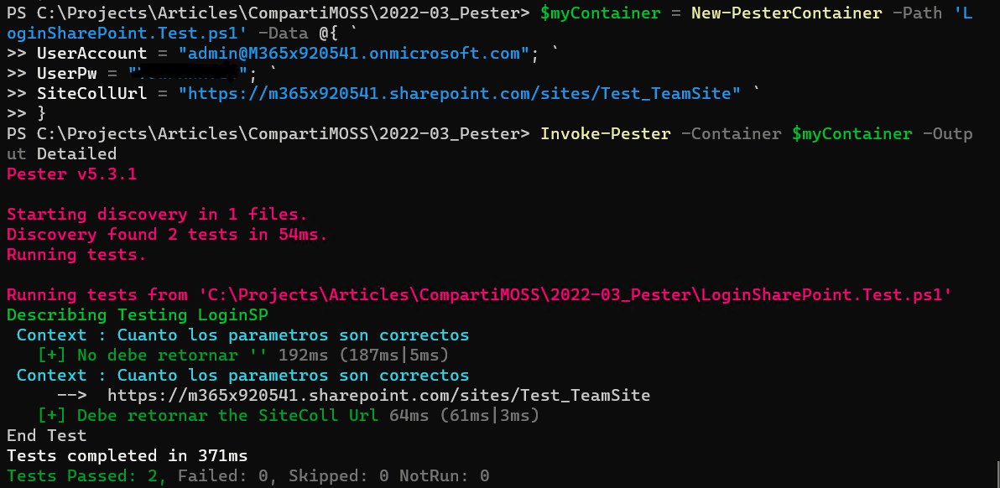

PowerShell es utilizado universalmente en el mundo de software de
Microsoft no solo como la herramienta para crear scripts rápidamente,
sino también como el lenguaje de programación preferido para realizar
multitud de tareas administrativas dentro de Windows y todos los
servidores de Microsoft.

Cuando hablamos de PowerShell, hablamos de dos cosas indistintamente: el
Framework de automatización (programación) integrado en Windows y los
servidores de Microsoft (Exchange, SharePoint, SQL, Azure, Dynamics,
Office 365, etc.), y la consola para ejecutar los scripts desde la
interfaz de usuario de Windows.

Generalmente PowerShell es utilizado por administradores de sistemas que
desean encontrar/modificar elementos de algún sistema de Microsoft, o
automatizar tareas rutinarias. Pero scripts pueden volverse muy
complejos rápidamente, y, como con cualquier otro lenguaje de
programación, necesitan mantenimiento y hay que adaptarlos a nuevos
requisitos durante su vida útil. Lo que nos lleva a la necesidad
ineludible de testeo de software para garantizar el funcionamiento de
cualquier pieza de software.

Existe un Framework para testeo de scripts de PowerShell: Pester. Pester
es Open Source y su repositorio de código fuente se puede encontrar en
GitHub (https://github.com/pester/Pester). Pester tiene cuatro
características principales:

-   Assertions: Pester permite programar las condiciones que
    determinarán si las pruebas deben fallar o no.

-   Ejecución de pruebas: El framework permite ejecutar las pruebas de
    testeo.

-   Agrupación de pruebas: Creación de grupos lógicos de pruebas.

-   Mocking: Es posible crear objetos "fantasmas" para ejecutar las
    pruebas sin afectar los datos originales.

-   Code Coverage: Pester puede medir la cantidad de código que cubren
    las pruebas.

**Información sobre Pester**

En el sitio Wiki de Pester (https://pester.dev/docs/quick-start) se
puede ver toda la información necesaria para utilizar las funciones del
framework, incluyendo ejemplos extendidos de su uso. En este articulo
solamente se presentará información básica sobre cómo usar Pester para
testear una función que se puede utilizar con SharePoint en Microsoft
365.

**Instalación de Pester**

PowerShell en Windows 10 y 11 vienen con una versión antigua (v3) de
Pester instalada por defecto. Para instalar la última versión, ejecute
el siguiente comando en PowerShell:

Install-Module -Name Pester -Force

Pester se puede utilizar con Windows, Linux, MacOS y es compatible con
PowerShell 3, 4, 5, 6 and 7.

**Utilización de Pester - Funciones**

Como en todo programa tradicional escrito con C#, Visual Basic o
cualquier otro lenguaje, para poder hacer testeo unitario es
indispensable separar la interfaz de usuario de los objetos de negocios.
En el caso de PowerShell, toda la funcionalidad de negocios se puede
crear en archivos separados y por intermedio de funciones ("Function")
que, a su vez, pueden tener parámetros de entrada y retornar valores.
Los archivos pueden tener la extensión .ps1 (archivos ejecutables de
PowerShell) o .psm1 (archivos con módulos de PowerShell).

Como ejemplo en este artículo, se va a utilizar un archivo .ps1 llamado
"LogInSharePoint.ps1" con una función que permite logearse en
Microsoft 365 SharePoint utilizando PnP. La función "LoginPS" tiene
tres parámetros de entrada (cuenta del usuario, su clave para Office 365
y el URL de la Site Collection), y devuelve el contexto de SharePoint.
Normalmente archivos de PowerShell de este tipo contienen varias
funciones, pero para el ejemplo se va a utilizar solamente una.

```
Function LoginPS($UserAccount, $UserPW, $SiteCollUrl) {
    [SecureString]$securePW = ConvertTo-SecureString -String $UserPW -AsPlainText -Force
    $myCredentials = New-Object -TypeName System.Management.Automation.PSCredential `
        -argumentlist $UserAccount, $securePW
    Connect-PnPOnline -Url $SiteCollUrl -Credentials $myCredentials
    return Get-PnPContext
}
```

Nota: este artículo solamente muestra funcionalidad básica de Pester,
pero el framework permite realizar pruebas mucho más complejas. Toda la
información necesaria se puede encontrar en el vínculo indicado al
principio del artículo.

**Utilización de Pester - Pruebas Unitarias**

Para crear el código de testeo de Pester, se utiliza otro archivo con la
extensión ".Test.ps1" y el mismo nombre del archivo a testear (en el
caso del ejemplo, el archivo de testeo se llama
"LoginSharePoint.Test.ps1"). Básicamente una prueba de Pester consiste
en varias secciones, de las cuales las más importantes son:

-   "BeforeAll" (no obligatorio) - Contiene todo el código que debe
    ejecutarse antes de que los asserts comiencen a ejecutar.

-   "Describe" (obligatorio) - Descripción del tipo de prueba que se
    va a ejecutar y es el contenedor para todos los contextos sobre los
    que se van a realizar las pruebas de un objeto. Normalmente se
    utiliza el nombre de la función a testear.

-   "Context" (obligatorio) - Describe el objetivo de una prueba
    (Assert) y es el contenedor de la prueba a realizar.

-   "It" (obligatorio) - Contiene el código de la prueba unitaria
    misma incluyendo las condiciones para que la prueba falle o pase la
    prueba.

-   "AfterAll" (no obligatorio) - Contiene el código que debe
    ejecutarse cuando se han terminado todas las pruebas.

El siguiente ejemplo testea la función "LoginSP" por medio de dos
asserts: el primero indica que el resultado debe contener un objeto, y
el segundo que la propiedad "URL" del objeto de regreso debe ser igual
al parámetro de entrada de la función. En código de producción se
incluyen normalmente muchos más asserts que cubren todos los casos
posibles de entrada y salida de datos; el ejemplo solamente muestra dos
casos básicos.

```
BeforeAll {
    . $PSScriptRoot/LoginSharePoint.ps1
    #Import-Module .LoginSharePoint.psm1 -Force
}
Describe "Testing LoginSP" {
    Context ": Cuanto los parametros son correctos" {
    It "No debe retornar '$null'" {
            $UserAccount = "admin@M365x920541.onmicrosoft.com"
            $UserPW = "MiMuySeguraPW"
            $SiteCollUrl = "https://m365x920541.sharepoint.com/sites/Test_TeamSite"
            LoginSP $UserAccount $UserPW $SiteCollUrl | Should -Not -Be $null
        }
    }
    Context ": Cuanto los parametros son correctos" {
    It "Debe retornar el SiteColl Url" {
            $UserAccount = "admin@M365x920541.onmicrosoft.com"
            $UserPW = "MiMuySeguraPW"
            $SiteCollUrl = "https://m365x920541.sharepoint.com/sites/Test_TeamSite"
            $rtnCtx = LoginSP $UserAccount $UserPW $SiteCollUrl
            Write-Host "     --> " $rtnCtx.Url
            $rtnCtx.Url | Should -Be $SiteCollUrl
        }
    }
}
AfterAll {
    Write-Host "End Test"
}
```

Algunos puntos importantes para anotar:

-   En el "BeforeAll" se hace la conexión con el archivo que contiene
    el código de la función a testear. La línea comentada se utiliza
    cuando el archivo es un módulo de PowerShell. Si lo que se quiere
    utilizar es un archivo .ps1, siempre utilice ". " (punto espacio)
    antes del nombre del archivo, la ruta completa al archivo, o
    cualquier otra función que le permita a Pester encontrar el archivo
    con el código ("$PSScriptRoot/" por ejemplo).

-   Note la forma diferente como se llama la función en los dos asserts:
    en la primera directamente, y en la segunda guardando el resultado
    primero en una variable. Ambas formas son válidas, pero la segunda
    forma permite enriquecer el resultado por pantalla.

-   El teardown ("AfterAll") solamente contiene algo de texto, pero el
    código puede incluir cualquier tipo de script de PowerShell que sea
    necesario.

**Utilización de Pester - Ejecución**

Para ejecutar la prueba unitaria utilice el siguiente comando:

```
Invoke-Pester ".LogInSharePoint.Test.ps1"
```

Y el resultado mostrado por pantalla indica cuantos asserts han
ejecutado correcta e incorrectamente, lo mismo que el tiempo utilizado
para ejecutar todos los asserts:



Los resultados se pueden enriquecer con más información utilizando el
siguiente comando:

```
Invoke-Pester ".LogInSharePoint.Test.ps1" -Output Detailed
```

Y en este caso la salida por pantalla indica que asserts se han
ejecutado, incluyendo el texto de la descripción y contexto:



**Utilización de Pester - Parámetros de entrada**

Un problema con el código de prueba del ejemplo es que para cada assert
se tienen que pasar los parámetros de entrada de la función, lo que hace
no solamente engorroso modificar toda la prueba unitaria cada vez que se
cambia de tenant de Office 365, sino que impide ejecutar el código de
forma automatizada. Para solucionar el problema, los parámetros de
entrada de la función se pueden definir como parámetros de entrada de la
prueba unitaria de la siguiente forma (la sintaxis es la misma que se
utiliza para cualquier script de PowerShell):

```
Param (
    [Parameter(Mandatory=$true)]
    [string]$UserAccount,
    [Parameter(Mandatory=$true)]
    [string]$UserPW,
    [Parameter(Mandatory=$true)]
    [string]$SiteCollUrl
)
BeforeAll {
    . $PSScriptRoot/LoginSharePoint.ps1
    #Import-Module .EnsureList.psm1 -Force
}
Describe "Testing LoginSP" {
    Context ": Cuanto los parametros son correctos" {
    It "No debe retornar '$null'" {
            LoginSP $UserAccount $UserPW $SiteCollUrl | Should -Not -Be $null
        }
    }
    Context ": Cuanto los parametros son correctos" {
    It "Debe retornar el SiteColl Url" {
            $rtnCtx = LoginSP $UserAccount $UserPW $SiteCollUrl
            Write-Host "     --> " $rtnCtx.Url
            $rtnCtx.Url | Should -Be $SiteCollUrl
        }
    }
}
AfterAll {
    Write-Host "End Test"
}
```

En este caso, Pester se puede llamar utilizando un comando que incluye
los parámetros de entrada en un contenedor, como en el siguiente
ejemplo:

```
$myContainer = New-PesterContainer -Path 'LoginSharePoint.Test.ps1' -Data @{ `
  UserAccount = "admin@M365x920541.onmicrosoft.com"; `
  UserPw = "MiMuySeguraPW"; `
  SiteCollUrl = "https://m365x920541.sharepoint.com/sites/Test_TeamSite" `
}

Invoke-Pester -Container $myContainer -Output Detailed
```




**La importancia de Testeo Unitario**

Suponga que la función de logeo que se está utilizando en el ejemplo
forma parte de un extenso proyecto de PowerShell, con innumerables
funciones que se apoyan en la función "LoginSP" para acceder a
SharePoint. El Framework de PnP utilizado en el código de la función
requiere que se utilice un "App Registration" de Azure para
autorización. Por alguna razón (requisitos empresariales, utilización de
diferentes frameworks para desarrollo, testeo y producción, etc.) se
requiere que la autenticación se realice por medio del Client Side
Object Model (CSOM) de SharePoint en lugar de PnP, que puede funcionar
con autenticación que utiliza un challenge tradicional. En este caso
podemos modificar la función "LoginSP" para que utilice CSOM de la
siguiente forma:

```
Function LoginSP($UserAccount, $UserPW, $SiteCollUrl) {
    {
    Add-Type -Path "C:Program FilesCommon FilesmicrosoftsharedWeb ServerExtensions16ISAPIMicrosoft.SharePoint.Client.dll"
    Add-Type -Path "C:Program FilesCommon FilesmicrosoftsharedWeb ServerExtensions16ISAPIMicrosoft.SharePoint.Client.Runtime.dll"
   
    [SecureString]$securePW = ConvertTo-SecureString -String $UserPW -AsPlainText -Force
    $myCredentials = New-Object Microsoft.SharePoint.Client.SharePointOnlineCredentials `
        ($UserAccount, $securePW)
    $rtnContext = New-Object Microsoft.SharePoint.Client.ClientContext ($SiteCollUrl)
    $rtnContext.Credentials = $myCredentials
    return $rtnContext
}
```

Una pequeña modificación del código fuente puede tener repercusiones
imprevistas en el proyecto completo. Con solo ejecutar las rutinas de
testeo unitario se puede estar seguro de que todo el código del proyecto
seguirá funcionando sin problemas ("Regression Test").

**Conclusión**

Todo código creado con PowerShell se tiene que manejar de la misma forma
que código fundado en cualquier otro idioma de programación, incluyendo
separación de funciones e interfaz y testeo unitario. Pester es un
framework que permite crear Unit Test para PowerShell. Pester es Open
Source, gratis de utilizar, y dispone de información detallada sobre
cómo utilizarlo. Este artículo es solamente una introducción a testeo
unitario por medio de Pester, el framework dispone de funcionalidad
mucho más compleja que abarca múltiples facetas de testeo automático.

**Gustavo Velez** <br />
Office Apps & Services MVP 
 
import LayoutNumber from '../../../components/layout-article'
export default LayoutNumber
