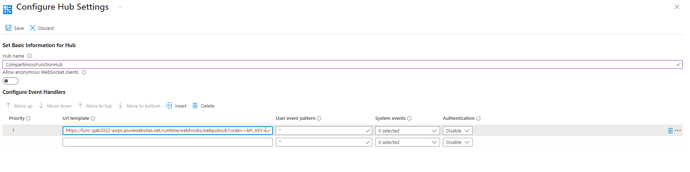

Antes de leer el siguiente artículo te recomiendo visualices la charla
que di con Santiago Porras y Rodrigo Liberoff en el Global Azure
Bootcamp 2022 titulada [Real Wars - La batalla por el tiempo
real](https://www.youtube.com/watch?v=rq3UA9U1QBw). En esta charla se
dio pinceladas sobre el nuevo servicio Azure Web PubSub. Bien, una vez
situados en qué es el servicio Azure Web PubSub vamos al lío.

Con la llegada de net6 y el nuevo motor en tiempo de ejecución v4 de las
funciones, se han desarrollado nuevos desencadenadores y enlaces
(triggers y bindings) para poder consumir este nuevo gran servicio lo
que ayudará a los desarrolladores a implementar fácilmente aplicaciones
web con características en tiempo real y con el patrón de
publicación-suscripción.

**Algunos conceptos clave**

A continuación, se detallan algunos conceptos claves a considerar:

-   Desencadenador (Trigger): Lo que provoca que una función se ejecute.

    -   Cada función debe tener un único desencadenador.

    -   Un desencadenador es un tipo especial de enlace.

-   Enlace (Binding): Conecta recursos o datos a una función.

    -   Enlace de entrada (Input): Permiten leer datos. Se conecta al
        origen de datos.

    -   Enlace de salida (Output): Permiten escribir datos. Se conecta
        al destino de los datos.

-   Concentrador (Hub): Concepto lógico relativo a un conjunto de
    conexiones de clientes.

-   Usuario (User): Las conexiones pueden pertenecer a un usuario y éste
    puede tener varias.

-   Manejador de eventos (Event Handler): Contiene la lógica para
    controlar los eventos del cliente.

Veamos el siguiente diagrama y procederemos a explicarlo


1.  El cliente solicita conexión con el servicio, para ello realiza una
    llamada y así obtener la URL del punto de conexión y un token de
    acceso válido. Enlace de entrada WebPubSubConnection con
    HttpTrigger.

2.  Se devuelve la URL y token de acceso.

3.  El cliente envía un mensaje al servicio.

4.  El servicio ejecuta el manejador de eventos el cual contiene toda la
    lógica y así poder actuar de nuevo en el resto de los clientes
    conectados. Enlace de desencadenador WebPubSubTrigger o enlace de
    entrada WebPubSubContext con HttpTrigger para controlar la solicitud
    de servicio.

5.  El manejador solicita que el servicio realice una acción. Enlace de
    salida WebPubSub para solicitar que el servicio realice alguna
    acción.

6.  El servicio envía la notificación a todos los clientes conectados.

Con esto en mente procederemos a ver lo que realmente nos gusta y es
código del bueno. (Parrita approved).

> NOTA: Lo primero informaros que hay que instalar el siguiente paquete
> Nuget (Microsoft.Azure.WebJobs.Extensions.WebPubSub) pero no es
> compatible con los tipos de funciones Isolated al ser de tipo WebJob.

Enlace de entrada WebPubSubConnection

Como hemos comentado antes, para que un cliente pueda conectarse al
servicio Azure Web PubSub, éste debe conocer la dirección URL del punto
de conexión del servicio y tener un token de acceso válido. El enlace de
entrada WebPubSubConnection genera la información necesaria, por lo que
el cliente no necesita controlar la generación de dichos tokens. A mí me
gusta usar con este enlace de entrada un desencadenador HttpTrigger,
para que así todos los clientes que necesiten conectarse con el servicio
puedan obtener de una forma muy sencilla la información de conexión.

```
[FunctionName(nameof(Negotiate))]
public static WebPubSubConnection
Negotiate([HttpTrigger(AuthorizationLevel.Function, "get",
"post")] HttpRequest req,

      ILogger log,
      [WebPubSubConnection(Hub = "<hub>", UserId = "{query.userid}")] WebPubSubConnection connection)
      {
         log.LogInformation("Connecting...");
         return connection;
     }
```

Si te fijas, el binding WebPubSubConnection tiene como propiedades lo
siguiente:

-   Hub: Es obligatorio escribir esta propiedad y es el nombre del
    concentrador del servicio de Azure Web Pubsub al que solicitamos
    conexión.

-   UserId: Es un valor opcional en el cual estableceremos el
    identificador del usuario que solicita conexión para que se incluya
    dentro del token de acceso al servicio.

-   Connection: Aunque en el ejemplo no está incluido, es una propiedad
    obligatoria. Es el nombre de la clave de configuración de nuestra
    función que contiene la cadena de conexión al servicio Azure Web
    PubSub. Por defecto este valor es "AzureSignalRConnectionString".

Ahora con la respuesta de esta función obtenemos un WebPubSubConnection
cuyas propiedades son:

-   BaseUri: Es la URI de conexión de cliente de Web PubSub.

-   Uri: Es la Uri completa al punto de conexión al servicio e incluye
    el AccessToken.

-   AccessToken: Token de acceso generado basado en la información de
    servicio y UserId de la solicitud.

**Desencadenador WebPubSubTrigger**

Este desencadenador controla las solicitudes del servicio Azure Web
PubSub, es decir cuando deseamos controlar las peticiones que lleguen a
Azure Web PubSub. Para ello dentro del portal del servicio en Azure se
debe configurar un webhook para que se invoque a la función. Para
realizar esto, iremos a Settings/Configure Hub Settings agregando
nuestro HUB:




Estableceremos el patrón del manejador de eventos lo siguiente:

```
<Function_App_Url>/runtime/webhooks/webpubsub?code=<API_KEY>
```

> **IMPORTANTE**: En Producción por favor, debéis incluir SI o SI, el
> apiKey code de nuestra aplicación de funciones. Por seguridad os lo
> comento.

```
[FunctionName(nameof(WebPubSubTrigger))]
public static void
WebPubSubTrigger([WebPubSubTrigger("CompartimossFunctionHub",
WebPubSubEventType.User, "message")]
         UserEventRequest request,
         WebPubSubConnectionContext context,
         string data,
         WebPubSubDataType dataType)
{
  Console.WriteLine($"Request from: {context.UserId}");
  Console.WriteLine($"Request message data: {data}");
  Console.WriteLine($"Request message dataType: {dataType}");
}
```

Veamos cómo configurar este desencadenador:

-   Hub: Es obligatorio escribir esta propiedad y es el nombre del
    concentrador del servicio de Azure Web Pubsub al que solicitamos
    conexión.

-   WebPubSubEventType: es requerido e indica el tipo de evento de los
    mensajes para la función que se va a desencadenar. El valor debe ser
    User o System.

-   EventName: es requerido y dependiento del tipo de evento puede tener
    varios valores como son

    -   Para el tipo de evento System, el nombre del evento debería
        estar en connect, connected, disconnected.

    -   Para el tipo de event User, el nombre del evento es message.

    -   En el caso de que queramos usar el subprotocolo
        json.webpubsub.azure.v1, el nombre del evento es el nombre del
        evento definido por el usuario. (esto la verdad es que me gusta
        mucho más, soy partidario de usar el subprotocolo).

-   Connection: Aunque en el ejemplo no está incluido, es una propiedad
    obligatoria. Es el nombre de la clave de configuración de nuestra
    función que contiene la cadena de conexión al servicio Azure Web
    PubSub. Por defecto este valor es "AzureSignalRConnectionString".

Este disparador también permite que se devuelva una respuesta cuando se
requiere alguna sincronización.

```
[FunctionName(nameof(WebPubSubTriggerWithReturnValue))]
public static WebPubSubEventResponse
WebPubSubTriggerWithReturnValue([WebPubSubTrigger("CompartimossFunctionHub",
WebPubSubEventType.User, "message")]
          UserEventRequest request,
          WebPubSubConnectionContext context,
          string data,
          WebPubSubDataType dataType)
{
  return new UserEventResponse
  {
    Data = BinaryData.FromString("ack"),
    DataType = WebPubSubDataType.Text
  };
}
```

Los tipos devueltos pueden ser los siguientes:

-   ConnectEventResponse: Respuesta para el evento connect.

-   UserEventResponse: Respuesta para el evento de usuario.

-   EventErrorResponse: Respuesta de error para el evento de
    sincronización.

-   WebPubSubEventResponse: Tipo de respuesta base.

**Enlace de salida WebPubSub**

En los conceptos clave de inicio del artículo comentamos que cuando
queramos que el servicio Azure Web PubSub realice una o varias acciones,
debemos de establecer un enlace de salida.

Si te viste la charla, se indicó que se pueden enviar mensajes a:

-   Todos los clientes conectados al hub.

-   Clientes de un usuario específico (un usuario puede tener varias
    conexiones).

-   Clientes de un grupo.

-   A una conexión específica.

Pero también se pueden ejecutar las siguientes acciones:

-   Agregar conexión al grupo.

-   Agregar usuario a un grupo.

-   Eliminación de una conexión de un grupo.

-   Eliminación de un usuario de un grupo.

-   Eliminación de un usuario de todos los grupos.

-   Cierre de todas las conexiones de cliente.

-   Cierre de una conexión de cliente específica.

-   Cierre de conexiones de un grupo.

-   Concesión del permiso de una conexión.

-   Revocación del permiso de una conexión.

Como ejemplo de código tenemos:

```
[FunctionName("WebPubSubOutputBinding")]
public static async Task
RunAsync([HttpTrigger(AuthorizationLevel.Function, "get", "post")]
HttpRequest req,
       [WebPubSub(Hub = "CompartimossFunctionHub")]
IAsyncCollector<WebPubSubAction> actions)
{
    await actions.AddAsync(WebPubSubAction.CreateSendToAllAction("Hola Compartimoss!!!", WebPubSubDataType.Text));
}
```

El binding de salida tiene las siguientes propiedades:

-   Hub: Es obligatorio escribir esta propiedad y es el nombre del
    concentrador del servicio de Azure Web Pubsub al que solicitamos
    conexión.

-   Connection: Aunque en el ejemplo no está incluido, es una propiedad
    obligatoria. Es el nombre de la clave de configuración de nuestra
    función que contiene la cadena de conexión al servicio Azure Web
    PubSub. Por defecto este valor es "AzureSignalRConnectionString".

**¿Dónde puedo encontrar el código de ejemplo?**

Podéis descargaros los proyectos de ejemplo en
<https://github.com/sparraguerra/compartimoss/tree/master/AzureFunctionsAzureWebPubSub>

**Conclusiones**

Como conclusión diremos que tenemos a nuestra disposición el control del
servicio Azure Web PubSub con nuestras Azure Functions. Unidos por el
tiempo real.

Happy coding!


**Sergio Parra Guerra** <br />
Software & Cloud Architect at Encamina <br />
MVP Azure <br />
https://twitter.com/sparraguerra <br />