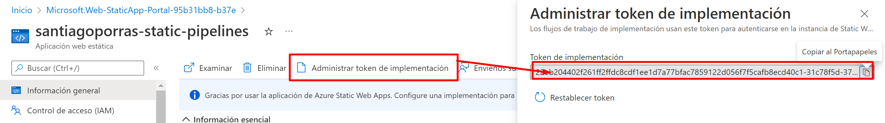

Hace algunos días se celebró el [aniversario de Azure Static Web
Apps](https://docs.microsoft.com/en-us/events/learntv/swa-anniversary-may-2022/)
y, entre otras cosas, se habló del despliegue desde Azure DevOps. Y os
preguntaréis... ¿Pero esto no estaba ya? Y la respuesta es que no, en
sus inicios, se habilitó la posibilidad de desplegar directamente desde
GitHub como explica [Adrián Díaz en este artículo en
CompartiMOSS](https://www.compartimoss.com/revistas/numero-45/azure-static-web-apps-que-es-este-nuevo-servicio/),
pero no desde Azure DevOps.

Lo cierto es que, desde inicios de 2022, se habilitó la posibilidad de
poder desplegar Azure Static Web Apps desde repositorios de Azure DevOps
y, de eso precisamente vamos a hablar en este artículo.

# Despliegue usando Azure DevOps directamente desde el portal de Azure 

Aunque no es el objetivo principal de este artículo, es posible realizar
el despliegue directamente desde el portal de Azure. Para ello, vamos a
crear el recurso de tipo "Azure Static Web App".

En la página donde especificamos los datos del recurso, podemos
seleccionar Azure DevOps como origen del despliegue.

Lamentablemente, para que esto funcione, es necesario que la cuenta de
Azure DevOps y el directorio activo de la cuenta de Azure estén
conectadas o, de lo contrario os pasará como a mí que no me permite
seleccionar ningún valor.

> En caso de que a vosotros sí os aparezca, podréis saltaros el
> siguiente paso

## Conectando nuestra organización de Azure DevOps con el Directorio Activo de Azure.

Para poder conectar la organización de Azure DevOps con el Directorio
Activo de Azure, debemos seguir los siguientes pasos: [Connect
organization to Azure Active Directory - Azure DevOps Services |
Microsoft
Docs](https://docs.microsoft.com/en-us/azure/devops/organizations/accounts/connect-organization-to-azure-ad?view=azure-devops)

1.  Entrar en el portal de Azure Devops
    [https://dev.azure.com/{TU_ORGANIZACION}](https://dev.azure.com/%7bTU_ORGANIZACION%7d)

2.  Ir a configuración de organización

## Desplegando desde el portal de Azure

En estos momentos, al crear una Azure Static Web App aparecerá
disponible la organización para que podamos seleccionarla, así como el
proyecto, el repositorio y la rama. Además, debemos especificar el stack
tecnológico y, al menos, la ubicación del código fuente. También es
posible seleccionar parámetros de la API, si la tuviéramos.

## Comprobando el resultado

En estos momentos, si navegamos a Azure DevOps y vamos a los pipelines,
veremos que ha aparecido un nuevo pipeline de compilación y despliegue,
que se ha creado automáticamente.

Sólo debemos esperar a que se complete su ejecución y ya podremos ir a
nuestra Azure Static Web App y ver el resultado.

# Despliegue desde Azure DevOps pipelines

Aunque la opción anterior es una manera bastante sencilla de realizar el
despliegue, es posible que en algunos casos no queramos o podamos
conectar el directorio activo de la suscripción de Azure con Azure
DevOps. En este caso, tenemos una tercera opción que es seleccionar
"Otro" en el detalle de implementación a la hora de crear el recurso de
Azure Static Web Apps.

En este caso, se creará el sitio, pero no se desplegará nada ya que, se
espera a que lo hagamos manualmente.

## Creación de pipeline de despliegue

Vamos a crear un pipeline muy sencillo que nos permita desplegar nuestra
web en Azure Static Web Apps, veréis qué sencillo es con los siguientes
pasos:

1.  Lo primero que tendremos que hacer es crear un nuevo pipeline desde
    nuestro proyecto en Azure DevOps para poder realizar el despliegue.

2.  A continuación, seleccionamos Azure Repos Git como fuente del código

3.  Seleccionamos el repositorio

4.  Seleccionamos, por ejemplo, el Starter pipeline

5.  Eliminamos el contenido de "steps"

6.  Usamos el asistente y añadimos la tarea de despliegue en Azure
    Static Web Apps

7.  Configuramos la tarea con los valores correspondientes, en mi caso,
    los siguientes:

8.  Copiamos el token de publicación de la Azure Static Web App que
    podemos encontrar en el propio recurso, en la pestaña de
    información.

9.  Lo añadimos en la configuración de la tarea del pipeline y le damos
    a añadir

10. Finalmente le guardamos y ejecutamos

Llegados a este punto, ya sólo tenemos que esperar que acabe la
ejecución del Job del pipeline y podremos comprobar el resultado.

## Comprobando el resultado

Una vez termine la ejecución del pipeline, ya podremos ir a comprobar el
despliegue de nuestra Azure Static Web App.

La url, como siempre, la podemos encontrar en la pestaña de información
del servicio de Azure Static Web App

Y el resultado...

# Resumen

Hoy en día podemos, no sólo desplegar Azure Static Web Apps desde el
portal de Azure al crear el recurso, lo cuál es la opción más adecuada y
recomendada o si la situación lo requiere, podemos realizar el
despliegue de forma manual creando un pipeline básico sin necesidad de
conocimiento de "yaml" para hacerlo.

# Links de interés

Si necesitáis más ayuda, podéis consultar información en los siguientes
enlaces:

-   [Azure Static Web Apps documentation | Microsoft
    Docs](https://docs.microsoft.com/en-us/azure/static-web-apps/?WT.mc_id=swaanniversary-61680-jemorg)

-   [Azure Static Web Apps Anniversary - Events | Microsoft
    Docs](https://docs.microsoft.com/en-us/events/learntv/swa-anniversary-may-2022/)

-   [Quickstart: Building your first static site with the Azure Static
    Web Apps | Microsoft
    Docs](https://docs.microsoft.com/en-us/azure/static-web-apps/getting-started?WT.mc_id=swaanniversary-61680-jemorg&tabs=vanilla-javascript)

-   [Azure Static Web App task - Azure Pipelines | Microsoft
    Docs](https://docs.microsoft.com/en-us/azure/devops/pipelines/tasks/utility/azure-static-web-app?view=azure-devops)

**Santiago Porras**  
MVP Developer Technologies  
Software Architect & Frontend Lead at ENCAMINA  
@saintwukong  
[Santiago Porras - The Lost Reference - YouTube](https://www.youtube.com/channel/UC4Ufxyi6_sLwL5sySfJJ3WA)  
[saintwukong - Twitch](https://www.twitch.tv/saintwukong)  