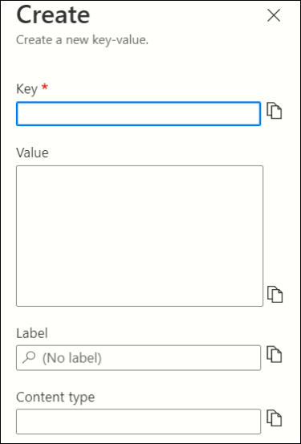
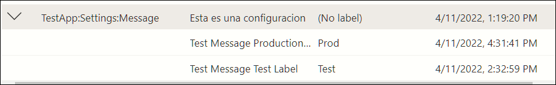

Prácticamente no existe aplicación para computadores que no necesite
algún tipo de configuración; además, siempre ha sido una buena práctica
separar las configuraciones del código fuente para poder adaptar el
funcionamiento del código sin tener que compilar e instalar todo el
programa de nuevo. Tradicionalmente se han usado todo tipo de
contenedores para almacenar configuraciones que cumplan estos
requisitos: archivos de texto, xml o JSON, bases de datos, etc.

El App Configuration de Azure es un servicio que permite que los
parámetros y configuraciones de la aplicación se almacenen fuera del
código y en un depósito centralizado. Esto permite crear un almacén
escalable para las configuraciones que se puede utilizar en múltiples
aplicaciones y que garantiza la coherencia y distribuye la carga de
trabajo. El servicio no solamente provee la funcionalidad tradicional de
un diccionario con pares de llave/valor para mantener los parámetros de
configuración, sino funcionalidad adicional como Labels, comparación de
valores, import/export de los valores, tipos de contenido, activación de
características y soporte para Azure Managed Identity, de tal forma que
las aplicaciones pueden acceder fácilmente a los valores sin necesidad
de especificar credenciales en el código o en la configuración.

**Creación y configuración del servicio en Azure**

Una instancia del Azure App Configuration se puede crear fácil y
rápidamente con la interfaz de usuario de Azure (también se puede crear
por medio de PowerShell y/o el CLI). Abra una ventana de navegador con
el portal de Azure (<https://portal.azure.com>) utilizando una cuenta de
administrador. Abra el Grupo de Recursos (Resource Group) que contiene
la aplicación que va a utilizar la configuración y agregue un nuevo
recurso del tipo "App Configuration". Asígnele un nombre único y
seleccione el Grupo de Recursos, la suscripción de Azure y la
localización geográfica del centro de datos que guardara la
configuración. En este momento hay dos tipos de precios para
seleccionar: gratis que permite 1.000 consultas por día con un máximo de
10 MB de espacio para las configuraciones, y una versión de pago que
permite 30.000 consultas por día con 1 GB de espacio.

Una vez creado el servicio, abra la ventana de "Access keys" y copie
el valor de "Connection string" que se va a utilizar luego para
retornar las configuraciones. En la ventana de "Configuration
explorer" es donde se pueden crear los pares key/valor para las
configuraciones. Utilice el botón de "+Create" que permite crear un
nuevo par.



Tanto la llave como el valor son cadenas (strings) que pueden contener
prácticamente cualquier valor. "Label" (no obligatorio) permite crear
clasificaciones de pares key/value: es posible que diferentes versiones
de una sola aplicación necesiten valores diferentes, según la versión
que se esté ejecutando. Por ejemplo, los valores de una misma llave para
utilizar en desarrollo, testeo y producción pueden ser diferentes.
Múltiples valores para una sola configuración, todos controlados desde
este lugar central, pueden ser definidos de esta manera.




Adicionalmente, utilizando la opción de "Feature manager" en el menú
vertical al lado izquierdo, se pueden definir banderas (flags) que
permiten realizar acciones en la aplicación dependiendo de su estado
(activada/desactivada). Por ejemplo, si se está agregando funcionalidad
nueva en una aplicación, o una nueva página en una aplicación Web, el
botón que permite utilizar las nuevas características se puede hacer
visible/invisible por medio de una bandera definida de este tipo. Hay
que tener claro que el servicio solo provee el indicador que identifica
si la bandera esta activada o desactivada, el código para reaccionar y
mostrar el botón o la nueva página tiene que ser programado en el código
fuente de la aplicación.

**Trabajando con el App Configuration**

El siguiente ejemplo utiliza una aplicación de consola basada en .NET
6.0 que utiliza la configuración creada anteriormente en Azure. Cree
inicialmente una aplicación de consola, y luego agréguele el NuGet
"Microsoft.Extensions.Configuration.AzureAppConfiguration" que
contiene todos los dlls y referencias necesarias para trabajar con el
App Configuration y CSharp. Agregue también las siguientes directivas
using:

```
using Microsoft.Extensions.Configuration;
using Microsoft.Extensions.Configuration.AzureAppConfiguration;
using Microsoft.Extensions.DependencyInjection;
using Microsoft.FeatureManagement;
```

El código básico para descargar configuraciones es supremamente
sencillo:

```
string AzAppConfigEndpoint = "Endpoint=https://appconfigcompartimoss.azconfig.io;Id=7AZx-...UKiz/;Secret=C3X2e...3+D9A=";

IConfigurationRoot myConfig = new ConfigurationBuilder()
  .AddAzureAppConfiguration(options =>
  {
    options.Connect(AzAppConfigEndpoint);
  }).Build();

Console.WriteLine(myConfig["TestApp:Settings:Message"]);
```

La primera variable contiene la cadena de conexión del servicio, tal
como se indicó al principio del articulo ("Access keys" - "Connection
string"). Un nuevo objecto del tipo "IConfigurationRoot" es creado y
contiene un objeto de opciones que conecta la aplicación con el servicio
de Azure por medio de la cadena de conexión. Finalmente, la
configuraciones se pueden leer utilizando el nombre dado en el
"Configuration explorer" a las llaves del par key/value en el
diccionario de llaves ("TestApp:Settings:Message" es el nombre de la
llave en el ejemplo).

El servicio de App Configuration puede utilizar una Managed Identity de
Azure, lo que significa que no es necesario mantener un secreto para
conseguir la autenticación de Azure. Si se utiliza una Managed Identity,
el código para obtener los valores de las llaves es muy similar al
mostrado anteriormente:

```
string AzAppConfigEndpoint =
"Endpoint=https://appconfigcompartimoss.azconfig.io";

IConfigurationRoot myConfig = new ConfigurationBuilder()
.AddAzureAppConfiguration(options =>
{
  options.ConnectWithManagedIdentity(AzAppConfigEndpoint);
}).Build();

Console.WriteLine(myConfig["TestApp:Settings:Message"]);
```

En este caso ya no es necesario utilizar toda la cadena de conexión
(incluyendo la identidad y el secreto), sino que con el solo URL del
endpoint es suficiente pues la Managed Identity se encarga de mantener
el secreto por sí misma. También se utiliza el método
"ConnectWithManagedIdentity" en lugar de "Connect".

Anteriormente se había indicado en el artículo que es posible utilizar
"Labels" para mantener diferentes valores para una sola llave. Si se
quiere obtener el valor de uno de los Labels de la llave, el código base
varía ligeramente, introduciendo un filtro que devuelve solo el valor
del Label necesario. Por ejemplo, si la llave
"TestApp:Settings:Message" tiene tres Labels (Dev, Test y Prod), para
obtener el valor para utilizar en Prod agregue un "Select" en el
objeto de opciones como muestra el siguiente código:

```
string AzAppConfigEndpoint =
"Endpoint=https://appconfigcompartimoss.azconfig.io;Id=7AZx-...UKiz/;Secret=C3X2e...3+D9A=";

IConfigurationRoot myConfig = new ConfigurationBuilder()
.AddAzureAppConfiguration(options =>
{
  options.Connect(AzAppConfigEndpoint);
    .Select(KeyFilter.Any, "Prod");
}).Build();

Console.WriteLine(myConfig["TestApp:Settings:Message"]);
```

Si se ha definido una o más característica en el Feature Manager, para
leer si la característica esta activada o desactivada desde el código se
deben utilizar interfaces del tipo "IServiceCollection" y
"IFeatureManager" e indicar en el objeto de opciones que se desea
utilizar las banderas de características, como muestra el siguiente
ejemplo. En la App Configuration del ejemplo se ha definido una
característica llamada "Beta". Note que al crear la característica se
puede definir el nombre de la llave a utilizar; pero si no se define,
Azure utiliza como nombre por defecto
".appconfig.featureflag/[NombreDeLaCaracteristica]" y crea un Label
para ella.

```
string AzAppConfigEndpoint =
"Endpoint=https://appconfigcompartimoss.azconfig.io;Id=7AZx-...UKiz/;Secret=C3X2e...3+D9A=";

IConfigurationRoot myConfig = new ConfigurationBuilder()
.AddAzureAppConfiguration(options =>
{
  options.Connect(AzAppConfigEndpoint);
    .UseFeatureFlags()
}).Build();

IServiceCollection myServices = new ServiceCollection();

myServices.AddSingleton<IConfiguration>(myConfig).AddFeatureManagement();

using (ServiceProvider myServiceProvider =
myServices.BuildServiceProvider())
{
  IFeatureManager myFeatureManager =
  myServiceProvider.GetRequiredService<IFeatureManager>();
  if (myFeatureManager.IsEnabledAsync("Beta").Result)
  {
    Console.WriteLine("Funcionando con el codigo Beta");
  }
}
```

La idea de la utilización de estas características es que el código para
modificar el funcionamiento de la aplicación estaría en la línea de
código del ejemplo que dice "Console.WriteLine("Funcionando con el
codigo Beta");". Por ejemplo, si es necesario hacer visible un botón
nuevo o una página Web que esta normalmente invisible, el código para
hacerlo reemplazaría esta line.

El modelo de objetos del App Config permite volver a cargar
dinámicamente los valores de las configuraciones (sin detener la
aplicación) si ellas cambian. Es posible programar un evento que detecta
cuando el valor de una llave cambia, pero la forma más sencilla de
hacerlo es manualmente por medio del método "Reload()" del objeto
"IConfigurationRoot" (llamado "myConfig" en el ejemplo).

**Conclusiones**

En este articulo solamente se han mostrado las posibilidades básicas del
uso del servicio App Configuration de Azure. Pero hay muchas otras
opciones muy útiles, como por ejemplo la integración con el Azure Key
Vault, la posibilidad de exportar e importar las configuraciones, el
historial de cambios que mantiene el servicio automáticamente, los
filtros no solamente por Label sino también por llaves o por fechas y,
como se indicó anteriormente, los eventos que detectan cambios en los
valores de las llaves. También existe toda una serie de comandos de CLI
que se pueden utilizar para crear y manejar el servicio por medio de
scripting.

El servicio de App Configuration es la respuesta al problema de cómo
mantener configuraciones para aplicaciones de una forma centralizada,
flexible y segura. Además, el sistema es fácil de crear, configurar y
utilizar programática.

**Gustavo Velez** <br />
MVP Office Apps & Services <br />
<gustavo@gavd.net> <br />
<https://guitaca.com> <br />