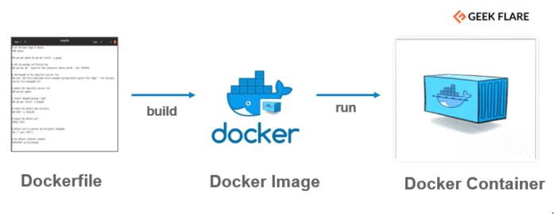

Hoy en día el uso de los contenedores está ligado a aplicaciones que
necesiten un nivel de escalado y aprovechamiento al máximo de la
infraestructura en la que se ejecutan. No hay una buena arquitectura que
no diga Microservicios, Kubernetes, CQRS sino se quiere decir que está a
la última. Tenemos ligado el uso de un contenedor a la plataforma donde
se ejecuta nuestro desarrollo. Sin embargo, el uso de los contenedores
no es solamente importante por ser la plataforma donde se ejecutan
tienen muchos más usos que pueden ser más importantes en el proceso de
desarrollo de una aplicación y que facilita la vida a un desarrollador.
En este artículo abordaremos esta funcionalidad de los contenedores,
porque debemos utilizarlos en nuestro día a día como desarrolladores de
Office 365 y que problemática nos soluciona (también alguna complejidad
nos da, pero como todo en esta vida está en el equilibrio).

**Introducción**

Antes de empezar con el articulo conviene que dejemos claro cuáles son
los conceptos que vamos a abordar en el artículo, de esta forma el
lector tendrá mucha más claridad a la hora de seguir el contenido de
este.

Lo primero que nos preguntamos que es un contenedor dentro del argot
tecnológico. Podemos buscar varias definiciones en internet, en casi
todas ellas una definición de un contenedor es una forma de
virtualización del sistema operativo. Se podría decir que es una forma
optimizada de crear, probar, poner en marcha aplicaciones en varios
entornos, sin importar el contexto de donde se ejecute (esta última
afirmación siempre con un asterisco). Un contenedor solamente tiene lo
necesario que tiene para poder ejecutar la aplicación, de la misma forma
que un contenedor de un barco solamente tiene el contenido que se le
ejecuta en ella ni más ni menos. Las partes del sistema operativo
necesarias para el arranque no están dentro del contenedor sino en el
sitio que se vaya a ejecutar dicho contenedor.

Por lo tanto, podríamos decir que un contenedor es el sitio donde se
ejecuta un proceso de software. Pero cual es el formato que debe de
tener un contenedor para poder lanzarse. Este formato es el que se
indica en un fichero que se llama DockerFile. En base a este fichero se
crean imágenes que luego son las que se ejecutan dentro del contenedor.
Para que nos hagamos un poco una idea de cuál es el proceso, sería algo
similar a la siguiente imagen:



**¿Que debe de contener fichero DockerFile?**

Debe de contener el conjunto de comandos o instrucciones para realizar
la imagen que queremos construir. Que comandos podemos ejecutar dentro
del contenedor:

  | Instrucción   | Descripción                      | Comentario
  | ------------- | -------------------------------- | ---------------------------
  | FROM          | Establecer imagen base           | Debe presentarse como
                                                 | | | primera instrucción; solo
                                                 | | | una entrada por etapa
| | | 
  | ENV           | Variable de entorno para el      | ---
                | | proceso de construcción y        
                | | establecer vida del contenedor   
| | | 
  | ARG           | Declarar parámetros de la línea  | Debe aparecer antes que la
                | | de comandos para el proceso de   | instrucción FROM
                | | construcción                     
| | | 
  | WORKDIR       | Cambiar de directorio actual     | ---
| | | 
  | USER          | Cambiar usuario y pertenencia al | ---
                | | grupo                            
| | | 
  | COPY          | Copiar los archivos y            | Crea una nueva capa
                | | directorios de una Image         
| | | 
  | ADD           | Copiar los archivos y            | Crea una nueva capa; uso no
                | | directorios de una Image         | recomendable
| | | 
  | RUN           | Ejecutar el comando de Image     | Crea una nueva capa
                | | durante el proceso de            
                | | construcción                     
| | | 
  | CMD           Establecer argumentos estándar   Solo una entrada por build
                para el inicio del contenedor    stage

  | ENTRYPOINT    | Establecer comando estándar para | Solo una entrada por etapa
                | | el inicio del contenedor         | de construcción
| | | 
  | EXPOSE        | Definir asignación de puerto     | Los puertos deben estar
                | | para contenedores en ejecución   | activos al iniciar el
                                                 | | | contenedor
| | | 
  | VOLUME        | Integrar como volumen directorio | ---
                | | de Image al iniciar el           
                | | contenedor en el sistema         
                | | anfitrión                        
  
Un ejemplo de un fichero DockerFile para ejecutar una aplicación .NET
podría ser el siguiente:

```
FROM mcr.microsoft.com/dotnet/aspnet: 6.0-bullseye-slim AS base
WORKDIR /app
EXPOSE 80
EXPOSE 443

FROM mcr.microsoft.com/dotnet/sdk:6.0 AS build
WORKDIR /src

COPY \*.sln .
COPY MyApp.Api/\*.csproj ./MyApp.Api/
COPY MyApp.Library/\*.csproj ./MyApp.Library/

RUN dotnet restore

COPY . .

WORKDIR /src/MyApp.Api

RUN dotnet publish -c release -o /app \--no-restore

FROM base AS final
WORKDIR /app
COPY \--from=build /app ./
ENTRYPOINT \[\"dotnet\", \"MyApp.Api.dll\"\]
```

Una vez ya tenemos la imagen generada, el siguiente paso es ponerla a
ejecutar. Para ello si lo queremos a poner a ejecutar en nuestra propia
maquina bastaría con poner a ejecutar este contener haciendo uso de la
instrucción Docker run. Si este desarrollo lo quisiéramos poner a
ejecutar en un entorno productivo, deberíamos tener más conocimientos
sobre orquestadores de contenedores como puede ser Kubernetes. Dicho
ámbito pasa por mucho del objetivo de este artículo, pero conviene
mencionarlo para tener la foto completa del proceso.

**Otras funcionalidades interesantes: Docker Compose**

Otra de las funcionalidades que son muy útiles haciendo uso de
contenedores, es levantar los distintos artefactos que tiene nuestro
desarrollo. Por ejemplo, la típica API que tiene una base de datos (bien
SQL bien MongoSQL), con su Cache de primer nivel en un Redis**.**
Podemos implementar un Docker Compose para que nos levante todos
artefactos para que podamos empezar a desarrollar. Que beneficios
podemos obtener de hacer uso de esto:

-   Ahorro de costes. Generalmente todos estos artefactos suelen ser
    servicios que están alojados en el cloud y aunque usemos las
    versiones free, tenemos algunas limitaciones que para el momento de
    desarrollo nos pueden hacer perder un tiempo valioso

-   Poder ejecutarlo sin tener conectividad a internet. Si vivimos en el
    siglo XXI y en todas las grandes ciudades hay conexiones muy
    rápidas, pero todos sabemos que no es oro todo lo que reluce. Hay
    momentos en el que no se tiene acceso internet o no a una velocidad
    decente en esas ocasiones el poder tirar de un recurso local te
    facilita mucho la vida y te permite continuar con el desarrollo de
    una forma normal.

También tiene sus aspectos negativos:

-   El ordenador donde lo ejecutas debe de tener una capacidad
    importante para poder soportar todos los servicios que necesitas
    para levantarlo. En esta ocasión ordenadores con memoria y
    almacenamiento muy justos no pueden trabajar de esta forma.

**Pero para un Office Developer y sus desarrollos en SPFx ¿porque van a utilizar Dockers para sus desarrollos?**

Hemos visto alguna de las ventajas más comunes de porque los equipos de
desarrollos hacen uso de contenedores, pero la gran mayoría de los
lectores aún no saben cuál de estos beneficios le pueden venir bien para
su desarrollo en SPFx. Antes de empezar a contar porque los contenedores
voy a pasar a enumerar alguno de los problemas más frecuentes con los
que nos encontramos los desarrolladores de SPFx.

1.  La actualización del tooling de herramientas que soporta SPFx.
    Imaginar tener en unos proyectos una versión de Node y para SPFx
    tener que utilizar otra. Tener que instalar una versión,
    desinstalarla, ver que funciona y volver al otro proyecto.

2.  Proyectos realizados con una versión antigua de SPFx al volver a
    descargarlos y compilarlos, ya no compilan, la versión de
    determinada librería ya no existe, ya no es compatible con todo lo
    que hay en el ordenador y eso hace un infierno el volver a ejecutar
    una versión no reciente de SPFx. Está claro que en el mundo ideal
    todo el mundo esta actualizado a la última versión, sin embargo, en
    el mundo real, las empresas no hacen esos cambios con esa
    frecuencia. En muchas ocasiones el proyecto no necesita evolución y
    con esa versión es suficiente hasta que deja de hacerlo.

Estos problemas al final en que se resumen: el ordenador donde está
desarrollando no tiene todo lo necesario para poder compilar la solución
que se está desarrollando. Si ahora pensamos en cual es la funcionalidad
de los contenedores y su definición ¿vemos alguna relación? La respuesta
naturalmente es que SI, un contenedor lo que hace es compilar un
proyecto nuestro y lo publica y lo deja accesible para poder acceder
desde fuera ¿no?

Dado esa aproximación porque no hacemos uso de Docker como "compilador"
de nuestros desarrollos, que beneficios podemos obtener con esta
funcionalidad:

No deberíamos instalar nada en nuestra máquina, es decir tendríamos
nuestro entorno de desarrollo, siempre listo. No dependemos de ninguna
instalación, solamente debemos de tener/construir una imagen para que
compile nuestro desarrollo y tener una ubicación para poder acceder a
estos binarios. Ahora bien, al hacer uso de los contenedores ¿podemos
dejar elementos fuera de nuestro contenedor? Por definición del propio
contenedor, lo que indicamos es que el contenedor es una caja negra
donde ponemos todo lo necesario para poder ejecutar nuestra aplicación,
en ningún momento indicamos que podemos acceder al contenido de este.

¿Pero esta afirmación es verdad? Si nos ponemos puristas la respuesta es
que Sí, pero en la práctica naturalmente podemos acceder. En un Docker
podemos montar un volumen, es un sistema de ficheros que se utiliza para
preservar los datos que se generan en la ejecución de un contenedor.
Este volumen no está almacenado en el contenedor, sino en el host, no
depende del ciclo de vida del contenedor. Con esto acción cuando un
contenedor se vuelve a levantar o bien escala el número de contenedores
que tiene ese despliegue, tiene la misma información que la anterior,
pongamos como ejemplo una base de datos, una API o cualquier otro
desarrollo que os venga a la mente.

**Manos a la obra**

Ahora bien, vamos a crear una imagen Docker para que compile nuestro
desarrollo. Vamos a ponernos en el caso base, vamos a crear una imagen
que dado el contenido que tenemos haga la compilación

```
FROM node:8.12.0
WORKDIR /src

COPY . .

RUN npm install
RUN npm run build
```

Si con este DockerFile creamos una imagen, y luego ejecutamos el
contenedor con las siguientes instrucciones:

```
Docker build -t dockercompartimos .

Docker run dockercompartimos
```

Ahora bien, nuestra solución la podríamos compilar dentro del
contenedor, pero ¿cómo podríamos hacer que le pasemos el código fuente y
nosotros mismos compilar? Como he comentado anteriormente haciendo uso
de volúmenes. Para ello en la imagen anterior quitaremos el paso de
poner el copy. Quedando el dockerfile de la siguiente forma:

```
FROM node:8.12.0
WORKDIR /src

RUN npm install
RUN npm run build
```

Una vez con la nueva imagen volvemos a construir la imagen

```
Docker build -t dockercompartimos .
```

Cuando ejecutemos el contenedor tendremos que indicarle el volumen que
vamos a usar para ello

```
docker run -v /C/src:/src dockercompartimos
```

Ahora si lo ejecutamos cuando compilamos en nuestro volumen tenemos todo
el contenido que se ha producido,

**¿Qué más puedo hacer?**

Además de compilar también podemos levantar el workbench en un
contenedor para poder así probarlo y empezar a depurarlo. Para poder
hacerlo desde PnP hay una imagen oficial que se puede utilizar para este
efecto. Para ello basta con seguir las instrucciones que hay en la
propia página
[https://hub.docker.com/r/m365pnp/SPFx](https://hub.docker.com/r/m365pnp/spfx)

**Bonus track**

¿Se os ocurre algún uso más de los contenedores? El mismo problema que
tenemos en nuestros ordenadores, estos problemas los tenemos en los
agentes de compilación. Que se suban de versión de node y no compile
nuestra solución. Pues podemos preparar una build que compile nuestro
desarrollo usando este Dockerfile. De esta forma con que la Build tenga
soporte para Docker, no tenemos que estar pendiente de ninguna nueva
versión y además lo podemos hacer compatible con todas las tecnologías.

**Conclusión**

Venimos mucho tiempo diciendo que los contenedores han venido para
quedarse, cada vez son más los beneficios que tenemos. Para mucha de las
personas que hemos sufrido el trabajar con proyectos en SPFx con varios
proyectos en diversas versiones cada uno desde el mismo ordenador.
Siempre era un infierno el cambiar cada uno de los proyectos en tu
ordenador, la gran cantidad de tiempo perdido no está escrito.

Además, el familiarizarse con el tooling de Docker hace mucho más
sencillo el ir avanzando en su uso, para poder ir recreando entorno de
una forma sencilla y posteriormente dar un paso a un orquestador de
contenedores para poder ponerlo en aplicaciones. Eso si no queramos
meter cualquier desarrollo dentro de un Kubernetes porque igual estamos
matando moscas a cañonazos. Recordar los principios KISS
<https://es.wikipedia.org/wiki/Principio_KISS#:~:text=El%20principio%20KISS%20establece%20que,complejidad%20accidental%20debe%20ser%20evitada>.

Happy Coding

**Adrián Diaz Cervera** <br /> 
Technical Lead at SCRM Lidl Hub International <br />
MVP Office Development <br />
http://theavenger.dev <br />
@AdrianDiaz81 <br />
