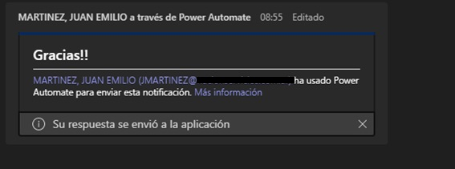

En el siguiente artículo veremos cómo utilizar Power Automate a fin de
enviar una tarjeta adaptable (Adaptive Card) a Teams y esperar su
repuesta para, luego, con el valor seleccionado por el usuario
actualizar una lista de SharePoint.

**¿Qué es una Adaptive Card?**

Según Microsoft, tarjeta adaptable (Apdative Card) es el formato de
intercambio de tarjeta abierta que permite a los desarrolladores
intercambiar el contenido de la interfaz de usuario de una manera
habitual y coherente.

**¿Cómo crear una Adaptive Card?**

Nos dirigimos a la url https://adaptivecards.io/ y luego pulsamos en
la pestaña "Designer", ahí mismo encontraremos ejemplos, documentación
controles y sus propiedades.

Una vez que estamos en "Designer", diseñamos la tarjeta según nuestras
preferencias y gustos, en mi caso, es una tarjeta sencilla, que contará
con un título , una pequeña descripción, un control de opciones y dos
botones con las opciones "SI" y "NO".


El control de opciones "Imput.Choice" nos permitirá, entonces, ofrecerle
al usuario opciones. Este puede presentarse mediante un combo u en
opciones de selección. A continuación se puede observar el json
utilizado para el imput.choice

```
  {
            "type": "Input.ChoiceSet",
            "id": "MiAprobacion",
            "isRequired": true,
            "errorMessage": "Debe seleccionar una opción",
            "placeholder": "Seleccione la opción deseada",
            "choices": [
                {
                    "title": "Si",
                    "value": "SI"
                },
                {
                    "title": "No",
                    "value": "No"
                }
            ],
            "style": "expanded"
        }
```

  | type                                | Tipo de control
  | ----------------------------------- | -----------------------------------
  | id                                  | Id del control y variable que después utilizamos en Teams para actualizar un determinado campo
  |isRequired                           | Si el campo es obligatorio
  |errorMessage                         | Mensaje para mostrar en caso de que el control tenga isRequired en true
  | placeholder                         | Opción para mostrar en el placerholder (Marca de agua, en el caso de ejemplo no es necesario)
  | choices                             | Opciones para mostrar y su valor interno
  | Style                               | Forma del control, Expanded/Compact

Código json completo de la tarjeta:

```
{
    "$schema": "http://adaptivecards.io/schemas/adaptive-card.json",
    "type": "AdaptiveCard",
    "version": "1.3",
    "body": [
        {
            "type": "TextBlock",
            "text": "Revista CompartiMoss",
            "id": "Title",
            "spacing": "Medium",
            "horizontalAlignment": "Center",
            "size": "ExtraLarge",
            "weight": "Bolder",
            "color": "Accent"
        },
        {
            "type": "TextBlock",
            "text": "Hola lectores,   ¿les gusta el articulo?",
            "id": "acHeaderTagLine",
            "separator": true
        },
        {
            "type": "Input.ChoiceSet",
            "id": "MiAprobacion",
            "isRequired": true,
            "errorMessage": "Debe seleccionar una opción",
            "placeholder": "Seleccione la opción deseada",
            "choices": [
                {
                    "title": "Si",
                    "value": "SI"
                },
                {
                    "title": "No",
                    "value": "No"
                }
            ],
            "style": "expanded"
        }
    ],
    "actions": [
        {
            "type": "Action.OpenUrl",
            "title": "Ver Articulo",
            "url": "https://www.compartimoss.com/"
        },
        {
            "type": "Action.Submit",
            "title": "Enviar  Respuesta"
        }
    ]
}
```

Como observamos en los dos botones finales, uno posee el "type" OpenUrl,
el cual abrirá una nueva ventana de nuestro navegador con la página
ingresada en "url", mientras que el segundo, posee "Summit", esto nos
permite obtener la respuesta seleccionada por el usuario en el
imput.Choice en la variable "MiAprobacion". Una vez realizada esta
acción, accedemos a Power Automate y creamos un Flow que se ejecute cada
vez que se crea un elemento, luego añadimos el componente de Teams para
enviar una tarjeta adaptable y esperar la respuesta, y luego el
componente para actualizar el item de SharePoint


En el componente de Teams, configuramos las siguientes opciones:

  | Post as                             | Flow Bot
  |----------------------------------- |-----------------------------------
  | Post in                             | Chat With Flow Bot
  |Message                             | Nuestra tarjeta en JSon
  | Update message (Dicho mensaje actualiza la tarjeta una vez que el usuario realizó la acción)        | Gracias!
  | Recipient                           | Destinatario de la tarjeta
  
Luego, actualizamos el Update Item, con la variable "MiAprobacion", que,
como mencioné, es el resultado seleccionado por el usuario.


Al finalizar completamos el campo Respuesta y guardamos el Flow.

Resultado final:

1.  Creamos el elemento


2.  La Adaptive Card llega a nuestro Teams:


3.  Respondemos y enviamos la respuesta, inmediatamente se actualiza la
    Adaptive Card




4.  Vemos en nuestro sitio SharePoint que el elemento efectivamente se
    actualizó.


Links útiles para este artículo:

-   [Crear su primera tarjeta adaptable](https://docs.microsoft.com/es-es/power-automate/create-adaptive-cards)

-   [Adaptive Card Designer](https://adaptivecards.io/)

**Juan Emilio Martínez** <br />
Ing. En Sistemas de Información | Líder SharePoint y Power Plataform en Nación Servicios S.A. | Consultor Independiente <br />
[Linkedin](https://www.linkedin.com/in/juan-emilio-mart%C3%ADnez-3b76824b) 
 
import LayoutNumber from '../../../components/layout-article'
export default LayoutNumber
