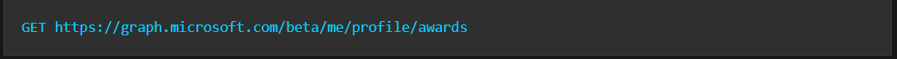
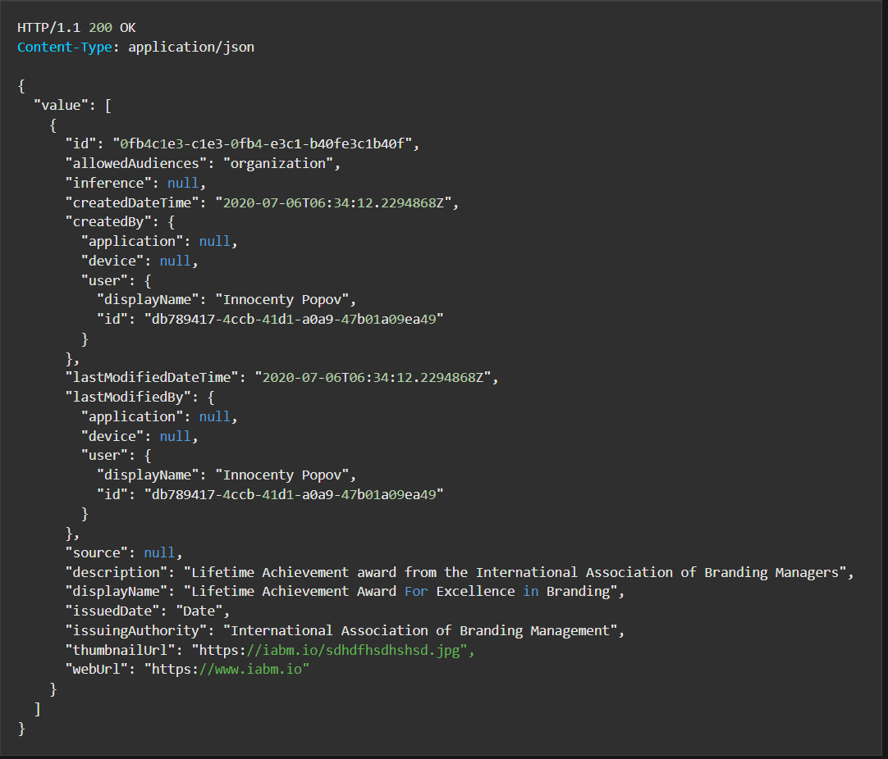
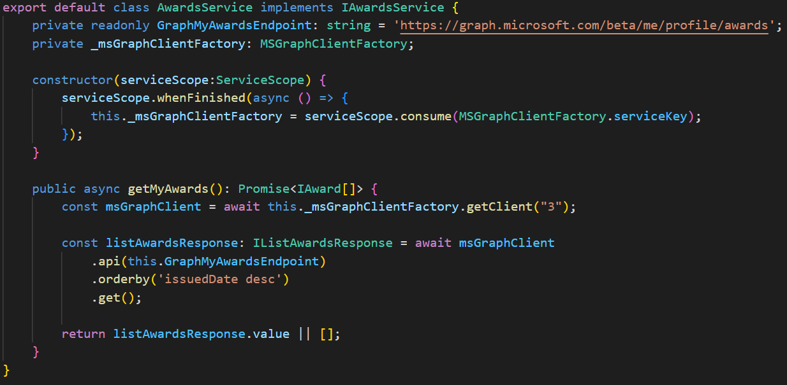
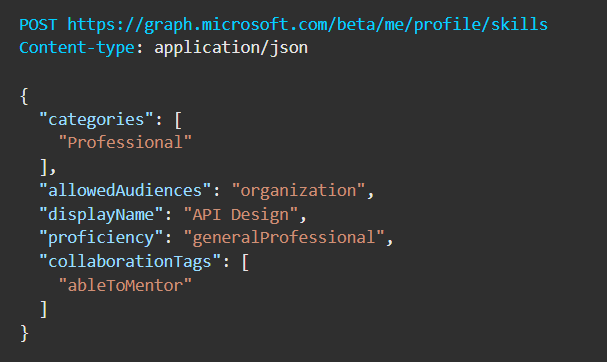
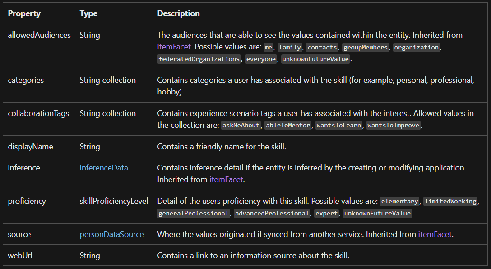
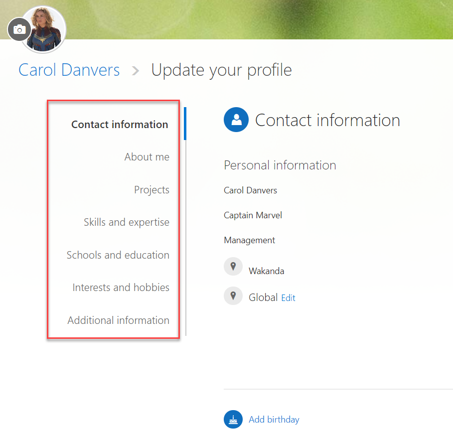

Desde hace un tiempo, Microsoft ha mejorado bastante la información de
"Profile" que podemos usar desde MS Graph API. De momento este endpoint
de Profile sólo está disponible dentro de la versión Beta de MS Graph.
En este artículo vamos a ver de qué se compone este nuevo endpoint, y
también como podemos utilizarlo, tanto desde un SPFx webpart, como
dentro de una aplicación de consola.

¡Vamos a ello!

**Profile endpoints**

La siguiente table muestra todos los endpoints disponibles, así como una
breve descripción de su funcionalidad (la mayoría son autodescriptivos
con sólo ver el nombre del endpoint)


  | Endpoint                         | Descripción             |Operaciones
  | -------------------------------- | ----------------------- | -----------------------
  | /profile                         | Obtiene el profile      | GET, DELETE
  |                                  | completo de un usuario  | 
  | |  |  
  | /profile/account                 | Información             | GET (read-only data)
|                                    | específicamente         
|                                    | enlazada a una cuenta   
|                                    | de usuario              
| | | 
  | /profile/addresses               | Representa una          | GET, CREATE, UPDATE,
  |                                  | dirección física y      | DELETE
   |                                 | detalles de su          
  |                                  | localización.           
| | | 
  | /profile/anniversaries           | Información de fechas   | GET, CREATE, UPDATE,
  |                                  | relevantes para el      | DELETE
  |                                  | usuario                 
| | | 
  | /profile/awards                  | Premios asociados al    | GET, CREATE, UPDATE,
|                                    | usuario                 | DELETE
| | | 
  | /profile/certifications          | Certificaciones o       | GET, CREATE, UPDATE,
  |                                  | nombramientos asociados | DELETE
  |                                  | al usuario              | 
| | | 
  | /profile/educationalActivities   | Representa información  | GET, CREATE, UPDATE,
|                                    | que el usuario ha       | DELETE
 |                                   | proporcionado relativa  
|                                    | a actividades           
|                                    | educacionales           
|                                    | (graduado, postgrado,   
|                                    | etc)                     
| | | 
  | /profile/emails                  | Información sobre       | GET, CREATE, UPDATE,
|                                    | direcciones de Email    | DELETE
|                                    | asociadas al usuario    
| | | 
  | /profile/interests               | Información sobre       | GET, CREATE, UPDATE,
|                                    | intereses asociados al  | DELETE
|                                    | usuario                  
| | | 
  | /profile/languages               | Idiomas asociados al    | GET, CREATE, UPDATE,
|                                    | usuario                 | DELETE
| | | 
  | /profile/names                   | Asociar otros nombres   | GET, CREATE, UPDATE,
|                                    | al usuario              | DELETE
| | | 
  | /profile/notes                   | Notas asociadas al      | GET, CREATE, UPDATE,
|                                    | usuario                 | DELETE
| | | 
  | /profile/patents                 | Representa una patente  | GET, CREATE, UPDATE,
|                                    | concedida, que ha sido  | DELETE
|                                    | añadida al perfil del   
|                                    | usuario                 
| | | 
  | /profile/phones                  | Permite asociar         | GET, CREATE, UPDATE,
 |                                   | diferentes números de   | DELETE
 |                                   | teléfono al perfil del  
|                                    | usuario                 
| | | 
  | /profile/positions               | Representa información  | GET, CREATE, UPDATE,
|                                    | detallada de puestos de | DELETE
|                                    | trabajo asociados al    
|                                    | perfil del usuario      
| | | 
  | /profile/projects                | Información de          | GET, CREATE, UPDATE,
|                                    | Proyectos en los que ha | DELETE
|                                    | participado el usuario. 
| | | 
  | /profile/publications            | Representa una          | GET, CREATE, UPDATE,
|                                    | publicación o artículo  | DELETE
|                                   | asociado al perfil del  
|                                    | usuario                 
| | | 
  | /me/responsibilities             | Proporciona información | GET, CREATE, UPDATE,
|                                    | detallada sobre         | DELETE
|                                    | responsabilidades que   
|                                    | el usuario ha asociado  
|                                    | consigo en varios       
|                                    | servicios               
| | | 
  | /profile/skills                  | Información relativa a  | GET, CREATE, UPDATE,
|                                    | habilidades o           | DELETE
|                                   | conocimientos del       
|                                    | usuario                 
| | | 
  | /profile/webAccounts             | Representa cuentas web  | GET, CREATE, UPDATE,
|                                    | que el usuario ha       | DELETE
|                                    | indicado que posee o    
|                                    | usa                     
| | | 
  | /profile/websites                | Sitios web asociados al | GET, CREATE, UPDATE,
|                                    | usuario                 | DELETE

> **Nota**: Respecto a las Operaciones permitidas descritas en la tabla
> anterior, están basadas en la documentación oficial de Microsoft. Sin
> embargo, por mi experiencia, al menos usando Graph Explorer, hay
> operaciones que no me han funcionado. Por ejemplo, asociar un nuevo
> "name" a un usuario, o modificar el *Nickname* de un "name" ya existente
> no me ha funcionado. Del mismo modo, crear un nuevo item dentro de
> "responsibilities", tampoco.
> Por lo que he podido probar, parece que cierta información del Profile,
> viene sincronizada desde otros sistemas, como Azure Active Directory, y
> no puede actualizarse si no es desde esa aplicación externa, por
> ejemplo, el portal de Azure AD.

Y ahora que ya hemos visto la gran cantidad de información de perfil que
podemos asignar a un usuario... ¿no es suena de algo toda esa
información?... si la respuesta es sí, enviarme solicitud de conexión
en LinkedIn... si habéis respondido que no os suena de nada, os
recomiendo que os creéis un perfil de LinkedIn (y luego me enviáis
solicitud de conexión).

**Algunos Endpoints en acción**

Vamos a jugar con algunos de los endpoints para obtener o añadir
información, y lo haremos tanto estudiando el formato de Request, como
viendo algo de código, tanto dentro de un WebPart SPFx, como en una
aplicación de consola con c#.

**Awards**

Para obtener un listado de Awards, debemos hacer una petición HTTP GET a
la siguiente URL:



Y la respuesta tiene esta pinta:



Para obtener el listado de Awards desde SPFx, podemos hacerlo con el
siguiente snippet:



> **Nota**: La clase *AwardsService* definida arriba, hace uso del objeto
> *ServiceScope* proporcionado por el propio framework SPFx. De esta
> manera podemos sacar el objeto de tipo *MSGraphClientFactory* ya
> inyectado también por SPFx.

**Skills**

Vamos ahora a ver cómo podemos listar los Skills asociados a nuestro
Profile, así como la creación de un nuevo Skill. En este caso, vamos a
hacerlo desde un proyecto de Consola, con .NET 6 y C#. Antes de saltar
al código, veamos la pinta de una Request para la creación de un Skill,
y así conocer todas las posibles propiedades que podemos asociar a un
Skill, y que por tanto recuperaremos en el listado de Skills.





## ¡Pasamos al código!

Por suerte, aunque estos endpoints forman parte de la versión Beta, ya
están disponibles en el SDK de Graph Beta. Además, para la Authorization
con MS Graph API, haremos uso del SDK de Azure Identity (si quieres
saber más sobre cómo conectar a MS Graph con el SDK de Azure Identity,
podéis revisar el siguiente artículo que también publiqué en
CompartiMOSS hace un par de números: [Introducción a Azure Identity SDK
y uso con MS Graph API |
CompartiMOSS](https://www.compartimoss.com/revistas/numero-49/introduccion-a-azure-identity-sdk-y-uso-con-ms-graph-api/)).

Aquí asumimos que ya tenemos registrada una aplicación en Azure AD con
los permisos necesarios para poder utilizar el endpoint de Skills.

Primero, los paquetes Nuget instalados:

```
<ItemGroup>
  <PackageReference Include="Azure.Identity" Version="1.6.0" />
  <PackageReference Include="Microsoft.Graph.Beta" Version="5.4.0-preview" />
</ItemGroup>
```

Ahora, para obtener un cliente de Graph, haremos:

```
string[] scopes = { "User.ReadWrite.All" };
var options = new InteractiveBrowserCredentialOptions
{
  ClientId = "",
  TenantId = "",
  RedirectUri = new Uri("http://localhost")
};

var credentials = new InteractiveBrowserCredential(options);
var graphServiceClient = new GraphServiceClient(credentials, scopes);
```

El código anterior nos levantará un browser para logarnos en la Tenant y
obtener un Token de Authorization con permisos Delegados (contexto del
usuario logado).

Ahora, ya podemos usar el GraphServiceClient para listar nuestros
Skills:

```
var skillsResponse = await
graphServiceClient.Me.Profile.Skills.GetAsync();

var mySkills = skillsResponse.Value;

foreach (var skill in mySkills)
{
  Console.WriteLine(skill.DisplayName);
}
```

Ahora, para crear un nuevo Skill, el SDK nos lo pone realmente fácil:

```
var skillCreated = await graphServiceClient.Me.Profile.Skills.PostAsync(
  new Microsoft.Graph.Beta.Models.SkillProficiency { DisplayName = "Typescript"});

Console.WriteLine($"New skill {skillCreated.DisplayName} created with Id: {skillCreated.Id}");

```

**Pero... y ¿qué pinta Delve en todo esto?**

Los más veteranos de SharePoint, recordarán que antiguamente SharePoint
tenía una página de Perfil de usuario, el *MySites*, y que tanto con
*SharePoint OnPremises* (OnPre... what?), a través de los antiguos
WebParts en .NET, como luego en *SP Online*, con algo de hacking y
*JavaScript*, dicha página se podía personalizar, mostrando información
de otros sistemas.

Sin embargo, hace unos cuántos años (diría que sobre 2014), Microsoft le
dio pasaporte al *MySites*, y algo llamado Delve, llegó a nuestras
vidas. Si miramos hoy las secciones de **Delve**, donde el usuario puede
editar su perfil, vemos lo siguiente:



*Projects, Skills, Education*... se parece bastante a los endpoints que
hemos comentado dentro de Graph Profile, ¿verdad?... pues si os estáis
preguntando si la información almacenada desde Delve, está disponible
desde el Profile endpoint de Graph... lo siento mucho pero la respuesta
es NO. No parece que tan siquiera haya una integración de datos en
background.

¿Qué significa esto?... pues no os lo sé decir, pero tengo la sensación
de que Delve no es tampoco la solución al perfil de usuario, y que, o
bien será sustituida por otra cosa, o bien se modificará internamente
para que la información salga de MS Graph... el tiempo dirá.

¡Hasta el próximo artículo!

**Luis Mañez** <br />
Cloud Architect en ClearPeople LTD <br />
@luismanez <br />
https://github.com/luismanez