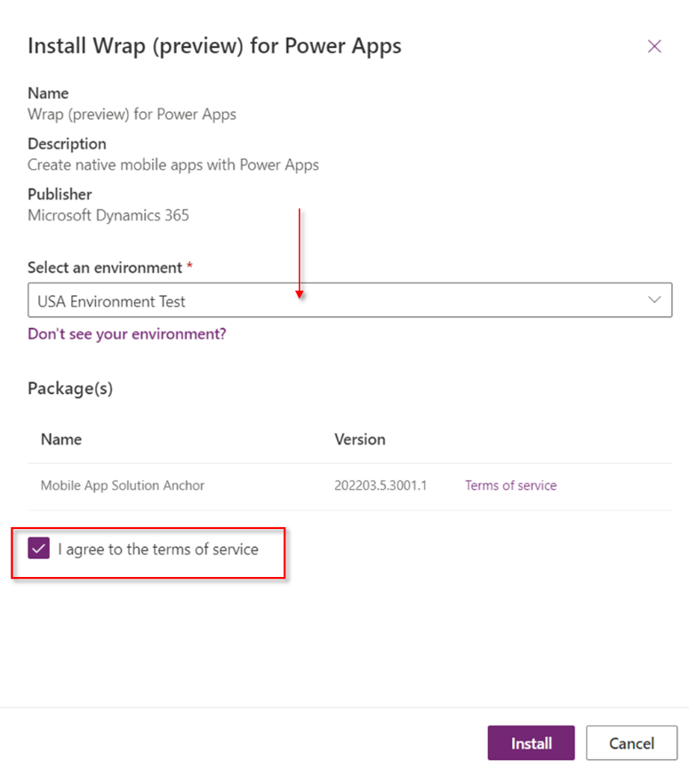

En este artículo voy a mostrar cómo podéis probar desde cero la nueva
característica que permite empaquetar las aplicaciones Canvas de Power
Apps y desplegarlas de forma conjunta en los dispositivos Android e iOS
agregándoles, además, el branding de nuestra organización.

La documentación oficial la tenéis en Microsoft Docs (aunque ya os aviso
que es un poco difícil de seguir):
https://docs.microsoft.com/en-us/power-apps/maker/common/wrap/overview

La característica está aún en Preview, por lo que puede sufrir alguna
modificación en el futuro. Como sabéis, al estar en Preview, no ha de
ser utilizada para uso en Producción.

Aquí os dejo el enlace a la comunicación oficial de abril de 2022:

https://powerapps.microsoft.com/en-us/blog/announcing-public-preview-of-wrap-for-power-apps/

> Este artículo muestra los pasos a ejecutar para desplegarlo en dispositivos Android.

> Todos los pasos que se muestran a continuación están
> realizados con un usuario con permisos de Administrador Global del
> tenant.

**PASOS PREVIOS**

Lo primero que podréis ver en el comunicado oficial es que, esta
característica sólo está disponible actualmente en los entornos de Norte
América. Por esa razón, si no estáis en esa región, tendréis que crear
un entorno que tenga esta localización.

**PASO A: Creación del entorno**

Para crear el nuevo entorno, basta con ir al Centro de Administración de
Power Apps y, en la sección de Entornos, crear uno nuevo con la Región
"*United States*" y marcar que el entorno ha de contar con base de datos
asociada. Como es una prueba, yo lo he marcado como Trial, por lo que se
eliminará a los 30 días.


Al cabo de un breve espacio de tiempo, nos aparecerá el entorno como *Ready*.


**Paso B -- Instalación de la característica**

La nueva característica Wrap no viene instalada por defecto, sino que
hay que instalarla en nuestro entorno. Para ello, desde el mismo Centro
de Administración de Power Apps, accedemos a la sección "Resources Dynamics 365 apps":


Una vez en esa sección, en el desplegable de ubicaciones situado en la
parte superior derecha, seleccionamos "*United States*", buscamos la
nueva característica "*Wrap (preview) for Power Apps"* en el panel
central y seleccionamos **Install**.


Se abrirá un nuevo panel en el que deberemos seleccionar el nuevo
entorno que creamos en el paso anterior, aceptar los términos de uso y
pulsar el botón **Install** para instalarla:




Al poco tiempo, veremos que la nueva característica está instalada correctamente:


**PASO 1 -- Crear nueva Solución con las aplicaciones**

Para aplicar la característica, será necesario que las aplicaciones
Canvas que queramos desplegar formen parte de una Solución dentro del
entorno que hemos creado en la región USA. Además, se ha de considerar
siempre una de las aplicaciones Canvas como la aplicación primaria ya
que será la que se abra en primer lugar cuando acceda el usuario. Desde
esa aplicación, se podrá llamar a las demás. Por tanto, lo primero que
haremos será crear una Solución en nuestro entorno, e incluir en ella
las aplicaciones Canvas que queramos desplegar en el dispositivo
Android.

En mi caso, he creado tres aplicaciones Canvas. La primera aplicación
(*myLaunchApp*) constituye el punto de entrada ya que se encargará de
llamar a las otras dos utilizando el comando *Launch* de Power Apps y el
correspondiente ID de aplicación:

Launch("/providers/Microsoft.PowerApps/apps/App ID")

Así, mi aplicación inicial (lanzadera) tendría el siguiente aspecto:


Y mi solución dentro del Entorno USA quedaría de la siguiente forma:


**PASO 2 -- Instalar los componentes para firmar los paquetes Android**

Ahora nos toca realizar la instalación de los componentes de firma de
paquetes de Android en vuestro equipo (o en una máquina virtual que
tengáis a mano):

-   Android Studio.

-   OpenSSL.

Aquí os dejo el enlace desde donde podréis instalarlos:

https://docs.microsoft.com/en-us/power-apps/maker/common/wrap/code-sign-android

La instalación de OpenSSL a mí me costó bastante trabajo porque la
página a la que enlaza es la del propio proyecto OpenSSL y no tiene el
típico fichero de instalación.

Por si os interesa, aquí os dejo un enlace con las instrucciones para
instalarlo descargando el instalador desde otra ubicación, aunque no me
hago responsable del software que contenga esa página.

https://thesecmaster.com/procedure-to-install-openssl-on-the-windows-platform/

Una vez instalado el OpenSSL, debéis modificar las variables de entorno
de ese equipo y referenciar las siguientes variables donde lo hayáis
instalado:

1.  OPENSSL_CONF C:Program FilesOpenSSL-Win64binopenssl.cfg

2.  Path C:Program FilesOpenSSL-Win64bin


**PASO 3 -- Generate Keys & Signature Hash**

Ahora vamos a generar las claves para nuestro paquete Android. Para
ello, hay que utilizar el comando *keytool* que estará instalado en la
siguiente ruta:

```
Drive:\Program Files\Android\Android Studio\jrebinkeytool.exe
```

Por tanto, debéis abrir una ventana de comandos y acceder hasta esa
ubicación (carpeta *bin*) para poder ejecutar los comandos siguientes:


A)  En primer lugar, generaremos las claves. Para ello se ha de utilizar
    la siguiente instrucción en la ventana de comandos:

```
keytool -genkey -alias SIGNATURE_ALIAS -keyalg RSA -keystore PATH_TO_KEYSTORE -keysize 2048 -validity 100
```

En mi caso, la instrucción que utilicé fue la siguiente:

```
keytool -genkey -alias **powerappswrap** -keyalg RSA -keystore **C:\TESTS\powerappswrap.jks** -keysize 2048 -validity 10000
```

Tras responder a las cuestiones que nos plantea (incluyendo una
contraseña que deberéis anotar en algún sitio ya que os la pedirá en un
paso posterior) se generará el fichero **jks** de almacén de claves en
la ubicación que hayamos seleccionado.


B)  Para exportar el certificado y generar el hash, deberemos utilizar
    la siguiente instrucción en la ventana de comandos:

```
keytool -exportcert -alias SIGNATURE_ALIAS -keystore PATH_TO_KEYSTORE | openssl sha1 -binary | openssl base64
```

En mi caso, la instrucción aplicada fue la siguiente:

```
keytool -exportcert -alias **powerappswrap** -keystore C:\TESTS\powerappswrap.jks | openssl sha1 -binary | openssl base64
```

Al ejecutarla, obtendremos el hash que debemos dejar anotado porque lo
necesitaremos posteriormente.


Ahora que tenemos los datos necesarios, podemos pasar a registrar la
aplicación en Azure AD.

**PASO 4 -- Registrar la aplicación en Azure AD**

Para registrar la aplicación en Azure AD se han de seguir los siguientes
pasos:

3.  Accedemos al portal de Azure de nuestro tenant y nos situamos en la
    sección Azure Active Directory.

4.  Una vez allí, accedemos a "*App registrations*" y pulsamos en "**New
    registration**".


Establecemos un nombre para nuestro registro de la aplicación, marcamos
la opción "*Accounts in any organizational directory (Any Azure AD
directory - Multitenant)"* y dejamos la "Redirect URI" sin completar (ya
que esto lo haremos posteriormente) y pulsamos **Register**:


Ahora, vamos a generar la "*Redirect URI*". Para ello, dentro de nuestro
registro de la app, seleccionaremos la opción "*Manage* >
*Authentication*". Una vez dentro, pulsaremos en "**Add a Platform**" y
seleccionaremos **Android**.


A continuación, deberemos introducir un nombre del paquete (del estilo
*com.contoso.myapp*) y el hash que obtuvimos en el paso anterior (PASO
3-B). El nombre del paquete es el que vosotros queráis asociar a vuestra
app. Por ejemplo: ***com.esm2019.myapp***


Al pulsar **Configure**, se os generará la "*Redirect URI*" que
estábamos buscando (que empezará por *msauth*):


> Podéis ver más información sobre el registro de la
> aplicación en el documento de Microsoft:
> https://docs.microsoft.com/en-us/azure/active-directory/develop/quickstart-register-app#register-an-application

**PASO 5 -- Asignar los permisos a la aplicación**

Es el momento de dar los permisos apropiados a esta aplicación que
acabamos de registrar. Para ello, accedemos a la sección "*Manage* >
*API Permissions*" y pulsamos en "**Add a permission**".


Se abrirá un panel en el que deberéis configurar los siguientes
permisos:

A)  En la pestaña de "*Microsoft API***":**
    i.  Deberéis seleccionar la opción "**Dynamics CRM"**
    ii. Marcar "*Delegated permissions*" junto con el check de "*user_impersonation*".
    iii. Pulsamos "**Add permissions**" para agregarlo.

B)  Pulsamos de nuevo "**Add a permission**"

C)  En la pestaña de "*APIs my organization uses*":
    i.  Buscaremos la que se denomina "**PowerApps Service**".
    ii. Una vez seleccionada, marcamos "*Delegated permissions*" junto con el check de "*User".*
    iii. Pulsamos "**Add permissions**" para agregarlo.

> Se supone que hay que agregar también el permiso de
> "*Azure API Connections*", pero en ninguno de mis tenants aparece esa
> API en la zona de "*APIs my organization uses*", por lo que no lo pude
> agregar y aún así ha funcionado correctamente. Por tanto, la zona de
> "*API Permissions*" del registro de la App, debería quedaros de la
> siguiente forma:


Si accedéis ahora a la sección "*Overview"* del registro de la app,
podréis obtener otro de los datos clave que vais a necesitar, y es el
**Application (Client) ID**. Anotadlo puesto que lo necesitaremos más
adelante.


**PASO 6 -- Permitir las aplicaciones registradas en el Entorno de Power Platform.**

Para ejecutar este paso es necesario el uso de PowerShell. Tendréis que
instalaros la última versión del módulo de PowerShell para
Administradores de Power Apps:

https://docs.microsoft.com/en-us/power-platform/admin/powerapps-powershell#cmdlets

Una vez instalado, se ha de ejecutar el siguiente comando:

```
Add-AdminAllowedThirdPartyApps -ApplicationId <App ID>
```

Como os podéis imaginar, el parámetro App ID es el que os mostraba en el
paso anterior que aparecía como **Application (Client) ID**. Por lo que
la ejecución sería la siguiente:


**PASO 7 -- Crear un App Center container para la aplicación**

Llega ahora el momento de crear un centro de aplicaciones donde se va a
generar nuestro paquete APK de Android. Si queréis generar también el
paquete iOS, tendréis que crear un contenedor diferente para cada
plataforma. Para ello debéis acceder al **App Center**
(https://appcenter.ms/) y logaros con vuestra cuenta de M365.

Una vez que accedáis, vamos a crear una nueva Organización pulsando en
"**Add new organization**" y escoged el nombre que queráis (en mi caso
lo llamé '*Wrap Feature Power Apps Android*'):


Una vez creado, deberemos seleccionar la sección *Apps* correspondiente
a esa organización en el menú de la izquierda. Una vez dentro de la
sección Apps, pulsaremos en la opción "**Add app**" e introducimos los
siguientes datos:

-   Nombre de la App (el que queráis. En mi caso '*ESM App Wrap'*).
-   Release Type (yo he puesto *Beta*).
-   OS: *Android.*
-   Platform: *React Native.*

Pulsamos en "**Add new app**"


Ahora, deberéis guardaros la URL de la aplicación creada. En mi caso:

https://appcenter.ms/orgs/Wrap-Feature-Power-Apps-Android/apps/ESM-App-Wrap/


**PASO 8 -- Crear el API Token para el acceso de la App**

Ahora vamos a generar el token para que se pueda crear los paquetes de
la aplicación en nuestro App Center. Para ello debemos hacer los
siguientes pasos:

1.  Seleccionamos *Settings* en el menú de la izquierda.

2.  Bajamos hasta abajo y editamos la sección *App API tokens*.

3.  Pulsamos en "**New API token"**.

4.  Indicamos una descripción y marcamos "*Full Access*".

5.  Pulsamos en "**Add new API token**".

> **[IMPORTANTE]**: Copiaros el token en algún sitio antes de cerrar
> el cuadro de diálogo ya que no podréis consultarlo más adelante.


**PASO 9 -- Crear el Wrap Project**

Ahora ya estamos en condiciones de crear el proyecto que generará
nuestra aplicación de móvil Android. Para ello, regresaremos al
diseñador de Power Apps y accederemos la sección de Soluciones de
nuestro entorno USA para acceder a la solución en la que tenemos las
aplicaciones Canvas que queremos que formen parte de nuestro paquete
(las del PASO 1).

Una vez allí, seleccionamos la aplicación inicial (en mi caso la
denominada *myLaunchApp*) y pulsamos la opción "**Wrap (preview)**" de
la cinta de opciones (o del menú contextual de la app).


Se nos abrirá un panel en el que deberemos rellenar los siguientes
datos:

1.  **Display name**: El nombre de nuestra aplicación inicial.

2.  **Secondary apps**: Las aplicaciones secundarias que se agregarán al
    paquete.

3.  **App platform**: Android.

4.  **Bundle ID**: El nombre que dimos a la app en el registro de la
    aplicación (PASO 4). En mi caso era: *com.esm2019.myapp.*

5.  **AAD Client ID**: Es el valor del "*Application (Client) ID*" que
    notamos en el PASO 5.

6.  **AAD Client Redirect URI**: Es la "*Redirect URI*" que generamos en
    el PASO 4 y que comienza por msauth.

7.  **Display options**. En esta sección podréis configurar el branding
    de vuestro paquete de despliegue eligiendo colores e iconos de la
    siguiente forma:

    a.  Los *[iconos]* serán los que se muestren en el dispositivo
        (1). Deberéis tener un icono con los siguientes tamaños: 432px,
        324px, 216px,162px,108px.

    b.  *[Splash screen image]*: Será la imagen que aparezca
        mientras carga la app (2).

    c.  *[Welcome screen image]*: La imagen que se mostrará en la
        pantalla de bienvenida, para el login del usuario (3).

    d.  *[Background fill color]*: El color de fondo en la pantalla
        de bienvenida (4).

    e.  *[Button fill color]*: El color de fondo del botón de "Sign
        In" en la pantalla de bienvenida (5).

    f.  *[Status bar text theme]*: El tema de la barra de estado
        superior de la app (6).

    g.  La zona *[Settings]* (7) no se puede customizar.


8.  **Publishing Settings**: Aquí introduciremos los datos del App
    Center:

    a.  *[Android App Center URL]*: La URL de nuestra app en el App
        Center que anotamos en el PASO 7. En mi caso era
        https://appcenter.ms/orgs/Wrap-Feature-Power-Apps-Android/apps/ESM-App-Wrap/

    b.  *[Android App Center API Token]*: Será el token que se
        generó en el PASO 8.

Una vez introducidos todos los datos, pulsad el botón **Save** de la
parte inferior y después el botón **Build**. En ese momento, la zona
inferior denominada *Builds*, empezará la generación de vuestro paquete
(que ya os aviso que puede tardar horas).


Podéis ir consultando el progreso pulsando la opción "**Wrap
(preview)**" para que se abra de nuevo el panel lateral y ahí veréis es
estado en que se encuentra el paquete. Cuando acabe el proceso, si todo
ha funcionado correctamente, podréis ver que el Status marca
"*Succeeded*".


Esto significa que ya tenemos nuestro paquete APK correctamente generado
en el App Center. Por tanto, abriremos de nuevo la página del App Center
con nuestra cuenta de usuario y en la sección de "*Distribute* >
*Releases*" de nuestra app podremos ver cómo se ha generado una versión
de nuestra aplicación.


Para descargar el fichero apk, bastará con que pulséis sobre esa reléase
y, en el panel derecho, pulséis el botón "**Download**".


Se os descargará en local un fichero denominado "**universal.apk**".
Este fichero todavía no podéis utilizarlo en el dispositivo móvil ya que
antes hay que firmarlo para que se pueda instalar.

**PASO 10 -- Firmar el paquete APK**

Es el momento de asignar la firma al paquete que acabamos de generar.
Para ello, vamos a utilizar la herramienta apksigner. Esta herramienta
se instaló cuando hicimos la instalación del programa "Android Studio".
Por tanto, debéis acceder al equipo o máquina virtual donde instalasteis
el programa y que será además en el que se encuentre el fichero *jks*
que utilizamos para generar las keys y el hash de nuestro paquete (PASO
3). Lo único que tenéis que saber es dónde se instaló el apksigner. Para
ello, deberéis abrir el programa "Android Studio" y pulsar en el menú
"*Tools* > SDK *Manager"*.

Se abrirá un panel donde indica la ubicación del SDK de Android. En esa
ubicación es donde estará el apksigner.


Por tanto, abriremos una ventana de comandos y nos situaremos en la
ubicación del SDK de Android. Una vez allí, accedemos a la carpeta
"*build-tools"* y dentro de ella a la carpeta de la buildToolsVersion
(en mi caso la *32.0.0*). Ejecutad un dir para verificar que existe el
apksigner.jar.


Para evitar problemas a la hora de ejecutar el apksigner, lo que yo hice
es dejar nuestro paquete "**universal.apk**" sin firmar en esa misma
ubicación:


Una vez copiado el fichero en esta ruta, volvemos a la ventana de
comandos para lanzar la siguiente instrucción:

```
apksigner.bat sign --ks PATH_TO_KEYSTORE --ks-key-alias KEY_ALIAS PATH_TO_APK
```

Donde el PATH_TO_KEYSTORE es la ruta del fichero JKS que utilizamos en
el PASO 3.

Como el fichero apk lo hemos dejado en la misma ubicación que el
apksigner, la instrucción a ejecutar en mi caso sería la siguiente:

```
apksigner.bat sign --ks C:\TESTS\powerappswrap.jks** universal.apk
```

> Os solicitará la password que establecisteis en el PASO 3A.


Ahora veréis que el fichero **universal.apk** ha sido modificado con la
fecha actual y se ha generado un fichero "*universal.apk.idsig*" con esa
misma fecha:


> Si a la hora de ejecutar el comando os sale algún aviso
> de error de JAVA como el siguiente:
> ERROR: JAVA_HOME is not set and no 'java' command could be found in
> your PATH.

Entonces, tendréis que instalaros el JDK de Java. Podéis hacerlo desde aquí: https://www.oracle.com/java/technologies/downloads/

**PASO 11 -- Instalar el paquete en el Smartphone**

Ya estamos al final del proceso. Ya tenemos nuestro paquete apk listo
para ser probado en nuestro Smartphone Android. Para ello, deberemos
conectar el smartphone a nuestro equipo y copiar en alguna ubicación el
fichero **universal.apk** que acabamos de firmar. Una vez copiado,
ejecutadlo desde el Smartphone para instalarlo en vuestro dispositivo
(*puede que tengáis que activar alguna opción del teléfono que os
permita instalar aplicaciones de fuentes desconocidas*)


Ahora se os abrirá la pantalla de inicio de la aplicación con los
iconos, imágenes y colores que se definieron en el Wrap Project:


Y por fin... nuestra aplicación principal está desplegada perfectamente
en nuestro dispositivo. También podemos comprobar cómo desde ella se
accede correctamente a las otras dos aplicaciones que incluimos en
nuestro paquete:


Bueno, pues con esto concluyo este artículo con la prueba de la
característica **Wrap** de Power Apps. Como podéis ver, el proceso es un
poco tedioso. Supongo que en el futuro se podrá automatizar alguno de
los pasos para que sea más ágil.

Y, como os decía anteriormente, no olvidéis que la característica está
en Preview por lo que no debéis utilizarlo para aplicativos de
producción.

Espero que os haya gustado y os pueda ayudar si algún día queréis hacer
la prueba.

Un saludo.


**Enrique Sánchez Moreno** <br />
Cloud Services Manager en ILUNION IT Services <br />
[www.esanchezm.com](http://www.esanchezm.com)