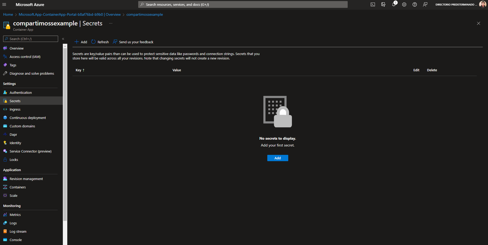

En este articulo quiero explicaros como podemos desplegar nuestras
aplicaciones contenerizadas de una forma fácil y sencilla a través del
nuevo servicio gestionado de contenedores que nos ofrece Azure "Azure
Container Apps". Este servicio es ideal si lo estamos buscando es
centrarnos en el desarrollo de nuestra aplicación y olvidarnos de la
infraestructura.

**¿Qué es Azure Container Apps?**

Azure Container Apps es un servicio centrado en el desarrollo de las
aplicaciones, esto nos permite a los desarrolladores centrarnos en la
lógica empresarial diferenciadora de sus aplicaciones en lugar de en la
gestión de la infraestructura de la nube. Azure Container Apps nos
permite poder ejecutar el código de la aplicación empaquetado en
cualquier contenedor basado en Linux sin forzar los tiempos de ejecución
o modelos de programación determinados. Esto nos permite poder escalar
para satisfacer la demanda global en respuesta a solicitudes o eventos
HTTP. Una de las características importantes de este servicio es que nos
permite ejecutar aplicaciones en background siempre activos.

**¿Por qué apostar por Azure Container Apps?**

Actualmente la demanda de aplicaciones Cloud native cada vez es mayor,
este tipo de aplicaciones se componen a menudo de microservicios
distribuidos alojados en contenedores para soluciones poco acopladas,
resilientes, gestionables y observables, tal y como define la [Cloud
Native Computing Foundation](https://www.cncf.io/) (CNCF). Azure
Container Apps ofrece un soporte perfecto para las aplicaciones nativas
de la nube con contenedores sin servidor creados especialmente para los
microservicios, permitiendo la modernización de las aplicaciones en un
entorno basado en Kubernetes.

¿Cuáles son los beneficios? Una de las principales características que
nos ofrece Azure Container Apps es que podemos compilar y ejecutar
aplicaciones de estilo Kubernetes sin necesidad de administrar,
gestionar la infraestructura del clúster. Esta opción es valida solo
para aplicaciones que no requiera acceso directo a todas las API nativas
de Kubernetes y a la administración de clústeres, ya que este servicio
es un servicio totalmente administrado.

Entre las principales ventajas encontramos:

-   Optimización para la ejecución de contenedores de uso general,
    especialmente para aplicaciones que abarcan muchos microservicios
    implementados en contenedores.

-   Escalar automáticamente las aplicaciones en función de cualquier
    desencadenador de escalado compatible con KEDA.

-   Nos permite poder crear microservicios con Dapr y acceder a su
    amplio conjunto de API.

-   Administra los secretos de forma segura directamente en una
    aplicación.

-   Habilita las arquitecturas de aplicaciones controladas por eventos
    al admitir la escala basada en el tráfico y la extracción
    de orígenes de eventos como colas, incluida la escala a cero.

-   Habilita la entrada HTTPS sin tener que administrar más
    infraestructura en Azure.

-   Dividir el tráfico entre varias versiones de una aplicación

-   Nos permite poder ejecutar varias revisiones del contenedor y
    administrar el ciclo de vida de la aplicación del contenedor de
    forma ágil.

**¿Como creamos nuestro primer container App?**

Para la creación de la instancia de Container Apps en nuestra
suscripción de Azure deberemos de entrar en el **portal de Azure -\>
Crear un Recurso -\> Container Apps**

Una vez que hemos asignado el nombre de nuestra instancia, y hemos
elegido en que región queremos alojar nuestra nueva instancia, deberemos
de configurar dentro del apartado App Setting para poder elegir la
imagen, CPU y Memoria. También nos permitirá habilitar los diferentes
ingress que necesitemos.

Para este ejemplo usaremos la imagen por defecto que nos brinda el
servicio:

Si desmarcamos la casilla podremos ver que nos aparecen las
características anteriormente mencionadas (al tener marcada la casilla
de imagen por defecto no te permite modificarla). Es importante destacar
que este servicio actualmente solo dispone de la capacidad de ejecutar
en Sistema Operativo Linux.

Como se puede apreciar en la imagen anterior, podremos elegir la fuente
de nuestra imagen eligiendo entre Azure Container Registry u Docker Hub.
Una vez aprovisionado el servicio, podremos observar que el tiempo de
despliegue es muy rápido (alrededor de 1 min), podremos ir a la url de
nuestra instancia y comprobar que el servicio esta corriendo y nuestra
aplicación está siendo servida:

Como hemos mencionado anteriormente podremos configurar los secretos,
autenticación de nuestra aplicación, ingress, CI/CD, dominios
personalizados, identidades y Dapr.

Además, podremos revisar y gestionar las revisiones de nuestras
aplicaciones, escalabilidad y seleccionar los contenedores que queremos
ejecutar en nuestra instancia.

**Conclusiones**

Azure Container Apps está construida sobre una base de potente
tecnología de código abierto. Entre bastidores, cada aplicación de
contenedor se ejecuta en Azure Kubernetes Service, con KEDA, Dapr y
Envoy baked. Esto le permite realizar tareas modernas del ciclo de vida
de las aplicaciones, como actualizaciones de aplicaciones, cambios de
tráfico y versiones, listas para ser ejecutadas por equipos con
cualquier tipo de habilidades.

Algunos de los escenarios más comunes para la implementación de este
servicio son:

En mi opinión es un servicio bastante completo que nos permite sobre
todo centrarnos en el desarrollo y la lógica del negocio, siendo lo
suficientemente potente para configurar aspectos bastante avanzados sin
la necesidad de generar y administrar un clúster de Kubernetes.

**Manuel Sánchez Rodríguez**  
Manuss20@gmail.com  
@manuss20  
https://manuss20.com 
 
import LayoutNumber from '../../../components/layout-article'
export default LayoutNumber
