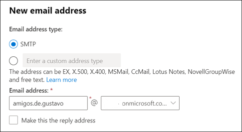
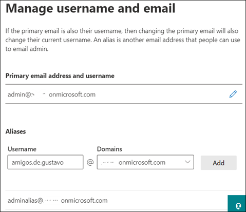
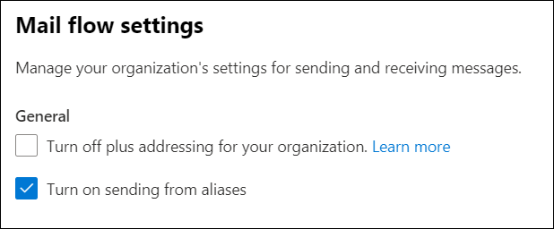
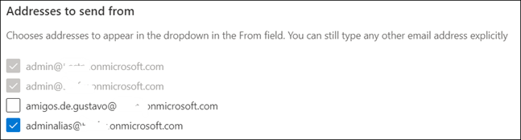
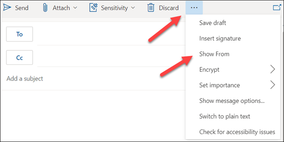
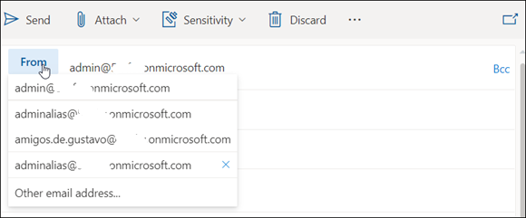
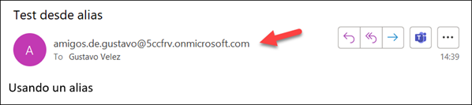

Exchange Online en Microsoft 365 siempre ha permitido la creación de
"Alias" para cuentas de Email. Un alias es un nombre adicional al
utilizado por la cuenta principal; por ejemplo, si la cuenta principal
(la que se crea inicialmente al asignar la licencia de Microsoft 365,
también llamada Cuenta Primaria) de un usuario es
"gustavo@dominio.com", un alias podría ser
"amigos.de.gustavo@dominio.com". En este caso, las dos direcciones
están vinculadas a una sola cuenta de Exchange. Hasta marzo del 2022, no
era permitido enviar Emails utilizando un alias de Exchange, solamente
se podían utilizar para recibir Emails. De esta forma, si se recibía un
Email en la cuenta de "amigos.de.gustavo@dominio.com", solo se podía
responder desde la cuenta de "gustavo@dominio.com".

Desde un update implementado en Microsoft 365 en marzo, y que ya está
comenzando a desplegarse en producción mundialmente, es posible utilizar
los alias también para enviar Emails. Tenga en cuenta que los alias,
aunque dispongan de la misma funcionalidad que las cuentas principales,
siguen estando acoplados a la cuenta principal, y comparten todas las
configuraciones inherentes a ella, tales como autenticación y
autorización. Hay que hacer notar que, por el momento, solo es posible
enviar Emails utilizando un alias desde Outlook Web, Outlook Android y
Outlook iOS, pero Microsoft ha anunciado que dentro de algún tiempo
también será posible hacerlo desde el cliente local de Outlook.

Note también que Microsoft 365 permite crear hasta 400 alias para una
sola cuenta sin que haya costos adicionales en la suscripción.

**Creación de un Alias**

Existen varias formas para crear Alias. Solamente un administrador
Global de Microsoft 365 o un administrador de Exchange Online pueden
crear un alias (usuarios no pueden crear alias para su propia cuenta).
Cuando se crea un nuevo alias, puede durar hasta 24 horas antes de que
Exchange lo haga disponible para ser utilizado.

-   **Creación usando el centro de administración de Exchange Online**

Inicie el centro de administración de Exchange (por medio del URL
https://admin.exchange.microsoft.com/ o usando el vínculo en el centro
de administración de Microsoft 365), expanda el menú de "Recipients"
(menú al lado izquierdo) y haga clic sobre "Mailboxes". Luego haga
clic sobre el "Display name" de la cuenta a la que se quiere agregar
un alias y luego en el vínculo "Manage email address types" en la
sección "Email addresses". Haga clic sobre el vínculo "+ Add email
address type", seleccione "SMTP" y defina el nombre a utilizar por el
alias.

Desde la ventana anterior también es posible modificar y eliminar
existente alias.

-   **Creación usando el centro de administración de Microsoft 365**

Inicie el centro de administración de Microsoft 365, expanda el menú de
"Users" (menú al lado izquierdo) y haga clic sobre "Active users".
Luego haga clic sobre el "Display name" de la cuenta a la que se
quiere agregar un alias y luego en el vínculo "Manage username and
email " en la sección "Aliases". Defina el nombre a utilizar por el
alias y agréguelo a la lista.

Si ya existen alias definidos, con el botón de elipse ("...") al lado
derecho de cada alias se puede eliminar o modificar su nombre.

-   **Creación usando PowerShell**

El " PowerShell V2 module" para Exchange permite crear y eliminar
alias programáticamente. Instale el módulo (si no lo tiene instalado en
el computador) utilizando el comando de PowerShell:

*Install-Module -Name ExchangeOnlineManagement*

Luego cree una sesión con Exchange por medio del cmdlet siguiente (el
cmdlet mismo pedirá las credenciales del usuario):

*Connect-ExchangeOnline*

Finalmente cree el alias por medio del comando de PowerShell:

*Set-Mailbox "gustavo" -EmailAddresses @\{add="amigos.de.gustavo@dominio.com"\}*

Note que también existen cmdlets para modificar y eliminar alias.

**Configuración para el uso de Alias (Administrador)**

Microsoft 365 tiene que ser configurado para poder enviar Emails de
cuentas alias. Hay dos formas para realizar la configuración: por medio
del centro de administración de Exchange y por medio de PowerShell.

-   **Configuración usando el centro de administración de Exchange**

Inicie el centro de administración de Exchange (por medio del URL
https://admin.exchange.microsoft.com/ o usando el vínculo en el centro
de administración de Microsoft 365), haga clic sobre "Settings" (menú
al lado izquierdo) y haga clic sobre "Mail flow". Luego seleccione la
opción "Turn on sending from aliases" en la sección "General".

-   **Configuración usando PowerShell**

El "PowerShell V2 module" para Exchange permite configurar el envío de
Emails desde alias programáticamente. Instale el módulo (si no lo tiene
instalado en el computador) utilizando el comando de PowerShell:

*Install-Module -Name ExchangeOnlineManagement*

Luego cree una sesión con Exchange por medio del cmdlet (el cmdlet mismo
pedirá las credenciales del usuario):

*Connect-ExchangeOnline*

Finalmente configure Exchange por medio del comando de PowerShell:

*Set-OrganizationConfig -SendFromAliasEnabled $True*

El comando *Get-OrganizationConfig* permite ver el valor configurado
para el parámetro *SendFromAliasEnabled*, si es necesario.

**Nota**: El cambio del valor de este parámetro (activarlo o
desactivarlo) puede tomar hasta 24 horas para ser efectivo en el tenant
de Microsoft 365.

**Configuración para el uso de Alias (Cada usuario)**

Una vez el sistema ha sido configurado por un administrador, cada
usuario debe activar su propia cuenta para poder enviar Emails desde sus
alias. Este paso tiene que ser implementado por cada usuario (no hay un
cmdlet de PowerShell disponible en el momento para hacerlo
programáticamente).

Los usuarios deben abrir Outlook Web, utilizar el vínculo de "View all
Outlook settings" disponible desde la ventana de "Settings" (el botón
con el símbolo de un engranaje en la esquina superior derecha de la
pantalla), expandir el menú de "Mail", hacer clic sobre "Compose and
replay", y en la sección de "Addresses to send from" seleccionar los
alias que se quieren utilizar. Si no hay alias configurados previamente,
esta ventana de configuración no es visible en la interfaz de usuario;
después de configurar algún alias, o configurar el sistema para utilizar
los alias, puede tomar hasta un día antes de que la ventana sea visible.

Esta página de configuración se puede abrir directamente utilizando el
URL https://outlook.office.com/mail/options/mail/messageContent.

**Uso de un Alias para enviar correos**

Finalmente, después de completadas todas las configuraciones (y esperar
uno o varios días para que se activen), es posible enviar Emails
utilizando un alias.

Abra Outlook Web y cree un nuevo Email. Si el botón de "From" no es
visible, utilice el botón de elipse ("...") en el menú horizontal del
menú y haga clic sobre "Show From":

Luego haga clic sobre el botón de "From", y una lista con los alias
disponibles será visible:

Cuando se envía en Email utilizando un alias, el recipiente recibe el
mensaje como si fuera enviado desde la cuenta del alias, no de la cuenta
principal:

**Conclusiones**

Finalmente es posible enviar Emails desde alias de cuentas de Exchange.
El sistema se puede utilizar por el momento solamente desde Outlook Web,
Android y iOS, pero estará disponible para los clientes locales de
Outlook próximamente. Aunque el sistema requiere múltiples
configuraciones y tiempos de espera, es una significante mejora para la
experiencia de los usuarios de Email y Exchange.

**Gustavo Velez**  
MVP Office Server and Services  
gustavo@gavd.net  
https://guitaca.com 
 
import LayoutNumber from '../../../components/layout-article'
export default LayoutNumber
