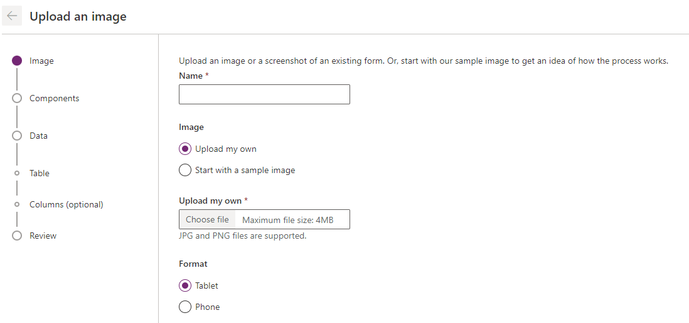

Desde hace algunos meses Power Apps nos permite crear aplicaciones de
una forma rápida y sencilla tomando como base un dibujo en papel.
Primero que nada, debemos acceder al Sitio de Power Apps:
https://make.powerapps.com Una vez allí, seleccionamos nuestro entorno
adecuado en la parte superior derecha, si estamos probando por primera
vez en una suscripción de prueba podemos utilizar el entorno por
defecto.

Luego de seleccionado nuestro entorno vamos a crear nuestra app desde
una imagen:

Una vez seleccionado el tipo de aplicación que queremos crear nos
aparecerá la siguiente pantalla:

En este punto debemos darle un nombre, cargar nuestra foto/imagen y
seleccionar si queremos que sea optimizado para Tableta o Teléfono.

Una vez cargada toda la información hacemos click en Siguiente o Next.
En a la siguiente pantalla nos aparecerán los campos detectados en
nuestro dibujo

Aquí podremos agregar aquellos que no fueron detectados o cambiar el
tipo de campo EJ: Fecha, Menú desplegable, etc.

Una vez tenemos todos nuestros campos con el tipo correcto vamos a
Siguiente o Next. En a siguiente pantalla podremos asignar los campos a
columnas y crear nuestra propia tabla en Dataverse desde allí. También
podemos ignorar este paso y continuar.

Una vez seleccionado los tipos de datos para las columnas de las tablas
correspondiendo damos en Crear:

Luego de crear la tabla o saltear ese paso nuestra aplicación quedara
finalmente creada.

Como podemos apreciar, nuestra aplicación fue creada de forma casi
automática a partir de nuestro dibujo en papel, claramente no es la
aplicación más bonita, pero a partir de este paso, podremos seguir
modificando nuestra app, dándole estilo y agregando componentes para
luego compartir con los usuarios.

**Conclusión**

Esta nueva característica nos permitirá acelerar aún mas el tiempo de
desarrollo o al menos tener un prototipo 100% funcional en unos pocos
minutos.

**Alex Rostán**  
Microsoft Business Applications MVP AI & Smarts Applications / Cloud Architect (Azure, O365, Power Platform)  
Mail: rostanker@msn.com  
Twitter: @rostanker  
LinkedIn: https://www.linkedin.com/in/alexrostan/ 
 
import LayoutNumber from '../../../components/layout-article'
export default LayoutNumber
