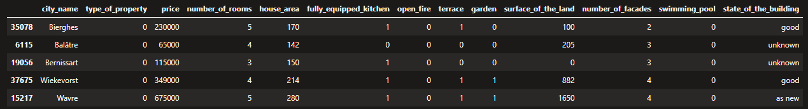
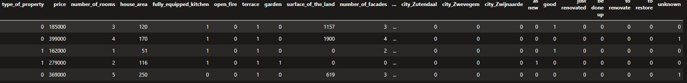
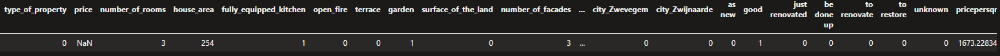

Cuando decidimos empezar a aprender sobre Machine Learning e
Inteligencia Artificial, usualmente empezamos a investigar sobre algebra
lineal, calculo diferencial, estadística y luego de pronto empezamos a
leer sobre tareas de clasificación y regresión las cuales se realizan
popularmente con el paquete de Scikit-learn, para efectos de este texto
se entenderá Scikit-learn como "una biblioteca para machine learning,
open source, la cual incluye varios algoritmos de
clasificación, regresión y análisis de grupos entre los cuales
están máquinas de vectores de soporte, bosques aleatorios, Gradient
boosting, K-means y DBSCAN. Está diseñada para interoperar con las
bibliotecas numéricas y científicas NumPy y SciPy."
(<https://es.wikipedia.org/wiki/Scikit-learn>)

Sin embargo, Scikit-learn no es la librería más rápida o con mejor
eficiencia, especialmente hablando de su implementación de Gradient
Boosting.
(<https://towardsdatascience.com/boosting-showdown-scikit-learn-vs-xgboost-vs-lightgbm-vs-catboost-in-sentiment-classification-f7c7f46fd956>)

**Qué es Gradient Boosting**

Gradient boosting, es una técnica de Machine Learning utilizada para
el [análisis de la
regresión](https://es.wikipedia.org/wiki/An%C3%A1lisis_de_la_regresi%C3%B3n) y
para problemas de [clasificación
estadística](https://es.wikipedia.org/wiki/Clasificaci%C3%B3n_estad%C3%ADstica),
el cual produce un modelo predictivo en forma de un conjunto de modelos
de predicción débiles.

Un modelo Gradient Boosting está formado por un conjunto de árboles de
decisión individuales, entrenados de forma secuencial, de forma que cada
nuevo árbol trata de mejorar los errores de los árboles anteriores. La
predicción de una nueva observación se obtiene agregando las
predicciones de todos los árboles individuales que forman el modelo,
pero muchos métodos predictivos actuales generan modelos globales en los
que una única ecuación se aplica a todo el espacio muestral y muchas
veces los resultados no son idóneos, para eso Gradient Boosting es una
técnica que implica múltiples predictores en base a los árboles de
decisión. Los árboles de decisión engloban a un conjunto de técnicas
supervisadas no paramétricas que consiguen segmentar el espacio de los
predictores en regiones simples, dentro de las cuales es más sencillo
manejar las interacciones. Es esta la característica la que les
proporciona gran parte de su potencial.

LightGBM es un framework de Gradient Boosting que utiliza el algoritmo
de aprendizaje basado en árboles con la eficiencia como objetivo
principal, con este método los árboles se construyen de manera
secuencial y cada uno que se agrega aporta su granito de arena para
refinar la predicción anterior. Es decir, se comienza con un valor
constante y cada árbol nuevo se entrena para predecir el error en la
suma de todas las predicciones de los árboles anteriores.
(https://github.com/microsoft/LightGBM)

Una vez terminado el proceso, las predicciones se calculan sumando los
resultados de todos los árboles que se construyeron. El efecto que tiene
esto es que cada vez que se agrega un árbol nuevo se le presta atención
a las muestras en las que el modelo está funcionando peor y se trabaja
para mejorar ese aspecto.

Se decidió probar la implementación de Microsoft LightGBM por las
siguientes razones:

1.  Velocidad de entrenamiento, es decir, es más rápida que los
    competidores.

2.  Menor uso de memoria RAM lo que resulta conveniente cuando se tienen
    pocos recursos.

3.  Mejor precisión que cualquier otro algoritmo de refuerzo.

4.  Compatibilidad con grandes conjuntos de datos ya que algoritmos
    existentes no manejan de manera eficiente una gran cantidad de datos
    como lo hace LightGBM.

5.  Admite el aprendizaje paralelo, es decir puede utilizar múltiples
    procesadores de una CPU o múltiples núcleos de una tarjeta de video
    grafica.

Esta información puede ser observada como la "teoría" de una técnica en
Machine Learning, sin dejar de lado la existencia de muchas otras, a
continuación, se presenta la parte práctica, esto se realiza en una
tarea de regresión.

**Parte practica**

El ejemplo se construye a partir de dos supuestos: quiero comprar
vivienda en Bélgica y tengo un set de datos de 40000 propiedades con sus
precios y características. La idea es que al buscar una propiedad pueda
comparar el precio del vendedor con el precio del modelo de Machine
Learning y asi saber si está en el rango adecuado antes de realizar la
compra o negociación, este modelo se realiza en base a características
como metros cuadrados, número de habitaciones, código postal, si tiene
terraza o jardín, etc. Vale la pena aclarar que, aunque en este artículo
se está usando LightGBM para una tarea de regresión con este framework
también se puede resolver problemas de clasificación entre otros.

Para esta tarea se utiliza un set de datos de más de 40000 propiedades
en casi todo el territorio belga, es decir, en la mayoría de los códigos
postales del país, lo cual nos servirá para probar realmente nuestro
objetivo porque así se observa la diferencia de precios dependiendo de
la localización, servicios, etc. El conjunto de datos se descargó de
aquí:

<https://raw.githubusercontent.com/Joffreybvn/real-estate-data-analysis/master/data/clean/belgium_real_estate.csv>

Este conjunto de datos tiene las siguientes características:

-   **Id:** numérico.

-   **Código Postal:** numérico, aunque el precio puede ser influido por
    el lugar de la propiedad, el código postal es un número, para lograr
    que el algoritmo realmente utiliza la ubicación de la propiedad,
    utilizaremos la columna ciudad y la codificaremos.

-   **Nombre de la ciudad:** Importante para el precio de la propiedad.

-   **Tipo de propiedad:** 1 o 0, Casa o apartamento.

-   **Precio:** Numérico, valor de la propiedad.

-   **Número de habitaciones:** Numérico.

-   **Área:** Numérico en metros cuadrados.

-   **Cocina equipada:** 1 o 0.

-   **Chimenea:** 1 o 0.

-   **Terraza:** 1 o 0.

-   **Jardín:** 1 o 0.

-   **Área del terreno:** Numérico, en metros cuadrados.

-   **Numero de fachadas:** Numérico.

-   **Piscina:** 1 o 0.

-   **Estado del edificio:** Categoría con diferentes estados.

-   **Latitud:** Numérico.

-   **Longitud:** Numérico

-   **Provincia:** Nombre de la provincia.

-   **Región:** Nombre de la región.

Estas características se convierten en datos de entrada para entrenar al
modelo de Machine Learning.

**Cargar datos**

Con este pedazo de código se cargan los datos que están alojados en un
*datastore* (almacén de datos) de Azure ML, solo es necesario cambiar el
id de la suscripción, el grupo de recursos, el nombre del espacio de
trabajo y por último el nombre de la tabla.

```
from azureml.core import Workspace, Dataset
subscription_id = 
resource_group = 
workspace_name = 
workspace = Workspace(subscription_id, resource_group, workspace_name)
dataset = Dataset.get_by_name(workspace, name='BelgiumRealEstate')
data = dataset.to_pandas_dataframe()
```

Ahora se tiene un dataframe (representación de los datos en memoria, se
puede manipular con código) de pandas el cual podemos utilizar para el
preprocesamiento.

**Preprocesamiento**

1.  Se eliminan las columnas no necesarias, en este caso fueron:
    latitud, longitud, provincia y región.

```
data.drop(['postal_code','Column1','province','region','lattitude','longitude'], axis=1, inplace=True)

data.sample(5)
```



2.  Se codifica (one hot encoder) las columnas categóricas, es decir
    estado del edificio y ciudad.

```
one_hot_state_of_the_building=pd.get_dummies(data.state_of_the_building) 

one_hot_city = pd.get_dummies(data.city_name, prefix='city')
```

One hot encoding es la estrategia que al implementarse crea una columna
para cada valor distinto que exista en la característica que se está
codificando y para cada registro, marcar con un 1 la columna a la que
pertenezca dicho registro y dejar las demás con 0. En este ejemplo, si
se tienen 1000 diferentes ciudades entonces se crearán 1000 diferentes
columnas con el nombre de cada ciudad.

3.  Luego se deben eliminar las columnas no codificadas y agregar las
    columnas codificadas con el paso anterior al dataframe.

```
data.drop(['city_name','state_of_the_building'],axis=1,inplace=True) 

data=pd.concat([data,one_hot_city,one_hot_state_of_the_building,],axis=1) 
``` 

4.  Se puede observar en el resultado que las columnas están codificadas
    para ciudad y estado del edificio.



**Ingeniería de características (feature engineering)**

Esto trata del procedimiento previo a la creación del modelo de
predicción en el que se hace un análisis, limpieza y estructuración de
los campos de los datos siendo este es uno de los más importantes y
costosos del proceso de predicción. En este caso, se creó un campo nuevo
*precio por metro cuadrado* que es importante para el algoritmo de
predicción, porque este campo tiene una influencia en el precio de la
propiedad, ya que este depende de la ubicación geográfica de esta. Vale
la pena mencionar que estamos simplificando la fase de ingeniería de
características, en un ejemplo más robusto se podrían crear más
características que se consideren importantes a la hora de entrenar el
modelo

```
data['pricepersqm'] = data.price / data.house_area
```

**Creando el modelo predictivo.**

Teniendo estos elementos ya se puede crear el modelo predictivo con
LightGBM, para esto se deben realizar las siguientes tareas:

1.  Dividir el set de datos en las características y el label (precio),
    este proceso consiste en eliminar el precio y se asigna a una nueva
    variable y el campo data.price se asigna a otra variable.

```
x=data.drop('price',axis=1) 

y=data.price 
```

2.  Se debe convertir el dataframe al formato requerido por LightGBM

```
X_df = DataFrame(x, columns= data.columns)
```

3.  Luego se parte el set de datos, 20% para probar y 80% para el
    entrenamiento de algoritmo.

`` 
X_train, X_test, y_train, y_test = train_test_split(X_df, y, test_size=0.20)
```

4.  De nuevo, se debe convertir el set de datos de entrenamiento
    (X_train) en el formato requerido por LightGBM

```
d_train=lgb.Dataset(X_train, label=y_train)
```

5.  Se crea un diccionario con los hiper parámetros de entrenamiento.

```
params = {
    'task': 'train', 
    'boosting': 'gbdt',
    'objective': 'regression',
    'num_leaves': 10,
    'learning_rate': 0.05,
    'metric': {'l2','l1'},
    'verbose': -1
}
```

Estos parámetros se explican más adelante en el texto.

6.  Luego se entrena el modelo con los hiper parámetros, los datos y el
    número de iteraciones deseado.

```
clf=lgb.train(params,d_train,1000)
```

7.  Después se utiliza el set de datos de pruebas para realizar
    predicciones con el modelo obtenido.

```
y_pred=clf.predict(X_test)
```

8.  Y por último se calcula la raíz del error cuadrático medio o RMSE en
    Ingles, es una medida de uso frecuente de las diferencias entre los
    valores (valores de muestra o de población) predichos por un modelo
    o un estimador y los valores observados.

```
mse =mean_squared_error(y_pred,y_test)

rmse = print(mse**0.5)
```

Esto produce un valor de: **9917**, es un valor bajo teniendo en cuenta
los valores de las propiedades de nuestro set de datos.

**Predicción**

¿Y ahora como se utiliza el modelo construido para predecir valores de
las propiedades? Para el siguiente paso se selecciona una fila
aleatoriamente del set de datos de pruebas, y vamos a enviar estos datos
como parámetros al método predict.

```
row = X_test.sample(n = 1, replace = False)
```



Y la predicción:

```
price = clf.predict(row)

price

array([421686.16348624])
```

Pero si queremos hacer predicciones con datos completamente nuevos, ¿Que
se tendría que hacer? Es decir, datos que no están en nuestro set de
pruebas. Vale la pena decir que el método predict debe obtener los datos
en el mismo formato en el que se hizo el entrenamiento. En nuestro caso
podemos mandarle al método predict una fila de datos de un panda
dataframe (o varias).

Para esto se hizo lo siguiente:

1.  Copiar el dataframe original, pero sin datos.

```
df_predict= data[0:0]
```

2.  Crear un diccionario de clave valor con todas las características de
    la propiedad que se quiere predecir:

```
diccionario = {
    'Column1':1,
    'postal_code':1050,
    'city_name': 'Ixelles',
    'type_of_property': 0,
    'price': 0,
    'number_of_rooms':2, 
    'house_area':120, 
    'fully_equipped_kitchen':1,
    'open_fire':0,
    'terrace':1,
    'garden':0, 
    'surface_of_the_land':100,
    'number_of_facades':1,
    'swimming_pool':0,
    'state_of_the_building':'renovated',
    'latitude':0,
    'longiute':0,
    'province':'Bruxelles',
    'region':'Bruxelles'
}
```
 

3.  Se agrega el diccionario al dataframe.

```
df_predict = df_predict.append(diccionario, ignore_index = True)
```

4.  Se realiza el mismo preprocesamiento de datos que hicimos
    anteriormente, es decir eliminar columnas, codificar las columnas
    necesarias, etc.

```
df_predict.drop(['postal_code','Column1','province','region','lattitude','longitude'], axis=1, inplace=True)

one_hot_state_of_the_building=pd.get_dummies(df_predict.state_of_the_building) 

one_hot_city = pd.get_dummies(df_predict.city_name, prefix='city')

df_predict.drop(['city_name','state_of_the_building'],
axis=1,inplace=True) 

df_predict=pd.concat([df_predict,one_hot_city,one_hot_state_of_the_building,],axis=1) 
```

5.  Y por último se puede utilizar de nuevo el método predict.

```
price  = clf.predict(df_predict, predict_disable_shape_check=True)
```

Y la predicción:

```
array([213028.65988591])
```

Para terminar, es necesario aclarar que LightGBM tiene muchos hiper
parámetros y al configurar cada uno puede tener resultados diferentes en
el modelo y las predicciones, los más importantes son los siguientes:

-   **task:** default value = train; options = train, prediction; con
    > este parámetro especificamos cuál es la tarea que queremos
    > realizar si es un entrenamiento o si es una predicción.

-   **application:** default=regression, type=enum, options= options:
    -   regression: ejecute tareas de regresión
    -   binary: clasificación binaria
    -   multiclass: clasificación multi clase
    -   lambdarank: aplicaciones tipo Lambdarank
-   **data:** type=string; training data, LightGBM se entrenará con estos datos.

-   **num_iterations:** número de iteraciones de boosting; default=100; type=int.

-   **num_leaves:** número de hojas en un árbol; default = 31; type=int.

-   **device:** default= cpu; options = gpu, cpu. dispositivo con el cual se entrenará a nuestro modelo escoja GPU para un entrenamiento más veloz.

-   **max_depth:** especifique la máxima profundidad sobre el cual el árbol crecerá este parámetro será utilizado para evitar y jugar con el overfitting.

-   **min_data_in_leaf:**  mínimo número de datos en una hoja.

-   **feature_fraction:** default=1; especifica la fracción de las variables que serán utilizadas para cada interacción.

-   **bagging_fraction:** default=1; especifica la fracción de las variables que serán utilizadas para cada interacción y que generalmente serán utilizadas para aumentar la velocidad del entrenamiento y evitar el overfitting.

-   **in_gain_to_split:** default=.1; ganancia mínima antes de hacer una división.

-   **max_bin:** máximo número de contenedores para almacenar las variables.

-   **min_data_in_bin:** mínimo número de datos por cada contenedor.

-   **num_threads:** default=OpenMP_default, type=int; número de threads para LightGBM.

-   **label:** type=string; especifica la etiqueta de la columna.

-   **categorical_feature:** type=string; especifica las variables categóricas que serán utilizadas para entrenar nuestro modelo.

-   **num_class:** default=1; type=int; esto solamente se utiliza para la clasificación multi clase.

 

**Conclusión**

En este artículo se hizo referencia a la teoría acerca de Gradient
Boosting y porque se decidió utilizar la implementación de Microsoft
LightGBM para probar esta técnica de Gradient Boosting. Además de ello,
se presentó una manera de procesar los datos de manera correcta para
luego alimentar el entrenamiento del modelo de manera adecuada.
Finalmente se entrenó el modelo y se utilizó para probar con
predicciones de nuestro set de datos de prueba para terminar con
predicciones de datos completamente nuevos. Vale la pena anotar que los
resultados pueden ser diferentes en base a los hiper parámetros
seleccionados, al trabajo hecho en la fase de ingeniería de
características e incluso dependiendo de cómo se codifique las columnas
categóricas, se deja como ejercicio al lector cambiar estos parámetros
para ver el impacto en el resultado.


**Luis Esteban Valencia** <br />
AI MVP