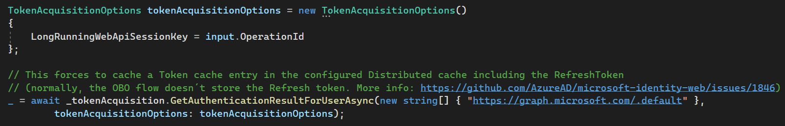

En este artículo vamos a ver un escenario poco comentado, pero muy
interesante, sobre todo si trabajamos con procesos background, webhooks
o en general cualquier operación que pueda requerir de mucho tiempo para
completarse (AKA: *long running operations*). Te pongo un ejemplo
concreto, donde seguro te hace imaginar otros casos similares:

Hemos desarrollado una API custom en .NET, securizada con *Azure Active
Directory*. Dicha API es consumida por un Web Part de *SharePoint*
(**SPFx**) o una SPA (previamente el usuario ha hecho un sign in), app
móvil, etc. Nuestra API dispone un endpoint que, dado unos parámetros en
su Body, permite la creación y configuración de un MS Teams team. Dicha
creación del Team, y sobre todo su personalización (imagina aplicando
una plantilla al Team, provisionando artefactos en el sitio de
SharePoint, etc), es una *long running operation*, así que, lo que hace
la API, tras ciertas validaciones, logging, etc, es disparar una Azure
Function, que, además, hace uso del framework de *Durable Functions*
para poder orquestar todas las acciones a realizar.

Una vez la Azure Function empieza su ejecución, hemos pasado a un
proceso en background, donde no hay interacción del usuario, por lo que,
para cualquier acción (ejemplo: crear el MS Teams team), lo normal será
hacerlo con permisos de *Application* (AKA: AppOnly). Sin embargo, puede
ocurrir lo siguiente:

1.  Los permisos de *Application*, requieren el *consent* de un
    Administrador, y puede que no siempre contemos con ello.

2.  Hay operaciones en MS Graph API (y SharePoint), que NO son posibles
    con permisos de *Application*, como, por ejemplo, crear un Term en
    el TermStore de SharePoint, usando en nuevo endpoint de *Taxonomy*
    de Graph, o aplicar una *Sensitivity Label* a un grupo de
    Microsoft 365. Si estás habituado a usar Graph, sabrás que hay
    bastantes operaciones que, a día de hoy, todavía no soportan
    *Application permissions*.

3.  Simplemente no queremos permitir ninguna acción, que el usuario que
    disparó el proceso no tenga permisos para realizar (con AppOnly
    estamos elevando privilegios... alguien recuerda en SharePoint el
    ***RunWithElevatedPrivileges***?).

Para estos casos, lo que queremos es que, en un momento dado, el proceso
de background, pueda "*impersonarse*" como el usuario que en su momento
disparó el *long running process*, y hacer acciones en su nombre. Por
suerte, la librería de **MSAL** (*Microsoft Authentication Library*),
ofrece un mecanismo para hacer estos escenarios viables, sin que nos
vaya la vida en ello.

**Descripción a alto nivel de la solución**

Antes de nada, tenemos que aclarar que desde la versión **4.38.0** de
MSAL, cuando se usa el *On Behalf Of Flow* (API llama a otra API en
nombre del usuario), la entrada en la Token cache que representa ese
*Auth result*, ya NO incluye el *Refresh* *token*. La siguiente imagen
es un ejemplo de una entrada en la Token cache para un *OBO Flow*:

Esto quiere decir, que si desde la *Azure Function*, leemos esa entrada,
y el Access Token ya ha expirado (recuerda que por defecto sólo viven
por 1 hora), no disponemos de un *Refresh token* que nos permita obtener
un *Access Token* válido (¡recuerda que, por defecto, en Azure AD, un
Refresh token vive por 90 días!). Este cambio, hace que la propuesta
inicial de Microsoft para este escenario, que existe en este repositorio
de GitHub, ya NO es válida:
https://github.com/Azure-Samples/ms-identity-dotnet-advanced-token-cache

Por suerte, existe una manera de decirle a MSAL "*hey, yo necesito que
guardes en la caché ese Refresh Token!*", y podemos además darle un
identificador único que se usará como Key del *item* en caché. Este
identificador, lo pasaremos a nuestra Azure Function, que usando MSAL,
recuperará el ítem de la caché, incluyendo su *Access y Refresh*
*token*. Así, el ítem en caché tiene este aspecto:

Ahora, o bien usando el *AccessToken*, u obteniendo uno nuevo desde el
*Refresh* *token*, tendremos un *Access token* con permisos delegados,
"**impersonando**" al usuario que creó la entrada en la caché, y con el
cual ya podremos llamar a Graph (o la API que sea).

La siguiente imagen muestra la arquitectura descrita:

**¡Show me the code!**

**Nota**: Para que todo esto funcione, tenemos que registrar al menos
una Aplicación en *Azure Active Directory* (también funciona si
registramos 2 aplicaciones, una para la API, y otra para la Function.
Llegado el momento del código, comentaré que hay que tener en cuenta si
se registran 2 apps). El proceso de registro de las Apps lo doy por
sabido, y está documentado en mil sitios. Al finalizar este artículo,
incluyo varias referencias a proyectos de GitHub que explican como
registrar las apps.

¡Vamos al código!

Para la API, voy a hacer uso de la librería ***Microsoft.Identity.Web***
(https://github.com/AzureAD/microsoft-identity-web), que viene a ser
un *wrapper* sobre **MSAL**, que facilita mucho las cosas a la hora de
securizar Web Apps / APIs y obtener Tokens para llamar a otras APIs
securizadas con Azure AD (Graph, SharePoint, una tuya custom). Además,
facilita muchísimo el uso de una caché de Tokens distribuida, usando
**SQL Server**, o **Redis caché**, por ejemplo.

El siguiente snippet, configura nuestra API para que requiera un *Bearer
Token* (authorization), y para que haya caché de token distribuida
usando Azure Redis Caché:

Pasamos ahora al controller de nuestra API que disparará la long running
operation (en forma de Azure Durable Function), y que cacheará en Redis
nuestros *Access y Refresh tokens*.

En este punto, ya tenemos nuestra caché con una entrada cuya Key es el
**OperationId** pasado (como os decía antes, os sirve cualquier cosa que
identifique de forma única la operación). La siguiente acción del
controller será lanzar la *long running operation*, en nuestro ejemplo,
la durable function, por ejemplo, dejando un mensaje en una cola,
incluyendo el *OperationId*.

Saltamos ahora al proceso background, nuestra Durable function. Ahora,
usando el *OperationId*, debemos leer la caché con esa Key, y pedirle a
MSAL que nos dé un AccessToken válido (si el de la caché sigue vivo,
será ese, de lo contrario, usará el Refresh token para sacar un nuevo
Access token para nosotros).

Antes de nada, la siguiente aclaración: La librería MS Identity Web, no
se puede utilizar en procesos background (al menos la parte que obtiene
tokens). La cosa es que, para configurar esta librería, tenemos que
hacer uso de unos Builders, que están pensados para web apps, y que de
usarlos en Azure Functions, cambiarán el Schema de Authentication, cosa
que puede que no queramos (por ejemplo, si tenemos un HttpTrigger que
autoriza por Function Key, esto dejaría de funcionar). Lo que sí
funciona, y vamos a aprovecharnos de ello, es el tema de la Token Cache.

**Nota**: me consta que el equipo de MS Identity Web está trabajando en
resolver esto, y seguramente estará disponible en la siguiente reléase,
puesto que ya he visto alguna Pull Request con mejoras en este punto.

Primero de todo, tenemos que asegurarnos de que configuramos la Token
caché de la misma manera que tenemos en la API. Nuestro startup de la
Function, tendrá el siguiente código para configurar la Token cache
(además de registrar cualquier otro servicio que necesitemos):

Si pudiéramos usar todo el potencial de MS Identity Web, en nuestra
Función, inyectaríamos un ITokenAcquisition, y podríamos usarlo para
obtener el token con un par de líneas de código. Como no es el caso,
haremos uso directo de MSAL.

**Nota**: Si tenemos registradas 2 aplicaciones en Azure AD, una para la
API, y otra para la Azure Function, tampoco podríamos usar un
ITokenAcquisition para sacar el token de la caché, ya que éste, queda
configurado con las settings de la Azure Function, y la caché fue
rellenada con la App de la API.

Como os digo, esto se soluciona usando directamente MSAL. El siguiente
snippet os muestra cómo:

**Nota**: Este código asume el uso de Certificado en el registro de las
Azure Ad Apps, así que necesitas una manera de sacar ese certificado
(esta parte no te será nada difícil, puesto que está muy documentada).
Supongo que también funcionará si utilizas un *Secret* para registrar la
AAD App. Con secret, tendrás que cambiar la manera en la que MSAL
construye el objeto *IConfidentialClientApplication* (también muy
sencillo y documentado).

Llegado a este punto, ya hemos obtenido un AccessToken que representa al
usuario que inició la *Durable Function*, por lo que ya podemos hacer
llamadas a la MS Graph API con permisos delegados, en representación de
ese usuario.

**Referencias**

-   Este es el ejemplo que más se parece al escenario del artículo, pero
    ya que ha quedado deprecated debido a los cambios en MSAL:
    https://github.com/Azure-Samples/ms-identity-dotnet-advanced-token-cache

-   Wiki de la librería MS Identity Web que describe como obtener el
    token delegado en procesos Long running:
    https://github.com/AzureAD/microsoft-identity-web/wiki/get-token-in-event-handler

-   Mismo que el punto anterior, pero usando sólo MSAL:
    https://github.com/AzureAD/microsoft-authentication-library-for-dotnet/wiki/on-behalf-of#long-running-obo-processes

**Luis Mañez**  
Cloud Architect en ClearPeople LTD | Office Development MVP  
@luismanez  
https://github.com/luismanez