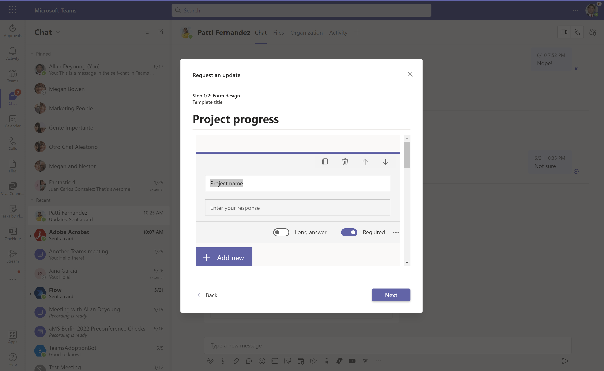

Microsoft 365 y sus servicios principales (SharePoint Online, Exchange
Online, OneDrive for Business, Microsoft Teams) son actualizados de
forma continua con Microsoft, lo que hace que en ocasiones podamos
perder de vista nuevas funcionalidades de interés. Este ha sido el caso
de la aplicación de Updates en Teams de la que no era consciente hasta
que me la he encontrado recientemente. En este artículo veremos esta
nueva aplicación y sus posibilidades.

**Introducción**

Update en Teams es una nueva [aplicación diseñada para facilitar
solicitar y enviar actualizaciones de
información/feedback/reporting](https://techcommunity.microsoft.com/t5/microsoft-365-blog/updates-in-microsoft-teams-allows-users-to-create-submit-and/ba-p/3367252)
por parte de compañeros de trabajo que se orienta mucho a escenarios y
casos de uso. Por ejemplo, con Update en Teams se facilita recoger un
update diario del trabajo realizado en proyectos de forma periódica
incorporando además funcionalidad de valor añadido como el envío de
recordatorios. Esta aplicación está habilitada por defecto en Teams y la
podemos usar tanto en chats privados como en canales estándar sin más
que hacer uso de la opción correspondiente.

Además, Updates en Teams dispone de su propia App desde la que podemos
visualizar las peticiones de información/feedback/reporting realizadas,
las que hemos recibido y gestionar el uso de las plantillas disponibles
para dichas solicitudes.

**Realizando una petición de información/feedback/reporting**

Realizar una petición de información/feedback/reporting es realmente
sencillo. Tras hacer clic en la opción de "Updates" en un chat privado o
en un canal de Teams, sólo tendremos que seleccionar la plantilla a
utilizar o bien crear una desde cero. En mi caso voy a hacer uso de la
plantilla de "Project progress":

A continuación, se inicia un asistente en el que podemos dejar el
formulario que se presenta como está o podemos personalizarlo. Como
seguramente habrás intuido, el formulario está utilizando Microsoft
Forms de la misma forma que lo hace la aplicación de Aprobaciones cuando
se hace uso de plantillas de aprobaciones. Para confirmar que vamos a
hacer uso de la plantilla seleccionada, hacemos clic en "Pick this
template":

El siguiente paso es que modifiquemos, si lo necesitamos, el
comportamiento del formulario por defecto de la plantilla o bien
simplemente lo utilicemos como está. En mi opinión, la experiencia de
personalización es mejorable, ya que la ventana de personalización es un
tanto pequeña.

Hacemos clic en "Next" de forma que se muestre la nueva ventana del
asistente en la que podemos establecer que obligatoriamente se adjunte
un archivo al realizar la solicitud de información y si esta solicitud
queremos que sea periódica. En este punto, dependiendo de la plantilla
ya tendremos configurada una propuesta de periodicidad.

En mi caso he configurado que se solicite una actualización del estado
de proyectos a Patti una vez a la semana lo que además garantiza que
Patti recibirá un recordatorio para que no se olvide de hacerlo.

Tras publicar la solicitud en el chat, se muestra información como una
Adaptive Card con una serie de datos básicos y reflejando el estado
actual: "In progress".

Desde el punto de vista del destinatario, recibirá una notificación de
la solicitud y también verá la Adaptive Card, pero con la opción de
poder contestar a la solicitud.

**Enviando y consultando una actualización de información**

Contestar a una solicitud de información es muy sencillo. Solo tenemos
que hacer clic en "Write update" en la adaptive card y contestar al
formulario:

Cuando hayamos completado toda la información requerida, podremos enviar
la solicitud y el resultado será una nueva Adaptive Card que permitirá
por un lado revisar el envío realizado a la persona que se le hizo la
solicitud. Y por otro, permitirá al solicitante (qué además será
notificado) realizar la misma tarea.

En cualquiera de los dos casos, se podrá visualizar la información (que
no modificar) que se ha enviado:

Además, si se han realizado varias entradas de información el
solicitante podrá revisar todo el histórico de entradas realizadas desde
la App de Updates:

Finalmente, el solicitante de actualización también puede ver tanto el
formulario (estará en solo lectura) como los datos enviados desde
Microsoft Forms lo que también nos da pistas de cómo podríamos extender
con Power Automate los escenarios de solicitudes y consulta de
información que se hayan realizado.

**Conclusiones**

Como siempre digo, Microsoft 365 siempre te da sorpresas y esto es lo
que me ha pasado cuando he descubierto la App de Updates en Teams que
está pensada para facilitar la recogida y envío de información y
feedback o simplemente para reportar estado. Sobre la base de
herramientas y servicios disponibles en Microsoft 365 (Microsoft Forms y
Power Automate), Updates en Teams habilita nuevos escenarios de trabajo
colaborativo en los que la información fluya y esté siempre al día.

**Juan Carlos Gonzalez**  
Microsoft 365 Apps & Services MVP  
M365 SME & Delivery Manager en RICOH España  
@jcgm1978 | <https://www.linkedin.com/in/juagon/>  
