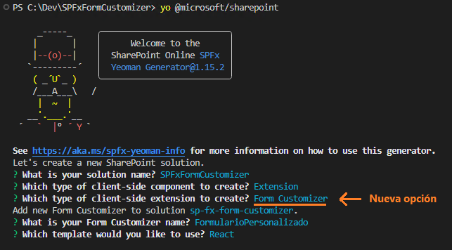
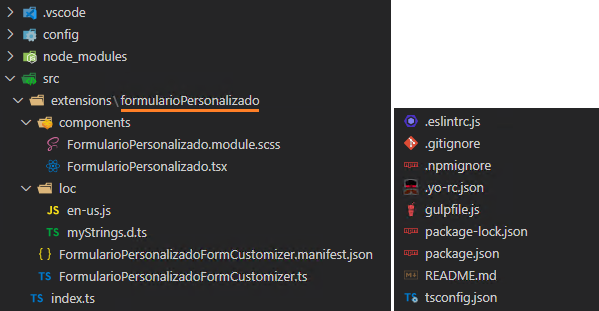
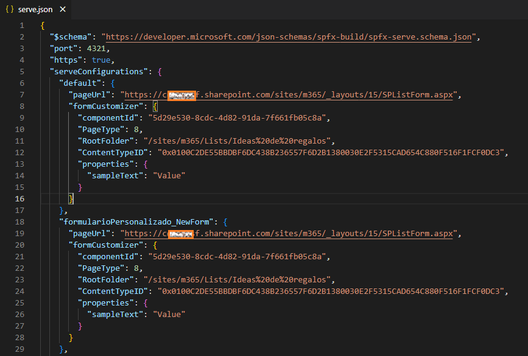
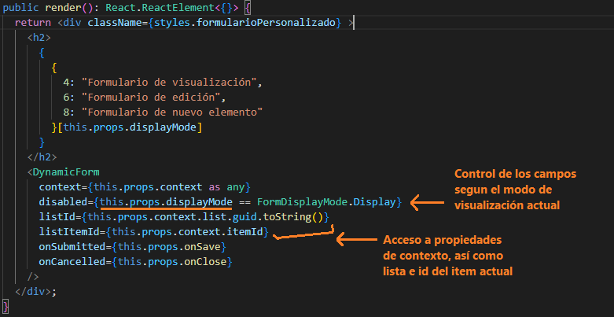
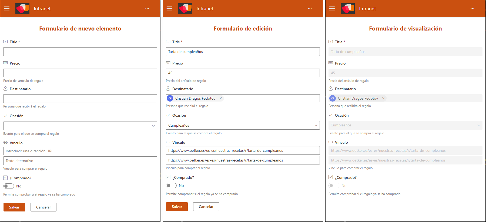
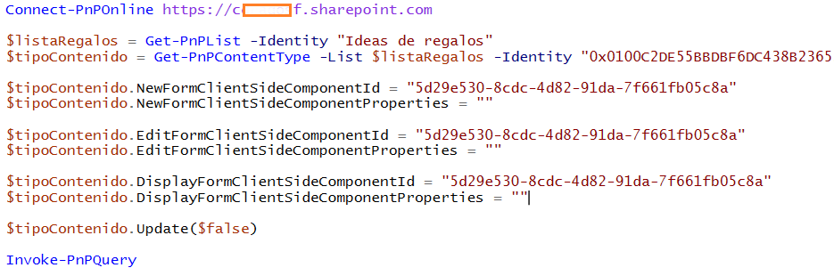

A partir de la versión de SPFx (SharePoint Framework 1.15), aparece un
nuevo tipo de extensión, el Form Customizer, que nos permite tener
control total sobre la apariencia y el funcionamiento de los formularios
de listas y librerías en SharePoint Online. A través de este nuevo tipo
de extensión tendremos control sobre el marco completo de los
formularios y la experiencia del usuario al utilizarlos. Tendremos la
posibilidad de acceder a través del contexto, a la lista o el item con
el que estemos trabajando. También tendremos métodos de guardado o
cancelado de las acciones.

En este articulo vamos a crear un nuevo formulario de lista, y veremos
cómo podemos personalizar la apariencia y el funcionamiento lógico de la
creación de los ítems a través del nuevo tipo de componente de Form
Customizer.

**¿Cómo empezamos?**

En mi caso utilizaré Visual Studio Code, junto con la versión 1.15.2 de
SPFx ( [detalles de cómo preparar un entorno de desarrollo de
SPFx](https://docs.microsoft.com/en-us/sharepoint/dev/spfx/set-up-your-development-environment)
). Crearemos un proyecto utilizando el mismo comando que veníamos
utilizando hasta ahora: "**yo @microsoft/sharepoint**" y a continuación
tendremos que pasar por el asistente de creación seleccionando en cada
paso las siguientes opciones:

Utilizaremos el nuevo tipo de extensión llamado "**Form Customizer**".
Obtendremos una estructura muy familiar si estamos acostumbrados a
trabajar con extensiones en las anteriores versiones de SPFx.

Por defecto, tendremos una nueva extensión con visualización y lógica de
ejemplo.

**¿Cómo visualizamos el componente?**

Para este tipo de extensiones necesitamos disponer de un entorno de
SharePoint Online y obviamente una lista o biblioteca de documentos con
un tipo de contenido de elemento o documento.

Dentro de la carpeta "config-serve.json" podemos modificar los
diferentes parámetros disponibles en cada una de las configuraciones
según el modo de visualización:

-   **pageUrl**: se debe actualizar la url raíz del tenant y de la
    colección de sitios (no cambiar la parte de "_layouts/..." ya que
    esta página podríamos decir que es el equivalente a la página que
    veníamos usando hasta ahora de Workbench.aspx).

-   **PageType**: podemos tener tres valores diferentes en esta
    propiedad (NewForm -- 8, EditForm -- 6, ViewForm -- 4).

-   **RootFolder**: indicar la URL relativa hasta la raíz de la lista o
    biblioteca donde se verán los formularios.

-   **ContentTypeID**: ya que la lista puede contener mas de un tipo de
    contenido, si es nuestro caso, podemos especificar el ID del tipo de
    contenido al que aplica nuestra configuración.

-   **ID**: el ID del item que queremos cargar (solo para las
    configuraciones de ViewForm y EditForm).

-   **properties**: por último, tenemos las propiedades personalizadas
    del componente.

De manera opcional, podemos lanzar el comando "gulp trust-dev-cert" y
confirmar la comprobación de confianza en el certificado de desarrollo.

Finalmente, para lanzar nuestro proyecto, usamos "gulpe serve" y
automáticamente se abrirá la página que tengamos definida en la
configuración por defecto en el fichero "serve.json".

También podemos lanzar específicamente una de las configuraciones
definidas anteriormente con el siguiente comando: **gulp serve
--config=formularioPersonalizado_ViewForm.** Siendo
"formularioPersonalizado_ViewForm" el nombre de cada una de las
configuraciones definidas.

Los cambios realizados en el código TypeScript, se verán reflejados
sobre la marcha, solamente guardando los ficheros modificados.

**¿Cómo personalizamos los formularios?**

En mi caso, para agilizar el desarrollo de este proyecto de ejemplo, he
utilizado el control de @pnp llamado Dynamic Form ([más detalles de
cómo utilizar este
control](https://pnp.github.io/sp-dev-fx-controls-react/controls/DynamicForm/)).
Este control se encargará de mostrar automáticamente los campos
definidos en la lista de manera que solo tendremos que encargarnos de la
lógica de negocio.

En caso de necesitar crear un formulario completo y tener el control
total sobre nuestros campos y el diseño de cada uno de ellos, debemos
utilizar controles de FluentUi u otras librerías visuales.

Dependiendo del enfoque que le queramos dar a nuestro desarrollo
podremos utilizar un nuevo componente para cada uno de los formularios
(New, Edit, View) y mostrarlos según la variable de contexto
"displayMode". En mi caso he utilizado este valor para deshabilitar el
formulario y que el usuario no pueda modificar los valores cuando se
accede al formulario de ViewForm, al igual que el cambio del titulo en
la cabecera del formulario.

Podemos realizar validaciones previas a la acción de guardado del item y
en función de ello mostrar errores de validación al usuario dentro del
mismo formulario. Es necesario llamar a los métodos "this.formClosed()"
y "this.formSaved()" para notificar al core de SPFx de los cambios
realizados en el formulario y que se realice la redirección de vuelta a
la lista o biblioteca desde la cual se ha llamado al formulario.

**¿Y el resultado final?**

Lanzamos el comando "gulp serve" y ya tenemos nuestro primer formulario
de lista, personalizado mediante SPFx Form Customizer:

Tenemos muchas posibilidades en cuanto a la lógica y diseños de los
formularios; textos dinámicos, botones que cambian según lógica de
negocio, contenido compuesto por imágenes, videos, texto, carruseles,
llamadas a APIs externas en la carga de los formularios, etc.

**¿Cómo desplegamos la solución?**

El empaquetado y distribución de la solución se realiza con los mismos
comandos que veníamos utilizando hasta ahora con SPFx (gulp bundle
--ship y gulp package-solution --ship).

Una vez empaquetada la solución debemos subirla a nuestro App Catalog
pudiendo desplegarla a nivel de colección de sitio o a nivel de tenant.

Por ahora debemos hacer el enlace de los formularios con los tipos de
contenido de las listas, mediante API REST o CSOM, pudiendo configurar
tanto el ID del componente a cargar como las propiedades adicionales que
se le deben enviar en cada caso.

En este ejemplo he utilizado PnP Powershell de la siguiente manera:

En futuras actualizaciones, tendremos una opción más para provisionar
todo esto a través del despliegue de la solución mediante los ficheros
de assets.

**¿Dicho todo esto ya sabes cómo vas a personalizar tus formularios con SPFx Form Customizer?**

**Consideraciones**

Para finalizar, algunas consideraciones a tener en cuenta:

-   Podemos tener varios Form Customizer en la misma solución y asociar
    cada uno a un tipo de contenido diferente.

-   En función de los permisos del usuario, podríamos bloquear, ocultar
    o limitar los datos cargados en los campos / partes del formulario.

-   Gracias al acceso a los eventos de OnSave y OnCancel, podremos
    realizar validaciones mas complejas con acceso a datos externos,
    antes de guardar los datos en el formulario.

-   Dentro de nuestro desarrollo podríamos jugar con la propiedad
    "displayMode" y así cargar un control diferente para cada modo de
    visualización del formulario (DisplayForm, editForm o newForm).

-   También podríamos crear un formulario personalizado solo para uno de
    los modos de visualización del item, es decir, podríamos
    personalizar solo la vista de edición del item y dejar por defecto
    las demás vistas.

-   En futuras versiones tendremos la posibilidad de mostrar estos
    formularios en paneles laterales dentro de las listas, sin necesidad
    de navegar a una pagina especifica para visualizar el formulario.

Links útiles:

-   [**Repositorio GitHub del ejemplo expuesto en el
    articulo**](https://github.com/cdragosf/SPFxFormCustomizer)

-   [**Compilación de la primera extensión de Form
    Customizer**](https://docs.microsoft.com/en-us/sharepoint/dev/spfx/extensions/get-started/building-form-customizer)

-   [**Ejemplo de Form Customizer con formulario completo y acción de
    guardado
    personalizada**](https://github.com/pnp/spfx-reference-scenarios/tree/main/samples/spfx-formcustomizer-basics)

**Cristian Dragos Fedotov**  
Microsoft 365 Solutions Architect en **NTT DATA**  
cristianfedotov@gmail.com  
<https://www.linkedin.com/in/cristianfedotov/> 
