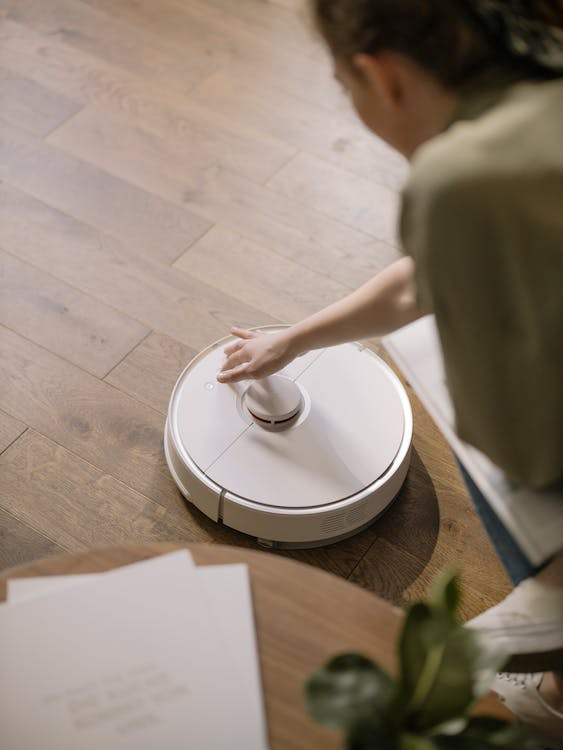

- ¿Voy a ser sustituido por una inteligencia Artificial? - Es una
pregunta que me han hecho muchas veces y de muchas formas, pero mi
respuesta siempre es una: "Depende...".

En realidad, la pregunta no es si vamos a ser sustituidos por una
Inteligencia Artificial, sino que la pregunta de fondo es más general ya
que la amenaza real proviene del avance tecnológico en sí, y no
solamente de una de sus ramas como es la IA. De todas formas, es natural
que centremos en la Inteligencia Artificial este problema o "temor" a
ser sustituido; tengamos en cuenta que es una de las tecnologías que más
han avanzado en los últimos años y que no deja de sorprendernos día a
día. Por ello en el resto de este artículo intentaré contestar esta
pregunta, aunque estamos rodeados de ejemplos de posibles respuestas.

Quiero empezar contando un ejemplo de
sustitución que creo que es un ejemplo muy fácil de imaginar y que viví
en persona hace unos años. Cuando trabajaba en seguridad de cajeros
automáticos, un día me encontraba en la acera, configurando un cajero
que acabábamos de instalar y observo que de la oficina bancaria en la
que estábamos sale un señor que se pone a mirar lo que hacía. Pasados 7
u 8 minutos, y con cierta sonrisa en la cara me doy vuelta sabiendo que
tenía al señor muy interesado en hablar y cruzamos miradas. No fue
necesario decir nada, instantáneamente me soltó algo como "*búscate otro
trabajo, esto no tiene futuro, ¿quién va a querer utilizar esta máquina?
¿Quién no va a querer entrar en la sucursal y hablar con Pepe (el señor
que atendía en la caja)? ¡Eso es insustituible!*". Tuvimos algún diálogo
adicional a partir de su frase, pero la importante y que se quedó
grabada a fuego en mi cerebro fue eso de "***Pepe es insustituible***",
porque pasado el tiempo no he encontrado un ejemplo que estuviese más
equivocado y acertado al mismo tiempo.

¿Ein? ¿Cómo algo puede estar equivocado y acertado al mismo tiempo? La
respuesta es fácil, solo piensa en lo que pasó en los años
siguientes... En los siguientes 10 años, esos cajeros automáticos
evolucionaron, y esa máquina que al principio sólo permitía sacar
dinero, se convirtió en otra máquina evolucionada que permitía hacer
ingresos, transferencias, consultas y una larga lista de toda clase de
servicios. A diferencia de la sucursal bancaria el cajero automático
trabajaba las 24 horas del día y bajo casi cualquier condición
meteorológica, lo que hizo que por una cuestión de comodidad
prefiriésemos usar los cajeros... ¡Claro!, pero quién le preguntó a Pepe
que ¿le parecía esta "nueva" tecnología?

Pepe había sido sustituido por una máquina, pero Pepe tenía un as en la
manga...

Si seguimos avanzando en el tiempo, los cajeros fueron evolucionados por
un plástico que llevabas en la cartera y que sustituía el cajero
automático en el 90% de los casos (pagar o cobrar). Hoy en día, todos
sabemos que hasta ese plástico ha sido sustituido por tu móvil, reloj, y
antes de que te des cuenta tampoco eso será necesario, porque los
reemplazaremos por chips subcutáneos, lectura de iris, etc. Es decir, no
dejamos de evolucionar tecnológicamente apoyándonos en que cada vez
queremos hacer más cosas con menos esfuerzo, y dada la cantidad de
posibilidades que implica "hacer cosas" pretendemos que las máquinas
sepan lo que queremos y de ahí la Inteligencia Artificial.

Pero ¿qué hay de Pepe? Seguramente Pepe terminó en el paro, a no ser que
se haya adaptado (este es su "*as en la manga*", del que hablaré más
adelante).

Este ejemplo del cajero automático no solamente aplica en la banca, en
realidad ha pasado en casi todas las cosas y ámbitos que nos rodean.
Sabias que hace unos años los coches eran fabricados por una persona que
tenía todo el conocimiento necesario, que luego fue sustituido por una
cadena de producción donde el coche "viajaba" entre distintas zonas
donde iba recibiendo distintas partes (mecánica, electricidad, chapa,
pintura, etc.) para llegar a un día donde hemos construido robots para
hacer esa tarea, auto relegándonos a una tarea de diseño y supervisión.
¡Pero tanto tú como yo hemos preferido que sea así! ¿Cómo?, ¿...Que tú
no has decidido eso? Claro que sí lo has decidido, pero no directamente,
o me vas a decir que no eres de aquellos que cada vez más, exiges que el
coche sea más barato, que tenga más autonomía, que no necesite de
reparaciones y que no te reclame conocimientos mecánicos para
conducirlo. Dicho de otra forma, queremos el coche cuanto antes, que
cueste menos, que me lleve más lejos, y que cuanto más autónomo sea
mejor (o menos dolores de cabeza te dé). Hasta con eso de que sea
"autónomo" sabes que hemos hecho avances, que aún no están del todo
listos, es cierto, pero casi; y ambos sabemos que es cuestión de tiempo.
¿Y qué ha pasado con el otro "Pepe" que fabricaba coches? La respuesta
es clara, también terminó en el paro o utilizó su "as en la manga".

Hay cientos de ejemplos en los que aplica
el caso de los cajeros o de los coches. Si tienes un robot que barre la
casa, y además lava y encera/pule los suelos, sabes que ya no llamas a
la persona que venía a echarte una mano a limpiar... Al menos y si la
llamas, ya no es para simplemente barrer porque aún quedan cosas de
mantenimiento de la casa para hacer. Pero si a eso le agregas la
lavadora, un lavavajillas, el robot de cocina y un robot limpia
cristales la cantidad de tareas no atendidas por un automatismo es cada
vez menor. Eso quiere decir, te guste o no, que estos avances destruyen
determinados puestos de trabajo, aunque la clave está en que esos
puestos deben adaptarse, esa es la clave: el "as en la manga".

Un último ejemplo, que tal vez parezca más moderno: los desarrolladores.
Me refiero a developers, a expertos en un lenguaje de programación u
otro que tiran código para hacer aplicaciones. Probablemente ya hayas
probado o al menos has escuchado hablar de Copilot. Sí, es una AI que te
"ayuda" a desarrollar partiendo de tu lenguaje natural. Simplificando,
Copilot es un "tu pide que yo programo". Esto podría implicar que "Pepe
Developer" se ha quedado sin trabajo.

Pero entonces ¿la Inteligencia Artificial y la evolución tecnológica
destruye trabajos? La respuesta es clara: los destruye desde el punto de
vista que los sustituye por máquinas, y está en tu mano el tener que
adaptarte y evolucionar junto con esa tecnología, si no lo haces sí que
serás sustituido. Insisto en la cantidad enorme de ejemplos que tenemos,
pero por mencionar otro ejemplo reciente: hace apenas unos 15 años en
España casi todos los conductores profesionales que trabajaban en un
taxi, camión, mensajería, etc. portaban un libro llamado popularmente
"el callejero". Era un pequeño libro donde había un índice de las calles
con sus numeraciones, y para cada calle y numeración había una
coordenada. En otra parte de ese mismo libro había un plano de la
ciudad, cortado en cientos o miles de secciones según cupieran en las
páginas. Eso quería decir que cuando querías buscar una calle y número,
por ejemplo, "Paseo Castellana 100", debías ir al índice donde buscarías
alfabéticamente hasta encontrar el "Paseo Castellana y los datos del
número 100, donde te llevaría al plano número X coordenada YZ; si a
partir de ahí ibas al resto del libro a la hoja X y a esa coordenada YZ,
encontrarías el plano correspondiente a la dirección que buscabas. Hoy
puede parecer un trabajo bestial para buscar una calle, pero una vez
habías ganado práctica te llevaba apenas unos segundos ubicar el plano.

Hoy en día el ejemplo del callejero puede parecernos un trabajo
extremadamente manual, pero además no cubre determinados problemas
externos al plano en sí como son: ¿qué pasa con los atascos, las obras y
todas las posibles alteraciones que en el día a día podrían existir? La
evolución nos llevó inmediatamente a unos pequeños aparatos que
contenían planos más actualizados, y de ahí a tener esos planos
digitalizados en una aplicación en el teléfono móvil fue cuestión de
tiempo. Hoy ni siquiera buscamos la dirección, simplemente la decimos
para que nuestro navegador haga el trazado óptimo para llegar a ese
sitio, y más aún: es capaz de estimar tiempos en función del tipo de
transporte, la hora, etc.

El "as en la manga". En el caso anterior, que parece muy obvio, el
"Pepe" que imprimía planos y editaba callejeros es un claro ejemplo de
lo que venimos comentando: en su momento tuvo dos opciones: no hizo nada
y no evolucionó provocando que hoy en día haya desaparecido y esté
trabajando en otra cosa. O tal vez como segunda opción: evolucionó y
transformó su tecnología de fabricación de libros callejeros hacia
aplicaciones portables y rápidamente actualizables. Para esta opción y
simplificando la conclusión, el "Pepe" en cuestión sigue haciendo lo
mismo, pero de forma más moderna y apoyado en otras tecnologías, porque
le necesidad de "debo llegar a un sitio al cual no sé llegar" sigue
existiendo.

La amenaza no deja profesiones libres de esa evolución: desde
arquitectos que deben luchar y demostrar su valor frente a una
Inteligencia Artificial que hace diseños, planos y hasta gestiona
impresoras 3D que imprimen la casa (obviamente a tamaño real), hasta un
dibujante de Cómics que ya puede encontrar una Inteligencia Artificial
que simplemente escuchando nuestra historia es capaz de dibujar el Cómic
respectivo.

La clave por la que vamos a prevalecer, a la que he hecho referencia en
todas las líneas anteriores y que es lo que marca la diferencia, es la
capacidad humana de creación, adaptación, ganas de hacer, y muy
especialmente: la capacidad de emoción. Todo eso es imposible (por
ahora) de llevar a un algoritmo de Inteligencia Artificial. Todos hemos
oído que una Inteligencia Artificial jamás podría pintar un cuadro o
crear una imagen tal como lo hace un artista, pero hoy ya lo hemos
superado y gratuitamente tienes al alcance de tu mano ver como una
Inteligencia Artificial crear un cuadro a partir de la frase que se te
ocurra. Entonces, ¿dónde está la diferencia? La diferencia está que en
el ejemplo anterior la creatividad está en la frase, o si piensas en el
fondo de la cuestión, en la idea de concebir algo. Eso sí que es
extremadamente complejo de llevar a una Inteligencia Artificial, porque
"crear algo" se basa en una combinación de cosas emocionales y
aprendidas que por ahora no logramos meter en un algoritmo.

Aquellos programadores que estén preocupados en ser sustituidos por
Copilot deberían preocuparse y ver que programar no es solamente tirar
una serie de líneas de código en determinado orden. En este caso la
capacidad de crear es muy importante y cuanto mejor sea tu idea o
creación, más difícil o cuasi imposible lo tendrá Copilot. Dicho de
forma más simplificada, Copilot no es capaz de crear de la nada, somos
los humanos los que debemos decirle qué programa o trozo de programa
queremos, y es en ese momento en el que sí es capaz de hacer su trabajo.

Hay tareas que están en claro riesgo, y no son otras cuyo quehacer es
algo repetitivo y constante. Si tu tarea es revisar si un paquete de
galletitas que acaba de ser fabricado está bien envasado o no,
seguramente esa tarea será reemplazada por una máquina antes de un
suspiro. Pero si la persona es capaz de adaptarse para ser capaz de
controlar cualquier envasado, u optimizar la forma en que las
Inteligencias Artificiales revisan los envasados, o promover nuevas
formas y envases, (la lista sigue) no sólo no será sustituido, sino que
seguramente será ascendido. La diferencia está en tu capacidad y ganas
de moverte de tu zona de confort.

Pero hay tareas que sí o sí son
repetitivas. Hay muchos ejemplos, pero por utilizar algo que sea muy
conocido por todos: ¿Qué pasa con la tarea de servir algo al cliente?
Piensa en un(a) camarero(a) llevándote tu pedido a la mesa o sirviéndote
el refresco de tu gusto. Parece esa una tarea totalmente orientada a ser
fulminada por una máquina.... Pues no, hay una diferencia: ¿qué pasa si
esa persona hoy te sorprende con un comentario de un tema que es de tu
interés, o mañana hace un pequeño dibujo en la espuma de tu café, o
pasado te atiende utilizando una amabilidad y detalle difíciles de
superar?, ¡Ajá! Ahí la cosa cambia, y mucho, porque, aunque una máquina
intente ser amable siempre suena a máquina ¿verdad? El as de la manga
del camarero(a) no es otro que su propia capacidad de sorprender, ser
amable, atento, crear formas nuevas de hacer su trabajo, y porque no...
generar emociones. Eso es irremplazable.

Entonces para terminar, ¿Voy a ser sustituido por una inteligencia
Artificial?

La respuesta la tienes tú mismo y las ganas de adaptarte es la base de
la cuestión. Las nuevas tecnologías y la innovación son difícilmente
destructoras de empleos, pero lo que sí son impulsoras de grandes
adaptaciones.

Todos los casos de nuestros "Pepes" han tenido que adaptarse. El del
banco ya no solamente atiende una caja, tiene que hacer más cosas y
asesorarte, explicarte, etc. La persona de la limpieza ya no viene a
barrer, pero la seguimos necesitando para echar un cable con otras cosas
que no es barrer (imagina el estropicio que haría un robot limpiando la
cristalera de las copas de la abuela). El "Pepe" de los callejeros sigue
haciendo callejeros, solo que ahora en vez de imprentas utiliza
aplicaciones, diseña cosas e implementa modelos de AI que optimizan
rutas.

De todas formas, la evolución trae sus problemas y no sólo te afecta
como profesional sino también como cliente. ¿Cuántos de nosotros hemos
llegado al hartazgo de "hablar" con máquinas en el banco y queremos que
nos atienda una persona? (si cambias la palabra banco por operadora de
telefonía, gas, electricidad, seguros o cualquier otra clase de
servicios la pregunta sigue siendo válida). Hay muchos casos en los que
nos encontramos en que los automatismos no han considerado todas las
opciones, e intentar resolver nuestro problema a través de la máquina se
vuelve tarea imposible y frustrante, y es en estos casos en los que
necesitamos de personas y no procesos. Muchas empresas de servicios han
entendido esto y han vuelto a incorporar personas, más especializadas y
efectivas que atienden esos casos en los que los procesos autómatas aún
no pueden ayudar. Otras empresas dicen que lo hacen, pero todos sabemos
que es falso y otras directamente no lo hacen, abandonándote a tu suerte
y umbral de aceptación. Está en ti decidir cuál es la mejor opción para
tu caso.

**Javier Menendez Pallo**  
AI MVP