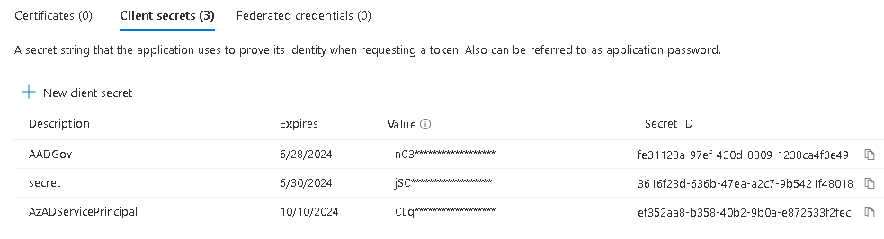
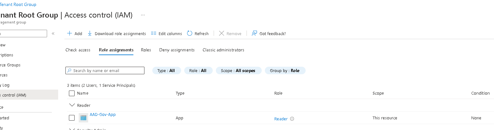
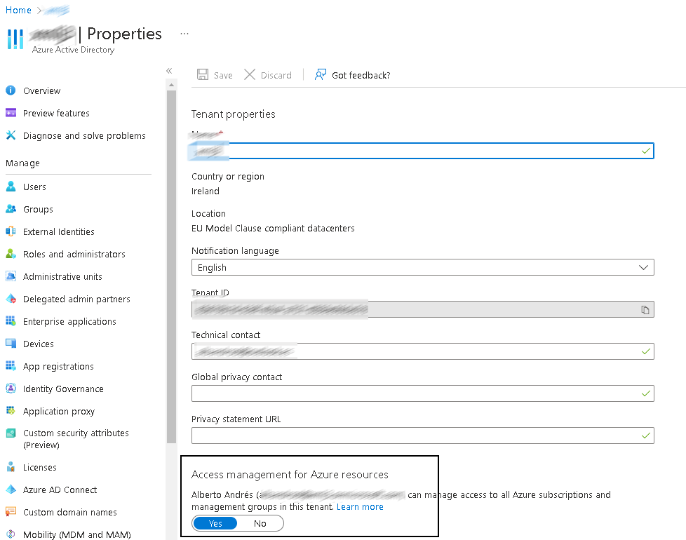
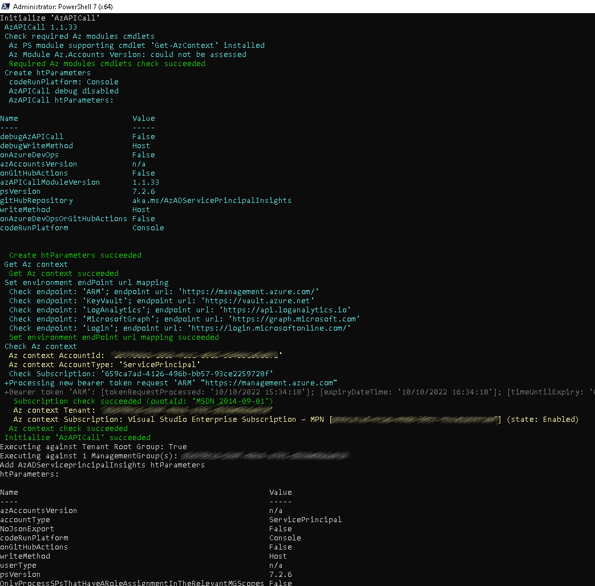
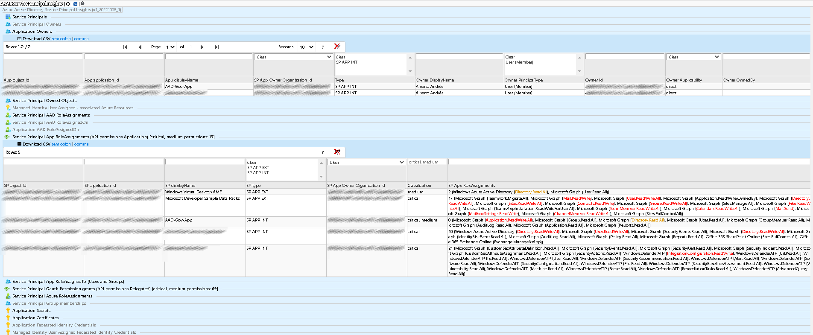
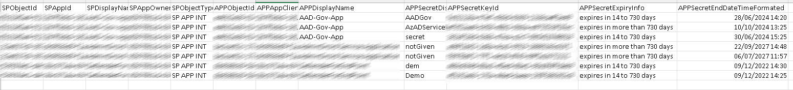
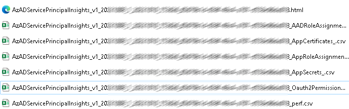
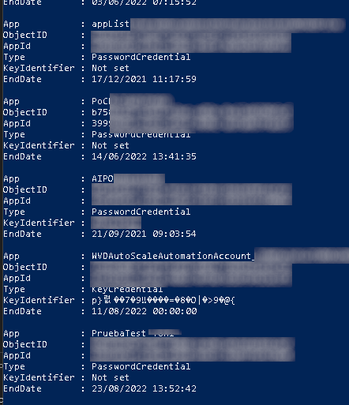

Es obvio, pero actualmente, muchos de nosotros estamos utilizando cada
vez más Azure AD para integrarlo con nuestras aplicaciones. ¿Cómo
estamos haciendo esta integración?

La mayoría de ellas con App Registrations, que no deja de ser una
combinación de permisos que le damos a dicha aplicación, para que se
autentique en el servicio (de forma impersonada o no), y podamos
realizar ciertas acciones contra las APIs a las cuales les hayamos dado
permisos.

Este tipo de solución tiene una pequeña limitación, que es la expiración
de los secretos o los certificados que van asociados a este tipo de
aplicaciones. ¿Qué provoca este tipo de situaciones? Pues a mi forma de
ver, uno de los problemas en la autenticación de aplicaciones, con lo
que la aplicación no puede autenticarse contra el servicio configurado,
y se pierden acceso a los recursos a los cuales previamente habíamos
dado permisos.

Como hacíamos en el mundo OnPrem, reemplazar un certificado o bien un
secreto, no es una tarea compleja, siempre y cuando la hagamos a tiempo.
El problema empieza cuando este tipo de tareas no se realizan, y
descubrimos que una aplicación ha dejado de funcionar repentinamente, y
lo peor es cuando no sabemos que hay por debajo configurado.

Por lo que tenemos una serie de puntos clave:

-   ¿Cómo podemos hacer seguimiento de las fechas de expiración de
    certificados y secretos?

-   ¿Cómo podemos montar una solución que nos ayude a ello?

-   ¿Cómo podemos estar notificados del número de días restantes?

La idea de este artículo es ver en detalle la solución de
AzGovADvertiser y ver cómo nos puede ayudar en situaciones del gobierno
de aplicaciones en AzureAD

En mi día a día, posiblemente esta es una de las piezas que podemos
tener montadas en nuestros entornos, llegando inclusive a montar otras
piezas con PowerShell, Runbooks, LogicApps, que nos den un punto más de
inteligencia y automaticen cosas por nosotros.

## Intro a las apps de Azure AD

Pero, antes de nada, hagamos un breve repaso a lo que son secretos y
certificados en Azure AD:

1.  **Secretos de cliente**: es una cadena secreta que la aplicación
    utiliza para probar su identidad al solicitar un token. También
    podemos llamarlo una contraseña de aplicación.

2.  **Certificados:** los certificados se pueden usar como secretos para
    probar la identidad de la aplicación al solicitar un token. También
    se puede denominar claves públicas.

En este punto, también necesitamos entender dos conceptos que harán
posible la integración y construcción de la solución:

-   **App registration:** Es necesario registrar una aplicación en Azure
    Portal y elegir el tipo de tenant para habilitar la administración
    de identidades y accesos. A partir de ese momento, es posible
    integrar su aplicación con Azure AD.

-   **Application Object:** El Application Object describe cómo el
    servicio puede emitir tokens para tener acceso a la aplicación, los
    recursos necesarios y las acciones que puede realizar la aplicación.

## ¿Como se comunican y autentican las apps?

Las aplicaciones se comunican de forma independiente, como daemons o
cuentas de servicio. Una aplicación envía sus propias credenciales (el
identificador de cliente y el secreto de cliente) al proveedor de
identidades que está configurado para generar un token de acceso. Si las
credenciales son válidas, el proveedor de identidades devuelve un token
de acceso a la aplicación cliente. Y aquí es donde entra en juego, el
App Registration, los secrets, certificados, etc...




Como es un engorro el tener que crear los secretos con una caducidad
máxima de 24 meses, hay una opción por PowerShell, que nos permite crear
AppRegistrations con mayor caducidad:

```
$startDate = Get-Date
$endDate = $startDate.AddYears(99)

$aadAppsecretName = New-AzureADApplicationPasswordCredential 
    -ObjectId YOURAPPID -StartDate $startDate -EndDate $endDate -CustomKeyIdentifier YOURSECRETNAME
```

En un mundo ideal, el propietario de la App, debería de ser el
responsable de tener procedimientos para monitorizar que las
credenciales van a expirar, etc... pero si has llegado hasta aquí, ya
sabes que no es el caso.

## ¿Y cómo puedo monitorizar mi entorno? ¿Cómo puedo saber de forma sencilla que apps tengo en mi AzureAD?

Ahora bien, ¿qué podemos hacer? Obviamente, monitorizar nuestro entorno,
y para ello haremos uso de una herramienta llamada
AzADServicePrincipalInsights ([GitHub -
JulianHayward/AzADServicePrincipalInsights: Insights and change tracking
on Azure Active Directory Service Principals (Enterprise Applications
and
Applications)](https://github.com/JulianHayward/AzADServicePrincipalInsights)
que nos ayudará muchísimo a dar un poco más de visibilidad de las
aplicaciones, permisos y propietarios de nuestro Azure AD.

## Preparación del entorno

Primero de todo, vayamos a ver en detalle qué información nos
proporciona la herramienta:

-   ServicePrincipals by type

-   ServicePrincipal owners

-   Application owners

-   ServicePrincipal owned objects

-   Managed Identity User Assigned - associated Azure Resources

-   ServicePrincipal AAD Role assignments

-   ServicePrincipal AAD Role assignedOn

-   Application AAD Role assignedOn

-   App Role assignments (API permissions Application)

-   App Roles assignedTo (Users and Groups)

-   Oauth permission grants (API permissions delegated)

-   Azure Role assignments (Azure Resources; Management Groups,
    Subscriptions, Resource Groups, Resources)

-   ServicePrincipal Group memberships

-   Application Secrets

-   Application Certificates

-   Application Federated Identity Credentials

-   HiPo Users (wip)

Ya vemos que la lista de cosas y objetos que vamos a obtener es extensa,
así que vayamos a ver como se ejecuta y el resultado final. Es una
herramienta que podemos ejecutar dentro de nuestros pipelines de Azure
DevOps, pero en mi caso y para hacerlo sencillo, lo he ejecutado de la
forma más simple que existe: creando un AppRegistration y ejecutándolo
como tal.

En mi caso, he ido al portal y he creado un nuevo AppRegistration y le
he dado permisos de:

-   Microsoft Graph API | Application | **Application.Read.All**

-   Microsoft Graph API | Application | **Group.Read.All**

-   Microsoft Graph API | Application
    | **RoleManagement.Read.Directory**

-   Microsoft Graph API | Application | **User.Read.All**

Y he creado un secreto para esta App (igual alguien se está empezando a
preguntar: ¿quién vigila a los vigilantes?). Le damos acceso al
ServicePrincipal creado a nivel de Root Management Group (ojo que para
ello debemos tener acceso a nivel de AAD):




Si tuvierais algún problema con esto, revisad a nivel de AAD la
propiedad siguiente:




Una vez hecho esto, me he descargado el repo anterior y he creado una
variable y me he autenticado, tal y como se indica en el repo de GitHub:

```
*#USER: 'Application (client) ID' of the App registration OR
'Application ID' of the Service Principal (Enterprise Application)
#PASSWORD: Secret of the App registration*

$pscredential = Get-Credential

Connect-AzAccount -ServicePrincipal -TenantId <tenantId> -Credential $pscredential

.pwshAzADServicePrincipalInsights.ps1
```

Y el script empezará a ejecutarse y a sacar alguna que otra información
en pantalla:




Una vez, tengamos el output, veremos que, en la misma raíz, nos habrá
generado una serie de ficheros con un reporte HTML interactivo:




Aquí podremos empezar a navegar y ver algunos detalles de nuestras
aplicaciones, inclusive, se generan unos CSV, donde podremos ver cierta
información de la caducidad de nuestros secretos y certificados:



Trabajando el fichero csv de salida, podríamos a llegar a generarnos
avisos en función del estado de la columna AppSecretExpiryInfo (aunque
como comentaba al principio, existen muchas soluciones para hacer un
seguimiento más exhaustivo de estos campos). Ya vemos que tenemos a la
salida diferentes ficheros, por lo que esto nos dará muchas ideas de lo
que podemos trabajar a posteriori con ello:




O si bien lo queremos integrar en un reporte y pintarlo de forma más
bonita.

## ¿Tengo alguna otra alternativa?

Claro que sí, por Internet hay multitud de alternativas para este tipo
de implementaciones, a mí me gusta la opción de KISS (keep it simple
stupid), así que vamos a ello:

```
#fecha expiración secretos (por ejemplo 30 días)

$LimitExpirationDays = 30

#sacamos la lista de secretos que expiran en esas fechas anteriormente
definidas

$SecretsToExpire = Get-AzureADApplication -All:$true |
ForEach-Object {

$app = $_

@(

Get-AzureADApplicationPasswordCredential -ObjectId $_.ObjectId

Get-AzureADApplicationKeyCredential -ObjectId $_.ObjectId

) | Where-Object {

$_.EndDate -lt (Get-Date).AddDays($LimitExpirationDays)

} | ForEach-Object {

$id = "Not set"

if($_.CustomKeyIdentifier) {

$id =
[System.Text.Encoding]::UTF8.GetString($_.CustomKeyIdentifier)

}

[PSCustomObject] @{

App = $app.DisplayName

ObjectID = $app.ObjectId

AppId = $app.AppId

Type = $_.GetType().name

KeyIdentifier = $id

EndDate = $_.EndDate

}

}

}

#sacamos la lista de secretos que van a expirar pronto

if($SecretsToExpire.Count -EQ 0) {

Write-Output "No secrets found that will expire in this range"

}

else {

Write-Output "Secrets that will expire in this range:"

Write-Output $SecretsToExpire.Count

Write-Output $SecretsToExpire

}
```

Y con esto, tendríamos una salida parecida a la siguiente:




Ya veis que este método es sencillo pero efectivo, ahora lo suyo sería
ejecutar esto en un runbook y enviarnos el resultado por correo, eso ya
depende de cada uno.

## Conclusión

Como hemos visto, esta es una posible solución para conocer un poco más
nuestro entorno y empezar a gobernarlo de una forma más efectiva,
empezando en este caso con toda la parte de aplicaciones, que nos acaban
facilitando mucho la vida para las conexiones, pero que, en términos de
gobierno, siguen siendo un gran desconocido.

¡hasta la próxima!


**Alberto Andrés Rodríguez**  <br />
Cloud Solutions Architect @ Seidor   <br />
@albandrod | [Alberto Andrés Rodríguez - | LinkedIn](https://www.linkedin.com/in/albertoar/)
