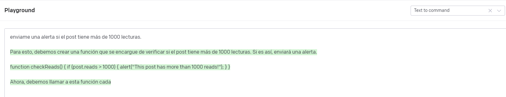

Hace muy poco tiempo, en una de mis intervenciones como speaker en un
evento, me preguntaban cuántos tipos de Inteligencia Artificial existen,
y yo simplifiqué en modo broma mi respuesta a "Solo hay dos tipos de IA:
la que mola y la que no mola".

Este artículo va de eso, de la Inteligencia Artificial que mola, pero
entre tantas y por no extenderme demasiado, he optado por escribir por
solo una de esas IA's que molan, que son útiles, que tienen un potencial
impresionante, y muchos etc. Resumiendo, veamos qué está haciendo la
gente de OpenAI en estos momentos.

Antes que nada, vale la pena aclarar que OpenAI es una empresa que se
autodefine como una compañía orientada a la investigación e
implementación de Inteligencia Artificial, cuya misión y objetivo es
asegurar una IA general (AGI) que beneficie a toda la humanidad. Busca
crear sistemas autónomos que solucionen problemas caros (desde un punto
de vista económico) y hacerlos públicamente disponibles, sea creando
ellos mismos cada solución o sentando las bases necesarias para que
otros logren el mencionado objetivo. Puedes encontrar más información en
[www.openai.com](http://www.openai.com)

Hay muchos proyectos de OpenAI sobre los que podríamos hablar, pero por
no extenderme en este artículo mencionaremos solo dos de ellos: GPT-3 y
DALL·E. Quiero dejar una mención especial a Jukebox (una red neuronal
que genera música y voz -- puedes ver más en https://openai.com/blog/jukebox/) que me ha sorprendido por lo fácil
de usar y los muy buenos resultados que he obtenido. Espero sea objeto
de otro artículo en breve.

**Modelos OpenAI**

Hay varios modelos ofrecidos por OpenAI, pero lo más conocidos son:

-   GPT-3 (Generative Pre-trained Transformer 3): es un modelo de IA
    autorregresivo, que utiliza Deep Learning para producir texto en
    lenguaje natural. Tiene multitud de aplicaciones posibles que
    veremos en detalle más delante.

-   DALL·E: es un modelo de Deep Learning pensado para generar imágenes
    a partir de descripciones realizadas en lenguaje natural.
    Básicamente es una subversión de GPT-3 modificada para generar
    imágenes, con capacidad adicional dirigida a la edición de esas
    imágenes. Verás sorprendentes ejemplos en este mismo artículo.

-   Codex: es un modelo de IA que analiza el lenguaje natural y genera
    código fuente como respuesta. Un ejemplo muy conocido de aplicación
    de Codex es GitHub Copilot, una herramienta que te ayuda durante la
    programación que realizas en Visual Studio.

**GPT-3**

Como comentaba anteriormente GPT-3 es un modelo de Inteligencia
Artificial autorregresivo. En este contexto, lo del "modelo
autorregresivo" implica que el modelo intenta completar una frase según
el resultado que parece más coherente, dependiendo siempre de sus
propias ejecuciones anteriores. Esto nos lleva directamente a poder
afirmar que cuanto más se utilice (a la vez que se corrige) mejor serán
los resultados.

La mejor forma de entender cómo funciona GPT-3 es utilizándolo y
probándolo, cosa que todos tenemos al alcance la mano. Simplemente con
visitar https://openai.com/ puedes darte de alta utilizando una
dirección de correo y una contraseña.

Una vez que hayas hecho lo anterior, pues saltar directamente a la
opción de "Playground" donde puedes ponerte a probar los distintos
modelos y ver cómo funcionan, simplemente introduciendo la frase que se
te ocurra. Como ejemplo mira el resultado de una prueba que he realizado
mientras escribía este párrafo:

Pero no contento con el resultado anterior probé cambiar la petición a
"Estoy escribiendo un artículo sobre GPT-3. *[Hazme un resumen
extendido]*." Y el resultado fue: "GPT-3 is a
third-generation machine learning platform that is designed to provide
more accurate and faster results than previous platforms. It is also
designed to be more user-friendly, with a focus on ease of use and
interpretability.". Como puedes ver, la palabra "extendido" ha variado
significativamente el resultado obtenido.

Pero he querido avanzar un paso más allá, y ¿qué pasaría si le pido que
directamente sea GPT-3 quien escriba el artículo? Pues aquí el
resultado:

El resultado es sorprendente, y aunque pudiese parecer que la respuesta
sigue siendo escueta, te invito a que juegues con la petición y los
parámetros de la derecha hasta que tenga el formato y extensión que
buscas.

En realidad, puedes pedirle que te responda sobre cualquier temática,
sin preocuparte de que GPT-3 "sepa" sobre qué cosa le estás hablando. El
modelo intentará siempre resolver la petición. Hace poco, durante un
evento en las oficinas de Microsoft invitamos al público a completar la
petición en tiempo real, el público iba agregando palabras y nosotros
hacíamos la petición. No teníamos ningún reparo en preguntar cualquier
cosa, y lo que buscábamos era sorprendernos todos comprobando su
capacidad.

Mirad los resultados que obtuvimos a la pregunta/input \"Cosas a tener
en cuenta cuando te vas a quedar calvo\":

Pero no todo se trata de completar texto, GPT-3 hace muchísimas más
cosas que te sorprenderán. Describir todas esas cosas en este artículo
lo haría infumable por su extensión, pero se me ha ocurrido mostrarte un
ejemplo para que tú juegues a tu libre albedrío a partir de aquí.

Como decía no todo se trata de completar texto, por lo quiero mostrarte
qué pasa si modificamos el parámetro "preset". He realizado la misma
petición sobre escribir el artículo de GPT-3 sin dar detalles, pero
modificando el preset a "convertir a un comando", y mira el resultado:

Dada la respuesta se nota que no he realizado la petición de forma
correcta, si lo que estoy esperando es un comando o una secuencia de
comandos para este ejemplo. Pero mira lo que pasa ante la siguiente
afirmación:

Ten en cuenta que no he indicado ni sobre que lenguaje o herramienta
estoy trabajando, por lo que sería ilógico pretender que la respuesta
esté orientada a un lenguaje de programación determinado. Lo que sí está
claro es que el pseudocódigo (por llamarlo de alguna forma) devuelto es
válido.

Como decía al principio la cantidad de aplicaciones que tiene GPT-3 se
presenta como enorme, pero hay una aplicación clara para utilizarlo en
todas aquellas apps y soluciones donde queramos mejorar la relación de
los mensajes emitidos hacia el usuario. No solamente queda claro que la
cantidad de temáticas se promete inmensa, sino que hay una mejora
sustancial en cómo brinda ese resultado en lenguaje natural, contando
además de que funciona en múltiples idiomas (incluida la traducción
entre los mismos) y la introducción de otros ámbitos de actuación como
es el propio Codex: "*tu dime lo que quieres hacer que yo escribo el
código*".

**DALL·E 2**

DALL·E está basado en el GPT que comentaba anteriormente, pero ha sido
modificado para generar los resultados en formato de imagen, en vez de
lenguaje natural. A igual que GPT-3 también puedes darte de alta con un
simple email y password y hay una cosa buena adicional; los créditos que
te asignan para GPT no son los mismos créditos que te asignan para
DALL·E, lo que te permite utilizarlos por separado y el uso/testing más
frecuente de uno no impacta en los créditos del otro.

Como he comentado anteriormente, la mejor forma de entender cómo
funciona DALL·E es darse de alta y probarlo, pero en lo que respecta a
este artículo quiero hacer especial mención a dos particularidades de
DALL·E.

**La generación de imágenes**

El interfaz de generación de imágenes es aún más fácil de utilizar que
el interfaz de GPT-3. Basta que escribas la frase que se te ocurra en la
barra de petición y le des al botón de generar. Pasados unos segundos
verás los resultados, que normalmente constan de 4 posibilidades
("respuestas") a lo que has pedido. Para mostraros un ejemplo, aquí
tenéis un pantallazo de la petición "cuadro de la última cena en estilo
Picasso".

No quiero saturaros con todos los ejemplos que se me ocurren, espero que
a partir de la idea anterior utilicéis vuestra propia imaginación para
generar lo que se os ocurra, pero hay una petición que he realizado
varias veces porque los resultados son sorprendentes y os la quiero
compartir:

Petición: "un informático bailando en la playa vestido de flamenco"

Resultado:

Cada vez que peticiono este ejemplo los resultados son diferentes, y
debes recordar que en realidad esas personas que aparecen en la imagen
no existen, han sido generadas en tiempo real. Otra cosa para tener en
cuenta es que automáticamente ha considerado la inclusión en los
resultados ya que la cuarta imagen es una mujer a pesar de que la
petición es "un informático". Y como no podía faltar, estos son los
resultados de la misma petición quitando la palabra "bailando".:

# 

**Outpainting**

Otra de las funcionalidades que se han agregado últimamente es la
capacidad de combinar imágenes existentes con imágenes generadas por
DALL·E, aumentando zonas de la imagen original en base a nuevas imágenes
generadas por DALL·E a petición. Funciona de la siguiente manera:

Como primer paso sube la imagen que quieras, o utiliza una que hayas
generado anteriormente con DALL·E.

Acto seguido te aparecerá la opción de recortar la imagen y una vez que
hayas ajustado el crop a tu criterio, dale a la opción "Editar Imagen"

En la pantalla de edición de la imagen selecciona agregar frame, y
posiciona el frame que extenderá tu imagen en la posición que quieras.
Cuando estés conforme con la posición actual la confirmas con un simple
clic:

Una vez que tengas el nuevo frame posicionado, ya puedes escribir en la
barra de peticiones lo que se te ocurra: estarás pidiendo lo que quieres
que DALL·E genere para completar tu imagen dentro de ese frame. En mi
caso he pedido que extienda la imagen con "la playa de Madrid"

Y este es el resultado:

En ese resultado (he elegido la mejor de cuatro opciones que me
presentó) observa cómo ha continuado el cielo y el agua de mi imagen
original, respetando no solo los colores y tonos, sino que también ha
respetado la distribución de cielo y agua. También ha agregado algo que
a lo lejos parecen las torres de la ciudad de Madrid, lo que pinta un
contorno bastante característico y reconocible. Podríamos seguir
ampliando esta foto con nuevas zonas, repitiendo una y otra vez el
proceso de agregar frame/posicionarlo/pintarlo.

Imagina la potencia de esta funcionalidad, ampliando el cuadro que más
te guste hacia zonas que el autor no pintó, respetando estilo, color y
formas, pero agregando lo que tu imaginación considere.

Hasta aquí este artículo, ampliaré las capacidades de OpenAI en los
siguientes. ¡Abrazo!

**Javier Menendez Pallo**   
AI MVP
 
 
import LayoutNumber from '../../../components/layout-article'
export default LayoutNumber
