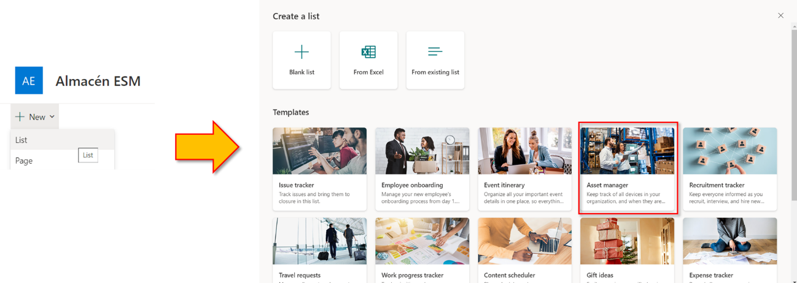

Hace unos días me plantearon la cuestión de crear un aplicativo para la
gestión de almacenes utilizando Microsoft 365. Se me ocurrió la idea de
que se podría aprovechar la funcionalidad que tiene SharePoint para
generar códigos de barras y la que tiene Power Apps para leer estos
códigos y crear así un pequeño sistema de gestión del stock del almacén
con la trazabilidad de los materiales almacenados en él.

A continuación, os muestro los pasos a dar para utilizar estos dos
componentes por si os sirve de ayuda en algún proyecto.

**PARTE SHAREPOINT**

La primera parte consistirá en crear un repositorio en SharePoint online
para almacenar los materiales del almacén y que éstos cuenten con un
código de barras único para poder identificarlos fácilmente.

La funcionalidad de SharePoint para generar códigos de barras está
incluida como una directiva en una opción denominada "*Configuración de
la directiva de administración de la información*" que hay en la
configuración de las listas y bibliotecas. Pero probablemente no lo
tengáis habilitado por defecto en vuestra colección de sitios. Para
habilitarlo, deberéis acceder a las características de la colección de
sitio (*Site settings* > *Site Collection Features*) y activar la
denominada "**Site Policy**" ('Retención basada en biblioteca y carpeta'
si lo tenéis en español.)

A partir de este momento, si accedéis a la configuración de las listas y
bibliotecas os encontraréis una nueva opción denominada "*Information
management policy settings*"

Una vez activada la característica, vamos a crear una lista que servirá
de repositorio para nuestro almacén. Para este ejemplo, he utilizado la
plantilla de lista "*Asset manager*" para aprovechar los diferentes
metadatos que contiene este template.

Una vez creada nuestra lista, tendremos que acceder a la configuración
de esta y habilitar los códigos de barra para los elementos allí
alojados. Para ello, accederemos a la opción "*Information management
policy settings*", seleccionamos el tipo de contenido *Elemento*
(*item*) y marcamos el ckech de "**Enable Barcodes**".

> En este caso, en la lista sólo tenemos el tipo de
> contenido Elemento. Si tuviésemos más tipos de contenido, podríais
> habilitar los códigos de barras para los tipos que fuese necesario.

Una vez habilitada esta directiva en la lista, se generará un código de
barras por cada nuevo elemento que se cree en la lista. Para
visualizarlo, podéis agregar a la vista de la lista los campos
"*Barcode*" y "*Barcode Value*".

Así, si creamos un nuevo elemento, podréis ver que se rellenan
automáticamente estos campos:

Si pulsáis sobre la imagen del código de barras, se abrirá en una nueva
pestaña mostrándolo en un tamaño superior por si lo quisieseis imprimir
para identificar el producto en el almacén.

Ya tenemos lista toda la parte de SharePoint para utilizarlo como
nuestro repositorio de elementos del almacén en este ejemplo. Como os
decía esto es sólo un ejemplo, pero podríamos agregar más campos
adicionales a nuestro repositorio del almacén, como, por ejemplo, un
metadato con el que indiquemos el número de unidades que tenemos
almacenadas de cada producto, o su ubicación.

Veamos ahora cómo utilizar estos códigos de barras en una aplicación
Canvas de Power Apps.

**PARTE POWER APPS (CANVAS APP)**

Para este ejemplo, crearemos una aplicación Canvas en blanco con formato
teléfono y le asociaremos la conexión a la lista de SharePoint del
**Almacén** creada en el apartado anterior. Por tanto, lo primero será
acceder al portal del maker de Power Apps y seleccionar *Create* >
*Blank app*.

Una vez creada nuestra aplicación, configuraremos la pantalla inicial
con el estilo que queramos y agregaremos la conexión SharePoint a la
lista **Almacén**.

**Pantalla 1: Alta de Elementos**

Ahora crearemos una nueva pantalla que será la que servirá para el alta
de elementos en nuestro stock del almacén. Para ello, utilizaremos el
template "Form"

En esta pantalla, vamos a modificar la propiedad *DataSource* del
*EditForm* para que sea nuestra lista **Almacén**:

Así, automáticamente tendremos el formulario de creación de elementos de
la lista SharePoint con unos cuantos campos (metadatos):

> Fijaos que ya se incluye el campo "**Device
> Photo**" que permite administrar de una forma muy fácil las imágenes de
> este tipo de columna de SharePoint.

Con este formulario, se podrán crear nuevos elementos en la lista de
SharePoint y, por tanto, se les generará automáticamente un código de
barras. Vamos ahora a mostrar ese código de barras en otra pantalla de
nuestra app.

**Pantalla 2: Detalle de un Elemento**

Ahora os voy a mostrar cómo visualizar el código de barras generado para
cada elemento en nuestra aplicación Canvas.

Para ello, he creado una nueva pantalla en la aplicación que he llamado
"Screen3_ViewForm" a la que se acceder directamente cuando se almacena
el elemento en el formulario de la pantalla anterior. Es decir, en el
evento '*OnSuccess*' del formulario de la pantalla anterior, almacenamos
el ID del elemento creado en una variable global y navegamos hasta la
nueva pantalla:

Set(_varCurrentID,EditForm1.LastSubmit.ID);Navigate(Screen3_ViewForm);

Ahora, en la pantalla de detalle, vamos a incluir un formulario cuyo
'*Default mode'* será '*View'* para observar la información almacenada
en el elemento creado. En él, indicaremos otra vez que el *DataSource*
es nuestra lista **Almacén** y que su propiedad *Item* es el registro
correspondiente al ID que almacenamos en la variable global.

LookUp(Almacén,ID=_varCurrentID)

En los campos del formulario, podéis agregar los correspondientes a
"*Barcode*" y "*Barcode Value*". Sin embargo, cuando lo probéis vais a
ver que la imagen del código de barras no se muestra correctamente,
aunque sí aparece el "*Barcode Value*".

Para poder visualizar correctamente el código de barras, tenéis que
modificar la propiedad *Image* del control e indicar la URL del código
de barras con el siguiente formato:

https://DOMAIN.sharepoint.com/sites/SITE/_layouts/15/barcodeimagefromitem.aspx?ID=ITEMID&list=LISTGUID

En mi caso, sería:
<https://esm2019.sharepoint.com/sites/AlmacnESM/_layouts/15/barcodeimagefromitem.aspx?ID=2&list=718c9235-d5ce-45c5-a301-3054055be6c0>

> Basta con que pulséis sobre la imagen del campo
> "Barcode" en la lista de SharePoint para que se os abra en una nueva
> pestaña y podáis ver esta URL.

Para que el ID del ítem sea dinámico, ya que lo tenemos almacenado en
una variable global, podemos componer la URL de la siguiente manera
aprovechando la interpolación de cadenas que nos ofrece Power Apps:

$"https://esm2019.sharepoint.com/sites/AlmacnESM/_layouts/15/barcodeimagefromitem.aspx?ID={_varCurrentID}&list=718c9235-d5ce-45c5-a301-3054055be6c0"

Ahora ya podréis observar cómo el código de barras se muestra
correctamente en nuestra app:

*[NOTA]*: Si tenéis problemas a la hora de que la aplicación
móvil muestre la imagen del código de barras con la URL de SharePoint,
podéis utilizar una URL de las que generan algunas webs de códigos de
barras pasando el valor del código. Por ejemplo, podéis usar la web
<https://www.barcodesinc.com/generator/index.php>
Así, la URL para la imagen quedaría de la siguiente forma:

$"https://www.barcodesinc.com/generator/image.php?code={ThisItem.'Barcode
Value'}&style=197&type=C128B&width=500&height=100&xres=1&font=3"

Si queréis, podéis crear una pantalla sólo con el código de barras e
incluir un botón con la función Print() para que se imprima la pantalla
y así podáis tener una etiqueta con este código de barras.

**Pantalla 3: Escanear un Código de Barras**

Ya tenemos implementada la funcionalidad de generación de elementos en
SharePoint con código de barras y su pantalla de visualización. Ahora
nos falta la funcionalidad que lea estos códigos de barras. Para ello,
vamos a crear una nueva pantalla en la aplicación Canvas que llamaremos
"Screen4_Scan" y en la que vamos a incluir un control de tipo "**Barcode
scanner**" que está en el apartado *Media*.

Al agregarlo, se incluirá un botón con el texto "**Scan**" que será el
que activará la cámara del dispositivo cuando lo pulse el usuario.

Dado que utiliza la cámara del dispositivo, este componente sólo es
compatible con dispositivos Android, iOS y Windows. Si lo intentáis
utilizar en la web, recibiréis un mensaje de error:

Aquí tenéis más información sobre este control y sus limitaciones:

<https://learn.microsoft.com/en-us/power-apps/maker/canvas-apps/controls/control-new-barcode-scanner>

Cuando el usuario realice un escaneo utilizando este botón, el valor del
código escaneado se guardará en el *Value* del control. Por tanto,
podríamos guardar el valor en una variable de contexto de la siguiente
forma:

UpdateContext({_varCodeScanned:Self.Value});

Y ahora, podríamos recuperar el elemento correspondiente de nuestro
repositorio **Almacén** a través de la columna del "*Barcode Value*" y
guardarlo en una colección. En mi caso, lo hice de la siguiente forma:

ClearCollect(ColItemScanned,LookUp(Almacén,'Barcode
Value'=_varCodeScanned));

Ahora que tenemos almacenados los elementos en una colección, los
podemos mostrar fácilmente en alguno de los componentes de Power Apps.
Por ejemplo, los podemos mostrar en una galería estableciendo la
colección en su propiedad *Items*.

De esta forma, cuando el usuario pulse el botón **Scan** desde su
teléfono móvil, se habilitará la cámara para escanear un código de
barras y, una vez escaneado, la información correspondiente se le
mostrará en la galería de la pantalla de la siguiente forma:

Con esto concluyo este artículo. No he pretendido entrar en el detalle
de todos los pasos a dar para la aplicación de Power Apps porque no era
el objetivo de este artículo. Sólo quería mostraros un ejemplo de esta
funcionalidad de SharePoint y cómo utilizarla en una aplicación de Power
Apps. Seguro que se os ocurren miles de ideas para sacarle partido a
estos componentes.

Espero que os haya gustado.

**Enrique Sánchez Moreno**   
Cloud Services Manager en ILUNION IT Services.  
[www.esanchezm.com](http://www.esanchezm.com)
