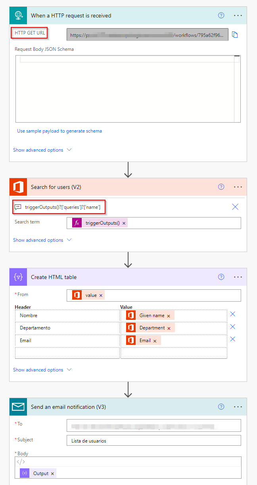
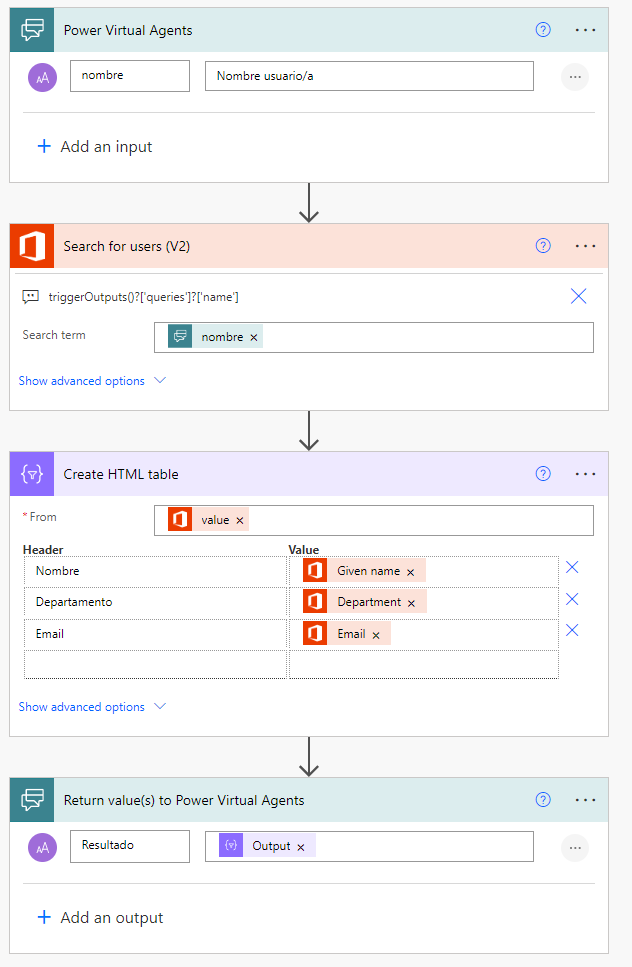
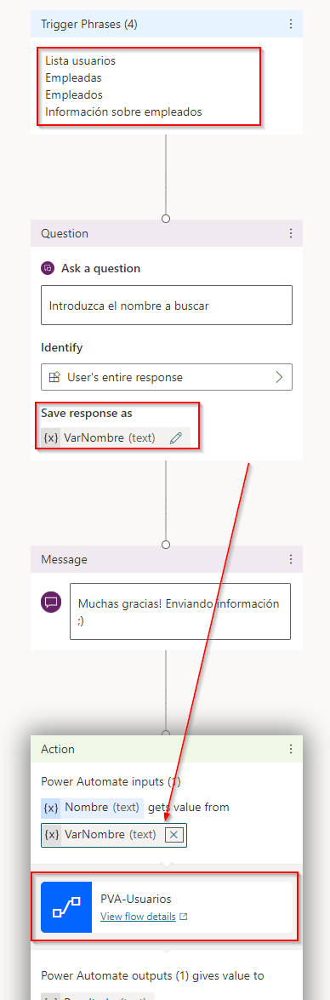
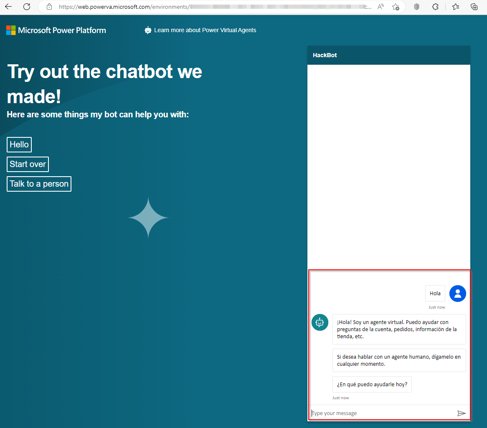
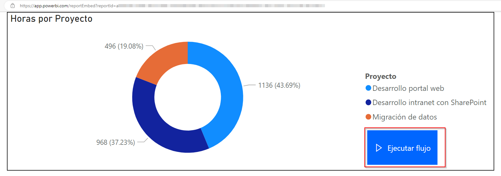
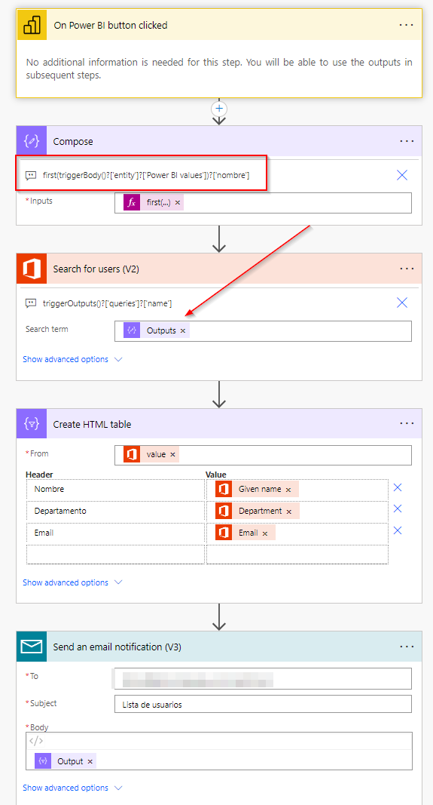

**Contexto: El entorno "Default" o "Personal Productivity"**

Como bien sabéis, en la Power Platform podemos trabajar con distintos
entornos (*environments*), que a los que podemos dar acceso a un
conjunto especifico de usuarios, además aplicar ciertas políticas de
seguridad (DLP), basada principalmente en definir qué conectores se
pueden utilizar. La aparición de los entornos administrados[^1]
(*managed environments*) supone una mejora importante en la gestión de
estos entornos por parte de los administradores.

Aun así, existe un entorno que nunca podemos eliminar, y al que no
podemos restringir el acceso a los usuarios. Se trata del entorno por
defecto, también conocido como "*Default*" o "*Personal Productivity*",
que tiene algunas características que merece la pena destacar[^2]:

-   Cada vez que un nuevo usuario se registra en Power Apps, se le
    agrega automáticamente al rol Creador de entornos del entorno
    predeterminado.

-   No se puede eliminar el entorno predeterminado.

-   El entorno predeterminado está limitado a 1 TB de capacidad de
    almacenamiento.

Es decir, cualquier usuario que tenga una licencia asignada de Power
Apps o Power Automate tiene acceso automáticamente a este entorno, con
lo que puede empezar a crear sus aplicaciones y flujos cuando desee. Así
que... ¡Controla el entorno por defecto en la Power Platform!

**Caso 1: Power Automate y el conector *Request***

Como una imagen vale más que mil palabras, vamos a mostrar el siguiente
flujo y descubrir lo que está haciendo:

Los pasos del flujo son los siguientes:

1.  Cuando se envía una petición "GET" a la URL
    [*http://prod-200.westeurope.logic.azure.com:443/workflows/\...&name=Miguel*](http://prod-200.westeurope.logic.azure.com:443/workflows/...&name=Miguel)

2.  Buscamos a los usuarios con el nombre o apellido Miguel.

3.  Creamos una tabla en formato HTML con los resultados, seleccionado
    los campos Nombre, Departamento y dirección de correo electrónico.

4.  Enviamos un correo electrónico (bajo la cuenta genérica de Power
    Automate) con la tabla HTML creada en el paso previo.

Por lo tanto, haciendo una petición GET a una URL específica, desde
cualquier aplicación o servicio, podemos obtener los resultados de la
búsqueda por nombre en el directorio activo de la compañía. Interesante,
¿verdad?

En este caso tenemos distintas soluciones:

  | **Solución**          |   **Inconveniente**     |    **Alternativa** |
  | ----------------------| ------------------------| -------------------|
  | Deshabilitar el conector | Podrían existir flujos | en Habilitar el
  | Request                  | el entorno por defecto |    conector solo para
  |                          | que necesiten usar este|    flujos específicos
  |                          | conector               |    creando una
  |                                                   |  excepción de
  |                                                   |  DLPs[^3]
  | | |
  | Mover el flujo a otro    | Necesitamos crear otro |    
  | entorno                  | entorno, y eso tiene un|    
                             | coste a nivel económico.|   
  | | | 
  | Establecer lógica en el  | El flujo se ejecuta       | Adquirir una
  | propio flujo (validar    | igualmente, y por tanto,  | licencia Per App o
  | los datos que se envían  | computa para el número    | Per User para
  | en la cabecera de la     | total de llamadas         | ampliar el número de
  | petición, por ejemplo)   | (recordemos que hay       | llamadas que se
  |                          | limitaciones en el número | pueden realizar al
  |                          | de llamadas por cada 24h) | flujo

**Caso 2: Power Virtual Agents (prueba), flujos de Power Automate y sitios web**

Como bien sabéis, Power Virtual Agents nos permite crear chatbots
fácilmente, y un usuario puede empezar a usar la versión de prueba
(*trial*) si ésta no está deshabilitada[^4] dentro de la organización.

Por lo tanto, podemos crear un chatbot que ejecute un flujo cuando el
usuario escribe una palabra concreta o elige una palabra específica. El
flujo por ejecutar sería similar al que mostramos en el caso anterior,
aunque el disparador sería el de Power Virtual Agents:

El chatbot podría disparar el flujo cuando se introducen algunas
palabras clave, tal y como mostramos seguidamente:

Finalmente, este flujo se podría publicar en uno o más canales, como
Teams, Facebook, Slack, o un en un sitio web:

De hecho, la forma más sencilla, sería publicar el chatbot en un "Demo
website" donde se genera una URL para acceder al mismo y que es del
estilo: *https://web.powerva.microsoft.com/environments/* y que se
mostraría de la siguiente manera:

Desde aquí podríamos introducir las palabras clave que indicamos y
disparar el flujo para obtener la información de los usuarios.

En este caso tenemos distintas soluciones:

  |**Solución**             |**Inconveniente**         |**Alternativa** |
  | ----------------------| ------------------------| -------------------|
  |Deshabilitar las         |Si un usuario quiere      | |
  |licencias de prueba de   |probar Power Virtual      | |
  |Power Virtual Agents     |Agents tiene que pedir    | |
  |                         |autorización a la         | |
  |                         |persona/departamento      | |
  |                         |correspondiente           | |
  |Deshabilitar el conector |No se pueden llamar a     |Mover el chatbot a |
  |de Power Virtual Agents  |flujos desde chatbots, lo |otro entorno |
  |                         |que limita su             |distinto del entorno |
  |                         |funcionalidad             |por defecto |

**Caso 3: Power BI y flujos de Power Automate**

Una funcionalidad de Power BI que puede pasar desapercibida para muchos
usuarios es que es posible ejecutar un flujo de Power Automate desde un
cuadro de mandos o informe mediante un botón[^5].

El flujo es muy similar a lo que hemos visto en los casos anteriores,
donde únicamente cambia el disparador del flujo.

Cabe destacar que actualmente los flujos que se quieran ejecutar desde
un informe de Power BI deben estar almacenados en el entorno por
defecto[^6].

Por lo tanto, generando una URL para incrustar el informe en una página
web, podríamos acceder al mismo desde cualquier navegador. La URL
generada es del estilo:
*https://app.powerbi.com/reportEmbed?reportId=1234-\....*

Teniendo en cuenta estos factores, las posibles soluciones para evitar
esta problemática son las siguientes:

  |**Solución**             |**Inconveniente**         |**Alternativa** |
  | ----------------------| ------------------------| -------------------|
  |Deshabilitar el conector |Podrían existir flujos en |Habilitar el
  |Power BI                 |el entorno por defecto    |conector solo para
  |                         |que necesiten usar este   |flujos específicos
  |                         |conector                  |creando una
  |                         |                          |excepción de
  |                         |                          |DLPs[^7]
  | | |
  |Establecer lógica en el  |El flujo se ejecuta       |Adquirir una
  |propio flujo (validar    |igualmente, y por tanto,  |licencia Per App o
  |los datos que se envían  |computa para el número    |Per User para
  |en la cabecera de la     |total de llamadas         |ampliar el número de
  |petición, por ejemplo)   |(recordemos que hay       |llamadas que se
  |                         |limitaciones en el número |pueden realizar al
  |                         |de llamadas por cada 24h) |flujo

**Conclusiones**

Seguro que muchos de nuestros lectores/as tienen otras sugerencias para
evitar estas "malas prácticas" al usar distintos servicios de la Power
Platform, o se les ocurren nuevas formas para obtener los mismos
resultados. En cualquier caso, esto nos debe servir para reflexionar y
pensar en el modelo de gobernanza y administración de la Power Platform
que queremos en nuestra organización, seguramente proporcionando al
usuario la mayor libertad posible, pero a la vez, garantizando una
correcta seguridad y, en definitiva, un buen uso de la tecnología.

¡Happy Power Platform!

**Ferran Chopo**  
Solution Expert -- MVP Business Apps - MCT  
ferran@ferranchopo.com  
@fchopo  

[^1]: https://learn.microsoft.com/es-es/power-platform/admin/managed-environment-overview
[^2]: https://learn.microsoft.com/es-es/power-platform/admin/environments-overview#the-default-environment
[^3]: https://learn.microsoft.com/es-es/power-platform/admin/powerapps-powershell#dlp-resource-exemption-cmdlets
[^4]: https://learn.microsoft.com/es-es/power-virtual-agents/requirements-licensing#trial-plans
[^5]: https://learn.microsoft.com/en-us/connectors/powerbi/#power-bi-button-clicked
[^6]: https://learn.microsoft.com/en-us/power-automate/trigger-flow-powerbi-report#known-limitations
[^7]: https://learn.microsoft.com/es-es/power-platform/admin/powerapps-powershell#dlp-resource-exemption-cmdlets 
 
import LayoutNumber from '../../../components/layout-article'
export default LayoutNumber
