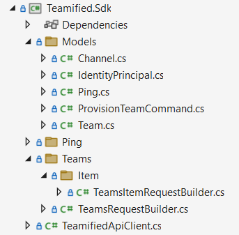
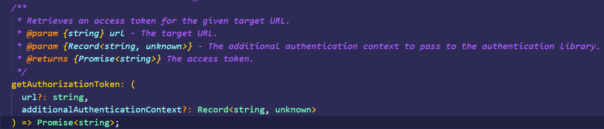

En este artículo, os voy a hablar de Kiota. Kiota es una herramienta
desarrollada por Microsoft, open-source, y que permite generar código
para crear un cliente / SDK para cualquier API descrita con OpenAPI.

Os doy algo más de contexto aplicado a un caso real. En mi empresa,
ClearPeople, desarrollamos un producto por encima de Microsoft 365.
Dicho producto, expone una API que es consumida por diferentes
"*consumers*", principalmente Web Parts desarrollados en SharePoint
Framework (SPFx), pero también, otras aplicaciones backend, como Azure
Functions. No tardamos mucho en tener algunos clientes de nuestro
producto, interesados en consumir directamente nuestra API, para sus
propias integraciones y desarrollos a medida. Inicialmente,
proporcionábamos cierto código con ejemplos de cómo consumir la API, y
siempre tuvimos en nuestro backlog, el poder ofrecer un SDK "como tal".
Sin embargo, desarrollar un SDK, no es trivial, y, además, primero
tienes que priorizar, qué lenguajes soportas en tus SDKs: ¿TypeScript?,
¿.Net?, ¿Python?\...

Por suerte, hace cosa de un año, Microsoft presentó Kiota, y su función,
resolvía exactamente nuestro problema. Podíamos tener un SDK
directamente desde nuestra API, en menos de 1 minuto, y pudiendo generar
diferentes lenguajes. Hoy en día, Kiota soporta: TypeScript, C#, Java,
Python, PHP, Ruby, Go, Swift, Shell.

Kiota se puede instalar de diferentes maneras: dotnet tool, en un Docker
container, o incluso bajándote su código y compilándolo tú mismo. Una
vez instalado, tan sólo necesitamos ejecutar el siguiente comando:

Además del lenguaje deseado y la ubicación de los ficheros
autogenerados, Kiota necesita un fichero con la descripción OpenAPI de
la API.

## ¿Qué es OpenAPI?

OpenAPI es una iniciativa creada por un consorcio de gente experta en el
mundo de las APIs, que definieron un estándar para describir APIs. La
imagen siguiente muestra la descripción en OpenAPI del endpoint Me de
Microsoft Graph API:

Lo que vemos es un fichero YAML (también puede ser JSON), que define la
API. Vemos título y versión, vemos el endpoint "*me*", con su verbo GET,
que devuelve un código 200, con un objeto "*microsoft.graph.user*", que
vemos definido más abajo, con su propiedad "*id*" y "*displayName*".

Este contenido, es el que debemos guardar en un fichero .yaml o .json, y
que pasaremos como parámetro a Kiota.

Obviamente, nadie espera crear ese fichero "a mano", existen diversas
herramientas que generar la descripción desde el propio código de la
API. Si vienes de mundo .net, seguro que conoces Swagger.

Como curiosidad, antes de pasar al siguiente apartado, en la siguiente
imagen, extraída de la web de OpenAPI
(https://www.openapis.org/about), podemos ver a la gran Yina Arenas,
Head of Product de Microsoft Graph.

## Usando nuestro cliente generado con Kiota desde .NET

Ahora que ya sabemos cómo generar nuestro SDK, vamos a ver cómo podemos
usarlo desde una aplicación de consola .NET. Primero, la siguiente
imagen nos muestra el código generado para una API que interactúa con
Microsoft Teams:

> Para poder usar este código, necesitamos que nuestro proyecto
> instale ciertos paquetes nuget creados por el equipo de Kiota. Para
> saber qué paquetes necesitamos, podemos sacarlos de la documentación
> oficial, o podemos hacer uso del comando "Kiota info", que nos listará
> los paquetes a instalar (y esto aplica a cada lenguaje, es decir, para
> .NET, serán paquetes nuget, para TypeScript serán "npm", etc).

Nuestro punto de entrada es la clase "*TeamifiedApiClient*", y para
poder usarla, tenemos primero que crearnos un *AuthenticationProvider*,
y seguidamente un *RequestAdapter*. El primero se encargará de
Autenticar nuestro cliente contra la API, que está asegurada con Azure
AD, y el segundo, se encarga de realizar las llamadas HTTP a la API. La
siguiente imagen nos muestra el código:

Una vez creado nuestro cliente, podemos hacer una llamada a la API con
una sencilla línea de código:

## Usando nuestro cliente generado con Kiota desde SPFx

En esta sección vamos a ver cómo podemos usar un cliente TypeScript
generado por Kiota, desde un Web Part desarrollado con SPFx. A
diferencia de con .NET, para SPFx, Kiota no ofrecía un paquete para
poder crear un Authentication provider que funcionara en SPFx, así que
tuve que desarrollarlo por mi cuenta. Aun así, no fue difícil, ya que
Kiota ofrece una serie de interfaces que podemos implementar a nuestro
gusto. Además, a la hora de obtener un token en SPFx para una API
protegida por Azure AD, SPFx nos proporciona ya un objeto para hacerlo:
"AadTokenProvider", así que lo único que había que hacer es ver la
manera de implementar un custom AuthenticationProvider de Kiota, que
hiciera uso del AadTokenProvider proporcionado por SPFx.

Os cuento cómo desarrollé el AuthenticationProvider para SPFx, puesto
que creo que es interesante y útil para ocasiones en las que necesitáis
construir vuestro propio AuthenticationProvider. Sin embargo, ya os
adelanto que envíe una Pull Request al repositorio de Kiota TypeScript,
y que ha sido aceptada por el equipo de Microsoft, por lo que ahora
mismo ya podéis instalar directamente el paquete, y hacer uso directo en
vuestra solución SPFx.

Para implementar el AuthenticationProvider, primero implementé la
interfaz de Kiota *AccessTokenProvider*, con su método
*getAuthorizationToken*

Dicho método, simplemente debe devolver un token válido, cosa que
podemos hacer directamente con el objeto de SPFx AadTokenProvider,
llamando a su método *getToken*

Así que lo que hice fue pasar el *AadTokenProvider* por el constructor
de la clase custom que implementa *AccessTokenProvider*, pasando
también, un string que contiene el *application id URI* de la API
registrada en Azure AD.

Con esto, el método de nuestro *AccessTokenProvider*, sería:

El siguiente paso es crear un *AuthenticationProvider* (que hará uso de
la clase *AccessTokenProvider* que acabamos de crear). En este caso,
Kiota nos proporciona una clase base que podemos extender, y que nos
ahorra bastante trabajo que si tenemos que definir nuestro
AuthenticationProvider desde cero:
"*BaseBearerTokenAuthenticationProvider*". Extendiendo dicha clase, sólo
necesitamos llamar a su constructor, pasando nuestro
*AccessTokenProvider*.

Con estas 2 clases custom, ya podemos usar el cliente de Kiota desde
nuestro SPFx webpart:

Si quitamos la parte de desarrollar el custom Provider, que como os
digo, ya está disponible como paquete NPM, el uso de nuestro cliente
generado por Kiota, es sencillísimo y basta con unas pocas líneas de
código (sin contar el que ya genera Kiota, claro, que ahí está la gracia
de aprovecharse de esta gran herramienta).

## Referencias

-   Documentación oficial: https://microsoft.github.io/kiota

-   Repositorio GitHub con los paquetes TypeScript para Kiota, entre
    ellos, los de Autenticación para SPFx de mi contribución y
    comentados en el artículo:
    https://github.com/microsoft/kiota-typescript

-   Repositorio GitHub con mi sesión sobre Kiota impartida en el pasado
    CollabDays Barcelona:
    https://github.com/luismanez/collabdays-bcn-2022

-   Demo de uno de los PMs de Kiota:
    https://www.youtube.com/watch?v=q-MIYdo1K8Q

¡Hasta el próximo artículo!

**Luis Mañez**  
Chief Architect en ClearPeople LTD   
@luismanez  
https://github.com/luismanez
