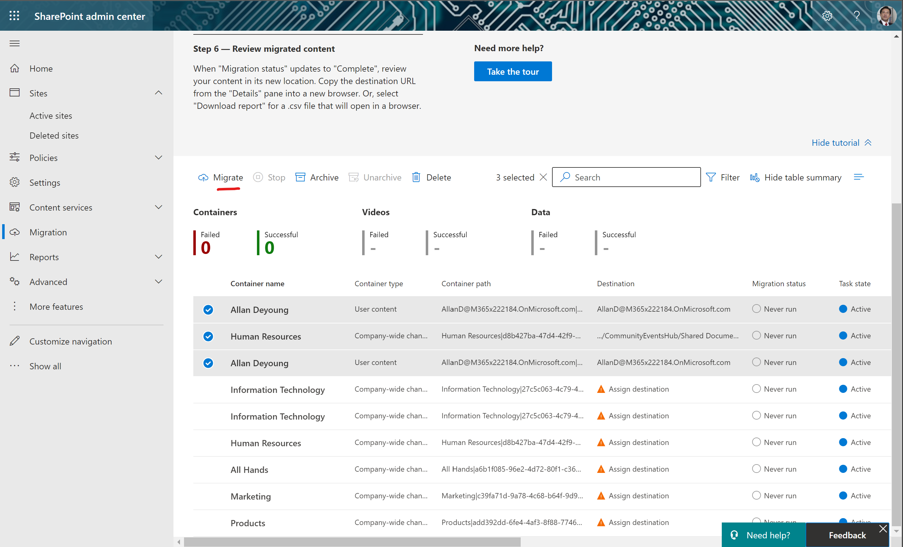

Como sabéis, la nueva versión de Stream está construida sobre SharePoint
Online (SPO) y OneDrive for Business (ODFB) y en la transición desde la
versión clásica de Stream a Stream en SharePoint nos faltaba conocer
como íbamos a poder migrar nuestros canales y videos. En este artículo
vamos a ver como Microsoft ha habilitado dicha migración desarrollando
un conector específico (actualmente en Preview) para Migration Manager,
una de las herramientas de migración disponibles cuando necesitamos
migrar contenidos a SPO y ODFB. En este artículo revisaremos como
podemos ir migrando canales y videos desde Stream Clásico a Stream en
SharePoint.

**Accediendo a la herramienta migración de Stream Clásico a Stream en
SharePoint**

El primer paso en la migración de Stream Clásico a Stream en SharePoint
pasa, tras la correspondiente organización y Planning de cómo queremos
hacer la transición entre versiones, acceder a la herramienta de
migración bien desde el Admin Center de Stream Clásico o directamente
desde el Admin Center de SPO:

-   Si accedemos desde el Admin Center del Stream Clásico, veremos que
    se realiza a través de la sección habilitada al efecto:

Si hacemos clic en el botón "Launch Migration tool", apareceremos
directamente en la sección de Migration Manager en el Admin Center de
SPO.

-   Si lo hacemos desde el Admin Center de SPO, veremos que hay una
    opción Stream (Preview) disponible:

**Descubriendo canales y contenidos a migrar**

Lo primero que nos vamos a encontrar, independientemente de cómo
lleguemos a la herramienta de migración, es la sección de escaneos
(Scans) en la que al cabo de un tiempo veremos lo que Migration Manager
ha descubierto en cuanto a Contenedores y Contenido de estos en Stream
Clásico. Además, en esta sección por defecto podemos ver en la cabecera
el paso a paso a seguir para realizar la migración:

Como podéis ver, para el escaneo realizado tenemos un resumen de
contenedores (Canales de Stream), Video encontrados y tamaño de estos.
Debajo del resumen se muestra el listado de los contenedores escaneados
y si hacemos clic en uno de los contenedores, veremos información de
detalle de este:

Como podréis comprobar, el escaneo no solo descubre canales de Stream
sino contenido asociado a un usuario que además interpreta que se
tendría que migrar a su ODFB.

**Migrando Videos desde Stream Clásico a Stream en SPO**

Con el escaneo realizado y teniendo claro donde vamos a migrar los
videos de los contenedores identificados, empezar la migración es una
tarea sencilla: solo tenemos que seleccionar los contenedores a migrar y
hacer clic en "Add to migrations":

Una vez añadidos los contenedores a migrar, para proceder a su migración
haremos clic en la pestaña "Migrations" donde de nuevo veremos un
overview del proceso y en la parte inferior los contenedores que se van
a migrar. Para algunos de estos contenedores será necesario indicar el
destino, mientras que para otros la herramienta hace una propuesta
automáticamente:

Para cambiar el destino de los contenidos de un contenedor de Stream
clásico, simplemente hacemos clic en el mismo. De esta forma se abre un
panel lateral que nos permite indicar la ubicación de destino de los
videos del contenedor:

Si hacemos clic en el enlace "Edit" bajo Destination, podremos indicar
si los videos se migrarán a SPO o a ODFB.

Una vez indiquemos el Sitio, podremos elegir en que Biblioteca y en que
carpeta queremos migrar los contenidos:

También tendremos la posibilidad de crear la carpeta de destino:

Cuando estemos listos con los contenedores a migrar, simplemente los
seleccionamos y hacemos clic en "Migrate". En mi caso voy a migrar tanto
a SPO como a ODFB:

A continuación se abrirá un panel lateral en el que simplemente
revisamos la información que se muestra relativa a la migración y
hacemos clic en Migrate:

Las tareas de migración lanzadas serán primero "encoladas" en Migration
Manager que poco a poco irá migrando los contenidos a los destinos
seleccionados:

Para a continuación realizarse la migración. Como se puede ver en la
siguiente captura, en mi caso se ha migrado uno de los tres contenedores
y podemos ver también la cantidad de información que se ha migrado:

De nuevo, si hacemos click en uno de estos contenedores podremos ver en
este caso los detalles en cuanto a cómo ha ido la migración:

Y por supuesto, podemos verificar que los videos se han migrado
incluyendo metadatos de estos como la persona que creó/cargó
originalmente el video en Stream Clásico.

En el caso de los contenedores cuyo destino de migración es el ODFB del
usuario, a pesar de que han dado error en mi caso también algunos de los
videos se han migrado y se pueden encontrar en dicho ODFB.

Finalmente, a nivel de trazabilidad de cómo ha ido el proceso tenemos
disponibles los LOGs de migración.

**Conclusiones**

Para cerrar el círculo en la transición desde Stream Clásico a Stream en
SharePoint, Microsoft nos proveed como parte de Migration Manager de la
posibilidad de migrar nuestros videos de Stream a SPO u ODFB. El proceso
de migración es muy directo y empieza con un escaneo previo para
descubrir contenedores y videos en dichos contenedores como paso previo
a su migración.

**Referencias**

-   [Overview of migrating from Microsoft Stream (Classic) to Stream (on
    SharePoint) - Microsoft Stream \| Microsoft
    Learn](https://learn.microsoft.com/en-us/stream/streamnew/stream-classic-to-new-migration-overview)

-   [Stream (Classic) to Stream ( on SharePoint) migration tool -
    Microsoft Stream \| Microsoft
    Learn](https://learn.microsoft.com/en-us/stream/streamnew/understand-the-tool)

-   [Step by Step guide to run the migration tool - Microsoft Stream \|
    Microsoft
    Learn](https://learn.microsoft.com/en-us/stream/streamnew/step-by-step-guide)

**Juan Carlos Gonzalez**  
M365 Apps & Services MVP | M365 SME & Delivery Manager   
@jcgm1978 | https://www.linkedin.com/in/juagon/
