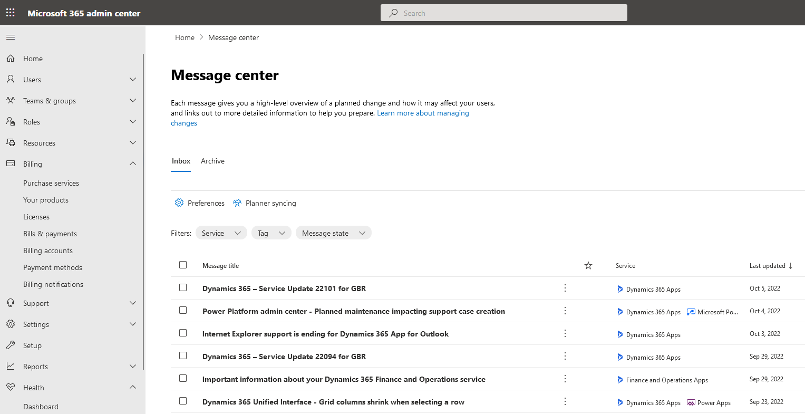

A medida que pasa el tiempo y a raíz del uso continuado de los productos
informáticos, inevitablemente vamos a encontrarnos con alguna de las
siguientes situaciones

1.  El producto degrada sus prestaciones y necesita alguna actualización.

2.  El fabricante proporciona una actualización que corrige algún fallo, o proporciona nuevas funcionalidades

3.  Se produce la obsolescencia del producto o el fin de vida del producto.

En cualquiera de ellos, es necesario un apropiado proceso de prueba que
nos permita determinar si el nuevo paquete/versión se ajusta a las
necesidades de los usuarios, el impacto que tiene sobre la
infraestructura o si afecta algún otro componente ya sea del mismo
fabricante, de terceros o customizaciones realizadas por nosotros.

Cuando hablamos de entornos OnPremise, es importante un proceso adecuado
de revisión, prueba y validación: infraestructura similar,
integraciones, casos de uso comunes, seguridad., etc.  También es
importante una adecuada estrategia de comunicación que nos permita
mantener informados a los responsables tecnológicos, pero también las
áreas funcionales y de negocio a las que se brindan los servicios y que
se vean afectadas.

En los departamentos de IT suele haber una serie de procesos que recaen
en algún miembro de los distintos equipos, de documentar las versiones
actuales de software, fechas de fin de servicio, Service Packs/Service
Update o hotfixes, así como los contratos que puedan haber firmados con
los proveedores indicando fechas de inicio y finalización, tiempos de
respuesta, etc.

Sin embargo, con la entrada de tecnologías Cloud, la introducción de
mejoras en la infraestructura ya no es un proceso que esté cien por
ciento en nuestro control, sino que queda en manos del proveedor.
 Incluso, para aquellos servicios PaaS y SaaS, es importante comprobar
periódicamente las actualizaciones previstas, las fechas o frecuencia en
que se realizan, ventanas de mantenimiento, etc

Para el caso de Power Platform y Dynamics 365, hay tres puntos
fundamentales de analizar:

1)  Todas las notificaciones son enviadas de forma predeterminada al
    Centro de Mensajes de Microsfot 365 y al Service Health Dashboard.
    Esto incluye actualizaciones e incidentes de servicio. De forma
    predeterminada, no se envían notificaciones por correo a los
    administradores de cada entorno de Power Platform.

Más detalles pueden leerse en
[https://learn.microsoft.com/en-us/office/office-365-management-api/office-365-service-communications-api-reference]](https://learn.microsoft.com/en-us/office/office-365-management-api/office-365-service-communications-api-reference)

2)  Para el caso de las 2 oleadas (Waves) en las que se liberan nuevas
    funcionalidades, es importante probar en un entorno Sandbox (con una
    copia de producción) las nuevas características y su impacto en
    nuestras personalizaciones y data. Es posible optar en este caso a
    un "acceso temprano" que nos dá entre 6 y 9 semanas para hacer una
    revisión.

Podemos ver cómo suscribirnos al "acceso temprano" en
[[https://learn.microsoft.com/en-us/power-platform/admin/opt-in-early-access-updates]](https://learn.microsoft.com/en-us/power-platform/admin/opt-in-early-access-updates).

3)  En el Centro de Mensajes de Microsoft 365 suelen publicarse los
    datos de aquellas actualizaciones planificadas y que pueden
    impactarnos:

En la imagen podemos ver algunos ítems relevantes tales como fin de
soporte, actualizaciones de servicio, etc. En
[[https://learn.microsoft.com/en-us/power-platform/important-changes-coming]](https://learn.microsoft.com/en-us/power-platform/important-changes-coming)
podemos revisar el detalle de los cambios que van a introducirse en la
plataforma relacionados con el fin de servicio o deprecaciones sobre
distintos componentes

**Conclusión**

Es conveniente que los departamentos de TI destinen recursos (humanos,
tiempo) para realizar esta revisión, analizar sus resultados y tomar las
medidas apropiadas. Un primer enfoque es añadir esta tarea a la lista de
los Administradores de Power Platform/Dynamics. Dependiendo del tamaño
de la organización, otro enfoque interesante sería la creación de un rol
dentro del equipo de Administradores para contar con recursos
específicos dedicados a la revisión, prueba y documentación.

**Daniel Pérez Aguiar**  
perezaguiar@programmer.net  
@perezaguiar  
https://www.linkedin.com/in/daniel-p%C3%A9rez-aguiar-a6981a121/
