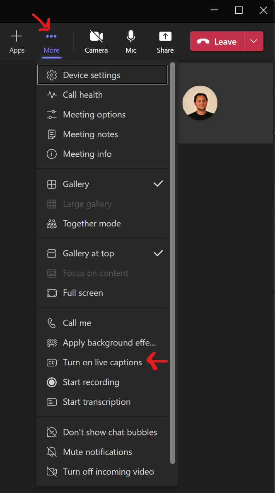
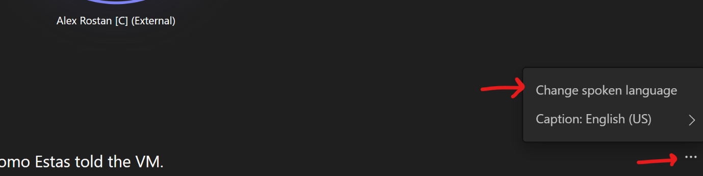
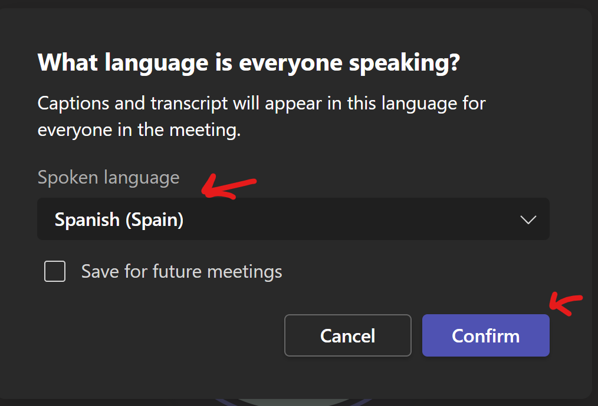
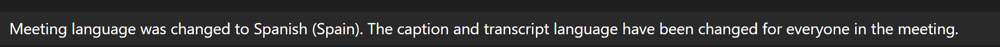
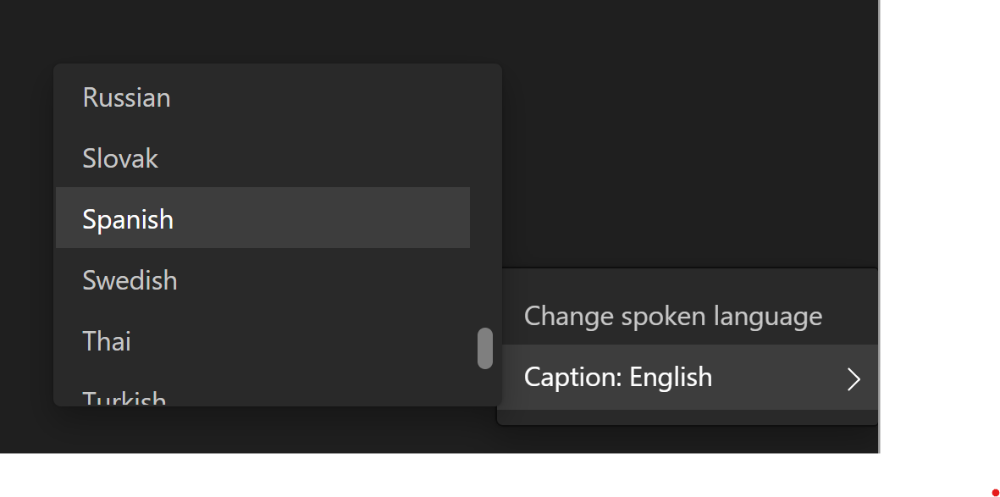
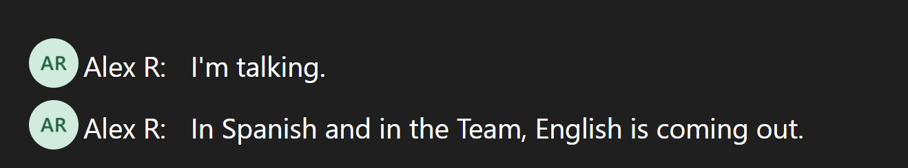
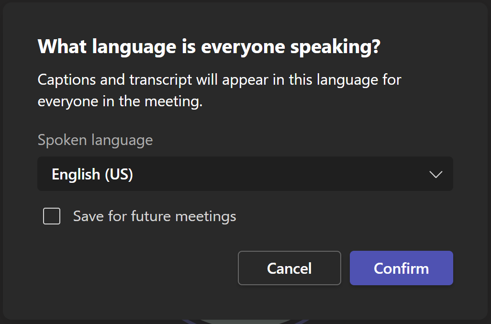
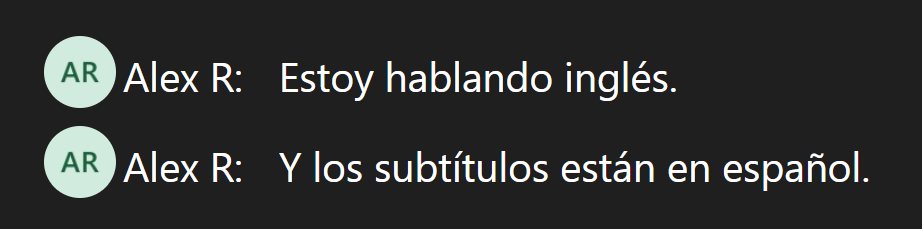
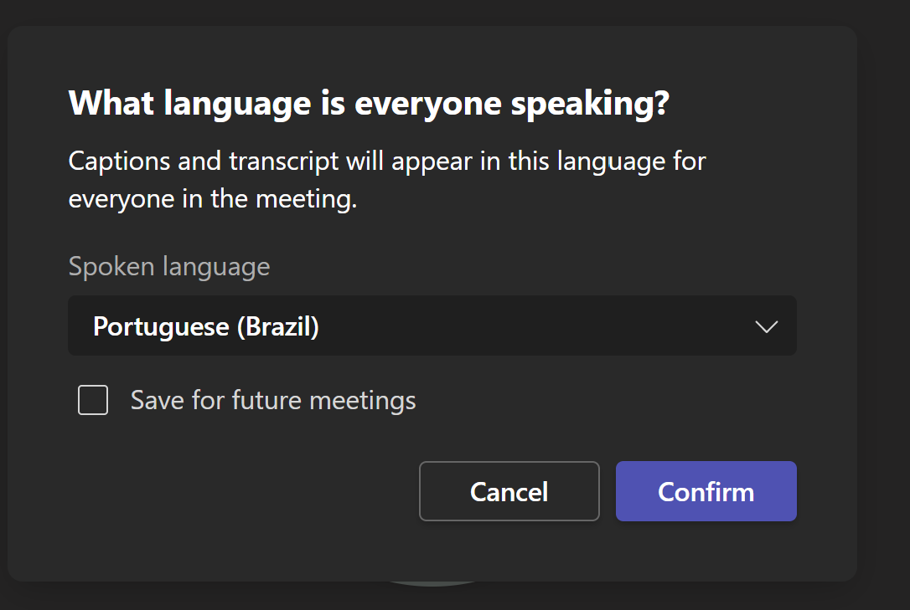
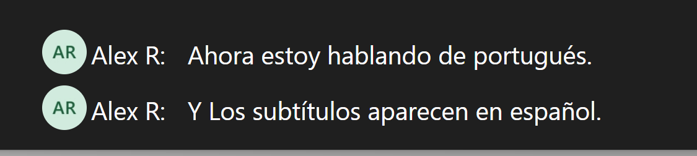

En las últimas actualizaciones de Microsoft Teams podemos observar
algunas nuevas características, una de ellas resulta sumamente
interesante dado que cada día más se trabaja con equipos distribuidos en
diferentes países y regiones y, por ende, en diversos idiomas. Si bien
en la mayoría de los casos se opta por comunicarse inglés, esta nueva
característica abrirá la puerta para aquellos que solo se comunican en
su idioma nativo.

Un caso típico de esto es que se necesita tener una reunión con un
cliente que no habla mi idioma ni inglés y yo no hablo su idioma,
entonces MS Teams nos permitirá partiendo de la base que sabemos cuál es
el idioma que la otra persona habla, generar automáticamente subtítulos
en mi idioma.

En este articulo veremos como configurar esta nueva característica y
como variar los idiomas según sea necesario. Para realizar este
procedimiento, luego de estar conectado al meeting debo ir a las
opciones y habilitar los "Live captions".

Una vez encendidos los "live captions" debemos seleccionar el idioma
del otro participante y el idioma al que queremos que se haga la
traducción. En la parte inferior derecha de la ventana veremos 3
puntitos donde debemos hacer clic para configurar esto.

Nos aparecerán dos opciones una para seleccionar el lenguaje hablado y
la otra para los subtítulos. Seleccionamos lenguaje hablado (Spoken
Language) y seleccionamos el idioma y le damos confirmar.

Nos aparecerá el siguiente mensaje cuando esté listo para comenzar:

Luego seleccionamos "caption" y elegimos nuestro idioma de preferencia
para los subtítulos.

Luego de configurar estas dos cosillas estaremos listo para comenzar
nuestra conversación.

Como verán, el usuario está hablando en español y los subtítulos salen
en inglés. Pero así mismo podremos cambiar a otro idioma si hubiese
alguien más hablando en otro idioma, por ejemplo, inglés o portugués.

Ahora vemos con el usuario habla en inglés y el subtítulo sale en
español. Y lo mismo vamos a probar para portugués, pero solo cambiando
el idioma del que habla del otro lado y no el idioma de los subtítulos.

Como podemos apreciar, resulta sencillo ir cambiando de idiomas y poder
tener la traducción en tiempo real. Esta característica no solo nos
sirve para comunicarnos con otros que hablen idiomas que no dominamos,
sino que también en aquellos idiomas de los cuales tenemos conocimiento,
pero algunas veces se pierden algunas palabras.

**Conclusión**

Esta nueva característica nos permitirá ampliar el espectro de
comunicación con nuestros clientes o equipos remotos. Permitiéndonos
tener una comunicación fluida en real time incluso hablando diferentes
idiomas.

**Alex Rostán**  
Microsoft Business Applications MVP  
AI & Smarts Applications / Cloud Architect (Azure, O365, Power Platform)  
Mail:<rostanker@msn.com>  
Twitter: @rostanker  
LinkedIn: <https://www.linkedin.com/in/alexrostan/>
