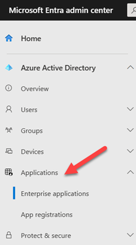
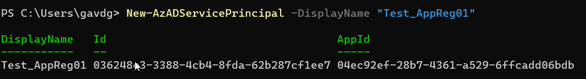
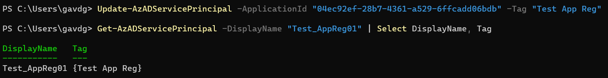
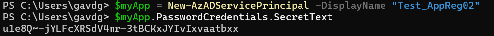
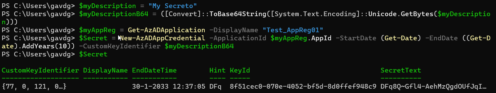
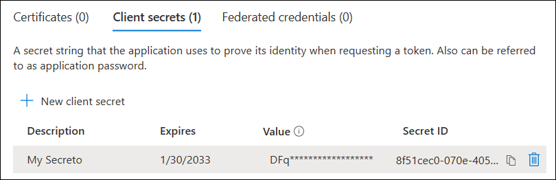
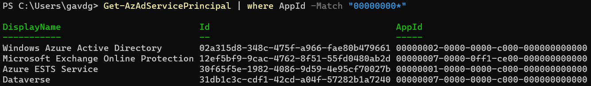
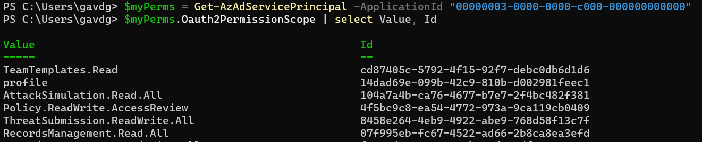
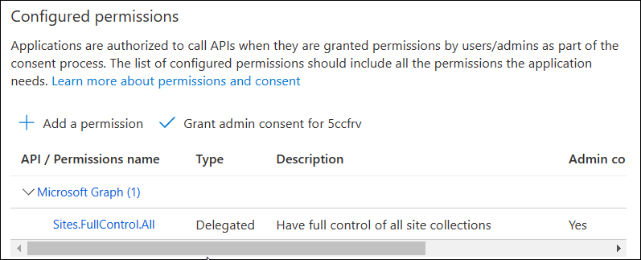

Hasta no hace mucho tiempo, la forma que Microsoft nos ofrecía para
autenticar los usuarios en el software que creábamos para SharePoint,
Exchange y otros servidores era "Autenticación Básica" (Basic
Authentication). Pero Microsoft decidió hace ya algunos años que poco a
poco iría retirando la Autenticación Básica y la reemplazaría por
"Autenticación Moderna" (Modern Authentication). En este momento, ya
es prácticamente imposible utilizar Autenticación Básica para acceder a
Exchange, y se está comenzando a eliminar para el acceso a SharePoint.

En Autenticación Básica se usa el nombre de un usuario y su clave para
pedir acceso a los servidores y las credenciales se envían sin
encriptar. Además, cada servidor tiene sus propias rutinas para validar
al usuario y asignarle las credenciales requeridas. Autenticación
Moderna se base en protocolos universales (oAuth, oData, tokens, etc.) y
un proveedor único (Azure AD) que unifica la forma de acceder a la
información, y libera a los servidores de la carga de identificar a los
usuarios.

En Autenticación Moderna se usa, como ya se ha indicado, Azure Active
Directory (AAD) y OAuth. Esto significa que (obligatoriamente) se
necesita tener un registro en Azure que define el tipo de credenciales a
utilizar (cuenta/clave, secreto o certificado), los permisos a asignar y
un identificador único en Azure para que el software pueda iniciar el
proceso de autenticación.

Hay dos tipos de registros en AAD: "App Registrations" y "Enterprise
Applications", aunque, en realidad, son dos aspectos de la misma
funcionalidad, como se explicará más adelante. El registro se puede
crear manualmente por intermedio de la interfaz de usuario de Azure, o
programáticamente por medio de algún lenguaje compilado como CSharp, o
usando un lenguaje interpretado como PowerShell.

Para ver los registros de autenticación en un tenant de Azure, abra la
administración central de Azure (https://entra.microsoft.com) en un
navegador utilizando credenciales de administrador. Expanda la sección
de "Applications" en el menú vertical al lado izquierdo, y acceda los
dos tipos de registros, Enterprise Application o App Registrations.
Revise las subsecciones de cada tipo de aplicación para tener una idea
inicial de sus posibilidades.



Desde la página de "Overview" de cada una de las subsecciones se
pueden crear nuevos registros por medio del botón "+ New aplication" o
"+ New registration". Cuando cree una nueva App Registration por medio
de la interfaz de usuario, vera que AAD automáticamente crea una
Enterprise Application con el mismo nombre. Pero cuando se crea una
nueva Enterprise Application, no se crea automáticamente una nueva App
Registration. Esto ocurre porque, en realidad, una App Registration es
un objecto de identificación global en el tenant, mientras que una
Enterprise Application es una instancia de un objeto del tipo App
Registration (muchas veces también llamado un "Service Principal"). Es
algo similar a lo que ocurre con programación: se pueden crear
definiciones de objectos (las Clases), e instancias de esas definiciones
(los Objetos).

Azure AD ya viene con muchas App Registrations listas para ser
instanciadas, y un usuario puede crear nuevas cuando sea necesario (por
medio del botón "+ New registration"). Por esta razón, el primer paso
cuando se utiliza el botón de "+ New application" es seleccionar la
App Registration de la que se quiere derivar el Service Principal
Object, y por lo que una nueva Enterprise Application no crea una nueva
App Registration.

La creación tanto de App Registrations como de Enterprise Applications
utilizando la interfaz de usuario de Azure se explicada por sí misma
siguiendo las instrucciones de Microsoft, y también existen muchos
sitios en Internet que explican los pasos a seguir y que significa cada
uno de los campos a configurar. La parte interesante del proceso (por lo
menos para desarrolladores y administradores) es como automatizar el
ciclo de vida de los registros con PowerShell (como se indica más
adelante en este artículo).

Primero, hablemos un poco sobre la utilización de PowerShell para
trabajar con Azure. En el momento existen tres módulos para acceder a
Azure con PowerShell: "AzureAD", "AzureRM" y "Az" (Microsoft nunca
se ha distinguido por una buena selección de nombres para ninguno de sus
productos).

AzureRM: primera versión de un módulo de uso general para PowerShell que
permitía la administración de AD. Sera eliminado totalmente por
Microsoft en julio 2024. Ejecuta solamente en PowerShell 5.x y versiones
anteriores.

AzureAD: modulo dedicado a manejo de usuarios e identidades en AD,
ejecuta solo en Windows y PowerSell 5.x y versiones anteriores (no es
compatible con PowerShell 7).

Az PowerShell: ejecuta en todo tipo de plataformas (PowerShell 7.x y
superior), sin embargo, hay algunas opciones que todavía no han sido
implementadas, pero Microsoft trabaja constantemente para mejorar el
módulo.

Aunque los tres módulos permiten trabajar con registro de aplicaciones
en Azure, en este articulo solamente se utiliza el módulo Az PowerShell,
pues es el más moderno de los tres, y el que finalmente, dentro de
algunos años, será el único soportado por Microsoft. Para instalar el
module de Az PowerShell, abra una consola con una cuenta de
administrador y ejecute el siguiente comando:

```
Install-Module Az
```

Y para iniciar una conexión con AAD utilice el siguiente comando para
acceder al sistema (el comando abre un navegador en donde se pueden
indicar la cuenta y clave a utilizar):

```
Connect-AzAccount
```

Todas las App Registration disponibles en AAD se pueden enumerar por
medio del siguiente comando:

```
Get-AzADApplication
```

Y las Enterprise Applications actualmente disponibles en AAD se pueden
enumerar con el comando:

```
Get-AzADServicePrincipal
```

Una nueva App Registration se puede crear con el siguiente comando.

```
New-AzADApplication -DisplayName "Test_AppReg01"
```

Por otro lado, una Enterprise Application se puede crear como indica el
siguiente ejemplo. Esta acción crea tanto la App Registration como la
Enterprise Application.

```
New-AzADServicePrincipal -DisplayName "Test_AppReg02"
```

Después de procesar el comando, PowerShell muestra el identificador del
registro:



Los datos de tanto la App Registration como de la Enterprise Application
se pueden recobrar usando su identificador:

```
Get-AzADApplication -ApplicationId "04ec92ef-28b7-4361-a529-6ffcadd06bdb"

Get-AzADServicePrincipal -ApplicationId "04ec92ef-28b7-4361-a529-6ffcadd06bdb"
```

En lugar del parámetro "-ApplicationId" se puede utilizar el nombre de
la aplicación (parámetro "-DisplayName") o parte del nombre (parámetro
"-DisplayNameBeginsWith"). Algunos aspectos de un registro se pueden
modificar, tanto para App Registrations como para Enterprise
Applications. El siguiente ejemplo modifica el valor de la propiedad
"Tag":

```
Update-AzADApplication -ApplicationId "04ec92ef-28b7-4361-a529-6ffcadd06bdb" -Tag "Test App Reg"

Get-AzADApplication -DisplayName "Test_AppReg01" | Select DisplayName, Tag

Update-AzADServicePrincipal -ApplicationId "04ec92ef-28b7-4361-a529-6ffcadd06bdb" -Tag "Test App Reg"

Get-AzADServicePrincipal -DisplayName "Test_AppReg01" | Select DisplayName, Tag
```



App Registrations pueden ser utilizadas con un "Secreto" o con un
certificado digital. Ambos se pueden ver en la interfaz de usuario de AD
en la sección "App registrations" - "Certificates and secrets".
Cuando se crea una App Registration con PowerShell, el sistema le crea
automáticamente un Secreto, pero el registro puede contener muchos
otros, si es necesario. El valor del secreto solamente se puede ver en
el momento de creación, lo que hace imposible recuperarlo después de
creación programáticamente o a través de la interfaz de usuario. Para
ver el valor del secreto creado por defecto al momento de creación,
utilice los siguientes comandos para crear una nueva App Registration o
Enterprise Application:

```
$myApp = New-AzADServicePrincipal -DisplayName "Test_AppReg02"

$myApp.PasswordCredentials.SecretText
```



Un nuevo secreto en una App Registration ya existente se puede crear con
los siguientes comandos. Note que la interfaz de usuarios solamente
permite crear secretos con una validez máxima de 24 meses; usando
PowerShell se les puede asignar cualquier validez deseada (10 años en el
ejemplo). También note que en el ejemplo se utiliza una cadena con base
64 para definir el campo de "Description" en la interfaz de usuario
(es la única forma de lograr esto, el objeto "Secreto" no tiene una
propiedad para la descripción. Además, la cadena tiene que ser en base
64).

```
$myDescription = "My Secreto"

$myDescriptionB64 = ([Convert]::ToBase64String([System.Text.Encoding]::Unicode.GetBytes($myDescription)))

$myAppReg = Get-AzADApplication -DisplayName "Test_AppReg01"

$Secret = New-AzADAppCredential -ApplicationId $myAppReg.AppId -StartDate (Get-Date) -EndDate ((Get-Date).AddYears(10)) -CustomKeyIdentifier $myDescriptionB64

$Secret.PasswordCredentials.SecretText
```





Los secretos en un registro se pueden eliminar por medio del cmdlet
Remove-AzADAppCredential:

```
$myAppReg = Get-AzADApplication -DisplayName "Test_AppReg01"

Remove-AzADAppCredential -KeyId "8f51cec0-070e-4052-bf5d-8d0ffef948c9" -ApplicationId $myAppReg.AppId
```

> Nota: los comandos utilizados para agregar y eliminar un secreto se pueden utilizar también para trabajar con un (existente) certificado.

Un registro debe tener suficientes derechos para que las aplicaciones
que van a utilizarlo consigan acceso a los sistemas deseados. Los
derechos se pueden asignar por medio de la interfaz de usuario en la
sección "App registrations" - "API permissions". Por medio de
PowerShell se pueden asignar derechos como indica el siguiente script.

```
Add-AzADAppPermission -ObjectId [AppRegistration ID] -ApiId [TipoPermisos ID] -PermissionId [Permisos ID]
```

En donde (todos los valores son GUIDs):

[AppRegistration ID] - es el identificador de la App Registration

[Tipo Permisos ID] - el identificador del tipo de permisos que se
quiere asignar. Por ejemplo, para asignar permisos del tipo Microsoft
Graph se debe usar el identificador
"00000003-0000-0000-c000-000000000000". Todos los identificadores se
encuentran por medio del comando "Get-AzAdServicePrincipal" y
generalmente comienza con el valor "00000000". Una lista de los
identificadores y sus DisplayName se pueden ver usando el comando:

```
Get-AzAdServicePrincipal | where AppId -Match "00000000"
```



[Permisos ID] - es el identificador de un grupo especifico de permisos
dentro del tipo de permisos. Por ejemplo, el permiso
"Sites.FullControl.All" en Microsoft Graph tiene como identificador
"5a54b8b3-347c-476d-8f8e-42d5c7424d29". Los identificadores para un
tipo de permisos se pueden encontrar por medio del comando (para
Microsoft Graph en el siguiente ejemplo):

```
$myPerms = Get-AzAdServicePrincipal -ApplicationId "00000003-0000-0000-c000-000000000000"
```

(para permisos del tipo Delegated) $myPerms.Oauth2PermissionScope | select Value, Id

(para permisos del tipo Application) $myPerms.AppRole | select Value, Id



De esta forma, la sintaxis para agregar los permisos de
"Sites.FullControl.All" de Graph en la App Registration creada
anteriormente seria:

```
Add-AzADAppPermission -ObjectId "cc5991af-8578-4e58-b86d-9e19ed755941" -ApiId "00000003-0000-0000-c000-000000000000" -PermissionId "5a54b8b3-347c-476d-8f8e-42d5c7424d29"
```



Para eliminar una Enterprise Application utilice el siguiente comando.
En el ejemplo se usa el DisplayName como parámetro de entrada, pero
también se puede utilizar su ApplicationId o ObjectId. Al eliminar una
Enterprise Application NO se elimina su App Registration.

```
Remove-AzADServicePrincipal -DisplayName "Test_AppReg02"
```

El anterior comando remueve solamente la Enterprise Application. Para
eliminar la App Registration utilice el siguiente comando. Eliminando la
App Registration se elimina también automáticamente su correspondiente
Enterprise Application.

```
Remove-AzADApplication -DisplayName "Test_AppReg02"
```

Como conclusión se puede mencionar que cuando es necesario automatizar
la creación de App Registrations en Azure para darle acceso a diferentes
sistemas que utilizan Azure AD como medio de autenticación, se puede
utilizar PowerShell y el módulo Az PowerShell. Este módulo es el más
apropiado en el momento para trabajar con Azure, pues los otros módulos
existentes serán deprecados dentro de algún tiempo.

**Gustavo Velez** <br />
M365 Apps & Services MVP <br />
Microsoft 365: The best recipes for developers - <https://guitaca.com>