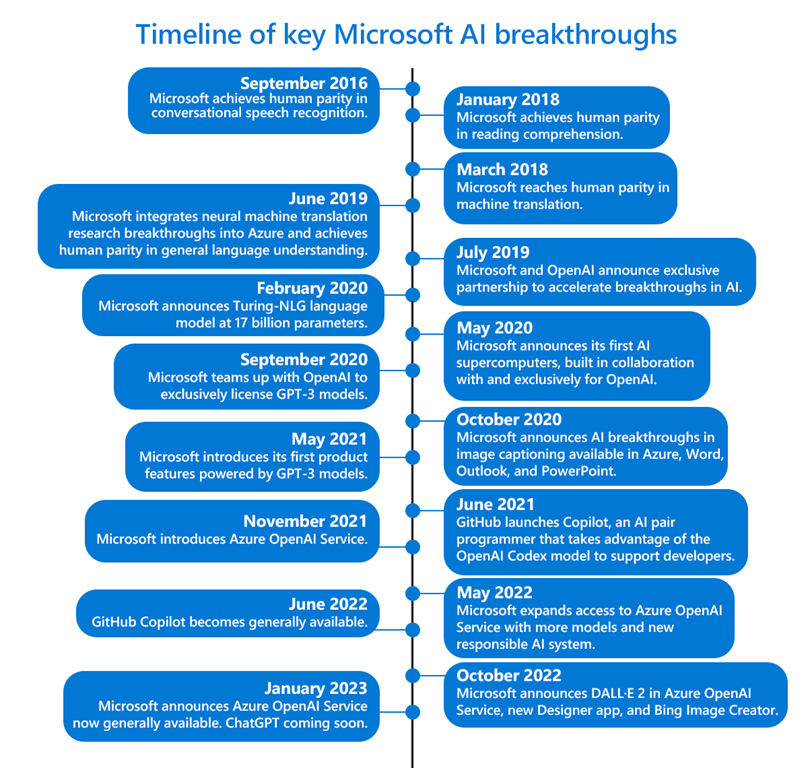

En este articulo quiero explicaros como podemos usar los servicios de
Azure OpenAI Service para mejorar la eficiencia, la productividad y la
experiencia del cliente a través de la Inteligencia Artificial de una
forma fácil y sencilla. Este servicio es ideal si lo estamos buscando es
centrarnos en el desarrollo, entrenamiento y desplegar modelos de IA.

**¿Qué es ChatGPT?**

ChatGPT es una tecnología innovadora que representa una nueva forma de
interactuar con la tecnología. La capacidad de entender y responder a
una amplia gama de preguntas y comandos de manera natural y fluida ha
hecho más accesible que más personas y empresas pueden interactuar con
él a través de diferentes plataformas, como sitios web y aplicaciones de
chat.

Utiliza algoritmos de aprendizaje profundo y redes neuronales para
comprender el lenguaje natural y generar respuestas precisas y
coherentes a una amplia gama de preguntas y temas. Lo que nos permite
poder usarlo en una infinidad de escenarios donde nos puede ayudar a
aprovechar los beneficios de la inteligencia artificial para mejorar la
eficiencia, experiencia, productividad e innovación dentro de los
procesos.

**¿Qué son los servicios de Azure OpenAI?**

Azure OpenAI Service es un conjunto de servicios basados en la nube de
Microsoft que permite a los desarrolladores crear, entrenar y desplegar
modelos de IA utilizando la plataforma OpenAI, que incluye una serie de
herramientas y servicios para desarrollar, entrenar y desplegar modelos
de IA.

**¿Cómo nos ayuda?**

Como hemos mencionado anteriormente, Azure OpenAI Service es una
plataforma de inteligencia artificial que ofrece una amplia gama de
servicios de inteligencia artificial y aprendizaje automático dentro de
Azure, dichos servicios nos pueden ayudar de diversas maneras, algunos
ejemplos son:

1.  **Mejora de la eficiencia**: Los servicios de Azure
    OpenAI pueden ayudar a las empresas a automatizar tareas y procesos,
    reducir errores y mejorar la eficiencia general.

2.  **Mejora de la experiencia del cliente**: La
    inteligencia artificial puede ayudar a las empresas a comprender
    mejor las necesidades de sus clientes y ofrecer experiencias
    personalizadas y adaptadas a cada uno de ellos.

3.  **Mejora de la toma de decisiones**: Azure OpenAI
    puede ayudar a las empresas a analizar grandes cantidades de datos y
    a tomar decisiones más informadas y precisas.

4.  **Mejora de la productividad**: Los servicios de Azure
    OpenAI pueden ayudar a las empresas a mejorar la productividad de
    sus empleados al automatizar tareas tediosas y repetitivas y
    permitirles enfocarse en tareas más estratégicas.

5.  **Innovación**: La plataforma de Azure OpenAI puede
    ayudar a las empresas a desarrollar nuevas soluciones y productos de
    inteligencia artificial que pueden abrir nuevas oportunidades de
    negocio y generar ingresos.

Como podemos observar Azure OpenAI Service es una nueva herramienta que
permite a las empresas acceder a una amplia gama de servicios de
inteligencia artificial y aprendizaje automático, permitiendo aprovechar
las ventajas de la inteligencia artificial brindando una serie de
beneficios y oportunidades.

Por un lado, nos puede ayudar a mejorar la eficiencia empresarial al
automatizar tareas repetitivas y tediosas, lo que permite a los
empleados concentrarse en tareas más estratégicas y productivas
aportando un valor diferencial, mejorando la experiencia del cliente al
permitir a las empresas comprender mejor las necesidades y deseos de sus
clientes y ofrecerles soluciones personalizadas y adaptadas. También
puede mejorar la toma de decisiones empresariales al proporcionar una
gran cantidad de datos y análisis avanzados para respaldar las
decisiones de negocio.

En general, Azure OpenAI puede ser un recurso valioso para las empresas
que buscan aprovechar los beneficios de la inteligencia artificial.
Poniendo foco en mejorar la eficiencia, la productividad y la
experiencia del cliente, lo que puede conducir a un mayor éxito y
crecimiento en el mercado.

**¿Qué ventajas tiene Azure OpenAI Service?**

Azure OpenAI Service proporciona a las empresas y a los desarrolladores
modelos de inteligencia artificial de alto rendimiento a escala de
producción de forma fácil y sencilla. Estos mismos servicios también son
usados por Microsoft en entornos de producción para impulsar sus propios
productos, como pueden ser GitHub Copilot, Power BI o Microsoft Designer
entre los más populares.

Azure es actualmente la única nube pública mundial que ofrece
superequipos de inteligencia artificial con escalabilidad horizontal y
vertical masiva. Con un diseño de arquitectura único que combina las
mejores soluciones de redes y GPU, Azure ofrece un rendimiento y una
escala excepcionales para cargas de trabajo de entrenamiento e
inferencia de IA que hacen un uso intensivo de la capacidad de proceso. 

**¿Cómo puedo usarlo?**

Azure Open AI Service ya está disponible con carácter general desde el
mes de enero por lo que cada vez más empresas pueden solicitar el acceso
a los modelos de IA (entre los que encontramos GPT-3.5, Codex y
DALL•E 2) con el respaldo de la funcionalidad de nivel empresarial y la
infraestructura optimizada para IA de confianza de Microsoft Azure.

Uno de los principales enfoques de este servicio es el uso de la
inteligencia artificial de forma responsable. Para ello el equipo de
Microsoft se ha implementado algunas barreras de seguridad que están en
consonancia con los principios de inteligencia artificial responsable
que definieron al comienzo de esta aventura, podéis encontrar [aquí más
información](https://www.microsoft.com/en-us/ai/responsible-ai)

Además, para empezar a usar el servicio deberemos solicitar acceso a
través del siguiente [formulario de acceso](https://aka.ms/oai/access) y
explicar los casos de uso, descripción del caso de uso antes de que
podamos acceder a él. Los filtros de contenido diseñados específicamente
por el equipo de Microsoft para detectar contenido abusivo, con tintes
de odio y ofensivo supervisan constantemente las entradas proporcionadas
al servicio y el contenido generado, de esta forma en el caso de una
infracción de una directiva confirmada, pueden pedirle al desarrollador
que tome medidas inmediatas para evitar más abusos.

En resumen, estoy convencido que esto permitirá a las empresas y
personas innovar de forma completamente nuevas y de una forma muy
emocionante, utilizando modelos de inteligencia artificial de calidad y
seguros. Ayudando a mejorar la eficiencia, productividad y la
experiencia de los usuarios, lo que puede conducir a un mayor éxito y
crecimiento en el mercado.

**Manuel Sánchez Rodríguez**  
Manuss20@gmail.com  
@manuss20  
https://manuss20.com 
 
import LayoutNumber from '../../../components/layout-article'
export default LayoutNumber
