En el último número de la revista os daba detalles de OpenAI y os
prometía ampliación en siguientes artículos, aquí va.

En esta época se está hablando mucho de ChatGPT y el impacto que ha
creado en el mercado, sorprendiendo a todos con sus capacidades. Debemos
tener en cuenta que ChatGPT es un modelo entrenado por OpenAI
especialmente pensado para interactuar con el usuario de una forma
conversacional; está orientado a responder preguntas, admitir sus
propios errores, cuestionarse premisas incorrectas y rechazar
solicitudes inapropiadas. Desde un punto de vista más técnico, ChatGPT
es un modelo lingüístico basado en GPT-3 que ha sido entrenado y
perfeccionado usando técnicas de aprendizaje supervisado y de refuerzo.

Pero mi intención no es seguir contando las capacidades de ChatGPT, sino
demostraros las bases y cómo construir rápidamente algo muy parecido en
vuestros propios entornos de prueba.

**¿Qué vamos a montar?**

Este artículo te explicará cómo construir un asistente virtual basado en
Microsoft Teams, conectado al API de OpenAI con el objetivo de hacer que
este asistente conteste a tus preguntas basándose en lenguaje natural, o
dicho de forma más exacta: que ante determinada petición del usuario,
envíe la pregunta hacía la API de OpenAI, espere por su respuesta y la
muestre.

**Requerimientos**

Puedes montarte muy rápidamente este ejercicio con:

-   Alta en el servicio de API de OpenAI. Accedes al servicio con una
    cuenta de correo y un número de teléfono (validarán ambos) y ya
    tienes todo. Toma especial nota de la key única de llamada a tu
    servicio, la necesitarás más adelante.

-   Necesitas acceso a un Tenant de Office 365 donde puedas hacer tus
    pruebas. Especialmente vas a necesitar Teams, Virtual Agents y Power
    Automate (sobre este último necesitaremos algún componente Premium,
    puedes solicitar una versión de prueba).

**Preparación del entorno**

Lo primero que necesitamos es preparar el entorno para construir el
Chatbot y eso lo logramos agregando la app de Power Virtual Agents a tu
Microsoft Teams, simplemente agregándola como aplicación desde Teams.

1.  Seleccionas Aplicaciones en la parte inferior del panel lateral en
    Microsoft Teams.

2.  En el cuadro de búsqueda, escribes "Power Virtual Agent".

3.  Seleccionas el mosaico con la aplicación. Acto seguido seleccionas
    "Agregar para mí" en la ventana de descripción que aparece. Esto
    agregará la aplicación al panel lateral.

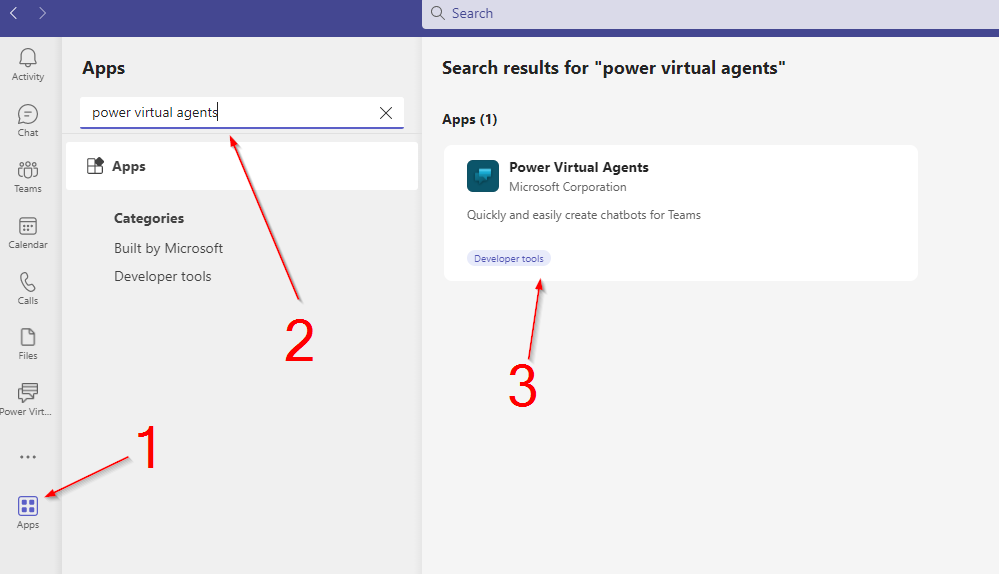

Te recomiendo que como cuarto paso y para que sea más fácil volver,
hagas clic derecho sobre el icono y lo dejes anclado.

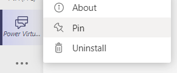

**Construcción del Chatbot**

Haremos uso del asistente para la creación del chatbot por lo que en
estos pasos iniciales iremos bastante guiados.

1.  Seleccionamos el icono Power Virtual Agents para abrir la aplicación
    y damos a "Empezar ahora"

2.  Acto seguido te pedirá un Teams inicial donde quieres hacer
    funcionar este chatbot, lo seleccionas y continuamos.

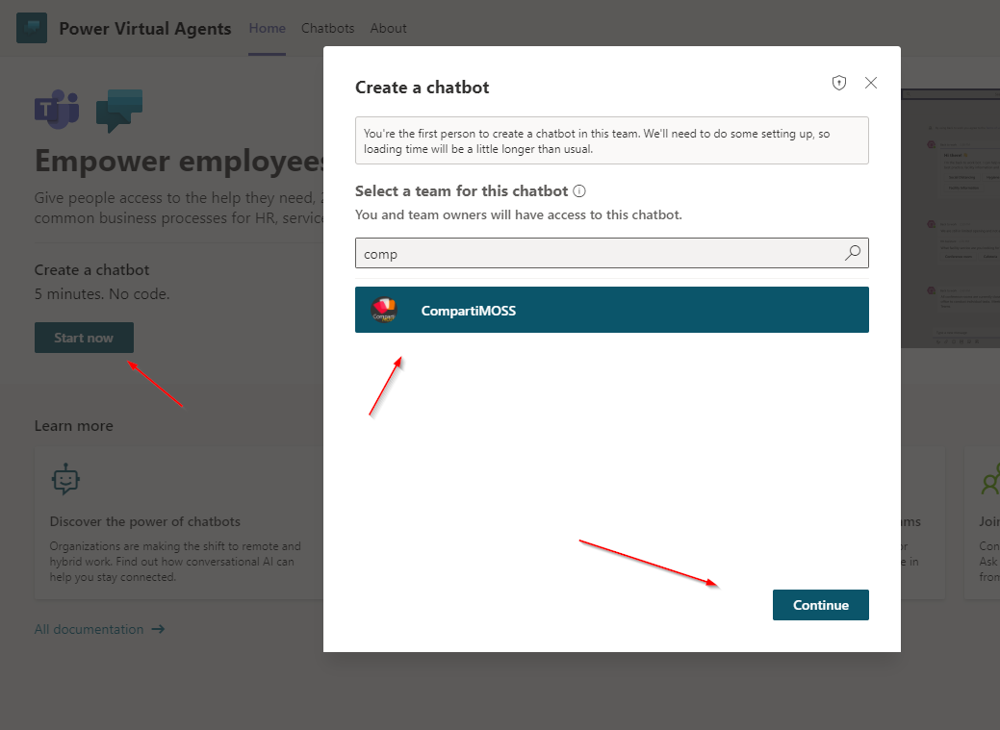

En este punto tienes que tener en cuenta
algunos aspectos:

3.  Una vez haya terminado la preparación del bot te pedirá el nombre
    que le quieres dar y te preguntará en que idioma hablará el bot.

4.  Esas fueron las ultimas preguntas, una vez le des al boton "Crear",
    comenzará el proceso y apenas tardará unos minutos.

5.  Cuando termine el proceso podrás ver tu bot listado en el team donde
    lo has creado. Si ves que algo no aparece no desesperes, se trata de
    un tema de refresco, simplemente cambiándote de pestaña y volviendo
    a esta pantalla lo verás.

En mi caso así ha quedado todo:

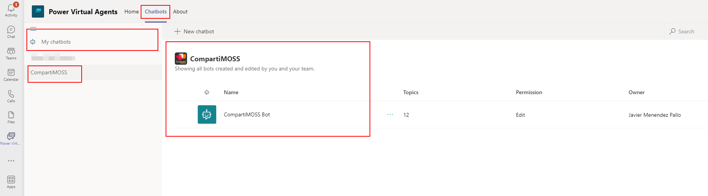

**Llamada a OpenAI**

Una vez que tengas el Chatbot creado ya estamos listos para
parametrizarlo y muy especialmente lo que más nos interesa, que es
realizar las llamadas a OpenAI. Ahora veremos que el asistente ha
realizado gran parte del trabajo por nosotros, y en realidad ya tenemos
un Chatbot operativo donde solo tenemos que agregar esa llamada que
queremos. Cuando en la pantalla del epígrafe anterior pinches en el
nombre del Chatbot te llevará a una pantalla como esta:

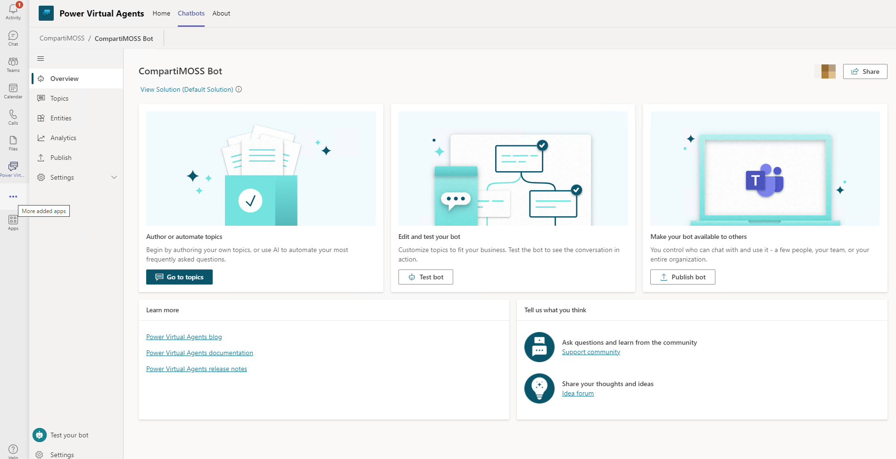

Si accedes a la parte de Topics verás que tal como te comentaba antes,
el asistente ha hecho gran parte del trabajo y te ha creado algunos
"Topics" o "lecciones" que en realidad indican las cosas de las que tu
Chatbot es capaz de conversar o hacer.

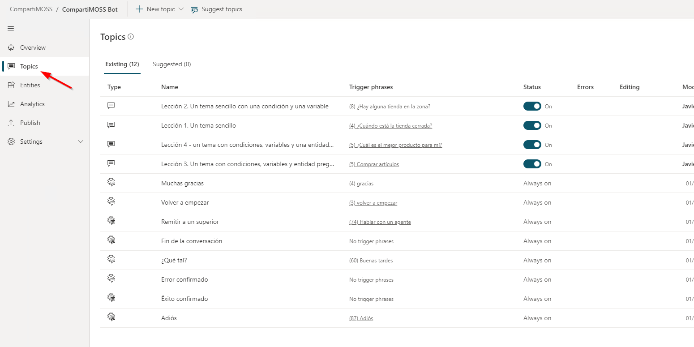

No quiero entrar en este artículo en las lecciones que te ha creado por
defecto, aunque sí te comento que las que ha creado son básicamente para
dos cosas:

a.  Enseñarte a utilizar el lienzo de desarrollo y las principales
    funciones que puedes desarrollar. Son aquellas que en el pantallazo
    que te he puesto antes aparecen como Lección 1, Lección 2, etc.

b.  Dotar al Chatbot de cosas básicas como saludar al principio y final,
    dar las gracias, y algunas otras cosas simples y muy utilizadas.

En nuestro ejemplo podríamos implementar la llamada de múltiples formas,
pero intentaré explicarte una muy simple, dejando que a posteriori
investigues tú otras formas y medios, personalizando y perfeccionando el
chatbot que hemos creado. Para realizar la llamada vamos a agregar un
nuevo "Topic", que se encargará de procesar la petición del usuario en
varias de sus formas. Para ello, estando en la pantalla de "Topics"
damos a "New Topic" e indicamos que queremos empezar desde cero:

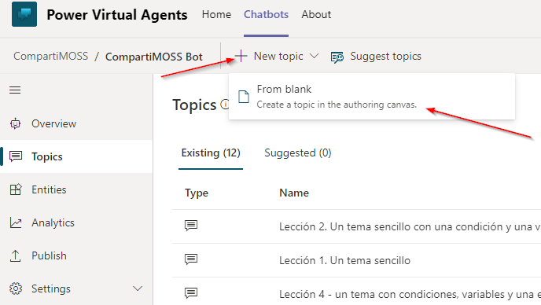

Eso hará que aparezca el lienzo, donde vamos a configurar cuáles son las
frases que disparan este "Topic" y un mensaje por defecto. En mi caso he
configurado esos topics y mensaje tal como aparece en la siguiente
pantalla (recuerda guardar de vez en cuando para no perder los avances,
tienes el boton arriba a la derecha).

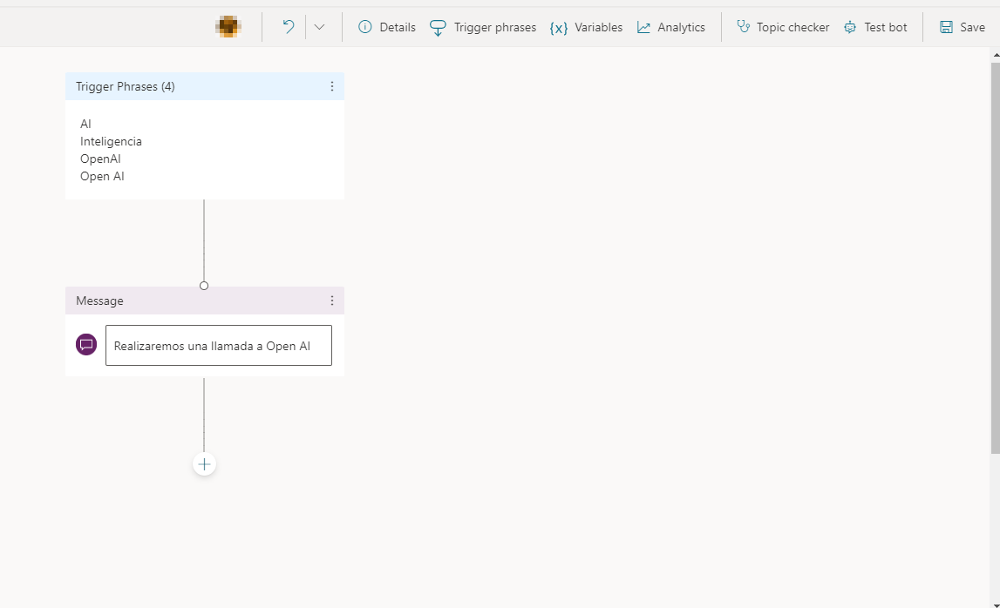

Hasta este momento lo que tenemos configurado es un topic, que va a
capturar el flujo de ejecución cuando el usuario escriba las palabras
"Open AI", "OpenAI", "Inteligencia" o "AI", a lo que responderá de forma
inmediata con un "Realizaremos una llamada a Open AI" y es lo que
escriba el usuario a continuación, lo que vamos a enviar al API como
pregunta. Para poder capturar la pregunta que quiere realizar el usuario
necesitamos como primer cosa darle esa capacidad de captura, lo que
haremos agregando una acción: "capturar" esa pregunta y eso lo haremos
agregando una acción y configurando minimamente la acción de "hacer una
pregunta". Estos son los pasos a seguir:

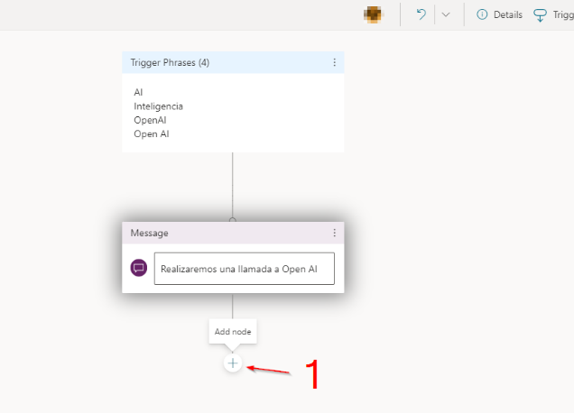

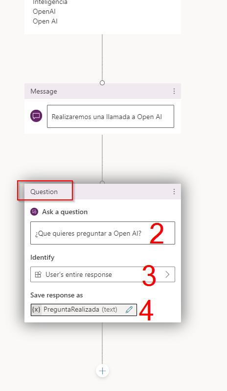

Presta atención a cómo he configurado la pregunta, poniendo el mensaje
correspondiente y configurando la respuesta como "respuesta completa" y
asignándole un nombre de "PreguntaRealizada". Basicamente lo que
acabamos de configurar es el mensaje que le aparecerá al usuario
diciéndole que escriba lo que quiere preguntar, configurando que esa
pregunta será un texto libre y diciendo que el texto de la pregunta lo
almacene en una variable de tipo texto llamada "PreguntaRealizada".

En este momento del flujo ya hemos capturado la pregunta que quiere
hacer el usuario, pero no podemos enviarla a Open AI directamente (por
ahora). Para ello, siguiendo los pasos que hicimos antes para agregar
una pregunta, vamos a agregar una acción que utilizaremos para llamar a
un Power Automate que será el que realmente llame al API. Aquí tienes
una captura de esos sencillos pasos:

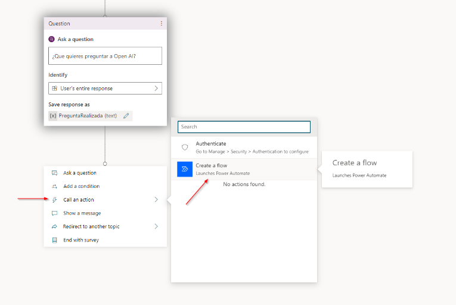

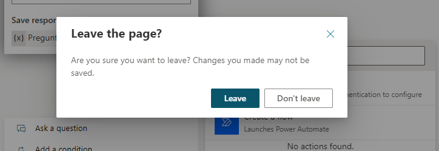

Lo primero que te preguntará una vez que estés en Automate es el
template a utilizar, donde seleccionaremos el "Power Virtual Agents Flow
Template"

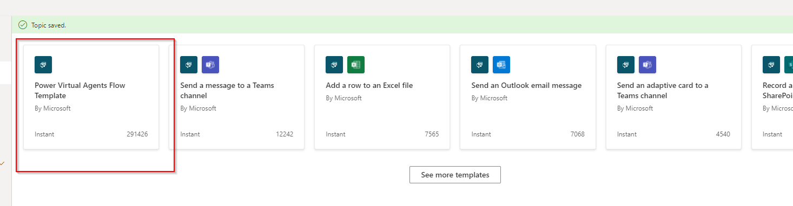

Y creamos un flow según la siguiente estructura, agregando las acciones
que te comento y con la configuración que pongo en cada pantallazo.

**Esquema general:**

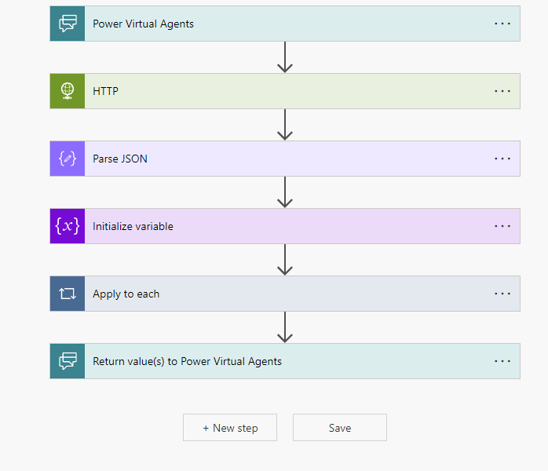

**Configuración de la entrada y la llamada a la API:**

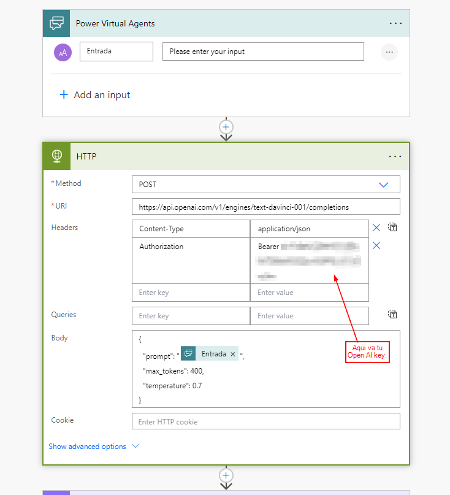

Ten en cuenta que la variable de entrada
es de tipo texto y es donde posteriormente mapearemos la pregunta que ha
hecho el usuario. Lo haremos luego, no te preocupes ahora.

La llamada HTTP es el componente que requiere la licencia Premium, y
podríamos utilizar otros métodos pero no son los ideales para
simplificar la llamada. Ten en cuenta que debes crear ese header que ves
en el pantallazo, de tipo "Authorization" y en su valor debes poner la
palabra "Bearer" seguido de un espacio y el valor de la KEY de tu
servicio de Open AI. El resto de tu configuración déjala igual a lo que
ves en el pantallazo.

**Configuración del resultado de la llamada y preparar la salida:**

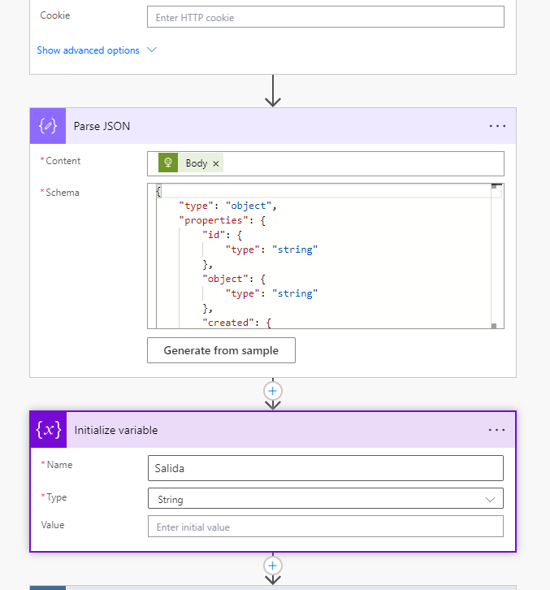

Para tratar la salida de la llamada hay que trabajar con JSON, y para
poder extraer la respuesta desde Open AI necesitas tratar el body
devuelto a la vez que necesitas definir su esquema.

Es JSON lo obtendrás realizando una llamada a la api, y gracias al
propio editor podrás generar el schema, aunque tienes muchas
herramientas gratuitas en la www.

Tienes más información sobre como preparar esa llamada y como procesar
la respuesta en:

https://platform.openai.com/docs/api-reference/making-requests

El paso inferior es simplemente la inicialización de una variable, que
en mi caso he llamado salida.

**Configuración de la salida y fin**

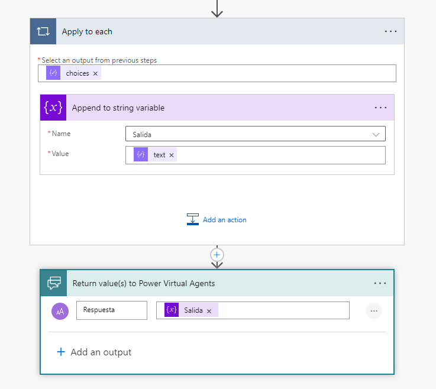

Aquí te doy un truco: no intentes
configurar un "Apply to each", céntrate en configurar un "Append to
string var" y en cuanto pongas el valor "text" el propio diseñador
agregará el apply to each automaticamente.

El último paso es devolver al chatbot la respuesta formateada, es decir,
nuestra variable salida.

Una vez que tengas el Power Automate configurado, guarda el trabajo y
vuelve a la pantalla de nuestro bot. Si vez que la llamada al flow ha
desaparecido no te preocupes, vuelve a agregarla pero ahora verás que el
flow que acabas de definir aparece como tal:

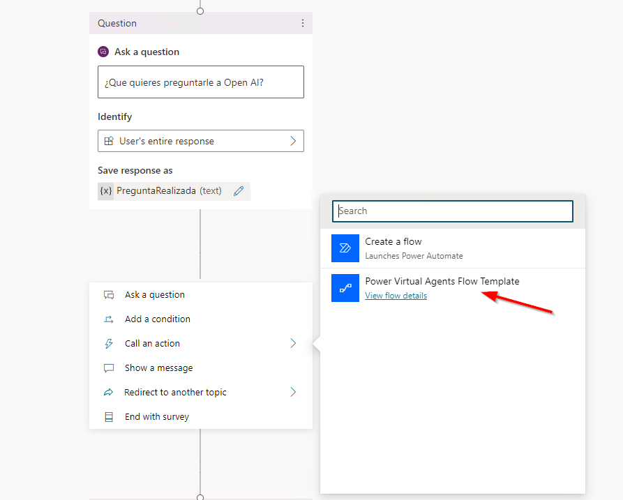

Y lo que tienes que hacer es configurarlo de la siguiente forma, para
que acepte la pregunta del usuario, haga la llamada a la API con esa
pregunta y muestre la respuesta:

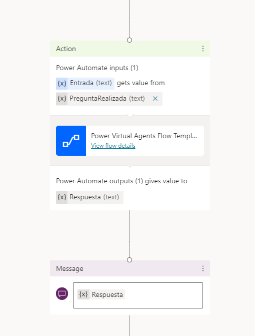

Luego de haber configurado el flow, simplemente he agregado una acción
de "Mostrar mensaje", donde lo que muestro es el contenido de la
variable que viene de nuestro Power Automate. Hecho todo lo anterior
nuestro chatbot está listo, guarda todo y pasemos a probarlo utilizando
el boton de "Test bot". Para este artículo se me ha ocurrido hacerle una
pregunta complicada y aquí tienes la respuesta:

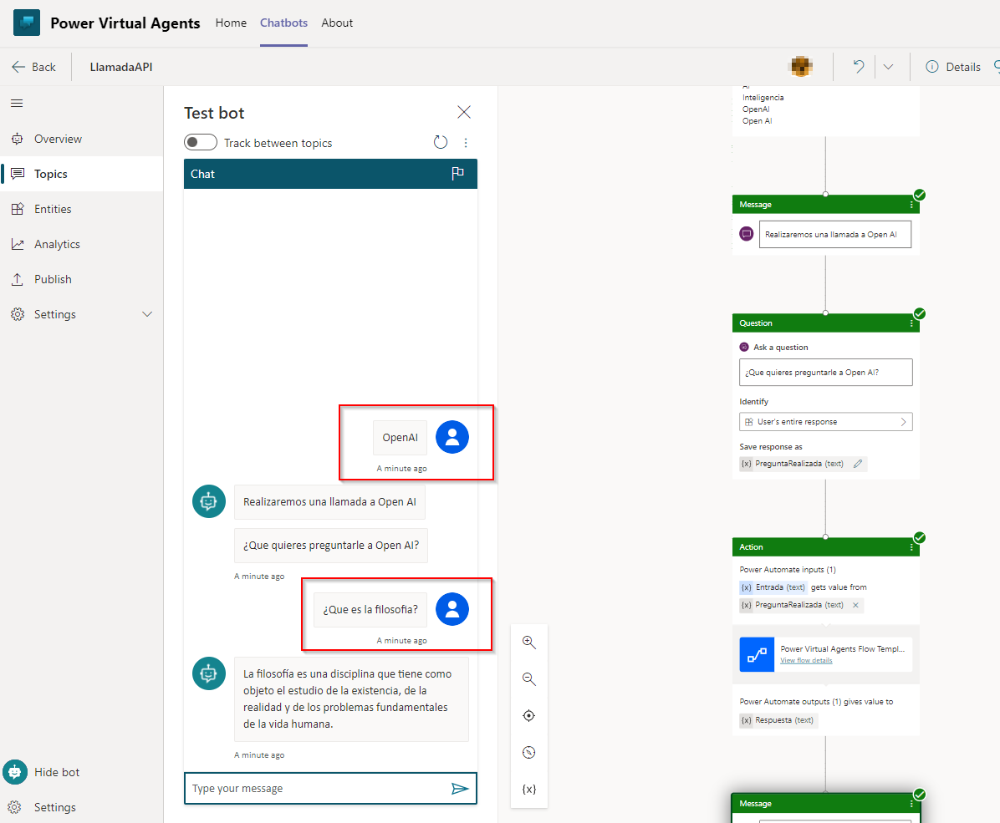

Ya tenemos nuestro bot funcionando, haciendo llamadas a Open AI de una
forma muy similar a como funciona ChatGPT. Podríamos perfeccionar este
chatbot de varias formas, pero el objetivo de esta artículo es contarte
las bases y dejo a tu criterio todas las mejoras que podría recibir.
Espero que este artículo te haya resultado útil, que todo funcione en tu
entorno y ¡¡te espero en la próxima!!!

¡Abrazo!

**Javier Menendez Pallo**  
IA MVP
 
 
import LayoutNumber from '../../../components/layout-article'
export default LayoutNumber
