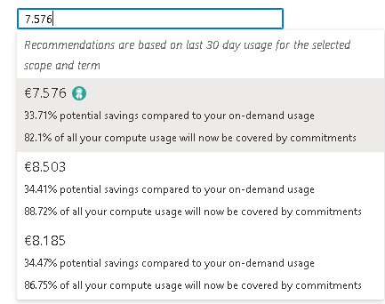
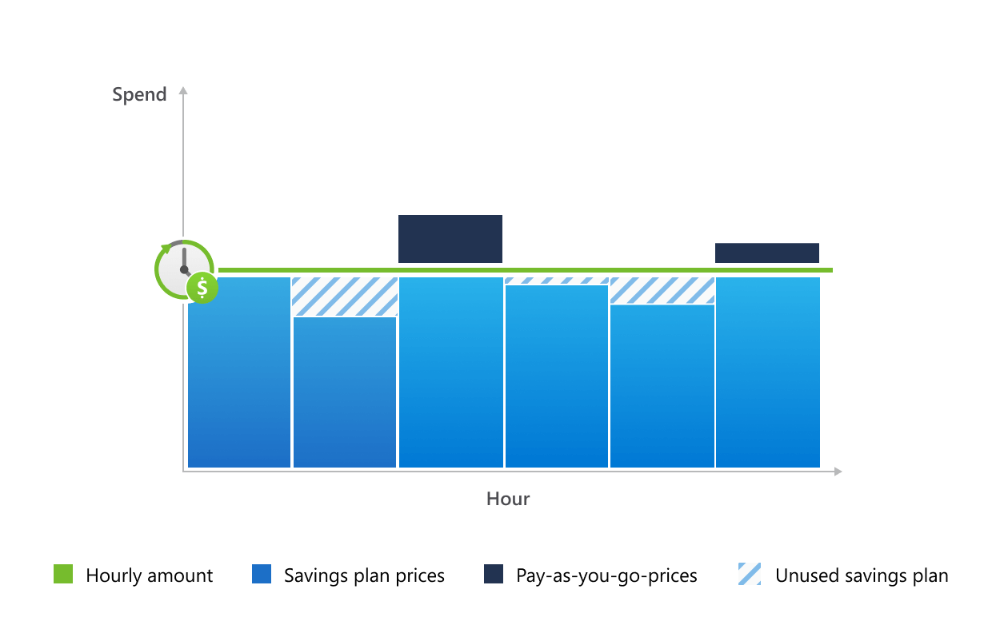
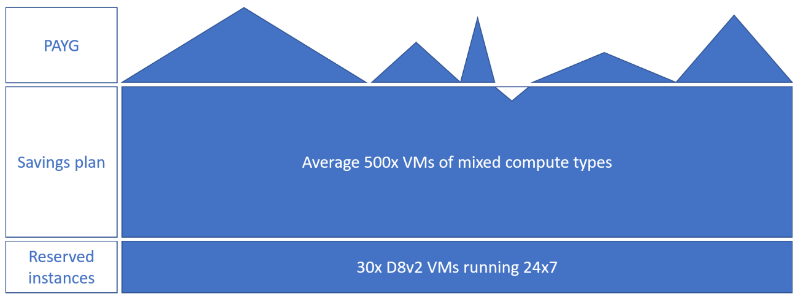

**Escenario actual**

Hasta ahora en Azure, si hablábamos de como ahorrar costes en servicios
de computación, teníamos dos alternativas (sin entrar en descuentos de
software):

-   [Azure
    Reservations](https://learn.microsoft.com/en-us/azure/cost-management-billing/reservations/save-compute-costs-reservations):
    Nos ayudan a ahorrar dinero mediante la reserva a 1 o 3 años de una
    talla de VM en particular. Los ahorros de costes pueden suponer
    hasta un 72% (cifras oficiales del fabricante, que bajo mi
    experiencia del 40% no ha pasado) frente a precios de Azure en
    formato PAYG. En este caso, cuando hacíamos una reserva de una
    instancia, no afecta al estado de nuestros recursos, sino que
    hacíamos la reserva contra una talla en concreto, obteniendo el
    descuento automáticamente siempre y cuando haga un matching de
    nuestros recursos.

-   [Spot Virtual
    Machines](https://learn.microsoft.com/en-us/azure/virtual-machines/spot-vms):
    este tipo nos permite tener una máquina para computación a un coste
    inferior al normal, pero con una condición: No disponemos de SLA,
    cuando Azure necesite capacidad de computación, de lo primero que se
    va a rescindir son las maquinas de tipo Spot, con lo que nos
    quedaríamos sin capacidad de disponer recursos de computación para
    esta tipología de tallas.

Pero durante el Ignite '22, se anunció una tercera vía para los recursos
de computación: los [Azure Saving
Plans](https://learn.microsoft.com/en-us/azure/cost-management-billing/savings-plan/savings-plan-compute-overview)

**¿Y que me proporciona?**

Nos permite ahorrar costes de computación basándonos en un precio fijo
por hora. En este caso, un Saving Plan puede ahorrar hasta un 65% el
precio respecto a un precio de Azure en formato PAYG (cifras del
fabricante, que bajo mi experiencia del 30% no ha superado), dependiendo
siempre del plazo que elijamos (de 1 a 3 años).

**¿Y cuál es la diferencia principal?**

Básicamente en la forma de reservar el recurso, si para una Reserva de
instancia, por ejemplo, reservamos una talla D4v4 en West Europe para un
año, con Azure Saving Plan, lo que hacemos es fijar una tarifa fija de
gasto a un plazo determinado (de 1 a 3 años sin posibilidad de
cancelación), por lo que cualquier recurso de computación que caiga
dentro del scope que hayamos elegido podrá hacer uso de ese commitment y
con ello ahorrarnos dinero de computación de dichos recursos.

**¿Cómo funciona?**

Básicamente tenemos que especificar la cantidad de dinero fijo que nos
queremos gastar por hora de computación, y automáticamente, todos los
recursos que estén contenidos dentro del scope de creación

Por ello es sumamente importante, tener en cuenta que este tipo de
soluciones no encajan con todo el mundo, ya que no todos tenemos una
gran cantidad de recursos de computación que supongan un coste fijo para
nuestra organización. Así mismo, deberemos de especificar durante cuanto
tiempo queremos tener este commitment (1 o 3 años) y la forma de pago
(mensual o anual)

Al intentar crear un ASP, el portal, nos ofrecerá diferentes
alternativas para configurar nuestro ASP en función del consumo de
computación que tengamos, desde la más conservadora hasta la estrategia
más agresiva (aunque de forma manual, también podemos configurar cuanto
estamos dispuestos a pagar por hora).

Una vez hemos creado el ASP, empieza la fiesta: ¿Cómo sé que estoy
aplicando el ASP a mis recursos? La respuesta es simple, tienes que
fiarte. Una muestra de como funciona es la siguiente imagen:

Si nos fijamos, la línea verde representa la cantidad de dinero que
estoy pagando de forma fija cada hora (recordemos que esto es 24x7, por
lo que si ponemos 5€/h terminan siendo aproximadamente 3600€ mensuales),
use o no los recursos de computación.

Esta ultima frase es muy importante, use o no los recursos, ¿esto que
quiere decir? Que, si utilizo el 100% de mis recursos de computación, y
el precio/hora es inferior a esos 5€, voy a pagar 5€/h si o sí. En
cambio, si mi 100% de recursos de computación/hora es superior a esos
5€, pagaré 5€ en formato fijo (que ya contiene un descuento
determinado), y el 1€ restante, lo pagaré a precio PAYG (recordad
dependiendo del contrato que tenga).

Por lo que aquí, entramos en diferentes escalas de precio:

1.  Escenario 1: en una determinada franja horaria, voy por debajo de mi
    precio establecido pago mi precio por hora.

2.  Escenario 2: en una determinada franja horaria, mi consumo de
    computación es lo que tengo establecido en el ASP pago mi precio por
    hora.

3.  Escenario 3: en una determinada franja horaria, mi consumo de
    computación es mayor al ASP creado pago mi precio por hora + precio
    PAYG no cubierto por el ASP.

Es importante entender esto, porque los ahorros **se aplican de forma
automática** cada hora, **sin importar la región**, **serie de la
instancia** o bien **SO.**

## ¿Qué recursos están contenidos en este tipo de solución?

Mientras escribo el artículo, entran en juego diferentes recursos de
Azure como:

-   VMs de Azure (no incluye la serie A, G y GS).

-   Instancias de contenedores.

-   Azure Functions con Plan Premium.

-   Azure App Service con Plan Premium v3 o Isolated v2.

-   Hosts dedicados de Azure.

Esto no quiere decir que a futuro se incluyan otros recursos, pero no
dispongo de más información.

**¿Y lo puedo combinar con las reservas de instancias?**

Si, sin problema, de hecho, es la fórmula más idónea para ahorrar
costes, en este caso, siempre entrarían primero las reservas de
instancias, y todo aquello que no cubra la reserva de instancia, sería
objeto de ser cubierto por un ASP:

Como podemos ver, todo aquello que no sea cubierto por la reserva de
instancia o bien un ASP, se pagaría al precio normal de cómputo que
tenemos establecido en Azure (aquí ya dependerá del tipo de contrato que
tengamos con Microsoft EA/CSP/PAYG)

**¿Y esto de ASP me aparece en el Advisor?**

Si, ya os debe de aparecer en el Advisor como medida de ahorro para los
servicios de computación contenidos en Azure junto con las reservas de
instancias

Inclusive, debemos de darnos cuenta que esta opción ya aparece en la
calculadora de Azure:

**¿Una vez he realizado un commitment con ASP, tengo posibilidad de cancelarlo y/o cambiarlo?**

No, no es posible cancelar un commitment de ASP, ni cambiarlo por otro,
tendremos que aguantar 1-3 años lo que hayamos configurado, y si nos
quedamos cortos, tendremos que configurar un ASP nuevo para cubrir la
nueva demanda (con el incremento de tiempo de este nuevo ASP que
suponga)

Lo que si es que posible hacer, es cambiar de una Reserva de Instancia
de Azure a un Azure Service Plan [Self-service trade-in for Azure
savings plans - Microsoft Cost Management | Microsoft
Learn](https://learn.microsoft.com/en-us/azure/cost-management-billing/savings-plan/reservation-trade-in)
Pero no así en el sentido contrario de ASP a RI.

**¿Alguna recomendación para crear un ASP?**

Mi recomendación personal es ir siempre a una configuración más
conservadora, más que nada por la no posibilidad de poder cancelar este
tipo de commitments, así esto nos dará pie a que podamos "jugar" con
otras configuraciones.

**Resumiendo**

Las reservas solo aplican a recursos de computación que hayan sido
identificados y a una región en concreto. Azure Saving plan aplica a
todos los recursos de computación que se contengan dentro de ese scope,
por lo que nos proporcionan una mayor flexibilidad y optimización
automática frente a las reservas.

**¿Cuándo elegir uno u otro?**

-   Para recursos de computación con cargas dinámicas: **Azure Saving
    Plans.**

-   Para recursos que sean estables en el tiempo y se ejecuten de forma
    continua, o bien no se piense en cambiar la talla: **Azure
    Reservations.**

No hay una formula universal para todos los casos, pero la perspectiva
del FinOps es así.

Información adicional sobre Azure Service Plan en: [What is Azure
savings plans for compute? - Microsoft Cost Management \| Microsoft
Learn](https://learn.microsoft.com/en-us/azure/cost-management-billing/savings-plan/savings-plan-compute-overview)

**Alberto Andrés Rodríguez**  
Cloud Solutions Architect @ Seidor  
[@Albandrod](https://www.twitter.com/albandrod)   
[Alberto Andrés Rodríguez - | LinkedIn](https://www.linkedin.com/in/albertoar/)
 
 
import LayoutNumber from '../../../components/layout-article'
export default LayoutNumber
