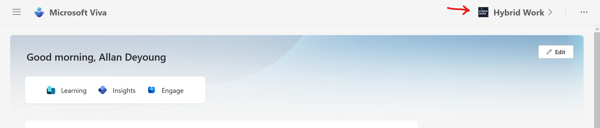

Llevamos más de 2 años hablando de la propuesta EXP (Employee Experience
Platform) de Microsoft que en la práctica se compone de una serie de
aplicaciones y servicios bajo el paraguas de Microsoft Viva y cuya
disponibilidad viene determinada por el licenciamiento disponible. Uno
de los "primeros" Microsoft Viva que surgió es Viva Connections que
facilita no solo la integración en Microsoft Teams de un sitio de
SharePoint que "etiquetemos" como Home o Principal, sino sobre todo el
acceso a recursos e informaciones corporativas a través de elementos de
visualización e interacción en el Dashboard o de visualizar el feed de
actividad. En Viva Connections el empleado pasa a ser el centro de
atención y se busca proporcionarle acceso rápido y directo a
aplicaciones e informaciones de interés:


En esta versión "1.0" de Viva Connections era responsabilidad de la
organización o de su partner tecnológico el diseñar y desplegar una
experiencia de usuario adecuada que facilitase el acceso a esos recursos
e información corporativa. Con la versión "2.0", Microsoft ha presentado
una propuesta de página Home mucho más simplifica en la que se facilita
no solo el acceso a los recursos corporativos de interés, sino también a
los restos de productos de la suite de Vita que pueda disponer una
organización.

**Elementos principales de la nueva Home de Viva Connections**

La nueva Home de Viva Connections tiene la siguiente apariencia en la
que rápidamente podremos identificar los bloques fundamentales:


Como se puede apreciar, la nueva Home dispone de:

-   Navegación al resto de productos de la suite de Viva de que disponga
    la organización.

-   Dashboard de Viva Connections más optimizado en cuanto a su
    visualización y experiencia de usuario e incorporando nuevos cards
    como los de Viva Learning y Viva Topics.


-   Sección de Recursos en los que el usuario puede visualizar el
    listado de Sitios frecuentes, el listado de Sitios seguidos y una
    serie de recursos que vienen definidos por la navegación del Home
    Site definido en el tenant.


-   Feed de actividad que muestra información de actividad generada en
    SharePoint y Yammer en base al contenido que los usuarios siguen.

**Opciones de personalización de la Home de Viva Connections**

La nueva Home de Viva Connections presenta tres zonas de
personalización:

-   Background de la Home de Viva Connections, con especial énfasis en
    la cabecera.

-   Dashboard de Viva Connections.

-   Recursos.


La personalización de la imagen de fondo nos permite seleccionar una
imagen a aplicar al fondo de la nueva Home eligiendo entre imágenes que
tengamos almacenadas en Sitios de SharePoint o OneDrive, en nuestro
equipo personal o bien buscándolas en el stock de imágenes:


La personalización del Dashboard supone acceder a la configuración del
Dashboard de Viva Connections del Home Site configurado, pero desde
Teams:


Finalmente, editar los recursos de Viva Home consiste en editar la
navegación del Home Site:


**Controles de Gobierno para la Home de Viva Connections**

A nivel de controles de Gobierno para la Home de Viva Connections, una
pregunta que puede surgir es la siguiente: ¿Puedo configurar si quiero
como experiencia por defecto la nueva Home o la Home que tengo definida
en mi Home Site? La respuesta es que sí, pero a través de PowerShell
porque como podéis ver en la siguiente captura seguimos sin disponer de
opciones de configuración y gobierno adicionales para la App de Viva
Connections en el Teams Admin Center:


La siguiente pregunta que os haréis es: ¿Y con PowerShell se puede hacer
algo? La respuesta es que sí. Podemos establecer cuál es la Home por
defecto que queremos para Viva Connections de la siguiente forma:

```
Set-SPOHomeSite -HomeSiteUrl <homesiteURL> -VivaConnectionsDefaultStart <$true/$false>
```

Un valor $false para el parámetro VivaConnectionsDefaultStart quiere
decir que el home por defecto para Viva Connections será la nueva Home.
Un valor $true en cambio indica que queremos seguir utilizando la
página principal del Home Site del tenant como página principal. Por
defecto cuando se realice el rollout de la nueva Home, esta pasa a ser
la página principal de Viva Connections, aunque desde la misma podemos
navegar a nuestro Home Site.




A la inversa, también podremos acceder (aunque algo oculto si me lo
permitís) desde el Home Site a la nueva Home de Viva Connections.


**Conclusiones**

Dentro de la evolución natural de Viva Connections, Microsoft ha puesto
sobre la mesa un nuevo concepto de Home que mejore y unifique la
experiencia de usuario en el acceso al resto de la suite de Viva, así
como a recursos e informaciones de interés de cada corporación.

**Juan Carlos Gonzalez** <br />
M365 SME & Delivery Manager | Microsoft 365 Apps & Services MVP <br />
@jcgm1978 | youtube.com/@jcgonzalezmartin