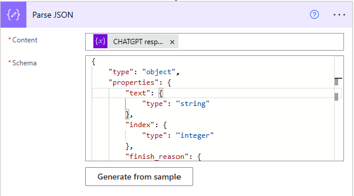
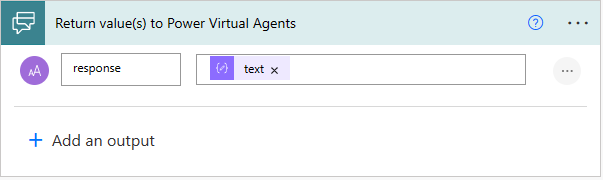

Luego de haber creado nuestro Power Virtual Agent veremos cómo
conectarlo con el servicio de OpenAI utilizando Power Automate. Con ello
podremos generar una asistente virtual con la capacidad de respuesta que
ChatGPT nos brinda.

Ya pudieron observar en ediciones anteriores que el Virtual Agent viene
configurado por defecto con algunos Topics como por ejemplo saludos.

Los siguientes pasos son los mismos que hicimos anteriormente para
conectar con otros servicios, pero recordémoslos nuevamente.

Una vez creado el Virtual Agent debemos dirigirnos a las opciones y
seleccionar "**System fallback**"


Una vez allí no aparecerá la siguiente pantalla:


Debemos hacer Click en "**Add**"

Aparecerá la siguiente pantalla y vamos a "**Go to fallback topic**"


Nos aparecerá la siguiente pantalla donde podremos ver el flujo de la
conversación.


Una vez allí iremos agregando paso a paso:

Primero eliminamos la acción "**Redirect**" pues no lo utilizaremos


En este punto debemos conectar nuestro Virtual Agent con el flujo de
Power Automate que será quien invocará a OpenAI para obtener la
respuesta.

Hacemos click en "**Add Node**"
 luego hacemos Click en "**Call an
Action"** y "**Create a Flow**".


Se nos abrirá la pantalla de Power Automate:


Le damos un nombre a nuestro Flow y definimos la variable de entrada que
será donde vendrá el texto de la pregunta realizada por nuestro usuario
en el Power Virtual Agent.


Agregamos una acción del tipo **"GPT3 Completes your prompt"**


Nos aparecerá la siguiente sección para generar la conexión con OpenAI:


Es muy importante el cargar la API Key exactamente como "Bearer
YOUR_API_KEY". Literalmente así: la palabra Bearer + espacio + API_KEY

EJ: Bearer 1234-12434-1231-12323

Para generar la API debemos ingresar a https://openai.com y allí a la
sección "API". Nos Registramos y luego vamos a nuestro perfil y allí a
view API Key


Allí seleccionamos new API Key copiamos el valor y volvemos a nuestro
Flow de Power Automate:


De nuevo en Power Automate cargamos los datos, damos aceptar y generamos
la conexión.


Una vez generada la conexión ya solo necesitamos pasarle los parámetros
correspondientes para obtener el resultado de ChatGPT basado en lo que
el texto que el usuario ingreso.


Definimos una variable para guardar la respuesta:


Agregamos un Apply to each y seleccionamos la colección a iterar
"Choices":


Luego guardamos el valor actual en la variable recién definida. Una vez
guardado el valor debemos procesar o parsear el JSON de respuesta. Aquí
el esquema (schema) que debemos utilizar para parsear la respuesta
correctamente.

```
{
    "type": "object",
    "properties": {
        "text": {
            "type": "string"
        },
        "index": {
            "type": "integer"
        },
        "finish_reason": {
            "type": "string"
        }
    }
}
```



Por último, solo falta retornar la respuesta al Power Virtual Agent



Retornamos nuestra respuesta al Virtual Agent. Guardamos nuestro Flow y
retornamos a la página de Power Virtual Agents para agregarlo


Una vez agregado nuestro flujo seleccionamos la variable de entrada
"**bot.UnrecognizedTriggerPhrase**"


Agregamos un nuevo nodo para desplegar la respuesta seleccionando
"**Show a message**"


Seleccionamos la variable Output:


Finalmente guardamos y tenemos disponible nuestro Virtual Agent
conectado con ChatGPT:


Solo queda comenzar a realizarle consultas y ver que resulta.

**Conclusión**

El conectar un Power Virtual Agent con OpenAI nos permite rápidamente
darle capacidades de respuesta infinita a nuestro chatbot.

**Alex Rostán** <br />
Microsoft Business Applications MVP <br />
Principal Microsoft COE -- Slalom Canada <br />
AI & Smarts Applications Cloud Architect (Azure, O365, Power Platform) <br />
Mail: rostanker@msn.com <br />
Twitter: @rostanker <br />
LinkedIn: https://www.linkedin.com/in/alexrostan/
 
 
import LayoutNumber from '../../../components/layout-article'
export default LayoutNumber
