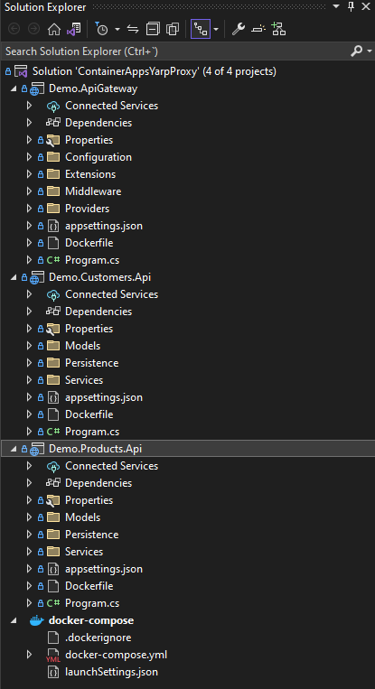
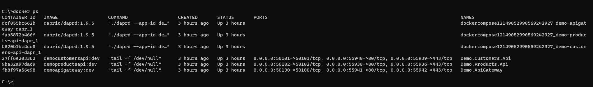
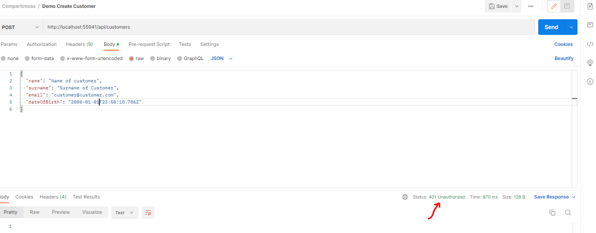
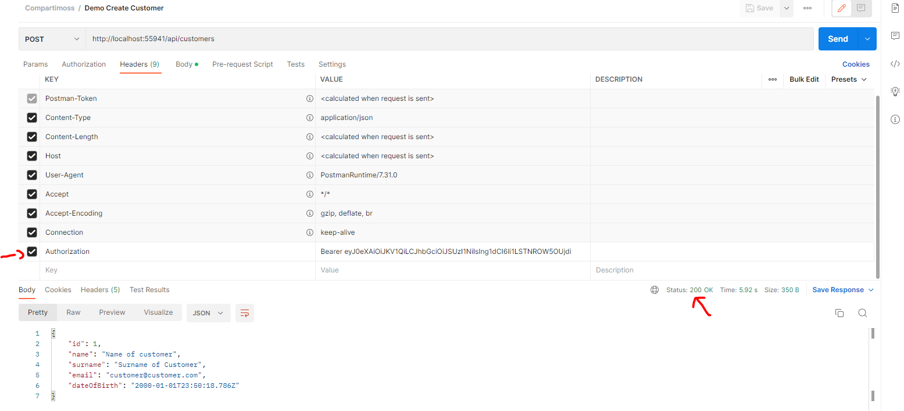
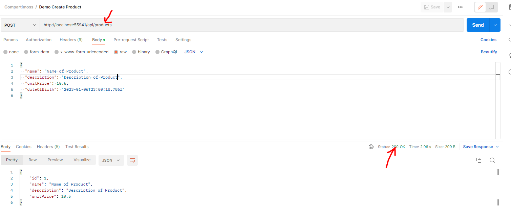

A todos nos molan los microservicios, ¿verdad? Has escuchado lo que es
Dapr y alucinas con lo que ofrece para que tus desarrollos suban a un
nivel superior. Si te cuento que podemos implementar un ApiGateway con
YARP (Yet Another Reverse Proxy) y configurar las rutas para que sea
Dapr el encargado de llamar a tus microservicios empleando el Service
Invocation API, ¿te interesaría? Sigue leyendo.

**¿Qué es un Proxy Inverso?**

Es necesario conocer el concepto de Proxy Inverso. Un proxy inverso es
una pieza de software que se encuentra frente a los servidores de
backend y se asegura de que ningún cliente se comunique directamente con
ellos. Generalmente se implementan para ayudar a aumentar la seguridad,
el rendimiento y la confiabilidad ya que proveen de diferentes
beneficios como equilibrio de carga, almacenamiento en caché, cifrado
SSL y protección contra ataques DoS y DDoS.

**¿Qué es YARP?**

Lo primero es dejarte por aquí una estupenda charla de mi amigo [Diego
Zapico](https://www.compartimoss.com/autores/diego-zapico/) en la .NET
Conf 2022 de Madrid que habla sobre YARP para que tengas más información
(<https://www.youtube.com/watch?v=a-Fm-aSHgrY>) y la dirección de la
documentación oficial del producto
(<https://microsoft.github.io/reverse-proxy/articles/getting-started.html>).

"YARP es una biblioteca de código abierto con la que puede implementar
funcionalidades básicas relacionadas con el proxy agregando o
reemplazando módulos. Actualmente, YARP se puede utilizar en forma de
paquetes NuGet y fragmentos de código. Microsoft planea proporcionar una
plantilla de proyecto y un exe precompilado para YARP para que los
usuarios no pierdan tiempo manejando fragmentos de código redundantes y
configurando un proyecto.

YARP se implementa sobre el marco .NET y está disponible para usuarios
de Windows, Mac y Linux"

**¿Qué es Dapr?**

Según la documentación oficial (<https://docs.dapr.io>), Dapr es un
tiempo de ejecución portable a varios sistemas operativos basado en
eventos que facilita a cualquier desarrollador la creación de
aplicaciones resilientes, con y sin estado que se ejecutan en la nube y
en el perímetro, y abarca la diversidad de lenguajes y marcos de
desarrollo. Al aprovechar los beneficios de una arquitectura sidecar,
Dapr lo ayuda a enfrentar los desafíos que surgen con la creación de
microservicios y mantiene su plataforma de código independiente.

Para este artículo que nos ocupa, emplearemos un "building block", que
es un API HTTP o gRPC que puede ser llamado desde nuestro código para
usar uno o más componentes Dapr.

Emplearemos el bloque de invocación de servicio que tiene el siguiente
esquema


1.  El servicio A hace una llamada HTTP o gRPC indicando como destino el
    servicio B. Esta llamada se hace al sidecar de Dapr.

2.  Dapr descubre la localización del servicio B usando [name resolution
    component](https://docs.dapr.io/reference/components-reference/supported-name-resolution/).

3.  Dapr reenvía el mensaje al sidecar Dapr del servicio B (usando gRPC
    siempre).

4.  El sidecar Dapr del servicio B reenvía la solicitud al endpoint
    concreto de Service B.

5.  El servicio B ejecuta su código y envía su respuesta al servicio A
    por medio del su sidecar Dapr.

6.  Dapr reenvía la respuesta al sidecar Dapr del servicio A.

7.  El servicio A recibe dicha respuesta.

**Al lío...**

Una vez ya tenemos algunos conceptos claros, vamos a empezar a ver algo
de código. Para la demo se ha generado una solución con tres proyectos,
de los cuales dos, serán nuestras Minimal Api de backend. La parte de
autenticación la delegaremos en nuestro Api Gateway por lo que se
descarga el backend de realizar estas comprobaciones.



Nos centraremos en la aplicación que implementa YARP. Lo primero que hay
que realizar es instalar el paquete
[Yarp.ReverseProxy](https://github.com/microsoft/reverse-proxy) para
tener disponible el servicio de proxy inverso.

Una vez hecho esto y si nos fijamos en la documentación de YARP sobre la
configuración, las settings deberían tener el siguiente esquema:

```
{
    "ReverseProxy": {
      "Routes": {
        "route1": {
          "ClusterId": "cluster1",
          "Match": {
            "Path": "{**catch-all}",
            "Hosts": [ "www.aaaaa.com", "www.bbbbb.com"],
          },
        }
      },
      "Clusters": {
        "cluster1": {
          "Destinations": {
            "cluster1/destination1": {
              "Address": "https://example.com/"
            }
          }
        }
      }
    }
  }
```

En la sección "Routes" se definen aquellas rutas que vamos a tener en
cuenta en nuestro ApiGateway y su configuración. Es importante saber que
podemos incluir Metadatos en nuestras rutas para su posterior uso como
ya veremos. Fijaos en que es obligatorio establecer un ClusterId y
definir una sección "Clusters" que contiene principalmente una colección
de destinos con nombre y sus direcciones capaces de manejar solicitudes
para una ruta determinada.

Hemos comentado de usar Dapr para realizar la comunicación entre
servicios, ¿cierto? Pues continúa leyendo.

Nuestra configuración por defecto tendrá este formato

```
"ReverseProxy": {
    "Routes": {
      "customersRoute": {
        "ClusterId": "dapr-sidecar",
        "CorsPolicy": "CorsPolicy",
        "AuthorizationPolicy": "default",
        "Match": {
          "Path": "/api/customers/{**catch-all}"
        },
        "Metadata": {
          "DaprEnabled": "true",
          "DaprAppId": "demo-customers-api"
        }
      },
      "productsRoute": {
        "ClusterId": "dapr-sidecar",
        "CorsPolicy": "CorsPolicy",
        "AuthorizationPolicy": "default",
        "Match": {
          "Path": "/api/products/{**catch-all}"
        },
        "Metadata": {
          "DaprEnabled": "true",
          "DaprAppId": "demo-products-api"
        }
      }
    }
  }
```

El ClusterId será siempre fijo a "dapr-sidecar". Definimos un objeto
Metadata en el que le indicamos que se ha habilitado Dapr y le indicamos
qué Application Id de Dapr está asociado a esa ruta. Esto es esencial ya
que como veremos, necesitamos este dato para realizar la invocación de
servicio a servicio. Sabemos que Dapr es un sidecar que se estará
ejecutando "pegadito" a nuestra Api contenerizada, pero no sabemos cuál
es su puerto (por defecto en HTTP es el 3500 y siempre vamos a acceder a
él con la uri http://localhost:PUERTO) por lo que usaremos un
método de extensión para construir dinámicamente la sección "Clusters"
de la configuración. Aquí el truquito.

```
public static IConfigurationBuilder AddDaprConfiguration(this IConfigurationBuilder configuration)
{
    var httpEndpoint = DaprDefaults.GetDefaultHttpEndpoint();
    return configuration.AddInMemoryCollection(new[]
    {
        new KeyValuePair<string, string>("ReverseProxy:Clusters:dapr-sidecar:Destinations:d1:Address", httpEndpoint!),
    });
}
public static string? GetDefaultHttpEndpoint()
{
    if (httpEndpoint is null)
    {
        var port = Environment.GetEnvironmentVariable("DAPR_HTTP_PORT");
        port = string.IsNullOrEmpty(port) ? "3500" : port;
        httpEndpoint = $"http://127.0.0.1:{port}";
    }
    return httpEndpoint;
}
```

Con esto es como si tuviéramos en un archivo de configuración las
settings completas de la sección "Clusters". Bien, ya tenemos la
configuración de las rutas y de los clusters. Vamos ahora a incluir un
proveedor de transformación de rutas para una vez capturada la ruta de
la petición, generaremos una petición al sidecar de Dapr y poder así
llamar al servicio de backend que queramos.

```
using Demo.ApiGateway.Configuration;
using Microsoft.AspNetCore.Http;
using Yarp.ReverseProxy.Transforms;
using Yarp.ReverseProxy.Transforms.Builder;
namespace Demo.ApiGateway.Providers;
public class DaprTransformProvider : ITransformProvider
{
    public void ValidateRoute(TransformRouteValidationContext context)
    {
    }
    public void ValidateCluster(TransformClusterValidationContext context)
    {
    }
    public void Apply(TransformBuilderContext context)
    {
        if (context.Route.Metadata?.TryGetValue(DaprYarpConstants.MetaKeys.DaprEnabled, out string? daprEnabled) ?? false)
        {
            if (string.IsNullOrWhiteSpace(daprEnabled))
            {
                throw new ArgumentException("A non empty DaprEnabled value is required");
            }
            if (!bool.TryParse(daprEnabled, out bool enabled))
            {
                throw new ArgumentException("A valid DaprEnabled value is required");
            }
            if (enabled)
            {
                if (context.Route.Metadata?.TryGetValue(DaprYarpConstants.MetaKeys.DaprAppId, out string? appId) ?? false)
                {
                    if (string.IsNullOrWhiteSpace(appId))
                    {
                        throw new ArgumentException("A valid Dapr AppId value is required");
                    }
                    context.AddRequestTransform(transformContext =>
                    {
                        transformContext.ProxyRequest.Headers.Add("dapr-app-id", appId);
                        transformContext.ProxyRequest.RequestUri =
                                        new Uri($"{transformContext.DestinationPrefix}{transformContext.Path.Value!}{transformContext.Query.QueryString.Value}");
                        return ValueTask.CompletedTask;
                    });
                }
            }
        }
    }
}
```

Verificamos los datos incluidos en el objeto Metadata de la ruta y
transformamos la petición original en otra que llama a Dapr. El código
es muy simple y descriptivo. Bien, ahora toca inicializar YARP y Dapr en
el arranque de nuestro ApiGateway empleando diversos métodos de
extensión.

```
public static void AddReverseProxy(this WebApplicationBuilder builder, IConfiguration configuration)
{
    builder.Services.AddReverseProxy()
        .LoadFromConfig(builder.Configuration.GetSection("ReverseProxy"))
                    .AddTransforms<DaprTransformProvider>(); //agregar proveedor de transformación
    builder.Services.AddDaprClient();
    builder.Services.AddAuthenticationDefault(configuration);
    builder.Services.AddAuthorization()
                    .AddCorsPolicy(configuration)
                    .AddHttpContextAccessor();
    builder.Services.AddSingleton(configuration);
    builder.Services.AddHealthChecks();                        
}
```

Y establecemos los middlewares

```
private static void UseYarp(this WebApplication app)
{
    app.UseEndpoints(endpoints =>
    {
        endpoints.MapHealthChecks("/hc",
                new Microsoft.AspNetCore.Diagnostics.HealthChecks.HealthCheckOptions { Predicate = _ => true });
        endpoints.MapHealthChecks("/liveness",
            new Microsoft.AspNetCore.Diagnostics.HealthChecks.HealthCheckOptions
            {
                Predicate = r => r.Name.Contains("self")
            });
        endpoints.MapReverseProxy(pipeline =>
        {
            pipeline.UseReverseProxyPipeline();
        });
    });
}

public static void UseReverseProxy(this WebApplication app)
{
    app.UseRouting();
    app.UseCors("CorsPolicy");
    app.UseAuthentication();
    app.UseAuthorization();
    app.UseYarp();
}
```

**Veamos el ejemplo**

Ejecutamos docker-compose para iniciar nuestras Api y los sidecars de
Dapr asociados. Una vez ejecutado comprobamos que los contenedores están
en ejecución.



Bien, buscamos nuestro ApiGateway (que en la imagen está en el puerto
http 55941). Ejecutamos desde Postman por ejemplo una llamada para crear
un "customer"




Se observa que nos devuelve un 401 porque no enviamos un token válido.
Realizamos una petición de Token y establecemos la cabecera
Authorization y...



¡Ya hemos creado un **customer**!

Ok, ahora a crear un "product" (fijaos en la url, mismo host y puerto
que la solicitud anterior de customers).



**¿Dónde puedo encontrar el código de ejemplo?**

No os preocupéis si no lo tenéis claro, lo veréis mejor al descargar el
código fuente en
<https://github.com/sparraguerra/compartimoss/tree/master/ContainerAppsYarpProxy>

**Conclusiones**

Hemos visto lo sencillo que es implementar con YARP nuestro amado
ApiGateway. Con esto ganamos seguridad ya que permitimos que nuestras
Api de backend estén "ocultas" al exterior. Y con Dapr hemos confirmado
lo fácil que es llamar a cualquier Api de backend.

Happy coding!

**Sergio Parra Guerra** <br />
Software & Cloud Architect at Encamina <br />
https://twitter.com/sparraguerra