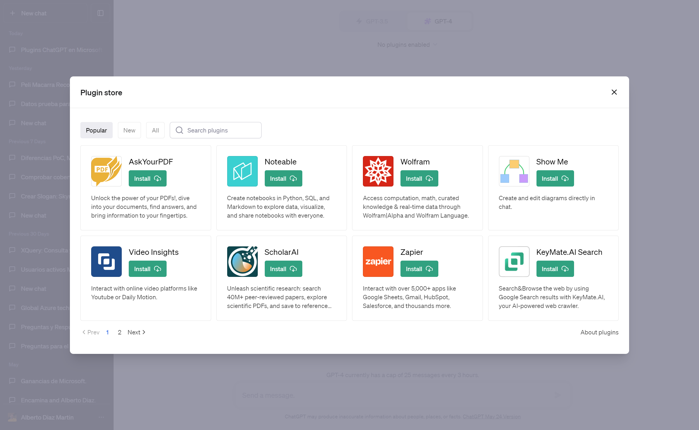
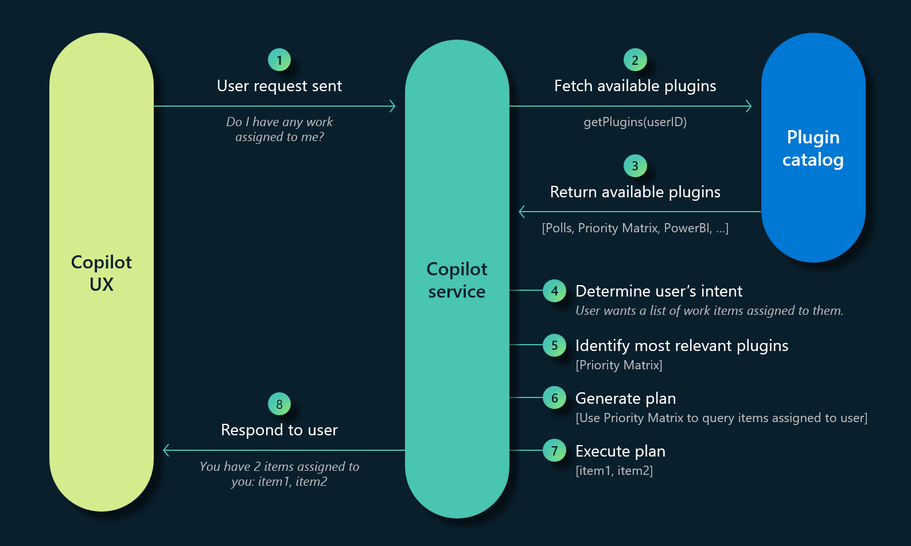

En el mundo actual, donde la inteligencia artificial (IA) juega un papel fundamental en el desarrollo de aplicaciones y servicios, 
Microsoft ha adoptado un modelo de extensión revolucionario para su asistente digital, Microsoft 365 Copilot. 
Los Plugins de ChatGPT son una de las opciones de plugins disponibles en Microsoft 365 Copilot, junto con las extensiones de 
mensajes de Teams y los conectores de Microsoft Power Platform. Estos plugins permiten a los desarrolladores crear nuevas funcionalidades 
y personalizar la experiencia de los usuarios en Microsoft 365 Copilot, llevando la inteligencia artificial a un nivel superior.



**Ampliando la funcionalidad de ChatGPT**

Los plugins de ChatGPT están diseñados para mejorar y personalizar la funcionalidad de ChatGPT, proporcionando una experiencia más 
enriquecedora para los usuarios. Desde mejorar la comprensión del lenguaje natural hasta la integración con otras aplicaciones y 
servicios, estos plugins ofrecen una amplia gama de capacidades.

**Integración con otras aplicaciones y servicios**

Otra ventaja clave de los plugins de ChatGPT es su capacidad para integrarse con otras aplicaciones y servicios. 
Esto significa que los desarrolladores pueden crear plugins que permitan al asistente interactuar con aplicaciones como Microsoft Office, 
Outlook, SharePoint y más. Los usuarios pueden, por ejemplo, programar reuniones, enviar correos electrónicos, acceder a documentos y 
realizar otras tareas directamente a través de ChatGPT, simplificando así su flujo de trabajo.

Esta integración interactua con los sistemas a través de las APIs definidas en OpenApi. 

**Definición de un Plugin**

Para crear un Plugin necesitamos la definición OpenApi de la API del sistema y crear un fichero de definión del plugin, ai-plugin.json, 
que debemos alojar en la ruta /.well-known/ai-plugin.json. 

```json
{
    "schema_version": "v1",
    "name_for_human": "TODO List",
    "name_for_model": "todo",
    "description_for_human": "Manage your TODO list. You can add, remove and view your TODOs.",
    "description_for_model": "Help the user with managing a TODO list. You can add, remove and view your TODOs.",
    "auth": {
        "type": "none"
    },
    "api": {
        "type": "openapi",
        "url": "http://localhost:3333/openapi.yaml"
    },
    "logo_url": "http://localhost:3333/logo.png",
    "contact_email": "support@example.com",
    "legal_info_url": "http://www.example.com/legal"
}
```

GPT conoce de la existencia del plugin y decide usarlo gracias a la interpretación del lenguaje natural y la definión que hacemos para el modelo
en el campo name_for_model y description_for_model. Las funciones disponibles en el Plugin son las disponibles en el fichero de definición de la API,
openapi.yaml. 

```yaml
openapi: 3.0.1
info:
  title: TODO Plugin
  description: A plugin that allows the user to create and manage a TODO list using ChatGPT. If you do not know the user's username, ask them first before making queries to the plugin. Otherwise, use the username "global".
  version: 'v1'
servers:
  - url: http://localhost:5003
paths:
  /todos/{username}:
    get:
      operationId: getTodos
      summary: Get the list of todos
      parameters:
      - in: path
        name: username
        schema:
            type: string
        required: true
        description: The name of the user.
      responses:
        "200":
          description: OK
          content:
            application/json:
              schema:
                $ref: '#/components/schemas/getTodosResponse'
    post:
      operationId: addTodo
      summary: Add a todo to the list
      parameters:
      - in: path
        name: username
        schema:
            type: string
        required: true
        description: The name of the user.
      requestBody:
        required: true
        content:
          application/json:
            schema:
              $ref: '#/components/schemas/addTodoRequest'
      responses:
        "200":
          description: OK
    delete:
      operationId: deleteTodo
      summary: Delete a todo from the list
      parameters:
      - in: path
        name: username
        schema:
            type: string
        required: true
        description: The name of the user.
      requestBody:
        required: true
        content:
          application/json:
            schema:
              $ref: '#/components/schemas/deleteTodoRequest'
      responses:
        "200":
          description: OK

components:
  schemas:
    getTodosResponse:
      type: object
      properties:
        todos:
          type: array
          items:
            type: string
          description: The list of todos.
    addTodoRequest:
      type: object
      required:
      - todo
      properties:
        todo:
          type: string
          description: The todo to add to the list.
          required: true
    deleteTodoRequest:
      type: object
      required:
      - todo_idx
      properties:
        todo_idx:
          type: integer
          description: The index of the todo to delete.
          required: true
```

Al igual que en el fichero de definión del Plugin, los campos de descripción y resumen son relevantes para la interpretación del lenguaje natural, 
ya que ChatGPT decide en tiempo de ejecución que Plugin y que método debe de usar, en función de la petición del usuario. 

Con este plugin habilitado, si el usuario escribe "Dame todas las tareas del usuario adiazcan", el plugin interpretará esa petición y hará una 
llamada al metodo GET de la API, y devolverá el resultado al usuario.

**Adopción de Microsoft 365 Copilot**

Microsoft ha adoptado este modelo de extensión para brindar a los desarrolladores la oportunidad de crear plugins que funcionen 
no solo en ChatGPT, sino también en Bing, Dynamics 365 Copilot y Microsoft 365 Copilot en general. Microsoft 365 Copilot es un asistente 
que tiene como objetivo proporcionar asistencia personalizada a los usuarios para una variedad de tareas y actividades.

Al combinar el poder de los modelos de lenguaje grandes (LLM) con los datos de Microsoft Graph y las aplicaciones de Microsoft 365, 
Microsoft 365 Copilot se convierte en una herramienta de productividad sin igual. Los plugins de ChatGPT desempeñan un papel crucial al 
permitir a los desarrolladores agregar nuevas funcionalidades y personalizar la experiencia del usuario en este entorno de 
asistente digital impulsado por IA.



Como podemos ver en el diagrama anterior, Copilot se comunica con los plugins disponibles y determina la intensión del usuario para generar un 
plan de ejecución y ejecutarlo, ya que es posible que tenga que ejecutar más de una función para satisfacer la petición del usuario.

**Conclusiones**

Los Plugins de ChatGPT son extensiones de software diseñadas para mejorar y personalizar la funcionalidad de Microsoft 365 Copilot. 
Al permitir la integración con otras aplicaciones y servicios, estos plugins llevan la experiencia del usuario a un nuevo nivel 
de eficiencia y comodidad. La adopción de este modelo de extensión por parte de Microsoft demuestra su compromiso con la innovación 
y su deseo de proporcionar a los desarrolladores las herramientas necesarias para crear soluciones inteligentes y 
personalizadas en Microsoft 365 Copilot.

**Alberto Diaz Martin** <br />
MVP Azure, MVP Office Apps & Services <br />
Microsoft Regional Director <br />
adiazcan@hotmail.com <br />
@adiazcan <br />
http://blogs.encamina.com/por-una-nube-sostenible/ 
 
import LayoutNumber from '../../../components/layout-article'
export default LayoutNumber
