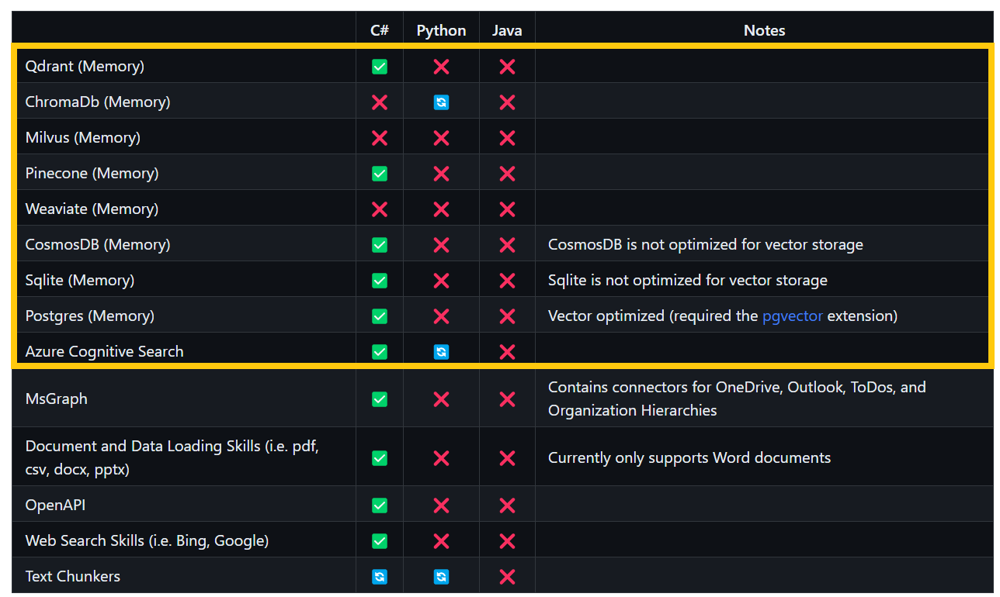
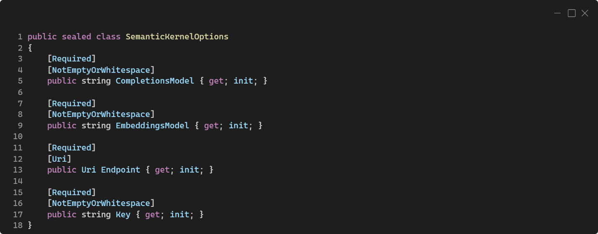
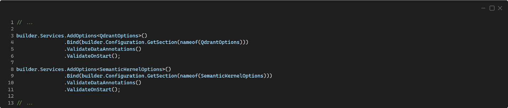
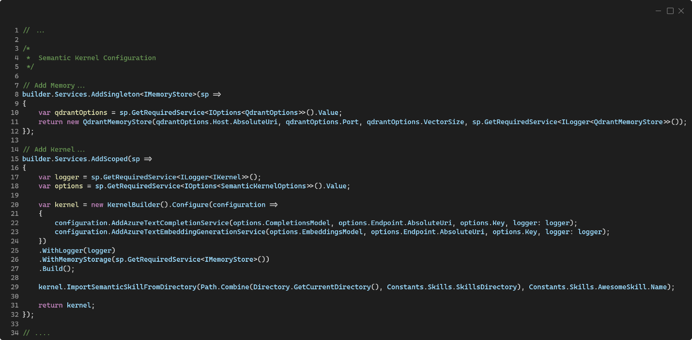
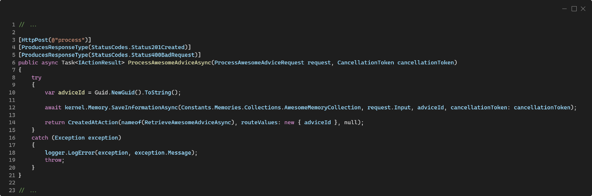
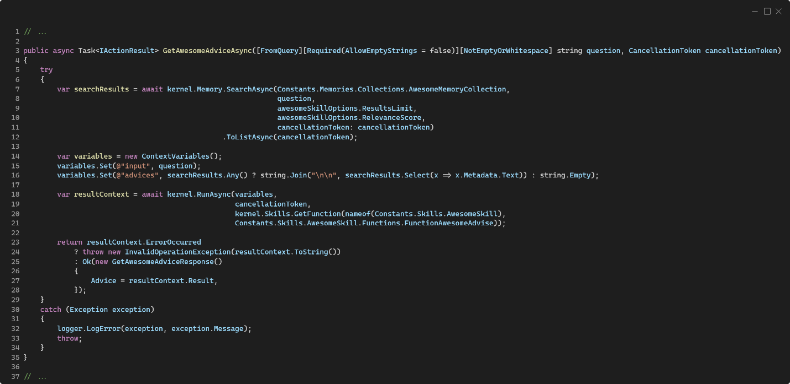

A menos que estés viviendo bajo una piedra, o te hayas consagrado a ermitaño, seguro estarás como todos nosotros contantemente inundado de noticias e innovaciones sobre la Inteligencia Artificial. De hecho, algunas personas ya bromean con que cada semana salen nuevos productos o servicios de Inteligencia Artificial (IA) como si fueran frameworks de JavaScript.
Dentro de ese contexto, una de las tecnologías de IA que más importancia está tomando dentro del mundo de quienes nos dedicamos a trabajar con las tecnologías de Microsoft es Semantic Kernel.
La primera parte puede ser un poco teórica, con muchas explicaciones para dar contexto a lo que vamos a montar. Si quieres ir directo al código (en C#), ve al título “La arquitectura de referencia” 🏃
Otra cosa, el código que veremos en este artículo lo podéis encontrar en mi GitHub aquí 👉 https://github.com/rliberoff/CompartiMOSS-Demo-June-2023 

**¿Qué es Semantic Kernel?**
Semantic Kernel es una librería de código abierto (open source) muy liguera que principalmente se enfoca en facilitar la combinación de mensajes e indicaciones – los famosos prompts – para Inteligencias Artificiales generativas basadas en las tecnologías de OpenAI, con distribuciones para los lenguajes C#, Python y TypeScript, aunque en cada caso la fecha de salida de características es un tanto diferente, siendo C# el lenguaje que más actualizaciones recibe.
Semantic Kernel ha sido diseñado para permitir que los desarrolladores integren tecnologías de IA de manera flexible en sus aplicaciones. Para hacerlo, Semantic Kernel proporciona un conjunto de abstracciones que facilitan la creación y administración de prompts, memorias, funciones y conectores. 
Gracias a las abstracciones que proporciona Semantic Kernel, se puede usar para organizar las capacidades de IA de casi cualquier proveedor. Por ejemplo, se puede usar Semantic Kernel para orquestar una AI desde OpenAI, Azure Open AI e incluso Hugging Face.
Esta librería es tan poderosa y significativa dentro del marco de negocio para Inteligencia Artificial que está proponiendo Microsoft, que se está convirtiendo en el eje fundacional principal en la implementación de servicios y aplicativos que conocemos con el apelativo de «Copilots», o también plug-ins potenciados por IA.
Esto quiere decir que gracias a Semantic Kernel y sus capacidades de integración de tecnologías de IA, será muy fácil construir nuestras propias aplicaciones de la IA, y distribuirlas dentro de la categoría de «Copilots». Es más, dos de los ejemplos más emblemáticos de esta librería son el Copilot Chat y el GitHub Repo Q&A Copilot.
Por cierto, Semantic Kernel tiene una excelente y muy activa comunidad en Discord  https://discord.com/invite/VpnfAZkv2a 

**¿Qué es la “memoria” en Semantic Kernel?**

La memoria es uno de los componentes fundamentales de Semantic Kernel, y corresponde al mecanismo para proporcionar un contexto más amplio para las consultas e interacciones de los usuarios de nuestros aplicativos con las Inteligencias Artificiales que los potencian.
Semantic Kernel abstrae la memoria en un concepto que nos permitirá realizar las siguientes tres acciones independientemente de cómo esté implementada la memoria:
1.	Pares clave-valor: de toda la vida. Se considera una búsqueda convencional porque es una coincidencia uno a uno entre una clave y el valor de una consulta.

2.	Almacenamiento local: cuando se guarda información en un archivo, se puede recuperar a partir de su nombre o cierta metadata. No es muy diferente al anterior, salvo por el hecho de que se almacena la información o bien para preservarla de forma más permanente, o bien porque el contenido es tan grande que es necesario apoyarse en recursos como discos duros para mantenerlos.

3.	Búsqueda semántica: el más interesante dentro de las Inteligencias Artificiales. En este caso, la información se representa como un vector muy largo de números, conocido como embeddings (prefiero usar el término en inglés porque digamos que las traducciones al español de “incrustaciones” o “empotramientos” son poco atractivas 😉). Esto permite ejecutar una búsqueda que compara un significado con otro significado dentro de una consulta por lo cercano que estén sus representaciones vectoriales numéricas, que en sí es una definición de “semántica”.

Los embeddings son una forma de representar palabras u otros datos como vectores en un espacio de alta dimensión. Los vectores son como flechas que tienen una dirección y una longitud. La idea de “alto dimensión” hace referencia a que el espacio vectorial tiene muchas dimensiones, más de las que podemos ver o imaginar como humanos. La idea es que palabras o datos similares tengan vectores similares, y palabras o datos diferentes tendrán vectores diferentes. Esto nos ayuda a medir qué tan relacionados o no están entre sí, y también a realizar operaciones en ellos, como sumar, restar, multiplicar, etc. para obtener combinaciones semánticas más complejas e interesantes. Los embeddings son útiles para los modelos de IA porque pueden capturar el significado y el contexto de palabras o datos de una manera que pueden entender y procesar.
Básicamente, toma una oración, un párrafo o una página completa de texto y luego genera el embedding (el vector) correspondiente. Cuando se realiza una consulta, ésta también se transforma a su representación como embedding, y luego se realiza una búsqueda a través de todos los vectores existentes para encontrar los más similares. Esto es parecido a cuando realizamos una consulta en Bing y nos devuelve múltiples resultados cercanos o parecidos a lo que queremos.
Lo cierto es que el trabajo de crear estos embeddings puede llegar a ser laborioso y con muchos detalles que pueden desembocar en errores o comportamientos esperados en nuestras aplicaciones.
Allí es donde entra Semantic Kernel, ayudándonos a configurar los aspectos de la memoria de una forma sencilla para que sea después la librería la que se encargue de las transformaciones, recuperaciones e incluso las búsquedas semánticas correspondientes. Básicamente, nos podemos olvidar de toda la teoría anterior 😅
El otro problema es cómo almacenar, indexar, preservar y recuperar los embeddings partiendo del hecho de que son un tipo de dato bastante particular y grande. 
Aquí es donde entran las bases de datos vectoriales, un tipo específico de bases de datos especiales. Las bases de datos vectoriales no son nuevas en el mercado de las bases de datos, existen desde hace varios años y se empleaban principalmente en la disciplina del Análisis de Datos o en modelos muy sofisticados y complejos de Inteligencia Artificial basada en «Machine Learning».
Con la entrada explosiva de los algoritmos de IA generativa – como nuestro amigo GPT-3 y GPT-4 de Open AI y Azure que dan potencia a ya ultra famoso ChatGPT – los desarrolladores de aplicaciones (como los Copilots) están encontrando la necesidad de contar con este tipo de bases de datos para sus productos y servicios.
En ese ámbito, la oferta es bastante interesante:
•	Azure Cognitive Search Service
•	Azure Cosmos DB
•	Pinecone
•	Postgres
•	Qdrant
Todas estas bases de datos vectoriales (y más que están en la hoja de ruta) son soportadas por Semantic Kernel, aunque principalmente en C#, aun cuando el plan es dar soporte a Python, TypeScript y Java.

En Semantic Kernel, la memoria es considerada como un con componente semántico que manipula texto, lo que implica que, por ahora, Semantic Kernel a nivel de memoria no gestiona contenidos diferentes de texto como podrían ser imágenes, audios o vídeos.
Cuando trabajamos con memorias en Semantic Kernel debemos tener en cuenta otro concepto, el de “colecciones”.
Una colección en memoria es como un cajón donde se almacenan e indexan los embeddings para ser recuperados y procesados durante las búsquedas semánticas. 
Como en el caso de las bases de datos relacionales, al utilizar bases de datos vectoriales tenemos que realizar un diseño de cómo se almacenará la información. En este caso, como será la forma en que se distribuyan los embeddings en las colecciones. Hay muchísimas estrategias, como por ejemplo segregar la información por su enfoque semántico, por su estructura física o por su función.
Por ejemplo, si implementamos una aplicación de IA que sirva para manipular el contenido de los libros de una biblioteca, podríamos diseñar las colecciones en función de los autores, los géneros, los años de publicación o cualquier otra característica que nos permita diseñar y programas a qué colección enviar un determinado embedding. Esto no quiere decir que un mismo embedding no se pueda enviar a más de una colección, eso es algo perfectamente factible, pero como en el caso de las bases de datos relacionales, podría llegar a ser poco óptimo. Podríamos decir que es el equivalente a una desnormalización de un modelo relacional, y que lo aplicaríamos en favor del rendimiento del aplicativo.
Otro elemento importante es entender cómo se generan los embeddings y cómo son comparados entre sí para buscar coincidencias semánticas. Actualmente existen muchísimos algoritmos de generación de embeddings, y cada algoritmo favorece en mayor o menor medida a un algoritmo de búsqueda y comparación. Por ejemplo, el modelo más utilizado para generar embeddings de OpenAI llamado 
«text-embedding-ada-002» favorece los algoritmos de comparación basados en la función de similitud por coseno.
Al elegir una base de datos vectorial debemos tener en cuenta cómo trata y procesa los embeddings para asegurarnos que emplea la función de similitud y búsqueda semántica que mejor se adapta a nuestros requerimientos técnicos.
En Semantic Kernel, al recuperar elementos de la memoria podemos indicar cuál es el nivel o índice de relevancia mínimo que esperamos de los resultados al realizar búsquedas semánticas. El índice de relevancia es un valor entre cero y uno (básicamente un porcentaje) que determina cuán relevante debe ser el resultado de la búsqueda en comparación semántica con el término o consulta proporcionado para la misma, correspondiendo el valor uno, a una coincidencia exacta.
A parte del soporte para las bases de datos antes mencionadas, Semantic Kernel ofrece en su librería el tipo VolatileMemoryStore, el cual se puede considerar como un almacenamiento temporal en memoria que no escribe en el disco y sólo está disponible durante la ejecución de la aplicación. Es súper práctico para pruebas o desarrollos en local.

**¿Por qué Qdrant como base de datos vectorial?**
 
Lo cierto es que Azure Cosmos DB o Azure Cognitive Search Service pueden ser opciones más interesantes dentro del mundo productivo y empresarial por su sello de garantía Microsoft que asegura la calidad, el nivel de servicio (SLA) y los aspectos de seguridad y privacidad.
Lamentablemente, para el momento histórico de escribir este artículo, estos servicios como base de datos vectoriales están aún en «Preview», y por tanto no serían muy recomendables para usar en entornos productivos (por ahora 😉).
El producto de base de datos vectoriales de Qdrant por otro lado, está muy depurado. Tiene tiempo en el mercado, ofrecen una versión desplegable en Azure y otra que podemos desplegar individualmente por nuestra parte a través de contenedores y que se ofrece en modalidad de código abierto (open source).
La gente detrás de Semantic Kernel tienen una excelente relación profesional y de negocios con la gente de Qdrant, lo que podríamos asumir garantiza una conectividad y soporte muy interesantes, algo que podemos evidenciar en este artículo del blog de Semantic Kernel.
Otra ventaja de Qdrant es que es muy rápida, muy simple y sencilla de administrar, razón por la cual es la que elegimos para este artículo (y en general para los proyectos que estoy realizando).
La arquitectura de referencia
La arquitectura que montaremos es 100% «Cloud Native», es decir, que usaremos exclusivamente recursos y servicios que sólo podemos obtener a partir del uso de una nube pública, en nuestro caso, Azure 😎
 

Lo primero es contar con los servicios y recursos de soporte; para los cuales en este caso necesitaremos:
•	Un Azure Log Analytics Workspace donde enviar las trazas y métricas de los servicios de Azure, la base de datos Qdrant y nuestra aplicación con Semantic Kernel.
•	Un Azure Application Insights para explotar las trazas y métricas recabadas en el Log Analytics Workspace.
•	Un Azure Key Vault para los secretos y cadenas de conexiones.
•	Un Azure App Configuration que nos servirá como el repositorio de los parámetros de nuestra aplicación. Este es un recurso de Azure especialmente muy útil para aplicaciones dockerizadas.
•	Un Azure Container Registry donde conservar las imágenes de nuestra aplicación.
Estos servicios y recursos podemos aprovisionarlos en nuestra subscripción de Azure como mejor nos convenga, usando PowerShell, Azure CLI o directamente desde el Portal de Azure.
Esta arquitectura asume que tenéis aprovisionado un recurso de Azure OpenAI para la parte que veremos más delante de vinculación con el Semantic Kernel. También os servirá una cuenta directa de OpenAI.
Lo siguiente a aprovisionar es un Azure Container Environment (ACE) donde se alojarán las Azure Container Apps (ACA) correspondientes a la base de datos vectorial de Qdrant y nuestra aplicación con Semantic Kernel. De momento – hasta donde yo sé – no hay un modo de crear un ACE independientemente de un ACA desde el Portal de Azure, por lo cual usaremos el Azure CLI para hacerlo.
Antes de eso, necesitamos averiguar la clave de conexión de nuestro Azure Log Analytics Workspace para conectarlo con el ACE. Para ello, desde el Azure Portal y dentro de nuestro Log Analytics Workspace, en el menú de la izquierda elegimos «Agents» y en la pantalla que nos aparece extendemos la sección «Log Analytics agent instructions» para poder ver los valores del ID del workspace y las claves (keys).
 

Otra alternativa es usando el Azure CLI:
 

Con estos datos ya podemos aprovisionar nuestro Azure Container Environment (ACE) mediante el siguiente comando del Azure CLI:
 

La ejecución de este comando puede tomar unos varios minutos, así que se paciente y espera a que te retorne el resultado que seguro será exitoso.
Una vez tenemos nuestro ACE, lo siguiente es crear los ACAs. Esto lo haremos desde el Azure Portal directamente (aunque también se puede desde el Azure CLI).
El primer ACA que crearemos es el de Qdrant, para ello desde el Portal de Azure seguimos los pasos que te muestro en las siguientes imágenes:
 

 

Al configurar el contenedor a desplegar es muy importante seguir los siguientes pasos:
1.	Desmarcar la caja (checkbox) de «Use quickstart image».
2.	Elegir como origen de la imagen (image source) la opción de «Docker Hub or other registries» y la opción de «Public».
3.	El servidor de imágenes que usaremos es docker.io.
4.	El nombre y etiqueta (tag) de la imagen de Qdrant que usaremos es qdrant/qdrant:latest.
5.	El resto de las opciones las dejaremos como están.
 

Lo siguiente es configurar cómo será el ingreso al contenedor (ingress) para lo cual también es muy importante seguir estos pasos:
1.	Habilitar el ingreso (ingress) marcando la caja (checkbox) de «Enabled».
2.	En el tipo de tráfico permitido, elegir la opción de «Limited to Container Apps Environment». Esta es la opción más importante en esta configuración pues la base de datos de código abierto (open source) de Qdrant no tiene seguridad alguna en cuanto a control de acceso. Es decir, carece de un usuario y contraseña, por lo cual es fundamental que sea absolutamente imposible llegar a ella desde el Internet, redes públicas o cualquier otro sistema que no esté bajo nuestro control dentro del mismo Azure Container Environment (ACE).
3.	Como puerto de entrada o «Target port» debemos poner 6333 que es el puerto por defecto por el cual escucha Qdrant las peticiones.
 

El resto de las opciones las podemos dejarla por defecto, y simplemente tenemos que esperar a que se aprovisione nuestro ACA con Qdrant.
Mientras tanto, podemos ir creando el volumen en el cual preservar el estado de la base de datos. Al ser Qdrant una base de datos dockerizada es fundamental contar con un volumen montado y asociado a su ACA para que los archivos y estados de las colecciones que gestionen estén ubicadas fuera del contexto del contenedor, tal que, si este se cae, reinicia o sufre algún corte de servicio, la información no se pierda.
El medio ideal y más fácil de configurar es un Azure File Share, ya que es el medio de integración de volúmenes que trae por defecto los Azure Container Environments (ACE).
Para esto, lo primero es contar con un Azure Storage Account, en el cual crearemos un nuevo contenedor para File Share que llamaremos qdrant. Mi recomendación es que uséis el plan (tier) «Hot».
 

Un punto importante antes de crear la conexión con nuestro ACE es buscar la clave de acceso del Azure Storage Account para poder realizar la vinculación, como muestro en la siguiente pantalla:
 

Ahora sí, volvemos a nuestro ACE para agregar el Azure File Share y usarlo como espacio donde montar nuestro volumen para el contenedor de Qdrant. Es importante que el modo de acceso sea de lectura y escritura:
 

Una vez hecho esto, tenemos que modificar la configuración del ACA de Qdrant. Para ello, usando el Azure CLI ejecutamos el siguiente comando:
 

Este comando nos creará un fichero llamado app-qdrant.yaml el cual abriremos con nuestro editor de confianza (Visual Studio Code 😉) para editarlo:
 
En la imagen quizás se ve muy pequeño, así que explicaré lo que estoy haciendo:
1.	En el fichero YAML, reemplazo la parte que dice volumes: null por:
volumes:
- name: compartimoss-qdrant-azure-file-volume
  storageName: qdrant
  storageType: AzureFile

Este cambio lo que hace es indicar que crearemos un volumen de tipo Azure File de nombre qdrant y que llamaremos compartimoss-qdrant-azure-file-volume.

2.	Agregaremos una configuración volumesMount para indicar dónde debe montarse el volumen desde dentro del contenedor de Qdrant:
volumeMounts:
- volumeName: compartimoss-qdrant-azure-file-volume
  mountPath: /qdrant/storage  

Aquí se vincula el punto de montaje del volumen con el volumen creado en el paso anterior. Así, cuando la base de datos Qdrant genere las colecciones en el directorio /qdrant/storage, realmente se estarán almacenando en el Azure File Share qdrant que creamos y vinculamos al ACE anteriormente.
Ahora nos queda sólo actualizar el contenedor con el YAML modificado, para lo cual ejecutamos el siguiente comando en Azure CLI:
 

Y listo, ya tenemos nuestra base de datos vectorial de Qdrant ejecutándose en un ACA con un acceso restringido a sólo el ACE donde vive, para asegurar que nadie podrá llegar hasta ella desde el exterior.
Ahora vamos con el código del Semantic Kernel. Para ello tendremos en este caso una aplicación web sencilla con ASP.NET dockerizada. Así, lo primero es traernos los paquetes NuGet que necesitaremos:
•	Microsoft.SemanticKernel.Core
•	Microsoft.SemanticKernel.Connectors.Memory.Qdrant
Al trabajar con Qdrant en nuestro código, necesitaremos tener en cuenta tres parámetros:
•	Host  el cual corresponde a la URL donde está desplegado Qdrant, y que en nuestro caso será el FQDN del ACA donde lo desplegamos.
•	Port  el puerto por donde escucha solicitudes Qdrant, en nuestro caso será 443, ya que los ACAs reciben todos sus ingresos (ingress) por los puertos estándares de HTTP. Ya será el propio ACA que contiene el Qdrant el que se encargue de pasar las peticiones desde el puerto 443 al puerto 6333.
•	Tamaño de vectores  Este es un término entero (int) que define el tamaño máximo de los vectores dentro de las colecciones. No es de mayor relevancia, por lo que suelo recomendar el valor por defecto de 1536. Lo importante a saber aquí es que valores pequeños para este parámetro implican que los vectores de un determinado embedding serán más pequeños y que la información estará más segmentada dentro de la colección, mientras que valores más grandes serán menos segmentados, pero podrían ser más lentos de procesar en búsquedas semánticas. La idea es buscar el valor más conveniente para nuestra aplicación. 
Para gestionar estos valores, he creado una clase de opciones que he llamado QdrantOptions y que mapea a una sección en el appsettings.json o bien a valores dentro del Azure App Configuration:
 
En el caso del propio Semantic Kernel también he creado una clase de opciones para gestionar por configuración algunos de sus parámetros. A dicha clase la he llamado SemanticKernelOptions:
 
En esta clase se gestionan las siguientes opciones de configuración:
•	CompletionsModel  corresponde al nombre del modelo para completaciones desplegado en nuestra cuenta de OpenAI, donde en mi ejemplo suelo usar text-davinci-003.
•	EmbeddingsModel  corresponde al nombre del modelo para embeddings desplegado en nuestra cuenta de OpenAI y que usará el Semantic Kernel en conjunto con la memoria (en este caso la base de datos vectorial de Qdrant) para generar y leer los embeddings de los textos procesados y las consultas realizadas. En mi ejemplo suelo usar text-embedding-ada-002.
•	Endpoint  es la URL al servicio de Azure OpenAI (o de OpenAI per se).
•	Key  es la clave de acceso al servicio de OpenAI.

Como os comentaba en la arquitectura de referencia, como estas aplicaciones están dockerizadas, lo más convenien te es tener estos parámetros y opciones de configuración en un Azure App Configuration:
 

Lo siguiente es agregar nuestras clases de opciones al contenedor de dependencias, para lo cual escribimos las siguientes líneas de código en nuestro Program.cs:

Al agregar Semantic Kernel y Qdrant a nuestro proyecto, debemos hacerlo de la forma correcta para que la Inyección de Dependencias funcione a perfección. Para ello, en nuestro Program.cs tendremos las siguientes líneas:

En las líneas 8 a 12, agregamos una memoria basada en Qdrant como una implementación del tipo de interfaz IMemoryStore. Este es el tipo de interface que permite definir conectores con bases y repositorios de datos. En este caso, para Qdrant, es más conveniente que la instancia de IMemoryStore sea un Singleton.
En las líneas 15 a 32 configuramos el Semantic Kernel. Así:
•	En las líneas 17 y 18 por inyección de dependencias obtenemos los parámetros de configuración para el Semantic Kernel así como una instancia válida de ILogger para enviar trazas y registros del comportamiento de nuestra aplicación al Azure Log Analytics Workspace a través de Azure Applications Insights, el cual estoy asumiendo habréis configurado previamente en el Program.cs 😉 (si no, tenéis el código en GitHub)
•	En la línea 20 se crea la instancia del Semantic Kernel, el cual es una implementación de la interface IKernel que es la que inyectaremos en nuestro código en los constructores de las clases y tipos donde necesitemos acceder a éste para interactuar con las abstracciones que configuremos de Inteligencia Artificial.
•	En la línea 22 configuramos cuál será el modelo que se emplee desde OpenAI para acciones de Inteligencia Artificial generativa, la típica que vemos en ChatGPT por ejemplo.
•	En la línea 23 configuramos cuál será el modelo que se emplee desde OpenAI para la generación y procesamiento de embeddings. Esto es algo que pasará el Semantic Kernel a quien lo requiere, principalmente la abstracción de la memoria.
•	En la línea 25 agregamos el ILogger al IKernel.
•	En la línea 26 configuramos el almacén de memoria, y es aquí donde obtenemos por inyección de dependencias la instancia válida de IMemoryStore que configuramos previamente como una base de datos de Qdrant.
•	En la línea 29, tras construir el Semantic Kernel, se lee de un directorio las funciones correspondientes las llamadas habilidades (skills) semánticas. Estas son básicamente, habilidades que se definen como prompts para cualquiera de los modelos de OpenAI, y de las cuales puedes encontrar más información aquí 👉 https://learn.microsoft.com/en-us/semantic-kernel/create-plugins/ 

Fijaos que el Semantic Kernel, a diferencia de la memoria, es configurado como Scoped. Esto es para asegurarnos de que durante el ciclo de vida de una llamada estaremos usando la misma instancia del Semantic Kernel, conservando las configuraciones, pasos y encadenamientos de las abstracciones a lo largo del flujo o regla de negocio que estemos ejecutando, pero que se eliminará (dispondrá) al final de éste.
Es muy importante entender que es un error fatal agregar el Semantic Kernel como Singleton, porque cada flujo de negocio que ejecutemos podría tener que activar diferentes componentes, abstracciones o encadenamientos y habría una afectación entre ellos al compartirse la misma instancia, con efectos secundarios y comportamientos inesperados que son extremadamente muy difíciles de depurar. 
En ese mismo sentido, también sería un error fatal agregar el Semantic Kernel como Transient, ya que entonces cada parte de nuestro código que se active y tenga al Semantic Kernel como dependencia recibirá una nueva instancia que partirá desde cero, sin tomar en cuenta las configuraciones, componentes o abstracciones que se hayan activado o encadenado, con iguales consecuencias que el caso anterior.
Ya con esto podemos comenzar a usar el Semantic Kernel en nuestro código tomando dependencias con la interface IKernel, la cual nos ofrecerá todo lo necesario para interactuar con la memoria y los demás componentes.
Veamos unos ejemplos de esto antes de pasar al despliegue en nuestra arquitectura 100% «Cloud Native».
El código de ejemplo busca proporcionar concejos increíbles a preguntas o consultas que le realicemos a través de un API REST. Si quieres probarlo en un Postman, encontrarás una colección lista para ello en el repo de GitHub en el directorio postman.
En ese sentido, lo primero es poder tener en nuestra base de datos vectorial algunos concejos base que le sirvan más tarde a la Inteligencia Artificial de inspiración para darnos una respuesta más certera a nuestra consulta (yo he usado frases sacadas de aquí 👉 https://calvinrosser.com/40-pieces-of-advice/. No importa el idioma de esta entrada (en el enlace anterior están en inglés), ya que una de las capacidades más increíbles y poderosas de las tecnologías de OpenAI es que traducen el contenido en base al contexto de la entrada que reciben. Así, prueba el código del repo con los concejos del enlace anterior tal cual, en inglés, pero preguntándole a la IA (como verás más adelante) en español o francés… y verás que te contesta tal cual en el idioma en que has enviado tu consulta 🫢
El siguiente código muestra cómo podemos pasar un texto al Semantic Kernel y éste automágicamente lo almacenará en la memoria:

La magia ocurre en la línea 10, donde el Semantic Kernel nos abstrae de qué o cómo funciona la memoria. Realmente lo que hace es tomar el texto que le pasemos y usando el modelo para embeddings que hemos configurado en Program.cs creará los embeddings del mismo y los almacenará en la base de datos que también hemos definido en Program.cs, en este caso Qdrant.
Esto tiene una grandísima ventaja y es que, si el día de mañana queremos cambiar de base de datos vectorial, simplemente tenemos que actualizar las referencias para el contenedor de dependencias en Program.cs, y el resto de nuestro código no se verá afectado.
El código anterior no retornará nada en el cuerpo de la respuesta, pero en la cabecera Location nos dará la URL donde podremos obtener el concejo que hemos procesado. El código es el siguiente:

Aquí, en la línea 12, se usa el identificador creado en el código del procesamiento para recuperar el contenido directamente desde la memoria. En el caso de bases de datos vectoriales, esto es recuperar el registro almacenado tal cual, no es una búsqueda semántica basada en vectores, sino un acceso directo por identificador al registro con la información.
Nuevamente podemos ver que no tenemos que preocuparnos de los embeddings, como se construyen o como se deserializan; ya de eso se encarga Semantic Kernel y la implementación del conector de memoria.
Si el resultado de llamar al método GetAsync retorna null significa que no existe en memoria un registro con el identificador proporcionado (ergo, retornamos un HTTP 404 Not Found, como puede verse en la línea 15). En caso de que retorne un registro desde la memoria, por convención, su valor estará dentro de una propiedad llamada Text que forma parte de la Metadata del registro.
Ahora bien, lo interesante es ver cómo podemos usar la memoria y Semantic Kernel para realizar una búsqueda semántica por similitud de vectores en función del contenido de dicha memoria (en este caso de Qdrant) para obtener un resultado generado a partir de nuestra consulta.
En el siguiente código, podemos ver una acción del controlador que toma una pregunta y se la pasa a la memoria para obtener un resultado que pasamos luego a la Inteligencia Artificial para que genere una respuesta más adaptada a nuestra consulta:

En la línea 30 se realiza la llamada a la memoria para que realice una búsqueda semántica por función de similitud a través del método SearchAsync, al cual se le pasa la pregunta, la colección donde tiene que realizar la búsqueda y dos parámetros más:
•	Límite de resultados  corresponde al número máximo de resultados a obtener. Es como hacer un «SELECT TOP …» en bases de datos relacionales.

•	Un índice de similitud  es un valor entre 0 y 1 (básicamente un porcentaje) que determina que tan cercanos deben ser los resultados en similitud semántica para ser considerados como correctos al devolverlos. Cuanto menor sea este valor (más cercano a cero) más resultados obtendremos, pero probablemente con menor valor o similitud semántica; por el contrario, cuanto mayor sea el este valor (más cercano a uno) existe la probabilidad de que recibamos menos resultados, incluso el no obtener resultado alguno, pero que serán de mayor valor o similitud semántica.

Algo interesante es que tampoco tenemos que preocuparnos de cuál función de similitud se debe emplear, nuevamente es algo que se abstrae en Semantic Kernel, y que en realidad la librería delega al conector de memoria. En el caso de Qdrant, se emplea la función de similitud coseno, ya que es la que emplea OpenAI al generar los embeddings.
Una vez que tenemos resultados desde la memoria, se los pasamos a una habilidad (skill) de Semantic Kernel que se encargará de usar el modelo de completación que hemos configurado en Program.cs para generar una respuesta más apropiada a la llamada. El tema de habilidades (skilling) se sale un poquito del alcance de este artículo – que ya de por sí está quedando bastante largo 😅 – pero tenéis un ejemplo completo el repo de GitHub.
Así, el resultado de llamar a la habilidad es retornado como respuesta a la llamada.
Por último, en este apartado, recordemos que los métodos SaveInformationAsync, SearchAsync y GetAsync no son de Qdrant, sino de Semantic Kernel en su interface ISemanticTextMemory.
Ahora, para conectar nuestra aplicación con la base de datos Qdrant que tenemos en Azure nos basta simplemente con desplegarla dentro de un ACA que esté dentro del mismo ACE que la base de datos, ya que, en caso contrario, debido a que el ACA del Qdrant está configurado para no aceptar peticiones fuera del ACE, nuestra aplicación no podrá conectarse a ésta.
Es decir, que debemos seguir los mismos pasos que seguimos para desplegar Qdrant, con dos cambios:
1.	La imagen a utilizar será la de nuestra aplicación que tendremos – lo más probable – dentro de un Azure Container Registry (ACR) tras publicarla.
2.	Al configurar el ingreso a nuestra aplicación (ingress) debemos apuntar como «Target port» al puerto 80 y en las restricciones de acceso seleccionar la opción de «Accepting traffic from anywhere» para poder acceder a ella desde Internet.
Finalmente tenemos que poner los valores de configuración en nuestro Azure App Configuration. Aquí el truco para conectar el ACA de nuestra aplicación con el ACA del Qdrant es percatarnos que el FQDN del ACA tiene el término internal como parte de éste, por ejemplo:
https://aca-compartimoss-qdrant.internal.yellow-23.westeurope.azurecontainerapps.io

Muchas veces obviamos ese término internal y no entendemos porque falla la conexión. Recordemos que hemos puesto el ACA del Qdrant para que sólo acepte conexiones dentro del ACE por seguridad, ya que la versión de código abierto para dockerizar no proporciona (por ahora) un mecanismo de seguridad, como podría ser una seguridad basada en identidades.

**A modo de conclusión**

¡Y eso sería todo!
Podemos ver que gracias a Semantic Kernel es súper sencillo integrar una abstracción de memoria para nuestras aplicaciones de Inteligencia Artificial, sean estas plug-ins o Copilots.
En el caso de Qdrant, podemos ver que es una base de datos vectorial de código abierto (open source) bastante interesante, poderosa y muy fácil de desplegar e integrar de forma segura en una arquitectura 100% «Cloud Native» usando Azure Container Apps – que también son económicamente muy rentables – y que nos dará la flexibilidad que buscamos a la hora de dotar de estado y permanencia a la información que manipulemos con tecnologías de Inteligencia Artificial, y de cómo Semantic Kernel nos ofrece los medios para abstraernos de las implementaciones, con lo cual será muy fácil pasar de una implementación tecnológica a otra con impacto mínimo sobre la base de nuestro código.
Cualquier duda o consulta que tengáis no dudéis en contactarme por redes sociales, haré todo lo posible por contestaros y ayudaros.
¡Gracias!

**Rodrigo Liberoff**  
Senior Software & Cloud Architect en ENCAMINA  
https://www.linkedin.com/in/rliberoff   
https://twitter.com/rliberoff    