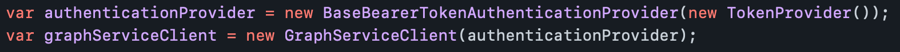
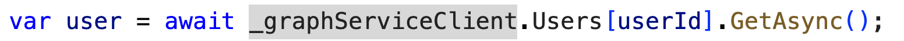

En el número 47 de la revista
(<https://www.compartimoss.com/revistas/numero-47/microsoft-graph-net-sdk-al-descubierto>),
os hablé del SDK para .NET de MS Graph, que por aquel entonces estaba en
la versión 4.0. Recientemente, el equipo ha liberado una *major*
versión, con cambios muy interesantes, y algún que otro *breaking
change* a tener en cuenta si estamos actualizando desde versiones
anteriores. En este artículo vamos a desgranar estos cambios y mejoras.

## Auto-generado por Kiota

En mi opinión, el cambio más destacado, aunque será el que menos
notaremos, es que este SDK, ya ha sido auto-generado por Kiota. Para los
que no lo conozcáis, Kiota es una herramienta de línea de comandos, que
es capaz de generar código cliente para consumir cualquier API descrita
en OpenAPI. Si queréis conocer más sobre Kiota, tengo un artículo con
más detalle en el número 54 de la revista
(<https://www.compartimoss.com/revistas/numero-54/introduccion-a-kiota-generando-sdks-para-apis-en-minutos>).
Al estar generado por Kiota, significa que será más homogéneo con otros
SDKs de Graph en otros lenguaje, también generados por Kiota, además de
ofrecer algunas otras ventajas que veremos durante el artículo.

**Diferentes namespaces para Microsoft.Graph y Microsoft.Graph.Beta**

Como ya sabréis, tenemos 2 endpoints principales en MS Graph API: v1.0 y
Beta. Es por ello, que siempre han existido dos paquetes Nuget, uno para
cada versión (v1.0/beta). Sin embargo, en versiones anteriores, tanto el
SDK del v1.0, como el del Beta, nombraban de igual manera los
namespaces, por ejemplo: Mic*rosoft.Graph.Models*, haciendo muy
complicado el poder utilizar ambos SDKs en la misma aplicación (cosa muy
común, puesto que de base siempre usamos el V1.0, pero es muy posible
que nuestra aplicación tenga funcionalidad que requiera usar el endpoint
Beta). Por suerte, con este cambio, ahora los namespaces contienen el
nombre completo del SDK:

*Microsoft.Graph.Models* vs *Microsoft.Graph.Beta.Models*

Así, si por ejemplo tenemos un método que devuelve un
GraphServiceClient, usando la versión Beta del SDK, podemos hacer:

Y en la misma clase, podemos devolver un GraphServiceClient de la V1,
con un simple:

**Autenticación basada en Kiota**

Como ya os contaba en el artículo anterior de la versión v4 del SDK, la
Autenticación del SDK, se integraba con la librería **Azure.Identity**.
Sin embargo, si queríamos hacer algo más custom, no disponible con los
Auth providers incluídos en la librería, la solución era utilizar el
*DelegateAuthenticationProvider*, y definir ahí nuestro código. Ahora,
sin embargo, gracias a las abstracciones ofrecidas por Kiota, podemos
implementar la interfaz *IAccessTokenProvider*, y utilizar la clase base
*BaseBearerTokenAuthenticationProvider*.

**Desaparece el método Request()**

Este es uno de los breaking changes que más va a afectar a vuestro
código en versiones anteriores. La interfaz IBaseRequest desaparece del
SDK, por lo que la famosa llamada Request(), de la mayoría de las
peticiones a Graph, requiere cambios en código. Es decir, lo siguiente
ya no es válido:

Ahora podemos hacer lo mismo sin el Request()

**Desaparecen los métodos para queries OData, y aparecen las clases
xxxxRequestConfiguration**

En versiones anteriores, si querías añadir una query OData, como por
ejemplo el TOP, podías llamar al método Top(x) de la fluent api del SDK.
Lo mismo para hacer un Filter, Expand, etc. Estos métodos se han
eliminado, y ahora mismo todo ese tipo de queries OData, se pueden hacer
con las clases RequestConfiguration, en el método Get/Post. Por ejemplo:

De forma similar, si queremos agregar Headers a la request, podemos
hacer:

**Nueva clase base ODataError para error handling**

En la versión v5, desaparece la clase ServiceException, y aparece la
clase ODataError. Así, podemos hacer error handling de la siguiente
manera:

**Soporte para OData cast en la misma Request**

En versiones anteriores, cuando se hacía un request a algún endpoint que
podía devolver diferentes tipos de datos en la misma request, no había
manera de hacer casting del objeto en la misma request. Por ejemplo, si
pedíamos los Members de un Grupo, con algo como:

Había luego que castear cada Item recibido a un objeto User or
Application, según quisiéramos, de hecho, si sólo nos interesaban los de
tipo User, teníamos que filtrarlos de alguna manera en la request, pero
aún así, el objeto retornado por el SDK, era un "DirectoryObject", y no
un User (el DirectoryObject era un objeto muy limitado, y por ejmplo, no
tenía un DisplayName).

En la versión 5, ahora podemos hacer el filtro y el cast en la misma
petición, por ejemplo, si solo queremos los de tipo User, podemos hacer:

Y si sólo nos interesan los Miembros que son de tipo Aplication, podemos
hacer:

**Haciendo Mock del GraphServiceClient**

Otra de las ventajas de haber pasado por Kiota, es que a la hora de
hacer mocking del objeto GraphServiceClient, lo podemos hacer con un
Mock de la interfaz *IRequestAdapter*. Por ejemplo, si queremos hacer
mock de una llamada a Graph como:

Bastaría con hacer:

Y hasta aquí las novedades que considero más interesantes de esta nueva
versión del SDK de Graph. Como veis, bastantes cambios a mejor, y algún
breaking change que nos va a hacer tocar bastantes líneas de nuestro
código.

¡Hasta el próximo artículo!

**Luis Mañez**  
Cloud Architect en ClearPeople LTD  
@luismanez  
<https://github.com/luismanez>
