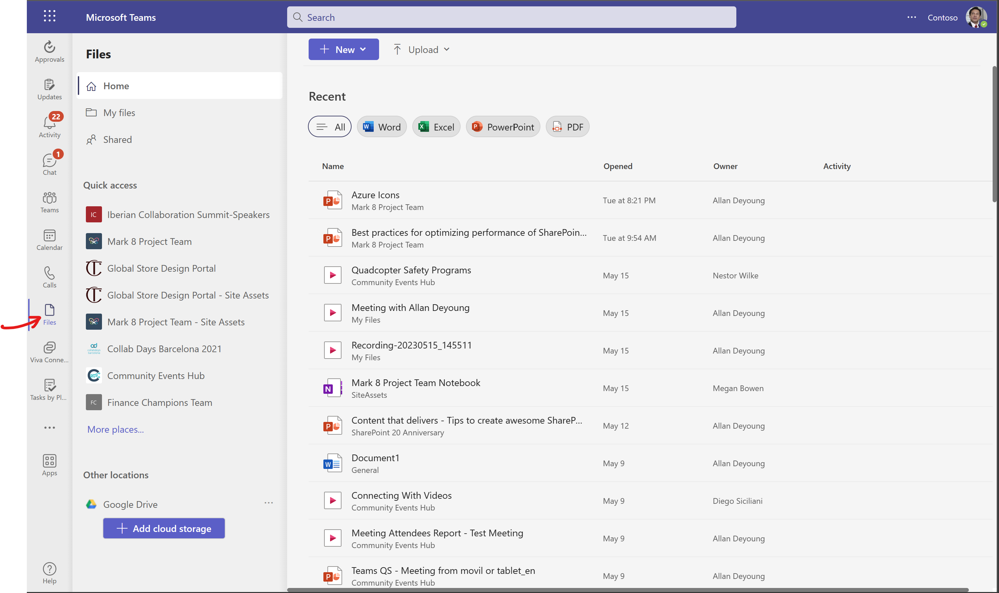
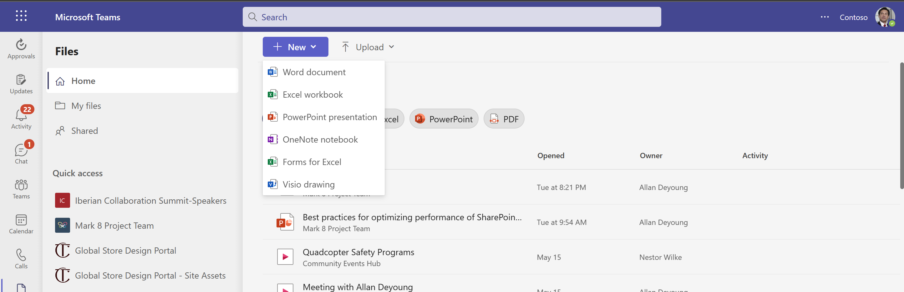
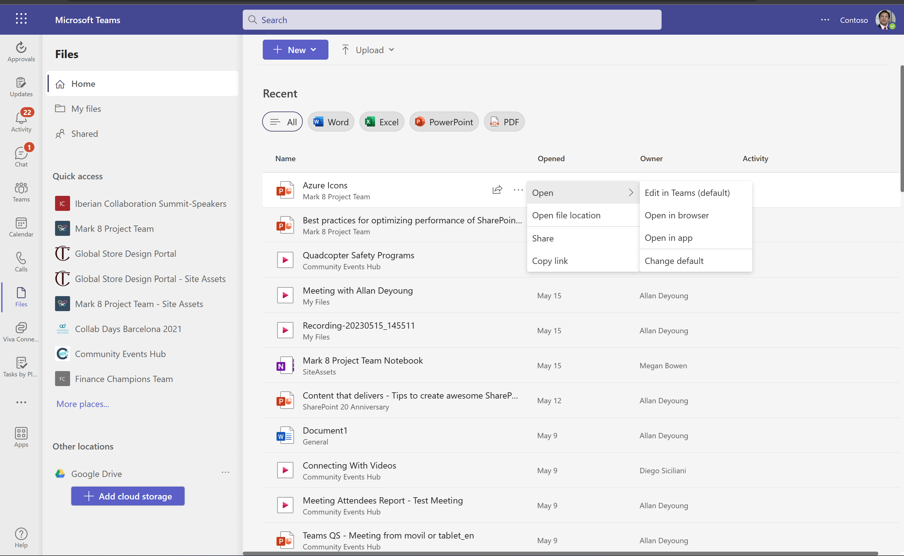
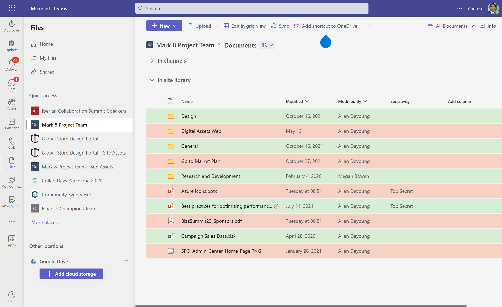
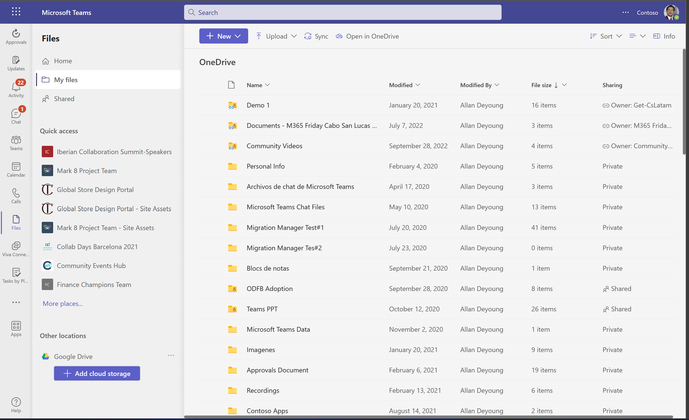
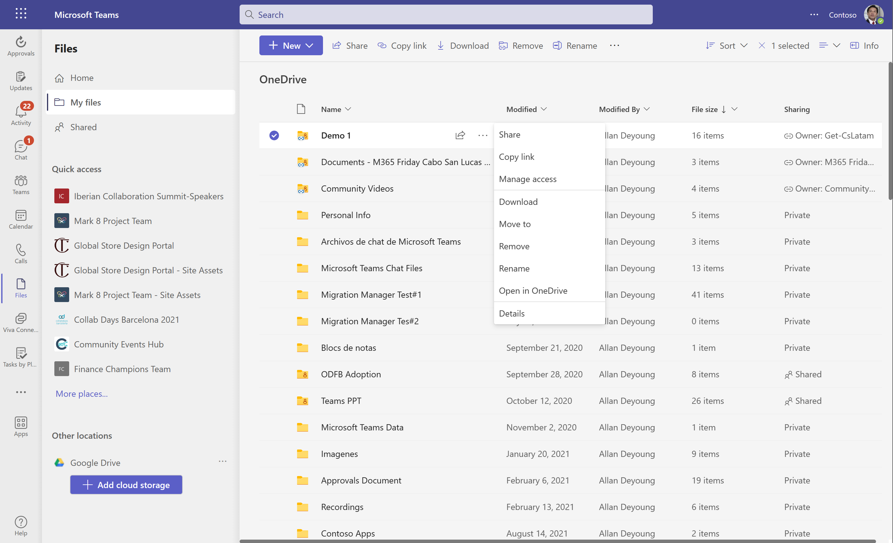
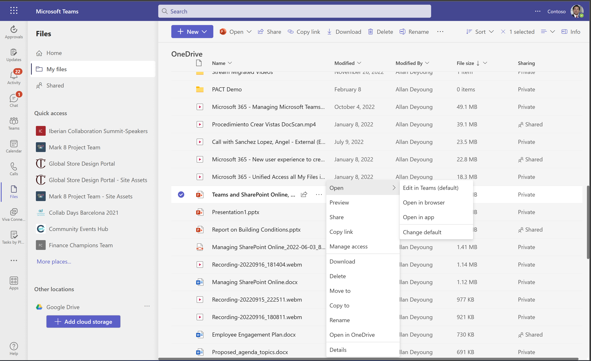
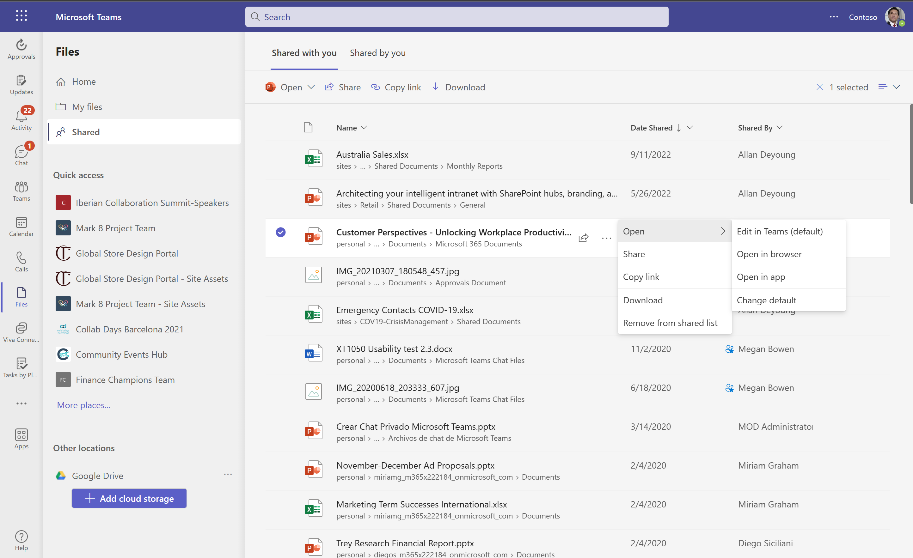
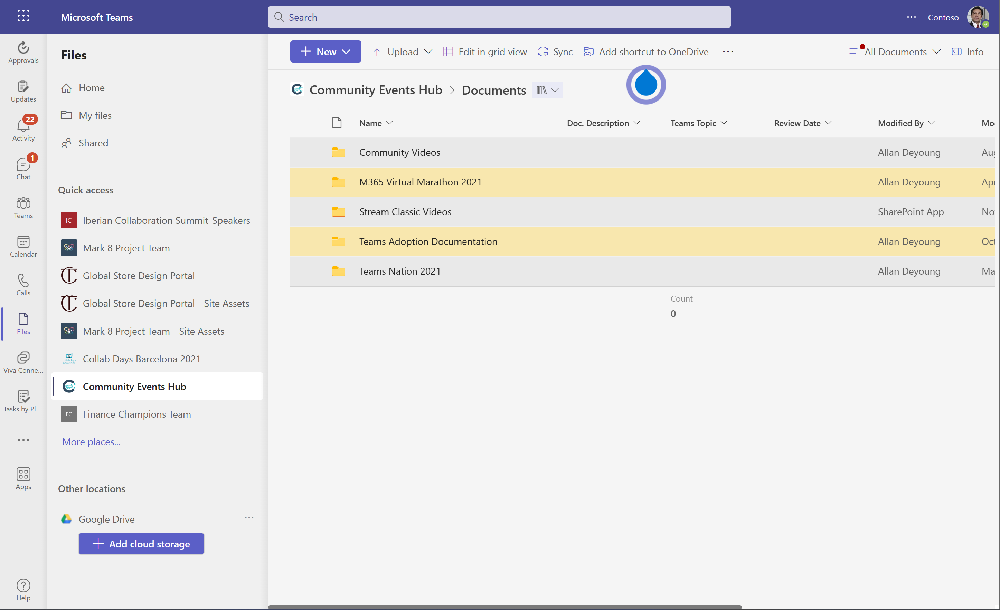
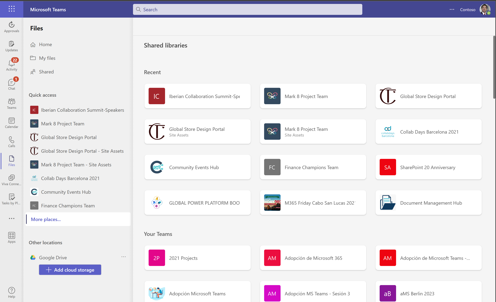

Podemos decir que casi no hay día para los que usamos Microsoft Teams en
que nos encontremos con una nueva funcionalidad que mejore no solo la
experiencia de usuario en su uso, sino también la productividad. Al
mismo tiempo, cada vez hay una mayor convergencia con otros servicios y
herramientas de Microsoft 365 y esto es lo que sucede con la nueva Files
App para Microsoft Teams que sigue la misma experiencia de usuario a la
hora de interactuar con archivos que nos podemos encontrar en la home de
Microsoft 365 y en OneDrive for Business.

**Accediendo a la Files App en Microsoft Teams**

El acceso a la Files App en Microsoft Teams se realiza a través del
icono del mismo nombre disponible en la barra de aplicaciones tanto para
el cliente de Microsoft Teams de escritorio como para el cliente web:

**Funcionalidades y secciones presentes en la Files App**

A nivel de funcionalidades y secciones presentes en la Files App en
Microsoft Teams:

-   En primer lugar, nos encontramos con la página principal (Home) en
    la que podemos ver un listado de los últimos documentos que hemos
    accedido a lo largo de Microsoft 365 e independientemente del
    workload donde estén almacenados (SharePoint, OneDrive for Business,
    Microsoft Stream). Desde está sección podremos:

    -   Filtrar los documentos por tipo: Word, Excel, PowerPoint, PDF.

    -   Crear nuevos documentos Office en línea incluyendo documentos
        Visio y formularios de Excel.

    -   Cargar nuevos documentos y carpetas.

> Por supuesto, dado un archivo tendremos la posibilidad de editarlo, compartirlo o simplemente acceder a la ubicación donde se encuentra almacenado.

Si hacemos uso de la opción de abrir ubicación del archivo, seguiremos
en el contexto de Teams puesto que se mostrará dicha ubicación (Por
ejemplo una Biblioteca de Documentos) integrada en la Files App:

-   La sección "My files" nos proporciona una vista de nuestro OneDrive
    for Business integrada en Microsoft Teams. Desde aquí:

    -   Podemos navegar a lo largo de la estructura de carpetas en
        nuestro OneDrive.

    -   Podemos visualizar si un archivo o carpeta se ha compartido.

    -   Podemos acceder a nuestro OneDrive en línea o bien en nuestro
        equipo local utilizando el cliente de sincronización.

    -   Podemos crear nuevos documentos en línea incluyendo vínculos a
        web o subir plantillas para crear documentos.

    -   Podemos cargar nuevos documentos, plantillas de documentos y
        carpetas.

Además, a la hora de interactuar con archivos tendremos opciones
adicionales como:

-   Cambiar el orden en el que se muestran los archivos así como el tipo
    de visualización (Podemos pasar a un modo Tiles). También a través
    de la opción "Info" podremos visualizar el historial de últimas
    actividades que han tenido lugar con nuestros archivos.

-   Al seleccionar una carpeta o un archivo de nuevo tendremos una serie
    de acciones disponibles que en este caso se ven incrementadas:

    -   Para una carpeta: Compartir | Copiar enlace | Administrar el
        acceso | Descargarla | Mover a | Copiar a | Eliminar |
        Abrir en OneDrive | Detalles. Además, estas acciones están
        disponibles tanto en el menú de acciones de la parte superior
        como a nivel contextual.

-   En el caso de un archivo, las acciones disponibles son similares
    como podemos ver en la siguiente captura de pantalla. De nuevo,
    estas acciones están disponibles tanto en el menú de acciones de la
    parte superior como a nivel contextual.

-   Las sección "Shared" muestra como el caso de OneDrive for Business
    el listado de archivos y carpetas que me han compartido y el listado
    de archivos que he compartido. De nuevo, si seleccionamos un archivo
    o carpeta podremos interactuar con el mismo a través de las opciones
    disponibes.

-   La sección Quick access nos muestra un listado de Sitios a los que
    tenemos acceso. Al hacer clic en uno de dichos sitios, veremos
    integrado en la Files App el acceso a las Bibliotecas de Documentos
    del Sitio. No solo podremos acceder a dichas Bibliotecas, sino que
    todas las acciones de trabajo con la misma están disponibles.

-   El enlace de More places... nos permite visualizar todos los Sitios
    con Bibliotecas de Documentos a los que tenemos acceso.

-   Finalmente, la opción "Add cloud storage" nos permite añadir
    almacenamiento nube de otros proveedores no Microsoft siempre y
    cuando los administradores de Teams lo permitan.

**Conclusiones**

La Files App en Microsoft Teams es un ejemplo más de la continua
evolución del cliente de Microsoft Teams y de como se integra
funcionalidad presente en otras áreas de Microsoft 365 como OneDrive for
Business o la página principal de Microsoft 365. Al final Microsoft
sigue buscando que en Microsoft Teams tengamos todo lo necesario para
trabajar en nuestro día a día y no sea necesario que nos salgamos de la
plataforma.

**Juan Carlos Gonzalez**  
**M365 Apps & Services MVP | M365 SME & Delivery Manager en RICOH**  
@jcgm1978
 
 
import LayoutNumber from '../../../components/layout-article'
export default LayoutNumber
