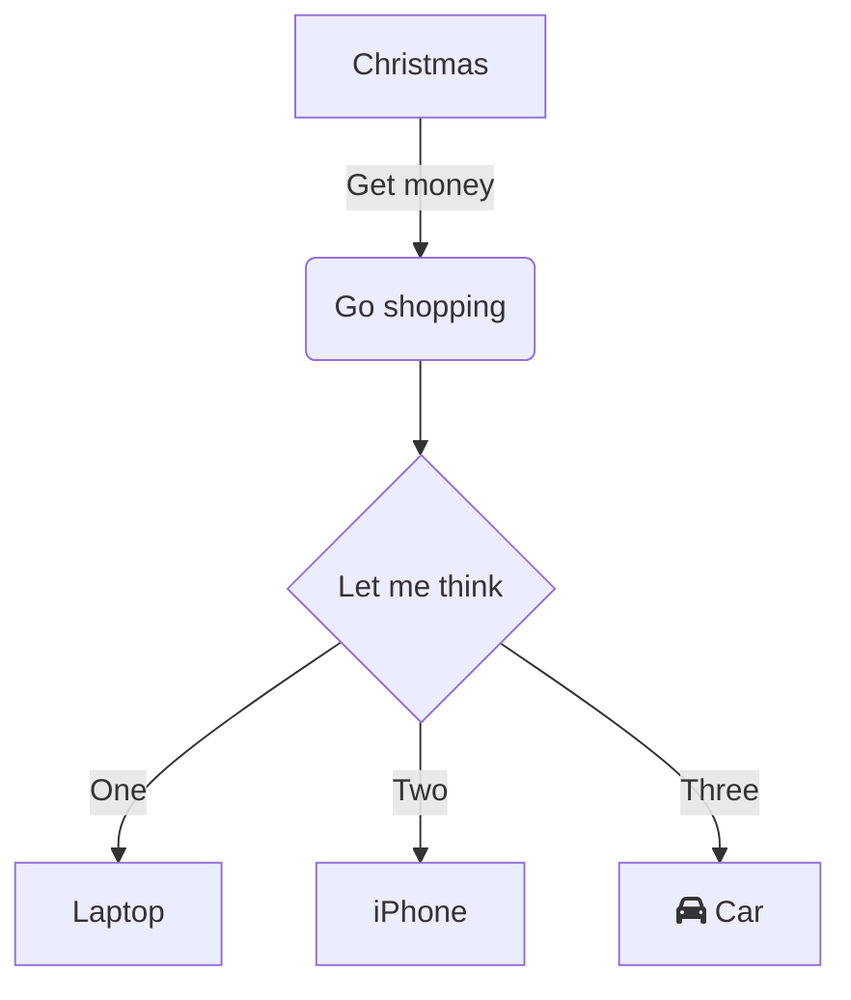

**Comencemos con Jupyter Notebooks**

Los cuadernos de código (Notebooks) son una herramienta para análisis y
visualización de datos. Permiten combinar código ejecutable, texto
explicativo, imágenes y gráficos en un solo documento interactivo.
Jupyter Notebooks es una herramienta Open Source que permiten crear y
compartir documentos creado originalmente para Python. Los Jupyter
Notebooks son mantenidos por el Proyecto Jupyter
(https://jupyter.org), una organización sin ánimo de lucro que
promueve estándares abiertos para la computación interactiva en
diferentes lenguajes de programación.

Los Jupyter Notebooks se originaron como una extensión del proyecto
IPython (https://pypi.org/project/ipython/), que ofrece un entorno de
desarrollo basado en el lenguaje de programación Python. El nombre
Jupyter proviene de la combinación de los tres lenguajes principales que
soporta: Julia, Python y R. Los Jupyter Notebooks se ejecutan en un
servidor web local o remoto y se pueden acceder desde un navegador web y
permiten combinar diferentes tipos de celdas en un mismo documento:
celdas de código, celdas de texto enriquecido (Markdown), celdas de
ecuaciones (LaTeX) y celdas de presentación de datos (HTML, imágenes,
videos, etc.).

Jupyter Notebooks se pueden exportar a otros formatos, como PDF, HTML o
código fuente, son muy populares en el mundo de programación de Python,
y se pueden instalar fácilmente usando el gestor de paquetes pip de
Python o la distribución Anaconda, que incluye muchas librerías
científicas preinstaladas.

**Y ahora, continuemos definiendo que son Polyglot Notebooks**

La mayoría de los Jupyter Notebooks se basan en un solo lenguaje de
programación (principalmente Python), lo que limita la capacidad de los
usuarios para aprovechar las ventajas de diferentes lenguajes y
bibliotecas. Microsoft creó el concepto de "Polyglot Notebooks", que
son cuadernos de código que pueden contener celdas de código escritas en
diferentes lenguajes y que pueden ejecutar e intercambiar datos entre
ellas.

Polyglot Notebooks nació en el mundo de Microsoft como ".NET
Interactive" (https://github.com/dotnet/interactive) que es un motor
y API diseñados para ejecutar y editar código de forma participativa, lo
que incluye ejecutar código y obtener sus resultados, evaluar el código
para proporcionar servicios lingüísticos como finalizaciones y
diagnósticos, y compartir datos y variables entre varios idiomas y entre
máquinas remotas.

Aunque normalmente se asocia con tecnologías de cuadernos de código como
Jupyter y la extensión Polyglot Notebooks para Visual Studio Code, .NET
Interactive también tiene otros usos, como la creación de REPL y motores
de secuencias de comandos incrustados. Actualmente, los idiomas de
programación incluidos en el motor son CSharp, F#, PowerShell,
JavaScript, SQL, KQL (Kusto Query Language), HTML, y Mermaid (un idioma
para crear graficas declarativamente).

Polyglot Notebooks es una extensión para Visual Studio Code que se
instala de la misma forma que cualquier otra extensión en Code (busque
"Polyglot Notebooks" creado por Microsoft, en la lista de extensiones
para instalar). No es indispensable instalar las extensiones para
Python, pero la extensión si requiere la instalación de la última
versión del ".NET 7 SDK" en el computador.

**Comenzando a trabajar con Polyglot Notebooks**

Después de instalar la extensión en Visual Studio Code, abra la paleta
de comandos (Ctrl+Shift+P) y seleccione "Polyglot Notebook: Create new
blank notebook". También puede crear un nuevo bloc de notas con la
combinación de teclas Ctrl+Shift+Alt+N en Windows. Cada Notebook no es
más que un archivo JSON con la extensión ".dib" o ".jpynb"; es
preferible utilizar la última extensión para mantener la compatibilidad
con Jupyter Notebooks, pero el sistema funciona de igual forma con
cualquiera de las dos. Escoja también el idioma a utilizar en la primera
celda, pero esto se puede cambiar fácilmente después de que el archivo
ha sido creado.


La interfaz en Visual Studio Code ofrece varias posibilidades:

-   Escoger el motor (esquina superior derecha). Para Polyglot Notebooks
    debe ser ".NET Interactive". Si Python esta instalado en Code, se
    puede escoger entre Jupyter o Polyglot Notebooks con este botón.

-   "+ Code" y "+ Markdown" para agregar celdas de código o texto en
    el Notebook.

-   La celda de código elegida al principio (en este caso HTML). En este
    espacio es donde se agrega el código a ejecutar. Al lado izquierdo
    de la celda hay un botón para ejecutar el código de la celda, pero
    también se puede hacer ejecutar desde el pop-up al lado derecho, o
    desde el menú de "Run" de Code.

Agregue algunas líneas de código HTML en la celda y haga ejecutar el
código. El resultado se vera debajo de la celda:


Utilice el botón de "+ Markdown" para agregar otra celda, esta vez de
código Markdown e introduzca algo de código Markdown en ella:


Las celdas de Markdown se comportan algo diferente que las de código:
utilice el símbolo de visto buen en la esquina superior derecha de la
celda para hacer ejecutar el código:


Agregue de nuevo una celda en el Notebook y cambie el tipo de código a
"Mermaid" (haciendo clic sobre el texto que indica el tipo de código
en la esquina inferior derecha). Agregue el siguiente código:



Haga ejecutar el código para ver la gráfica generada:


Mermaid es una sintaxis similar a Markdown que le permite usar texto
para describir y generar diagramas de flujo, UML, gráficos circulares,
diagramas de Gantt y muchos más tipos automáticamente. Toda la
información necesaria para crear gráficas, incluyendo la sintaxis que se
debe usar y varios tutoriales se puede encontrar en el sitio
https://mermaid.js.org. El proyecto Mermaid es Open Source mantenido
en el sitio https://github.com/mermaid-js/mermaid.

**C#, JavaScript y PowerShell en un solo Notebook pasando valores entre
celdas**

Una de las grandes ventajas de Polyglot Notebooks es no solo que se
puede ejecutar código de diferentes lenguajes en el mismo Book, sino
también que se puede pasar valores de una celda a otra, inclusive entre
lenguajes. Para el siguiente ejemplo, cree una nueva celda para código
de C# y defina una variable en la celda. Luego agregue una celda para
código de JavaScript y pase el valor de C# a JavaScript usando la
siguiente sintaxis:

```
#!set --value @csharp:[NombreVariableCSharp] --name
[NombreNuevaVariableJavaScript]
```

Repita el procedimiento, pero esta vez con una celda de PowerShell. La
sintaxis para pasar el valor de la variable de JavaScript a PowerShell
es similar:

```
#!set --value @javascript:[NombreVariableJavaScript] --name
[NombreNuevaVariablePowerShell]
```

El resultado es el siguiente:


Visual Studio Code tiene también una ventana para mostrar las variables
en Polyglot Notebooks en la ventana de salida (Output) que se puede
activar utilizando "Ctr+Shift+U":


Si olvida la sintaxis mostrada anteriormente para recuperar los valores
de las variables, utilice el botón indicado con la flecha para generar
el código automáticamente.

**Polyglot Notebooks y Microsoft 365**

Si se puede hacer ejecutar código de C# y/o PowerShell, se pueden
también utilizar Polyglot Notebooks para comunicarse con Microsoft 365
por medio de sus APIs. El siguiente ejemplo utiliza la librería PnP.Core
para obtener información de una Colección de Sitios de SharePoint en un
tenant de Microsoft 365. Cree una celda de C# en un Notebook y utilice
el siguiente código:

```csharp
#r "nuget: PnP.Core.Auth"
#r "nuget: PnP.Core"
#r "nuget: Microsoft.Extensions.Hosting"
using Microsoft.Extensions.DependencyInjection;
using Microsoft.Extensions.Hosting;
using Microsoft.Extensions.Logging;
using PnP.Core.Auth;
using PnP.Core.Services;
string myTenantId = "[domain].onmicrosoft.com";
string myClientId = "11111a1a-...-...-...-aa1a111111a";
Uri mySiteCollUri = new
Uri("https://[dominio].sharepoint.com/sites/Test_Guitaca");
IHost myHost = Host.CreateDefaultBuilder()
.ConfigureServices((context, services) =>
{
services.AddPnPCore(options =>
{
    options.DefaultAuthenticationProvider =
        new InteractiveAuthenticationProvider(myClientId,
        myTenantId,
        new Uri("http://localhost"));
});
})
.ConfigureLogging((hostingContext, logging) =>
{
    logging.SetMinimumLevel(LogLevel.None);
})
.UseConsoleLifetime()
.Build();

myHost.Start();
IServiceScope myScope = myHost.Services.CreateScope();
IPnPContextFactory myPnpContextFactory = myScope.ServiceProvider
    .GetRequiredService<IPnPContextFactory>();
using (PnPContext myContext = myPnpContextFactory.CreateAsync(mySiteCollUri).Result)
{
    myContext.Web.LoadAsync(p => p.Title).Wait();
    Console.WriteLine($"The title of the web is '" +
    myContext.Web.Title + "'");
}

myHost.Dispose();
``` 

Las librerías de PnP.Core.Auth, PnP.Core y Microsoft.Extensions.Hosting
ya deben estar instaladas en el computar (utilice el instalador
stand-alone de NuGet, PowerShell o Visual Studio para hacerlo). Las
primeras tres líneas de código le indican al Notebook que se van a
utilizar los NuGets de esas librerías. El resto del código es estándar
para logearse interactivamente con el tenant (el que abre una ventana de
navegador para introducir la cuenta y clave a utilizar) y utiliza una
App Registration con Delegated permissions. Haga ejecutar el código para
ver el resultado.


De forma similar se puede utilizar PowerShell. El siguiente ejemplo hace
una llamada a Microsoft Graph para enumerar los Teams a los que un
usuario tiene acceso utilizando un App Registration con un secreto y
Application permissions. Cree una celda del tipo PowerShell y utilice el
siguiente código:

```powershell
$LoginUrl = "https://login.microsoftonline.com"
$ScopeUrl = "https://graph.microsoft.com/.default"
$TenantName = "[domain].onmicrosoft.com"
$ClientIdWithSecret = "11111a1a-...-...-...-aa1a111111a "
$ClientSecret = "BvFQugmOuS......KwpLmNe6pCbM8="
$myBody = @{ Scope = $ScopeUrl; grant_type = "client_credentials";`
client_id = $ClientIdWithSecret; client_secret = $ClientSecret }
$myOAuth = Invoke-RestMethod -Method Post `-Uri $LoginUrl/$TenantName/oauth2/v2.0/token -Body $myBody

$Url = "https://graph.microsoft.com/v1.0/users/[user]@[domain].onmicrosoft.com/joinedTeams"

$myHeader = @{ 'Authorization' = "$($myOAuth.token_type) $($myOAuth.access_token)" }
$myResult = Invoke-WebRequest -Headers $myHeader -Uri $Url
#Write-Host $myResult
$objTeams = ConvertFrom-Json $myResult
foreach($oneTeam in $objTeams.value) {
    Write-Host $oneTeam.displayName
}
```


**Conclusiones**

Polyglot Notebooks permiten utilizar diferentes tipos de lenguajes de
programación en una sola aplicación de forma fácil y eficiente. El
sistema es ideal para documentación de procesos, pruebas de ensayos,
diferentes tipos de presentaciones, educación, etc. La combinación de
texto, Markdown, gráficas y programación en CSharp, PowerShell,
JavaScript y F# permite una gran flexibilidad de trabajo.

**Gustavo Velez** <br />
MVP M365 Apps & Services <br />
gustavo@gavd.net <br />
https://guitaca.com
 
 
import LayoutNumber from '../../../components/layout-article'
export default LayoutNumber
